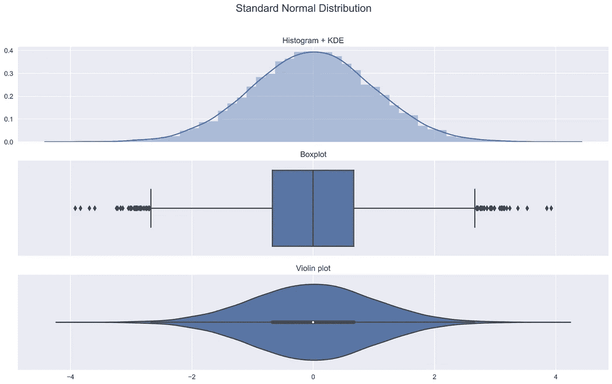
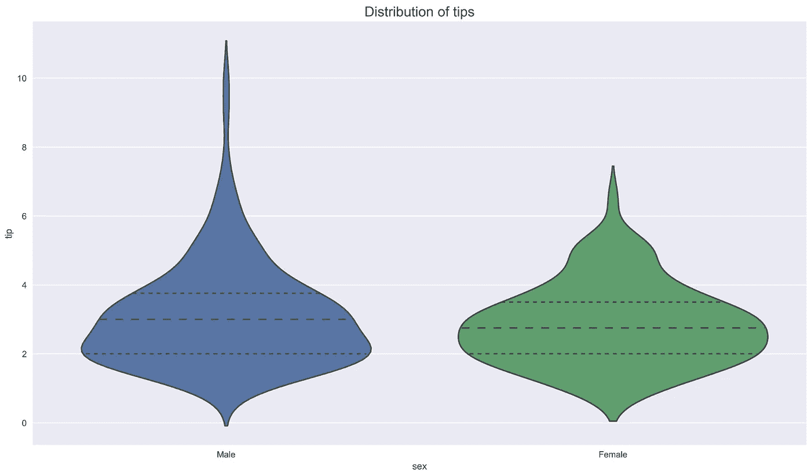
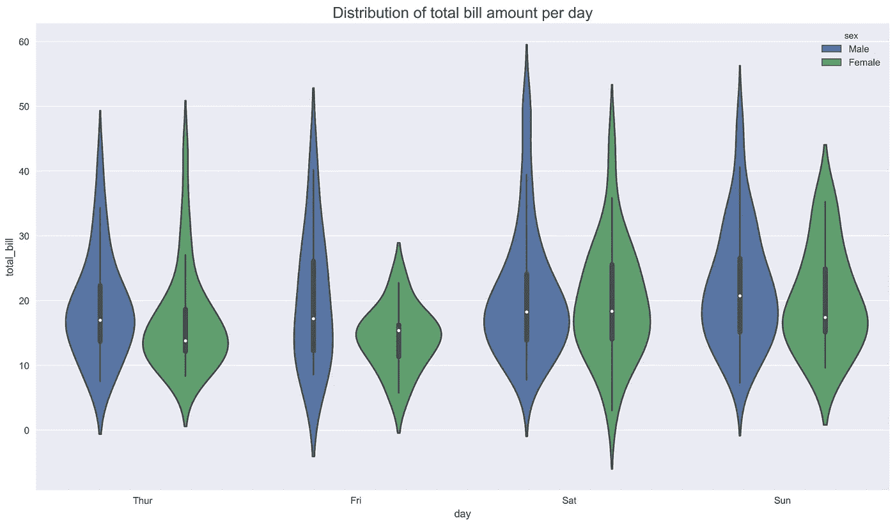
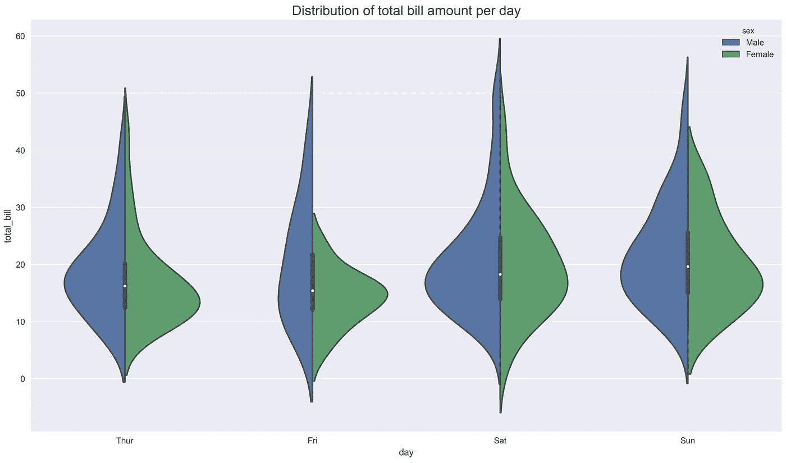

# 小提琴情节解释

> 原文：<https://towardsdatascience.com/violin-plots-explained-fb1d115e023d?source=collection_archive---------0----------------------->


Source: [Unsplash](https://unsplash.com/photos/OgqntOgPUP4)

## 学习如何使用小提琴情节，以及它们比盒子情节有什么优势！

一般来说，violin 图是一种绘制数字数据的方法，可以被认为是[盒图](https://en.wikipedia.org/wiki/Box_plot)和[核密度图](https://en.wikipedia.org/wiki/Kernel_density_estimation)的组合。在小提琴图中，我们可以找到与盒子图中相同的信息:

*   中值(小提琴图上的白点)
*   四分位范围(小提琴中间的黑条)
*   下/上相邻值(从条上拉伸的黑线)——分别定义为`first quartile — 1.5 IQR`和`third quartile + 1.5 IQR`。这些值可用于简单的异常值检测技术(图基栅栏)，位于这些“栅栏”之外的观察值可被视为异常值。


[Source](https://medium.com/@shobhitsrivastava18th/boxplot-v-s-violinplot-93a1d9f3a831)

与箱线图相比，小提琴图无可置疑的优势在于，除了显示上述统计数据之外，它还显示了数据的整体分布。这是令人感兴趣的，尤其是当处理多峰数据时，*，即*，具有一个以上峰值的分布。

# 用 Python 实现

在本文中，我们使用以下库:

```
seaborn    0.9.0
numpy      1.17.2
pandas     0.25.1
matplotlib 3.1.1
```

我们首先定义我们将从某些分布中抽取的随机观察值的数量，以及为结果的可重复性设置种子。

```
N = 10 ** 4
np.random.seed(42)
```

然后，我们定义一个绘制以下内容的函数:

*   具有核密度估计的直方图(KDE)
*   箱线图
*   小提琴的情节

我们将使用这个函数来检查随机创建的样本。

```
def plot_comparison(x, title):
    fig, ax = plt.subplots(3, 1, sharex=True)
    sns.distplot(x, ax=ax[0])
    ax[0].set_title('Histogram + KDE')
    sns.boxplot(x, ax=ax[1])
    ax[1].set_title('Boxplot')
    sns.violinplot(x, ax=ax[2])
    ax[2].set_title('Violin plot')
    fig.suptitle(title, fontsize=16)
    plt.show()
```

## 标准正态分布

我们从最基本的分布开始——标准正态分布。我们随机抽取 10000 个数字并绘制结果。

```
sample_gaussian = np.random.normal(size=N)
plot_comparison(sample_gaussian, 'Standard Normal Distribution')
```



我们可以做一些观察:

*   在直方图中，我们可以看到分布的对称形状
*   我们可以在箱线图和小提琴图中看到前面提到的指标(中位数、IQR、图基围栏)
*   用于创建小提琴图的内核密度图与添加到直方图顶部的内核密度图相同。小提琴图的较宽部分代表观察值取给定值的较高概率，较薄部分对应较低概率。

我相信把这三个情节放在一起展示，可以很好地直观地了解小提琴的情节到底是什么，以及它包含了什么样的信息。

## 对数正态分布

在第二个例子中，我们考虑对数正态分布，它肯定比正态分布更偏斜。

```
sample_lognormal = np.random.lognormal(size=N)
plot_comparison(sample_lognormal, 'Log-normal Distribution')
```


## 高斯混合物—双峰

在前两个例子中，我们已经看到小提琴图比盒子图包含更多的信息。当我们考虑多式联运配送时，这一点更加明显。在本例中，我们创建了一个双峰分布，作为两个高斯分布的混合。

如果不看直方图/密度图，就不可能在我们的数据中找到两个峰值。


# 高级用法

小提琴图通常用于比较给定变量在某些类别中的分布。我们在下面介绍了几种可能性。为此，我们从`seaborn`加载`tips`数据集。

```
tips = sns.load_dataset("tips")
```

在第一个例子中，我们看看小费在不同性别中的分布。此外，我们改变了 violin 图的结构，只显示四分点。一些其他的可能性包括`point`用于显示所有的观察结果，或者`box`用于在小提琴图内绘制一个小方框图。

```
ax = sns.violinplot(x="sex", y="tip", inner='quartile', data=tips)
ax.set_title('Distribution of tips', fontsize=16);
```



我们看到，两种性别尖端的整体形状和分布是相似的(四分位数彼此非常接近)，但男性的异常值更多。

在第二个例子中，我们研究了每天账单总额的分布。此外，我们按性别划分。我们立刻发现，性别分布形状的最大差异发生在周五。

```
ax = sns.violinplot(x="day", y="total_bill", hue="sex", data=tips)
ax.set_title('Distribution of total bill amount per day', fontsize=16);
```



在最后一个例子中，我们调查了与前一个例子相同的事情，但是，我们设置了`split=True`。这样做，我们得到的不是 8 把小提琴，而是 4 把——小提琴的每一面对应不同的性别。

```
ax = sns.violinplot(x="day", y="total_bill", hue="sex", split=True, data=tips)
ax.set_title('Distribution of total bill amount per day', fontsize=16);
```



# 结论

在这篇文章中，我展示了什么是小提琴情节，如何解释它们，以及它们相对于盒子情节的优势。值得注意的最后一点是，只要四分位数保持不变，箱线图就不会发生变化。我们可以用四分位数不变的方式修改数据，但分布的形状会有很大的不同。下面的 GIF 说明了这一点。


[Source](https://www.autodeskresearch.com/publications/samestats)

一如既往，我们欢迎任何建设性的反馈。你可以在推特[或评论中联系我。您可以在我的](https://twitter.com/erykml1) [GitHub](https://github.com/erykml/medium_articles/blob/master/Statistics/violin_plots.ipynb) 上找到本文使用的代码。

喜欢这篇文章吗？成为一个媒介成员，通过无限制的阅读继续学习。如果你使用[这个链接](https://eryk-lewinson.medium.com/membership)成为会员，你将支持我，而不需要额外的费用。提前感谢，再见！