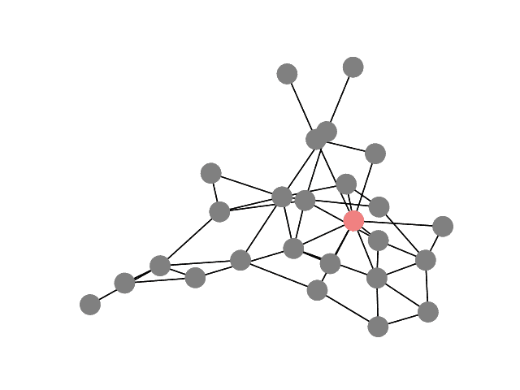
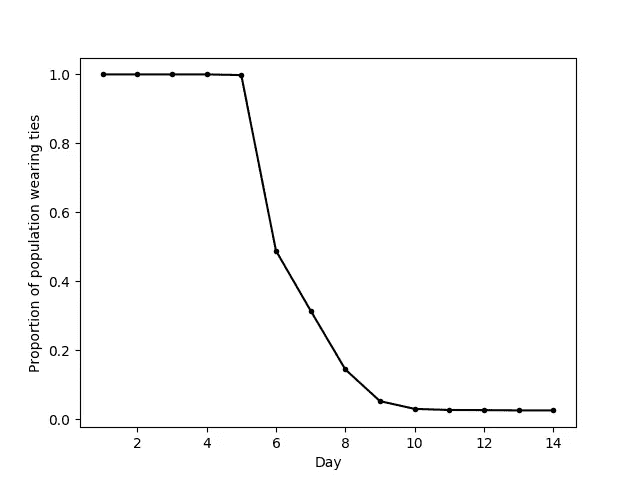
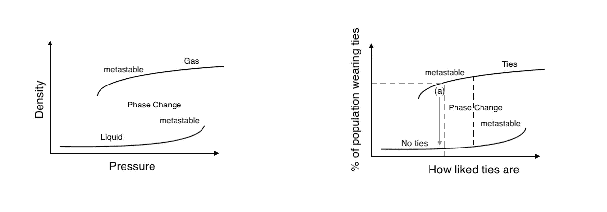
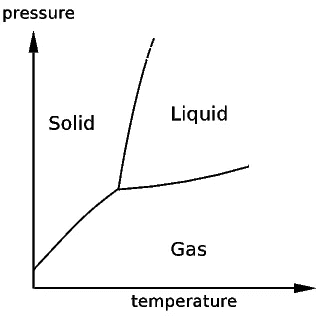
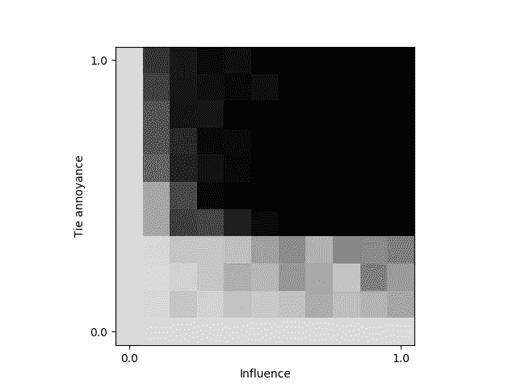
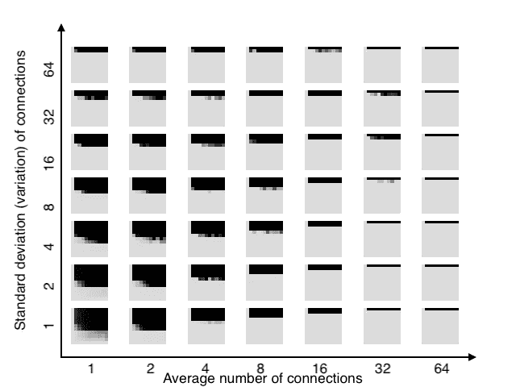
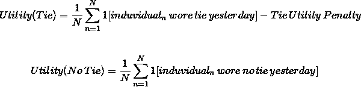

# 病毒时尚、网络和统计物理学

> 原文：<https://towardsdatascience.com/viral-fashion-networks-statistical-physics-373bebd36b13?source=collection_archive---------15----------------------->

## *模拟德国人为何放弃与互动代理人的关系*

> “所有的模型都是错误的，但有些是有用的”——乔治·博克斯

2017 年 5 月，当德国总理安格拉·默克尔会见德国汽车制造商戴姆勒和梅赛德斯-奔驰的首席执行官迪特·蔡澈，为一家新工厂奠基时，德国商界的一些人并没有关注增加电动交通投资的信息，而是在学习办公室着装。蔡澈是美国最有权势和影响力的商人之一，他不打领带。

接下来几周的反应是决定性的。据坊间报道，德国企业中打领带的比例从 90%骤降至 10%。

服装上如此迅速协调的变化是怎么发生的？一个可能的解释很简单:蔡澈对什么是合适的影响如此之大，以至于他的行动单枪匹马地改变了绝大多数德国上班族的想法。

另一种解释更复杂，也可能更有见地。着装习惯的突然改变表明，打领带可能不是每个人的首选(几乎所有打领带的人都证实了这一点)，而是为了迎合他人。蔡澈的行为打破了在公共场合的这种一致性，也许只有少数人不打领带。这些人的行为会影响其他人，这种影响会在人群中扩散。

这项研究采用了流行病学的方法，表明在工作场所打领带的决定与疾病在人群中传播的方式非常相似。不管多么简单，探索这样一个模型有可能突出趋势和规范如何在社会群体中传播。

How tie wearing evolves after an influencer (red) doesn't wear a tie for one day. Light colours indicate that a tie is worn, dark indicate that no tie is worn.

该模型假设每个人根据其网络中大多数人前一天的穿着决定每天是否打领带，稍微倾向于不打领带。随着时间的推移，打领带的人口比例显示出与德国一样的大幅下降。

The influencer wears no tie on day 5\. The change to a new stable state of no ties is abrupt.

这个过程表明，所有打领带的人群处于一种**亚稳态**——如果影响者永远不会放弃打领带，那么没有人会放弃，每个人都会无限期地打领带。然而，如果系统被某人(被称为*影响者*，他们的身份无关紧要)扰乱，行动将会蔓延，没有人会留下领带。这种状态可与过热的水相媲美，纯水即使在 100 度以上的温度下也会保持液态。引起所有水蒸发所需要的只是引入少量污染物以提供成核位置。

Right: Pressure-Density of water, reproduced from “Critical Mass” by Phillip Ball. Left: Hypothetical tie wearing model. The metastable state described previously is at point (a).

此外，模型和示例中描述的这种变化是**突然的**，似乎不存在领带佩戴者和非领带佩戴者共存的稳定状态，就像液态水和汽化水通常不存在于相同的条件下一样。

当描述水和其他物质的状态时，要用相图来描述物质在不同压力和温度下的相态(固态、液态或气态)。

Source: MIT

这些相似性表明，领带穿着习惯可能有一个相图，它描述了系统的**稳定**状态如何随着模型参数的调整而变化。这是引入影响者后系统的稳定状态。这让我们可以探索如果人们真的不介意打领带，或者如果蔡澈只影响了一小部分人，德国的情况会发生怎样的变化。

Tie wearing phase diagram starting at state where everyone wears a tie. Black indicates no-tie is stable, grey indicates tie wearing is stable. I**nfluence** is measured as the proportion of individuals that are connected to the influencer’s node in the network. **Tie annoyance** is the size of the penalty to utility from wearing a tie in relation to the utility gained from conforming, a measure of how much individuals would prefer to not wear a tie.

上图表明，蔡澈的影响在决定会议后的最终状态方面并不十分重要，只要至少其他一些人受到影响。然而，有一个最低水平的领带烦恼需要克服的愿望，以符合。

进一步的参数可以调整。稳定状态对网络中的个体数量是鲁棒的，只要平均连接数与个体数量相比是小的。个体之间的联系也可以调整，无论是平均数量还是可变性。

The phase diagrams are produced for a range of connections and connection variability.

随着平均连接数和连接可变性的增加，影响者改变群体习惯的机会减少。此外，在所有连接配置中，影响者的影响并没有产生很大的效果，相反，对关系的厌恶似乎是决定性因素。这是一个合乎逻辑的结论，因为对领带的厌恶是驱动最初的*领带佩戴*状态变得亚稳定而不是内在稳定的原因。

*那么，这个模型有用吗？*

这些模拟和由此产生的复杂行为依赖于遵循一套简单规则的一群相互作用的个体。这种简化方法忽略了办公室时尚的细微差别，而这种差别是存在的。忽视他们无疑会让每个人的行为变得错误。然而，这并不意味着整个人口的**统计行为**是不正确的，只要每个个体决策模型中的误差大致相互抵消。事实上，办公室里的一些人很少注意其他人的着装，而另一些人则确保他们的着装不仅符合标准，而且超出平均水平。通过这些人口规模属性，该模型可以揭示手头的过程，并增强我们对规范如何在社会中传播的理解。在其他应用中，这种类型的模型已经被证明对模拟[行人运动](https://journals.aps.org/pre/abstract/10.1103/PhysRevE.51.4282)和[社会政策](https://en.wikipedia.org/wiki/Sugarscape)很有用。

# 技术说明:

## 个人决策:

使用以下效用函数，将是否打领带的决定建模为效用最大化问题:

无论哪一个决定(平局或不平局)产生更大的效用，都是当天的决定。

## 网络布局:

网络被生成为完全连接的随机图。虽然*小世界网络*更适合用来模拟社会联系，但随机图的使用产生了相似的特征路径长度，并减少了长时间模拟的运行时间。

## 代码:

所有代码都可以在 Github 的[这里](https://github.com/Gholtes/fashionNetworkSims)获得。