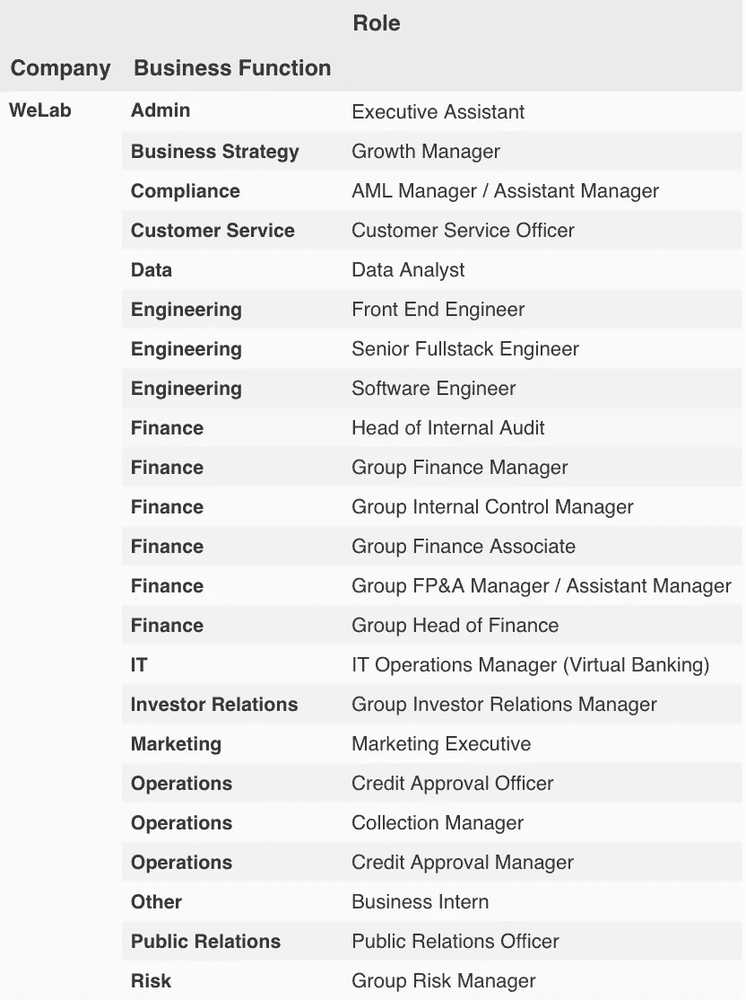

# 从招聘角度看香港的虚拟银行竞赛

> 原文：<https://towardsdatascience.com/virtual-banking-race-in-hong-kong-from-hiring-perspective-70fb5282d831?source=collection_archive---------22----------------------->

## 即使你不在找工作，招聘广告也是有用的吗？

Photo by [Autri Taheri](https://unsplash.com/photos/UPW1kgKMysU?utm_source=unsplash&utm_medium=referral&utm_content=creditCopyText) on [Unsplash](https://unsplash.com/search/photos/virtual-bank?utm_source=unsplash&utm_medium=referral&utm_content=creditCopyText)

如果你一直在关注香港虚拟银行牌照的相关新闻，你可能会听说过这些名字——**Livi VB、SC Digital Solutions、ZhongAn 和 WeLab** 。前 3 家公司于 3 月 27 日获得香港金融管理局颁发的第一张虚拟银行牌照，WeLab 于 4 月 10 日加入该俱乐部。关于这些公司的信息有限，本文试图通过分析它们的职位空缺来了解更多。

## 他们是谁？

你可能听说过自 2013 年以来一直在 P2P 融资领域的 [WeLab](https://www.welab.co/en) ，以及 2017 年在香港上市的[众安](https://za.group/)母公司，但其余公司对普通大众来说似乎相当“神秘”。

根据[SCMP](https://www.scmp.com/business/companies/article/3003496/hong-kong-hands-out-virtual-bank-licences-city-catches-china)—

> 香港金融管理局(Hong Kong Monetary Authority)表示，由中国银行(香港)、JD Digits and Jardines、渣打银行(香港)、HKT、PCCW 和携程组成的合资公司 SC Digital Solutions 以及由中安在线和国金资讯组成的合资公司中安虚拟金融(香港)共同拥有的 Livi VB 将成为前三个牌照的运营商

# 职位空缺:不同的扩展重点

根据他们的商业计划，这些新获得牌照的虚拟银行打算在获得牌照后的 6 至 9 个月内推出其服务。在如此短的承诺期限内，这些公司自确认其银行地位以来一直在更加积极地招聘。

在过去的 2 周里，我一直在收集这 4 家公司的虚拟银行职位空缺。截至 4 月 22 日，我已经从这 4 家公司的各种网上来源收集了 73 个虚拟银行职位空缺。图表中只有 3 家公司，因为我找不到与 **Livi VB** 相关的角色。通过分析这些新虚拟银行发布的职位空缺，我们可以看到这些公司团队扩张重点的一些有趣模式。

渣打银行、WeLab 和众安也有类似数量的职位空缺，每个都招聘 25 个左右的职位。为了了解每家公司关注的领域，我将这些角色归类到它们相应的业务职能中。例如，角色“高级 FP&A 经理”被归类为“财务”业务功能，“后端开发人员”被归类为“工程**”**等。

我发现下面这张雷达图挺有意思的:

当我们试图在雷达图中将相关的业务功能放在一起时，它揭示了每个公司的相对扩张重点—

## 渣打银行

*   大量强调扩展**技术**相关功能(工程、项目管理、安全)
*   风险/合规
*   营销(尤其是在线/社交媒体渠道)

## 中安

*   当务之急是加强**核心业务职能**(运营、风险、财务)
*   IT 和管理

## WeLab

*   与众安类似，首要任务是强化核心业务功能。而众安更强调扩大运营团队，WeLab 目前的重点是扩大**财务**团队。
*   建立各种**营销/关系**功能，这在其他两家公司中是没有的——期待更多的营销活动？
*   工程
*   招聘实习生

# 职位描述中的关键词

除了像扩展焦点这样的高层次见解，如果我们更深入地研究工作描述，还会有其他有趣的发现。

一份工作描述通常至少由两部分组成——(I)角色的**职责**，以及(ii)角色的**要求**。**职责**更多的是关于角色(任务)，而**要求**更多的是关于人(需要的技能)。我将这两个部分分开，并对它们分别应用关键词提取(前 5 个关键词)。

我们使用由名为 [textacy](https://github.com/chartbeat-labs/textacy) 的软件包提供的 [SGRank 算法](https://www.aclweb.org/anthology/S15-1013)，该软件包在 [spacy](https://github.com/explosion/spaCy) 的基础上提供了许多方便的 NLP 工具包。SGRank 算法提取的前 5 个关键词相当不错，即使没有任何微调。

比如 WeLab 中的行政助理角色，职责关键词是["地面交通"、"**差旅预订**、"商务会议"、"**会议日程安排**、"级别高管"]，需求关键词是[" **沟通技巧**、" ms word】、"**优秀人际交往**、"**高度灵活性**、"**良好英语**]。这些很好地总结了角色的性质和所需的技能。

## 使用单词嵌入和 t-SNE 将角色聚类成组

spacy 为我们提供了**名词块**和**单词嵌入**，这在我们试图将单个数据点聚类成组时非常有用。spacy 内置的词性标注器在从给定文本中提取**名词块**方面做得非常好。这些名词很好的代表了角色性质。

如果你拿到了**。vector** 属性，它将返回名词块的**单词嵌入**(向量表示)。单词嵌入允许我们量化单词之间的关系(两个单词/短语有多相似)。它甚至使文字上的算术成为可能！

在我们的例子中，我对每个角色的需求列的 noun_chunks 单词嵌入进行了平均，并应用了一种称为 t-SNE 的方法来将 300 维向量减少到(x，y)坐标中。结果显示在由散景创建的交互式绘图中。

如果我们悬停在相邻的点上，我们可以看到这些点之间的一些结构。剧情下部多为工程角色，fullstack 开发者介于前端开发者和后端开发者之间。在左边，行政助理、行政助理、接待员等管理角色彼此靠近，在图的其他部分也存在类似的结构。当人力资源经理/招聘人员试图分析市场上竞争对手的职位空缺时，这种技术可能会很有用。

# 关闭

我们可以从一家公司的职位空缺中获知很多信息，尤其是当这家公司正在积极招聘时。这可以解释为什么像对冲基金这样的“秘密”行业倾向于通过代理人招聘。

与此同时，职位空缺可以向候选人/投资者/公众传达一个信号，表明你公司的“舞台”或“品味”——你最常聘用的是什么样的角色，这可能会讲述一个关于“舞台”的故事；职位描述中列出的技术/技能很能说明你公司的“品味”。

鉴于这一子行业所享有的优势，虚拟银行的前景只会越来越好。2018 年，渣打银行在租金/建筑相关事务上花费了 7.9 亿 HKD[1]，占总运营支出 116.47 亿英镑的 6.78%。当银行可以取消分支机构时，70.74 亿英镑的员工成本可以得到更有效的利用。几年后，零售银行业可能会大不相同。

[1][https://av.sc.com/hk/zh/content/docs/hk-c-ar2018-101.pdf](https://av.sc.com/hk/zh/content/docs/hk-c-ar2018-101.pdf)第 256 页

## 附录:本分析中使用的数据