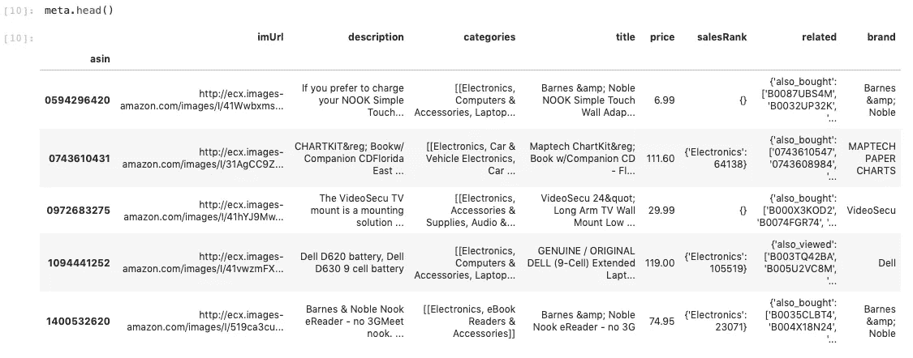
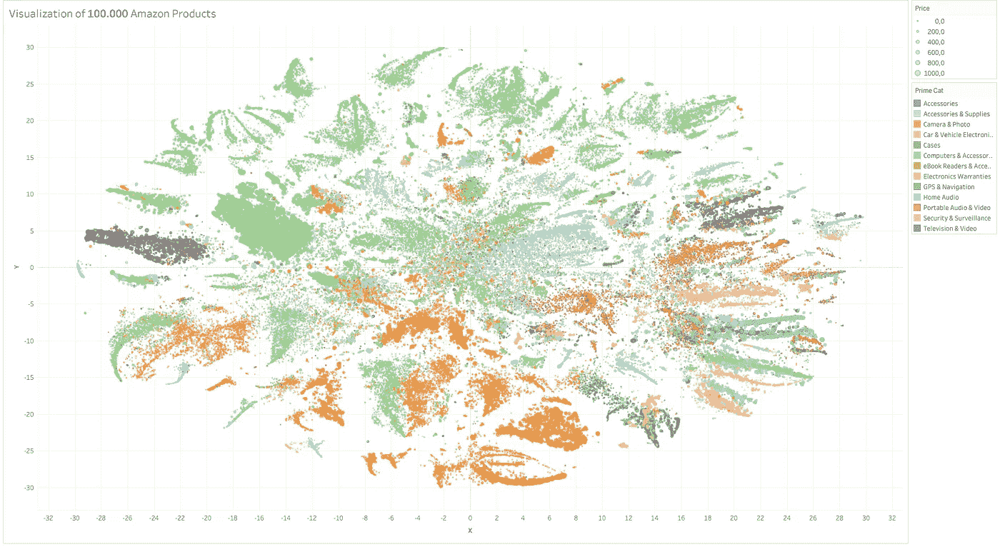
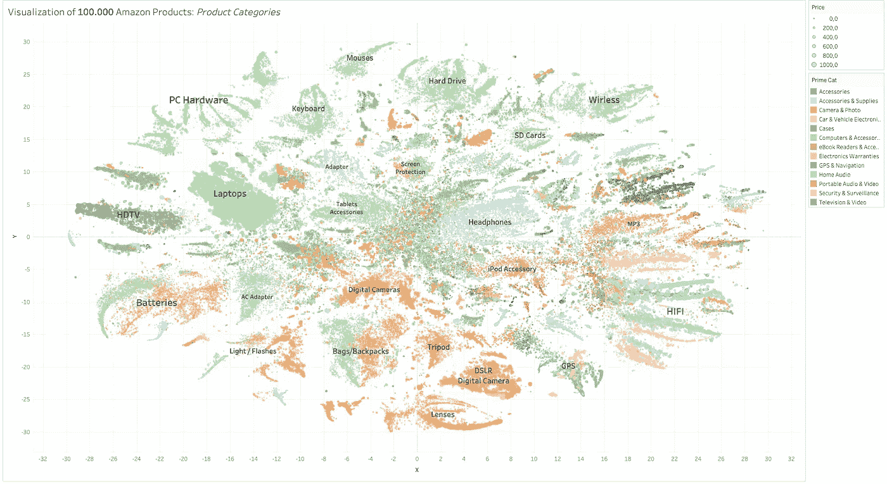

# 可视化 100，000 件亚马逊产品

> 原文：<https://towardsdatascience.com/vis-amz-83dea6fcb059?source=collection_archive---------8----------------------->

## 快速句子嵌入 **(fse)** 使您能够在几分钟内计算数百万条评论的句子嵌入。


t-SNE Mapping of 100,000 Amazon Products. © Oliver Borchers

***本文中的 fse 代码可能会被弃用。请确保使用***[***Github***](https://github.com/oborchers/Fast_Sentence_Embeddings)***上概述的更新代码。***

## 介绍

在我的博士研究中，我经常研究句子嵌入。更具体地说，我使用平均[1]和平滑逆频率(SIF)[2]嵌入。虽然 Github 上的原始实现非常有用，但我总是发现它们很难集成到我使用的任何 NLP 管道中。这是由于非标准化的接口和缺乏优化。因此，我决定在一个优化的包中实现 Average、SIF 和 uSIF [3]嵌入，这个包巧妙地集成到 Gensim 中。部分是因为我喜欢挑战，部分是因为我需要好的工具。这个包叫做 **fse** ，在 [Github](https://github.com/oborchers/Fast_Sentence_Embeddings) 和 Pypi 上都有。看看教程[笔记本](https://github.com/oborchers/Fast_Sentence_Embeddings/blob/master/notebooks/Tutorial.ipynb)看看它是怎么工作的。

```
pip install -U fse
```

您将需要常规的 Python (>3.6)包，特别是 Numpy、Scipy、Cython 和 Gensim。
**TL；DR:如果你需要快速的句子嵌入，就用:**

```
from gensim.models import FastText
sentences = [["cat", "say", "meow"], ["dog", "say", "woof"]]
ft = FastText(sentences, min_count=1, size=10)from fse.models import Average
from fse import IndexedList
model = Average(ft)
model.train(IndexedList(sentences))model.sv.similarity(0,1)
```

这篇文章是为*技术数据科学受众*而写的。我们将探索如何使用快速句子嵌入来可视化众所周知的亚马逊评论数据集。这个故事中使用的交易工具是 **fse** 、FIt-SNE 和 Tableau。

这条管道的结果显示在本文的第一张图中。在这篇文章的最后，你会发现一个交互式 Tableau 地图的链接，可以浏览所有 100，000 种产品。

关于这个库内部工作的更详细的介绍，请随意阅读我的第一篇关于句子嵌入的文章。

## 数据

如果你和 NLP 一起工作，你很可能已经听说过公共的斯坦福亚马逊评论数据集。三年前，我收到了朱利安·麦考利的完整版本，用于我的市场营销博士研究，并不时地继续使用它。第二大类别是“电子产品”类别，共有 7，824，482 条评论。知道里面到底有什么不是很好吗？

为了获得每个产品的嵌入，我们需要评论数据和元数据。两者都由唯一的 Amazon ASIN 标识符连接。我已经准备好了一个很好的熊猫数据框架(不允许我分享)。让我们来看看元数据:



Metadata of Amazon Reviews. © Oliver Borchers

为了实际可视化数据(例如，将每个产品表示为一个可映射的向量)，我们只能使用每个产品的评论。因此，我们正在处理多对一嵌入。在过滤掉少于 10 条评论的 asin 后，我们最终得到 97，249 条唯一 asin 和 6，875，530 条评论。

我们不对文本数据进行任何预处理。
为什么？
因为。

## 从评论到产品嵌入

为了获得每个评论的嵌入，我们首先需要某种预训练的嵌入。评论很可能包含许多不认识的单词。幸运的是， **fse** 提供了开箱即用的 FastText 模型支持。我们首先加载公开可用的 [FastText](https://fasttext.cc/docs/en/english-vectors.html) 模型:

```
from gensim.models.keyedvectors import FastTextKeyedVectors
ft = FastTextKeyedVectors.load("../models/ft_crawl_300d_2m.model")
```

接下来，我们实例化来自 **fse** 的 SIF 模型。

```
from fse.models import SIF
model = SIF(ft, components=10, lang_freq="en")
```

组件的数量等于 10，这在 STS 基准[再现性](http://ixa2.si.ehu.es/stswiki/index.php/STS_benchmark_reproducibility)部分中报告。

请注意 *lang_freq* 参数。一些预先训练的嵌入不包含关于语料库中词频的信息。 **fse** 支持多种语言预训练模型的词频归纳，这对于 SIF 和 uSIF 模型是必不可少的(这可能需要一段时间，取决于您的词汇量)。

所有的 **fse** 模型都要求输入是一个元组列表。元组的第一个条目是标记列表(句子)，第二个条目表示句子的索引。后者确定句子被添加到嵌入矩阵中的目标行。我们稍后将在单行上写多个句子(评论)(多对一)。

```
s = (["Hello", "world"], 0)
```

**fse** 提供了多个输入类，它们都提供了不同的功能。有 6 个输入类可供选择:

*   IndexedList:用于已经拆分的句子。
*   索引列表:对于已经预先拆分的句子，每个句子有一个自定义的索引。
*   SplitIndexedList:用于未拆分的句子。会分裂琴弦。
*   Split **C** IndexedList:用于未拆分的句子，每个句子有一个自定义索引。
*   SplitIndexedList:用于未被拆分的句子。会分裂琴弦。您可以提供自定义拆分功能。
*   **C**Split**C**indexed list:用于你想提供自定义索引和自定义 Split 函数的句子。
*   IndexedLineDocument:用于从磁盘上流式传输句子。可编入索引以方便搜索相似的句子。

这些是按速度排序的。也就是说，IndexedList 是最快的，而**C**Split**C**indexed list 是最慢的变体(调用越多=越慢)。为什么要上多节课？因为我希望每个 __getitem__ 方法有尽可能少的代码行，不会降低计算速度。

对于我们的审查数据，我们使用 Split **C** IndexedList，因为我们不想预分割数据(预分割 700 万)。评论会占用大量内存)。在内部，该类将指向我们的评论，并且只在您调用 __getitem__ 时执行预处理。

```
from fse import SplitCIndexedListreview = ["I really like this product.", "Its nice and comfy."]
s = SplitCIndexedList(review, custom_index = [0, 0])
print(s[0])
print(s[1])>>> (['I', 'really', 'like', 'this', 'product.'], 0)
>>> (['Its', 'nice', 'and', 'comfy.'], 0)
```

注意，两个句子都指向索引 0。因此，它们都将被添加到索引为 0 的嵌入中。为了将每个 ASIN 映射到一个索引，我们只需要一些更方便的函数。

```
from fse import SplitCIndexedListASIN_TO_IDX = {asin : index for index, asin in enumerate(meta.index)}indexed_reviews = SplitCIndexedList(data.reviewText.values, custom_index = [ASIN_TO_IDX[asin] for asin in data.asin])
```

既然一切都准备好了，我们可以打电话了

```
model.train(indexed_reviews)
```

该模型在具有 16 个内核和 32 GB ram 的云实例上进行训练。整个过程大约需要 **15 分钟**，大约 8500 条评论/秒。每条评论平均包含 86 个单词，我们总共遇到 593，774，622 个单词。我们将大约 700 万条评论压缩成一个 10 万* 300 的矩阵。添加更多的工人没有什么区别，因为预处理(分割)是瓶颈。

如果你的数据已经预先拆分，在普通的 MacBook Pro 上你可以达到每秒 500，000 句。如果你想了解更多，可以看看教程[笔记本](https://github.com/oborchers/Fast_Sentence_Embeddings/blob/master/notebooks/Tutorial.ipynb)。

## 使用和可视化嵌入

在训练句子嵌入之后，我们可以通过索引或完整的嵌入矩阵来访问每个单独的嵌入。该语法尽可能接近 Gensims 语法，以便于使用。

```
model.sv[0]       # Access embedding with index 0
model.sv.vectors  # Access embedding matrix 
```

相应的 Sentencevectors (sv)类提供了相当多的函数来处理生成的句子嵌入。例如，您可以使用相似性、距离、最相似、按单词相似、按句子相似或按向量相似。

如果我们回到标准的 sklearn t-SNE 实现，可视化这么多数据可能需要非常长的时间。因此，让我们尝试一种更优化的方法: [FIt-SNE](https://github.com/KlugerLab/FIt-SNE) 。这种优化的 t-SNE 实现利用傅立叶变换来加速 t-SNE 的计算。请随意阅读这篇论文。它工作起来很有魅力，使用了机器的所有 16 个核心。

```
import sys; sys.path.append('../FIt-SNE')
from fast_tsne import fast_tsnemapping = fast_tsne(model.sv.vectors, perplexity=50, seed=42)
```

计算完映射后，我们已经有效地完成了最困难的部分。将元数据中的一些信息添加到每个点，我们最终可以将所有内容导出到 Tableau。

## 表格映射

要访问相应的图形，请访问我的公共 [tableau](https://public.tableau.com/views/ProductMap_15674406439260/TSNEPrice?:embed=y&:display_count=yes&:origin=viz_share_link) 页面:

> [https://public . tableau . com/views/product map _ 15674406439260/TSNEPrice？:embed = y&:display _ count = yes&:origin = viz _ share _ link](https://public.tableau.com/views/ProductMap_15674406439260/TSNEPrice?:embed=y&:display_count=yes&:origin=viz_share_link)

您可以将鼠标悬停在每个点上，获取关于产品价格、名称、品牌等信息。

观察嵌入，我们观察到每个聚类中包含相当多的信息。



Map of Amazon Reviews. © Oliver Borchers

此外，我研究了数据，并手动标记了一些聚类，以确定这些聚类的形成是否至少在某种程度上是有效的。看起来映射捕获了评论中包含的大量信息。

请记住:我们所做的是平均每个评论的所有单词，并总结所有评论。我对使用简单的基于平均值的嵌入所能实现的东西感到非常震惊。



Manual Category Labels of Amazon Reviews. © Oliver Borchers

# 结论

句子嵌入是自然语言处理流水线的重要组成部分。这篇博文展示了如何使用快速句子嵌入、FIt-SNE 和 Tableau 来可视化众所周知的亚马逊评论数据集。

我希望你能从使用 **fse** 中找到乐趣。请随时建议可能有用的进一步模型或功能。

相应的 **fse** 包可在 pip / Github 上获得，为数据科学家提供了一种快速计算句子嵌入的方法。

如有疑问，欢迎联系 [me](mailto:borchers@bwl.uni-mannheim.de) 。

如果你喜欢这些内容，别忘了关注我:-)

# 附加说明

这篇文章的代码可以在 [Github](https://github.com/oborchers/Fast_Sentence_Embeddings) 和 pip 上找到:

```
pip install -U fse
```

# 文学

1.  Iyyer M，Manjunatha V，Boyd-Graber J，Daumé III H (2015)深度无序合成与文本分类的句法方法相匹敌。继续。第 53 届 Annu。见面。协会计算机。语言学家。第七国际。Jt。糖膏剂纳特。郎。过程。, 1681–1691.
2.  Arora S，Liang Y，Ma T (2017)一个简单但难以击败的句子嵌入基线。里面的糖膏剂学习。代表。(法国土伦)，1-16 岁。
3.  Ethayarajh，Kawin (2018)无监督随机行走句子嵌入:一个强大而简单的基线。NLP 表征学习第三次研讨会会议录，91–100。
4.  林德曼 G C，拉赫 M，霍斯金斯 J G，斯坦纳伯格 S，克鲁格 Y (2019)基于快速插值的 t-SNE，用于改进单细胞 RNA-seq 数据的可视化。自然方法(16)，243–245 页。

# 放弃

所表达的观点仅代表我个人，并不代表我的雇主的观点或意见。作者对本网站内容的任何错误或遗漏不承担任何责任或义务。本网站包含的信息按“原样”提供，不保证完整性、准确性、有用性或及时性。