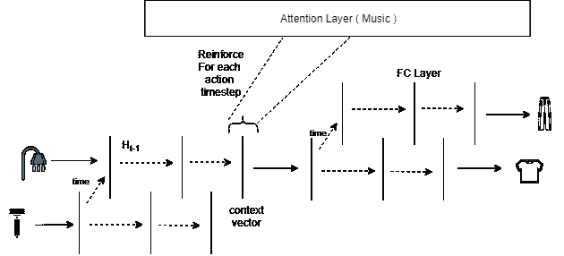

# 视觉失认症:一个神经网络类比

> 原文：<https://towardsdatascience.com/visual-agnosia-a-neural-network-analogy-8e208438b1ec?source=collection_archive---------40----------------------->

Visual Agnosia: Intricate Brain Imbroglio

本周，我开始阅读奥利弗·萨克斯博士的故事《把妻子错当成帽子的男人》，这是一个引人入胜的故事，讲的是一位失去视觉解读能力的 P 博士，这种能力在神经学上被称为视觉失认症。故事从对他的症状的粗略描述开始，逐步发展到详细描述他进入功能失调的视觉系统的妄想世界。从一个具有深刻视觉想象力和判断力的人到一个像卷积神经网络一样以非常抽象的方式看待世界的人，这是一种诗意的衰退。我越来越多地阅读这个故事，不禁将它与表现糟糕的卷积/胶囊/RNN 网络和相应的生成网络相提并论，试图用一些其他图像来弥补不足。

在这篇文章中，我提出了一些理论，你可以称之为未经训练的头脑的漫谈，可能是一个长镜头，将神经心理学和深度学习两个不同领域的片段放在一起。考虑到激发这篇文章和最初故事的音乐家 P 博士的情况，这似乎是合适的。虽然，要注意的是，这篇文章只是理论上的，没有实验基础，所以它的论点应该被大量的盐(不是一点点我的意思)。

# **理论 1:缺失神经元理论**

**症状:**视觉皮层 esp 丢失部分图像。像人脸一样的动画。有时这些脸会出现在随机的地方，比如柱子等。视觉缺失的部分被其他东西代替，比如一顶帽子代替了 P 博士妻子的头。

**假设:**顶叶和枕叶部分神经元的脱落/失活。

**解释:**P 博士表现出的无法识别面孔的症状或这些面孔被帽子或鞋子等无生命物体取代的情况，可能是由于右半球的病变/肿瘤而导致一些神经元不放电的情况，以及大脑通过产生随机意象/视觉来填补这种功能障碍所导致的缺陷的绝望尝试。我想用一张图表来说明这一点，这张图表应该模拟了你前额叶皮层中的一些神经元，至少我希望如此。

Defective visual discriminator and adversary

如果你看到上面的图表，很明显，在试图识别它通过眼睛接收的视觉信息的鉴别器网络中有一些错误。问题可能在于这个过程中的一些关键神经元已经停止运作。因此，大脑中的视觉皮层生成的图像是不完整的，因为它几乎正确地获得了各个部分，但在某些方面却缺失了，这妨碍了整体场景的创建。

为了弥补这一缺失，大脑生成了另一个片段，比如一张脸，并用这一片段来填补那些缺失的地方。但问题是，这个生成的脸被预期为对场景的上下文是正确的，因为应该告诉生成网络这个脸是否合适的对手本身缺乏一些神经元，因此呈现出扭曲的判断。

**可能的处理:**

一种可能的治疗方法是开出能够重新触发或模拟顶叶和枕叶神经元的药物。

第二种方法可能是重现病人遇到这些场景或人的某些场景，这样仍然完整的记忆可以用来重新点燃这些神经元。

同样，所有这些治疗建议都只是瞎猜，并不是基于彻底的研究。

## 理论 2:情感缺失

**症状:**P 博士无法识别他的学生/人，尽管他能够识别出诸如长鼻子、卷发或身高等个人特征。这意味着视觉的病理部分没有问题。除此之外，他以一种非常抽象、粗略的形式识别人，就像一台机器主要是 CNN，它的卷积层识别特征，最大池增加了一般化所必需的不变性。另一个限制是他能够通过听到人们的声音或他们演奏的音乐来识别他们。这就像失去的与视觉刺激相关的人类触觉/情感部分通过听觉重新获得。

**假设:**大脑右半球和杏仁核控制的情绪都有问题。这些情感是我们生活中与人联系的基本要素，是增加亲密关系的桥梁，是识别我们的朋友和家人的基本要素，就像是我们的视觉系统所依赖的 KPI 或独立变量。我想提出的理论是，由于杏仁核的功能障碍，这些情绪在网络的输入中缺乏，这导致 P 博士无法识别人。

Emotional Deficit Compensated By Music

音乐起作用的原因是，它刺激杏仁核唤起与某个情况或某个人相关的情绪，并加强输入向量，以便视觉识别起作用。

**可能的处理:**

一种可能的治疗是再次刺激杏仁核中的神经元/腺体，以产生进入大脑视觉识别机制的情绪输入。这些神经元可以通过讲述能够重现相同视觉意象的故事来激活。

另一种方法是重现能够唤起与一个人相关的记忆的情景，从而激活杏仁核的相同部分，重现相同的情绪。通过这种方式，输入将得到加强，并可能协调分离的部分。

理论 3:节奏难题

**症状:**如果 P 医生在进行身体活动或动作时哼的歌曲受到干扰，他似乎会失去对该身体活动或动作的上下文/判断。这也许是他表现出的最奇特的症状。P 博士似乎失去了很多识别和判断的能力，但他失去了什么，他得到了音乐敏锐度。这意味着，如果他一边哼着一首特定的歌曲，一边进行像刮胡子这样的动作，他就像一台加满油的机器，像正常人一样进行活动，但一旦像敲击这样的小事打破了他的节奏，他就会失去所有的上下文，并陷入停顿，直到同一首曲子以某种方式重新点燃精神进步。

**假设:**一个动作的序列有一个时间维度。与神经网络世界中的 RNN 平行的那个。在这种情况下，该 RNN 是编码器解码器网络，其中编码器将过去的动作编码成上下文向量，并将其输入到解码器以预测接下来的动作。在 P 博士的例子中，这个特殊的背景向量似乎在每个时间步都被大脑产生的音乐所强化。这种音乐在某种程度上给我们提供了一种注意力环境，告诉大脑注意什么和什么时候注意。但是一旦音乐停止，这个上下文就丢失了，解码器停止获得下一个时间步长的任何信息，并且变成空白。这导致了上下文和运动的丢失。

Missing context reinforced by music attention

**可能的处理:**

通过语音指令重新训练大脑。一遍又一遍地重复它们，直到活动完成。这可能有助于激活休眠的神经元。然后慢慢地开始让说明变得稀疏，然后完全放弃它们，让这个人自己建立那个环境。