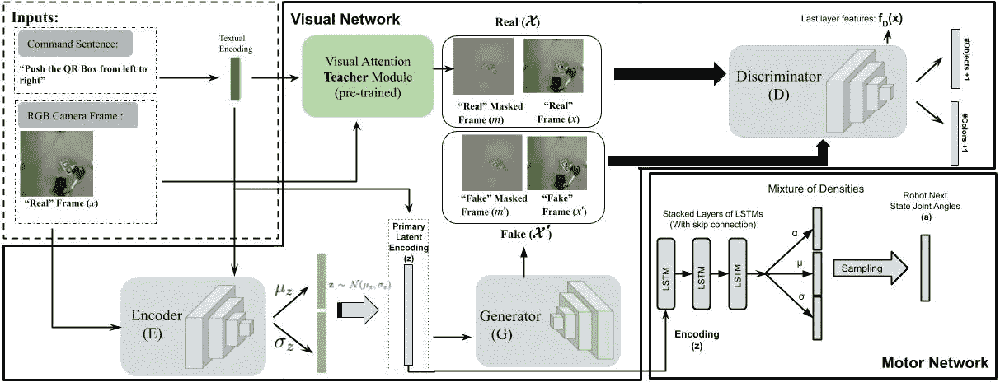
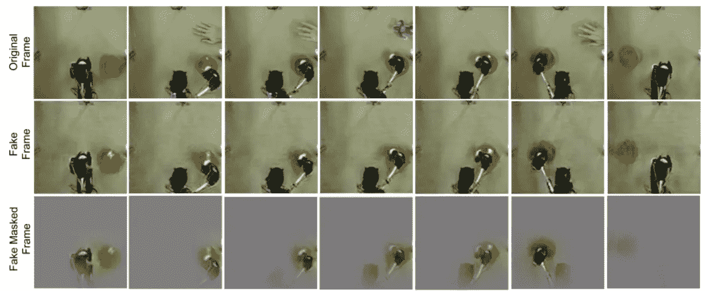

# 机器人视觉注意力

> 原文：<https://towardsdatascience.com/visual-attention-for-robotics-8fca83cbd95a?source=collection_archive---------41----------------------->

## 利用视觉任务聚焦注意强化视觉运动策略

Teacher-Student framework for the task of robotic object manipulation. Please read our CVPR 2019 [paper](http://openaccess.thecvf.com/content_CVPR_2019/papers/Abolghasemi_Pay_Attention_-_Robustifying_a_Deep_Visuomotor_Policy_Through_Task-Focused_CVPR_2019_paper.pdf) for more details. Also, the code and data are available on our [project page](https://www.crcv.ucf.edu/research/projects/pay-attention/).

物体操纵是机器人研究的主要任务之一。通过演示训练策略神经网络是设计视觉运动策略的一种方式。然而，重新编写演示既昂贵又耗时。此外，在记录训练演示样本后，环境可能会发生变化。例如，在测试期间，未知物体可能进入机器人的视觉场景。在这种情况下，大多数视觉运动策略都会失败，因为它们遇到了一个看不见的状态。此外，干扰可以是物理的或视觉的，这意味着某些东西可以干扰或接触物体一会儿，并阻止机器人完成工作(物理干扰)或只是机器人摄像机输入流中的一些意外视觉模式(视觉干扰)。由于存在无限的干扰场景，为每一个可能的物理干扰收集训练样本是不切实际的。

我们研究了一种在良性条件下训练策略神经网络的方法，这意味着在训练期间零干扰，同时在测试时间对物理/视觉干扰具有鲁棒性。

秘密成分？视觉注意！

我们设计了一个师生系统，从输入帧中提取丰富的特征，这些特征对看不见的干扰具有鲁棒性。我们的教师网络是一个简单的文本(机器人的任务)框架接地(作为注意力地图)网络。我们称之为任务聚焦视觉注意(TFA)。

学生网络是一个可变自动编码器(VAE)-GAN，它不仅试图重建输入帧，而且试图模仿教师网络产生的注意力。这是知识升华的一种形式。教师网络可以捕捉任务(在我们的实验中是自然语言句子)来构建知识，而学生网络可以通过模仿教师的行为来获得相同的知识，并提供移动机器人的运动网络。

我们表明，学生网络不仅可以学习注意力，还可以产生对干扰具有鲁棒性的特征。知道干扰会在注意过程中被忽略。

请阅读我们的[论文](http://openaccess.thecvf.com/content_CVPR_2019/papers/Abolghasemi_Pay_Attention_-_Robustifying_a_Deep_Visuomotor_Policy_Through_Task-Focused_CVPR_2019_paper.pdf)了解更多详情。

此外，代码和数据可在我们的[项目页面](https://www.crcv.ucf.edu/research/projects/pay-attention/)上获得。

请不要犹豫提出你的问题。

您也可以观看我的 YouTube 演示，了解更多详细信息和讨论: