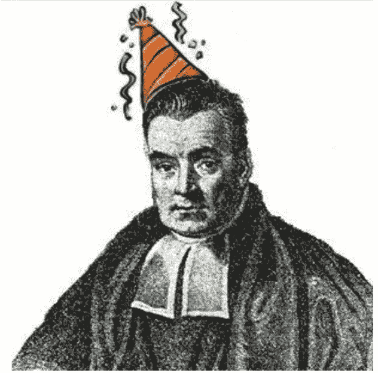
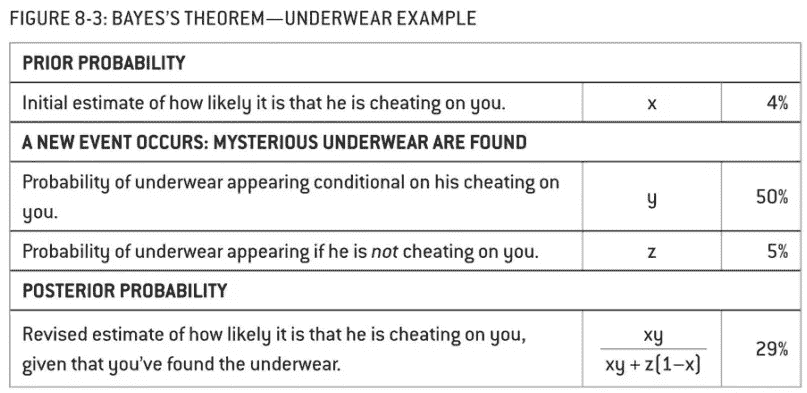
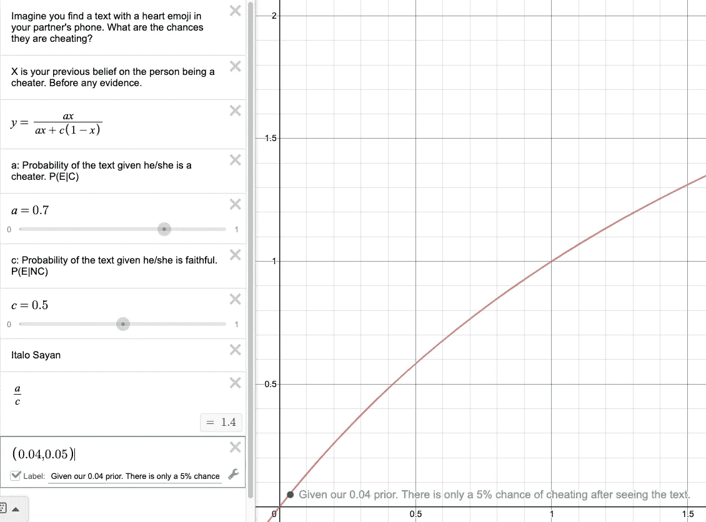

# 视觉贝叶斯:你的伴侣忠诚吗？

> 原文：<https://towardsdatascience.com/visual-bayes-is-your-partner-faithful-90b2fdba7cc8?source=collection_archive---------19----------------------->

## 什么可以解释伴侣手机上一个未知号码的心形表情符号？

“Just relax” says Bayes. [Source](https://github.com/ChristianSch)

在大学期间，我收到了许多关于贝叶斯定理的令人不满意的解释。第一次是在统计 101。教授只是把公式写在白板上，让我们背下来。给定一个问题陈述，只需将变量输入公式，得到输出，得到一个 a。更像是一个 b。

我遇到的第二个解释使用了一棵树。它可以在 YouTube 视频[这里](https://www.youtube.com/watch?v=2Df1sDAyRvQ)找到。问题是不够直观。要处理的信息太多了，你无法在你祖母看电视的时候向她解释。

接下来，我尝试了一门名为“社会科学家数据分析 T2”的在线课程。麻省理工学院讲师萨拉·费希尔在几次讲座中讨论了这个定理。甚至她声明这不是很[直观](https://www.youtube.com/watch?v=dtP57hfBW0Y)。在内特·西尔弗写出《信号和噪音》之前，我对一个简单且持续不断的解释失去了所有希望。

这是迄今为止我发现的最好的解释，我将尝试给它一个我在别处找不到的视觉扭曲。在我看来，贝叶斯定理允许决策者就一个困境提出 3 个问题。这是测试你的勇气和减少偏见的一种方式。

想象一下，你在伴侣的手机里看到一条短信，上面有一个来自未知号码的心形表情符号。他/她欺骗你的可能性有多大？你发现的新的**证据**是文本，你试图估计你的伴侣在哪里出轨的**假设**。如果你愿意探究 3 个问题，我们可以找到你的伴侣出轨的可能性。

1.  **忘掉证据**。她/他欺骗你的可能性有多大？这就是所谓的先验。如果你没有看到这篇文章，你认为你的伴侣出轨的可能性有多大？这很难考虑，尤其是当你情绪激动的时候，但是这是减少你自己偏见的第一步。研究发现，在任何一年的任何一方，这个数字都是 4%。
2.  假设她/他没有作弊，那么文本出现的几率有多大？所以，最好的可能情况:这只是一场误会。我们假设他们是忠实的。什么能解释这篇文章？一个密友？对一张图片的反应？也许他的某个家庭成员换了手机？我们给它分配 50%的概率。
3.  鉴于她/他**在欺骗**，那么**该文本出现**的几率有多大？最坏的情况。如果他们在欺骗，那么新来的人给他们发短信是有道理的。话说回来，他们会更加小心。我们给它 70%的机会。

综上所述，你需要估计三件事。一个**清白概率**没有任何证据的情况下，给出证据的**最好情况的几率**和给出证据的**最坏情况的几率**。对于任何决定来说，这是 3 件值得考虑的事情。每当你收到有影响力的新闻时，就后退一步，想想用贝叶斯框架来看待它是否有意义。

内特用一个不同的事件作为证据:你在卧室里发现了不属于你的内衣。

Chapter 8: The Signal and the Noise

使用我们的数字:

*   先前(x): 4%
*   最坏情况(y): 70%
*   最佳情况(z): 50%
*   **结果(后验):5%**

内特的数字导致了更高的后验概率。但是有道理。他认为最好的情况是 5%。很难想象为什么内衣会出现在卧室里，如果它们不是出轨的话。在我们的例子中，一个文本可以有多种解释。毕竟，心形表情符号在很多情况下都是有用的。

当然，在这个例子中，最坏和最好的情况概率是主观的。然而，好消息是你可以在任何给定的情况下分配你自己的权重。

**直观解释**

这里有一个链接供您更改输入:
[https://www.desmos.com/calculator/gyb1jzchr8](https://www.desmos.com/calculator/gyb1jzchr8)

让我们把注意力集中在积极的象限。x 是“干净概率”。可以确定另外两个量，求后验如何反应(Y)。

增加“最佳情况(c)”的机会将线条拖到右下角。因此，即使有很高的先验，如果最好的情况有很高的概率，后验概率也不会很大。听起来像是我们的场景。有人收到心形表情符号的概率相当高。Bayes 说“放松就好”。

增加“最坏情况(a)”的几率将线条拖到左上角。如果最坏的情况发生的可能性很大，你应该更加谨慎。

这是一个非常对称的图表，显示了这个定理是多么的基本。希望这能节省你理解它的时间。如果你想深入数学，我推荐这篇[文章](https://betterexplained.com/articles/an-intuitive-and-short-explanation-of-bayes-theorem/)。推导定理并不疯狂。如果你对配方本身感兴趣，更多信息请点击[这里](https://brilliant.org/wiki/bayes-theorem/)或[这里](https://calumsblog.com/2012/01/25/derivation-of-bayes-theorem/)。如果你想看这个定理的实际应用，点击[这里](https://en.akinator.com/)或者[这里](https://stats.stackexchange.com/questions/323269/simple-real-world-examples-for-teaching-bayesian-statistics)。在下一篇文章中，我将使用 Desmos 来解释一个非常基本的神经网络。欢迎任何评论！