# 视觉深度计算机视觉

> 原文：<https://towardsdatascience.com/visual-deep-computer-vision-f1e9fcca8f3b?source=collection_archive---------9----------------------->

## 或者你如何在不是专家的情况下运行计算机视觉的深度学习算法。

# 介绍

深度学习已经推动并解决了各种计算机视觉问题，如对象检测、运动跟踪、动作识别、人体姿势估计、语义分割等。

由于卷积神经网络(CNN ),该领域的最大进步已经成为可能。CNN 具有独特的特征学习能力，即基于给定数据集自动学习特征。CNN 对于变换也是不变的，这对于某些计算机视觉应用来说是一个巨大的资产。

你可以在这里了解更多信息:

 [## 全卷积神经网络|第一部分

### 导师指导的学习指南，以应对 Coursera 深度学习专业化课程 4

towardsdatascience.com](/convolutional-neural-networks-for-all-part-i-cdd282ee7947) 

请观看 Brandon Rohrer 关于他们的精彩视频:

# 我们通常是怎么做的

通常我们用深度学习编程来做计算机视觉，学习新的 API，有些比其他的更难，有些真的很容易，比如 Keras 或 PyTorch。为此，你需要理解深度学习、计算机视觉概念、OpenCV 等等。但是有一个问题。

如果你想运行实验，测试不同数量的时期，参数，估计，优化等等。当你编程时，这些事情开始变得复杂。在这里，我想向大家展示一个非常简单但非常强大的方法，用深度学习通过一个叫做深度学习工作室的平台来做计算机视觉。

# 新的方式

我之前已经讨论过这个平台，如果你想对它有一个大概的了解，可以看看这些文章:

 [## 深度认知让深度学习变得简单

### 在过去的一个月里，我有幸见到了 DeepCognition.ai 的创始人

becominghuman.ai](https://becominghuman.ai/deep-learning-made-easy-with-deep-cognition-403fbe445351)  [## 深度认知的视频漫游

### 大家好！在本文中，我将与您分享几个视频，带您浏览深度认知的平台…

towardsdatascience.com](/a-video-walkthrough-of-deep-cognition-fd0ca59d2f76) 

但在这里，我想向你展示**三个**使用深度计算机视觉平台的超级有用的方法。

## 1.上传你的 Keras 模型并训练它

假设您在自己的 jupyter 笔记本或 IDE 中创建了 Keras 模型。您希望使用该平台的所有功能。这很简单。

你要做的就是去站台:

 [## 主页

### 我们想邀请您在 3 月 26 日至 29 日的 GPU 技术大会上加入 Deep Cognition 的团队，展位号为 1035…

deepcognition.ai](https://deepcognition.ai/) 

并启动 app(你得先创建一个账号，是免费的 btw)。当你进入平台时，你会看到:

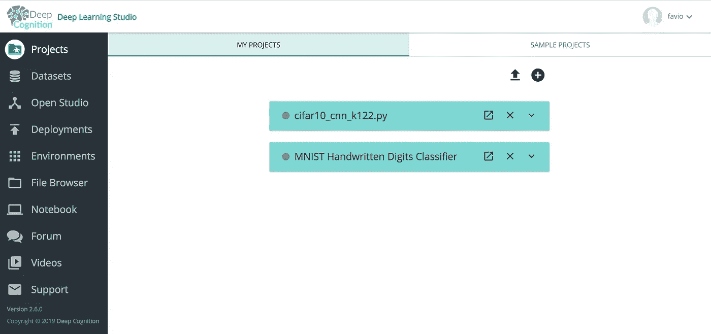

然后点击箭头上传你的模型。我们将在 Keras 中尝试使用带有卷积网络的 CIFAR-10 模型。这里重要的是:**这个模型应该与 Keras 1.2.2 兼容，这是我们目前唯一的限制。**

我们将上传合作创建的模型，您可以在此处访问:

 [## keras-team/keras

### 人类的深度学习。通过在 GitHub 上创建一个帐户，为 keras-team/keras 开发做出贡献。

github.com](https://github.com/keras-team/keras/blob/keras-1/examples/cifar10_cnn.py) 

如果你想从这里复制，我创建了一个要点:

在尺寸订购部分选择否。

之后，一个新的项目将会以 Python 文件的名称创建。然后点击打开，你会看到:

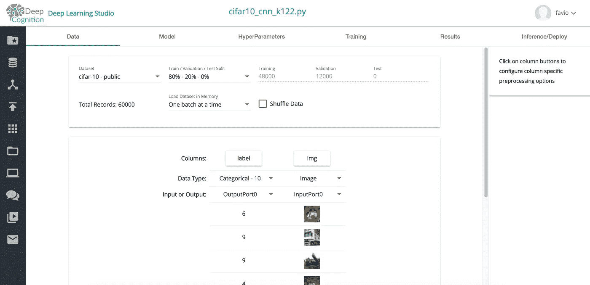

在数据部分选择 cifar-10-public，以便能够训练模型。顺便说一句，如果你想训练一个不同的模型，你可以上传你自己的图像数据集。

现在，如果您单击 Model 选项卡，您将看到刚刚上传的代码的可视化表示:

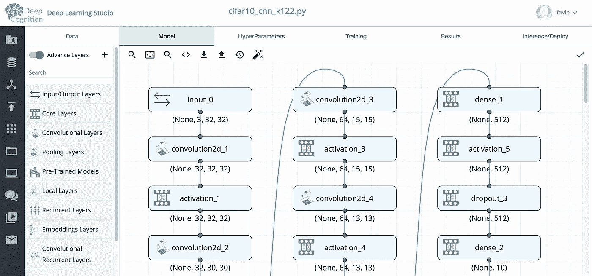

你可以玩玩它，看看不同的选项。在那里你可以改变你的超参数，当然也可以训练模型。

我将这个配置用于超参数:

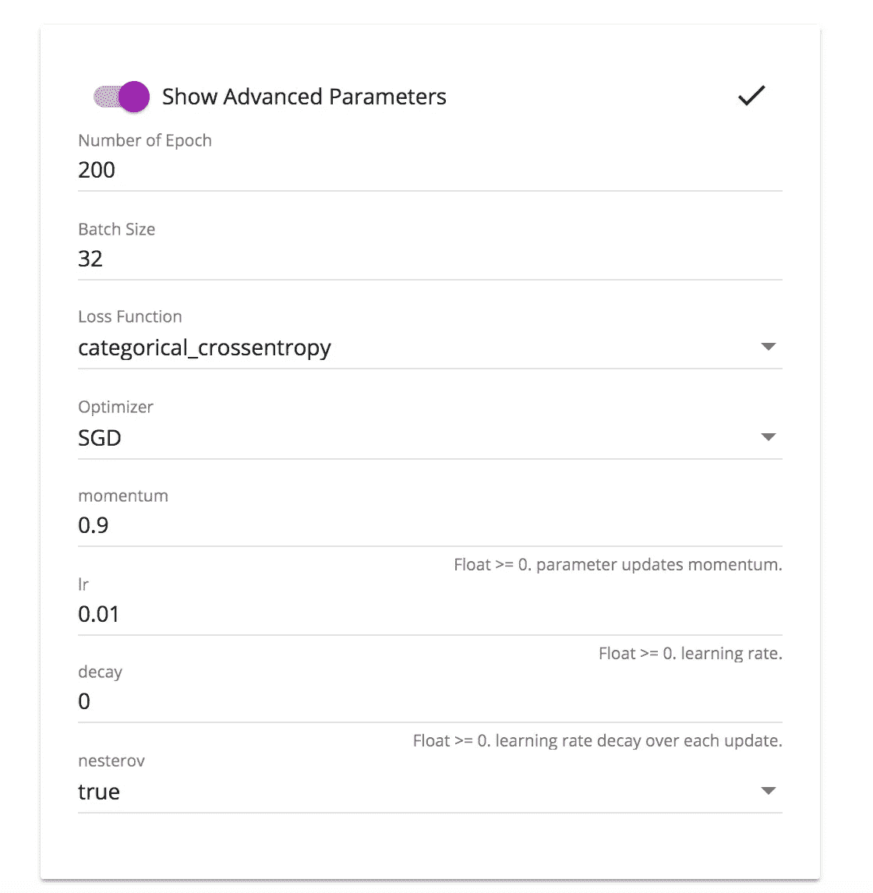

然后你去训练你的模型。在下面的视频中，您可以看到如何使用培训选项卡解决不同的问题:

## 2.将您的 Keras 代码转换为 Tensorflow、Pytorch、MXNet 等

有时你的经理或公司会要求你在不同的框架中编写你的深度学习算法。如果你没有时间学习 X 数量的新 API，你可以很容易地将 Keras 代码转换成不同的框架。

在模型选项卡中，只需点击<>按钮，您将看到:

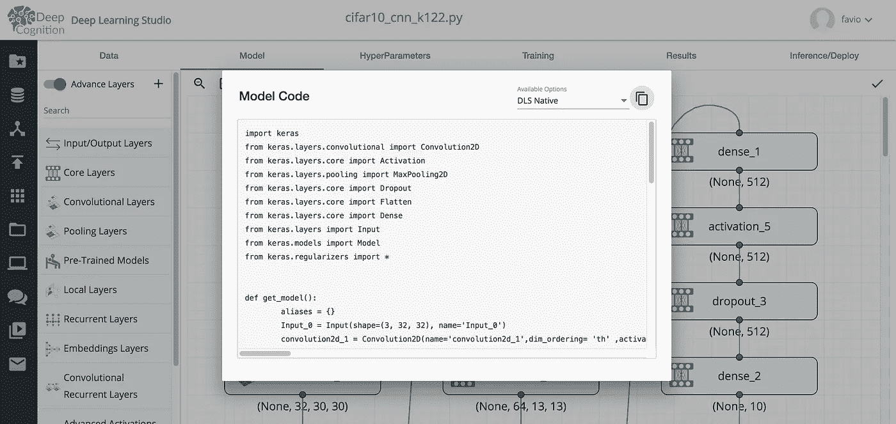

在可用选项中，您可以在不同的框架中获得您的模型:

Pytorch :

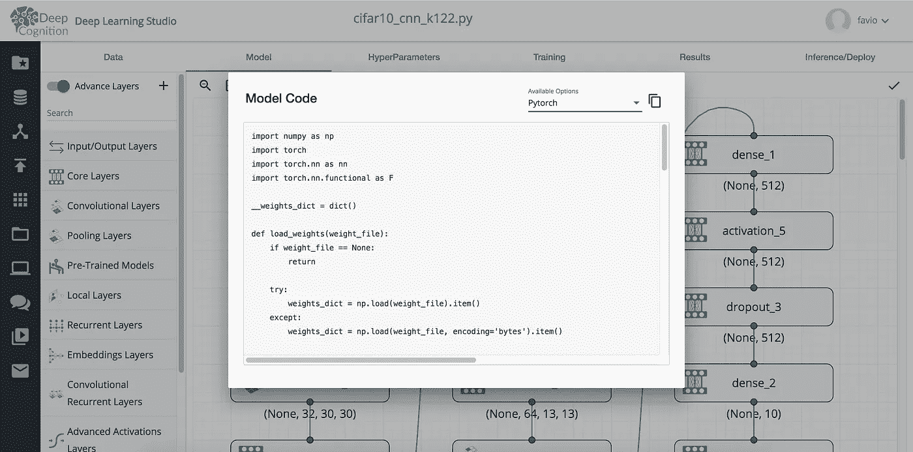

## 张量流:

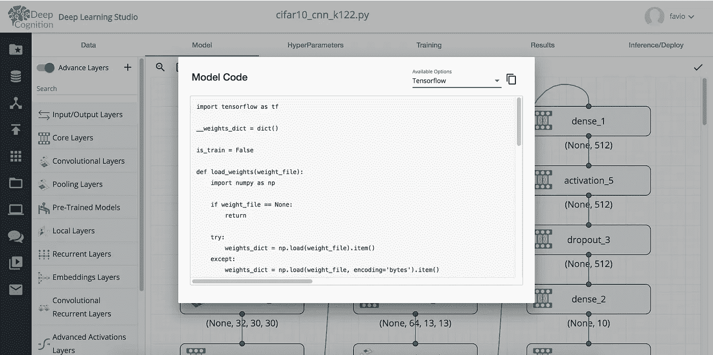

你可以免费得到所有这些。你甚至可以下载一个桌面版本并使用你自己的 GPU，点击这里查看:

 [## 深度学习工作室桌面

### Deep Learning Studio - Desktop 是在您的硬件上本地运行的单用户解决方案。桌面版允许您…

deepcognition.ai](https://deepcognition.ai/products/desktop/) 

## 3.将您的模型部署为 Web 服务或 REST APIs:

Having a magic button to deploy your models would be awesome.

当你完成你的模型，可悲的是很多时候它会永远留在你的电脑上。这太可悲了。想象一下，一个画家不能向任何人展示他的杰作。

通过 DLS 的部署功能，您将能够看到自己和他人的模型在运行。

让我们看看如何做到这一点。

当你建立你的实验时，你给它们命名。我将部署一个由 SGD 优化的模型，命名为 sgd-2(这只是一个名字):

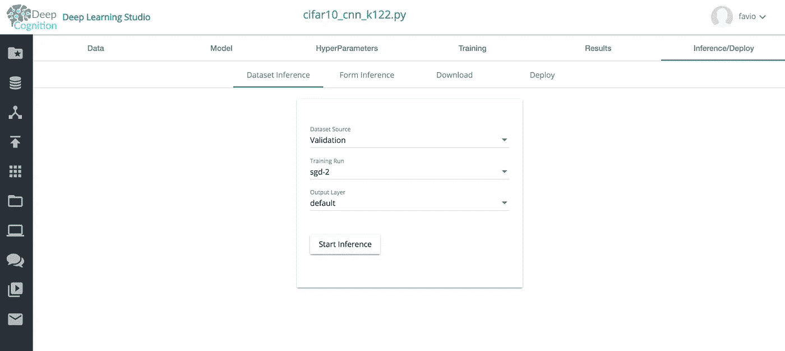

在推理/部署选项卡中，单击部署:

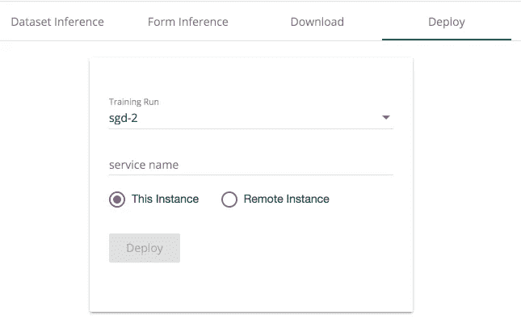

选择运行，创建服务名，然后选择是要使用正在使用的实例还是远程实例进行部署。

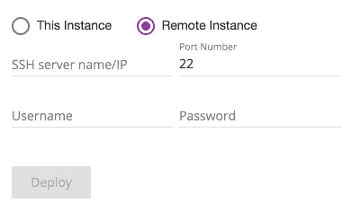

如果你这样做，它会问你更多的信息。我将使用我的云实例进行部署:

之后，您将会看到类似这样的内容:

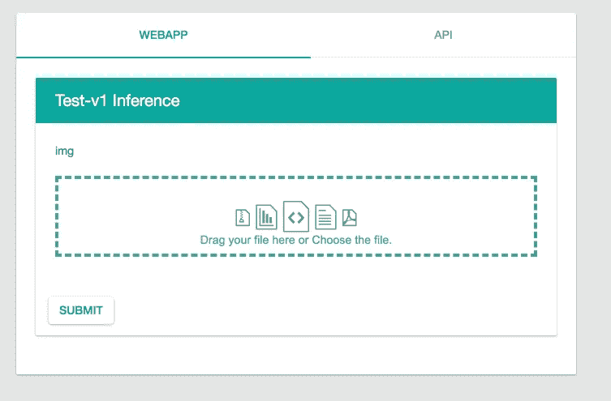

如果您还记得，CIFAR-10 数据集由 10 类 60000 幅 32x32 彩色图像组成。这些类是飞机、汽车、鸟、猫、鹿、狗、青蛙、马、船和卡车。所以我们试着上传一张飞机的图片，看看模型能不能探测到。我将用这张船的图片:

[http://www.seatrade-cruise.com/media/k2/items/cache/3356e0cd9331018e19a8cee016f484a2_XL.jpg](http://www.seatrade-cruise.com/media/k2/items/cache/3356e0cd9331018e19a8cee016f484a2_XL.jpg)

记住我们模型船中的**是第 8 级**。所以我只需点击上传面板:

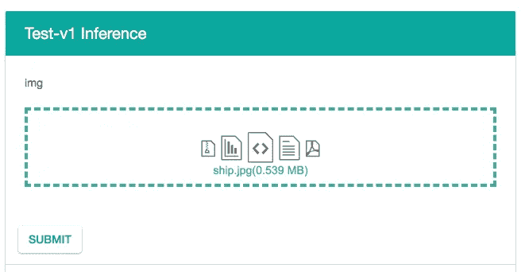

点击提交，我们看到:

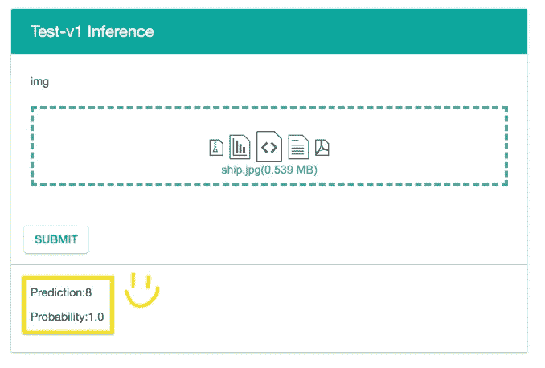

现在你知道了！您自己的具有深度学习的计算机视觉模型部署起来超级容易！

# 结论

生活已经够艰难的了，让它变得更加艰难。如果你是一名程序员、数据科学家、机器学习工程师或类似的人，我可以向你保证，我在这里展示的一些内容正在让你日复一日地奋斗。

借助这些工具，您可以满怀信心地轻松试验、测试和部署您的计算机视觉问题(以及更多问题)。我希望你能从中发现价值。

稍后我会添加更多不同主题的示例:)