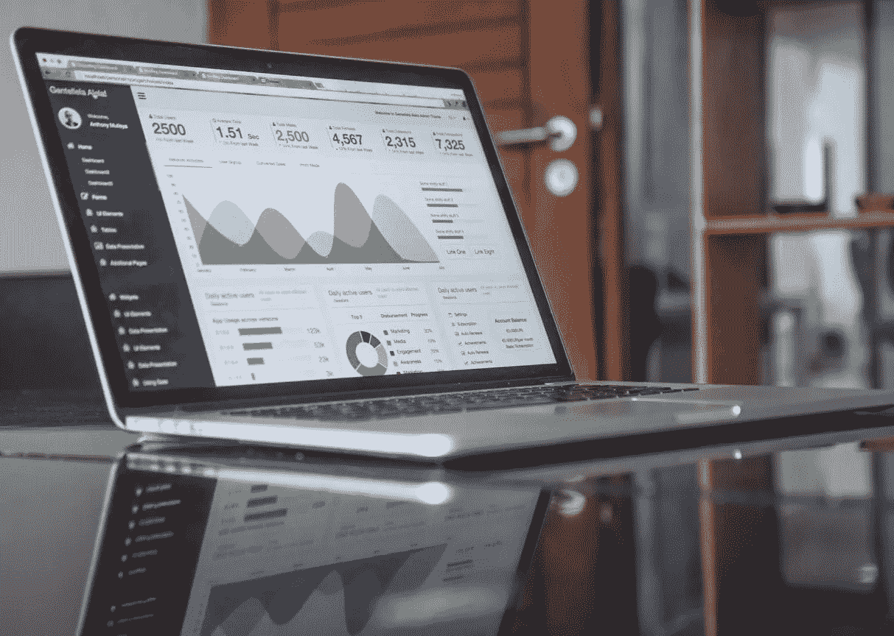
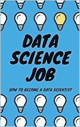

# 成为数据科学家的视觉指南

> 原文：<https://towardsdatascience.com/visual-guide-to-become-a-data-scientist-a8ae6430a249?source=collection_archive---------27----------------------->

## 现在是进入数据科学的最佳时机！

我们生活在一个前所未有的数据创造时代。我们参与的每个流程都是数字化的，并且会留下数字足迹。这意味着需要收集、利用和提取有用信息的数据。这就是为什么现在是成为数据科学家的最佳时机。这里有一个成为其中一员的视觉指南。

How to become a Data Scientist in easy, visual steps.

# 开始学习

这是数据学习的开始:

# GitHub 上的项目

然后，您应该开始在 GitHub 上构建一个数据科学项目组合:

# 数据科学书籍

你绝对应该开始阅读关于数据科学的书籍。以下是您开始的标题:

# 成为一名优秀的数据科学家

如果你有你的 GitHub 作品集，读了一两本书，你可能会开始找工作。以下是一些关于数据科学求职的建议:

# 数据科学工作类型

你应该记得有不同类型的数据科学工作:

# 工作访谈

最后，当你准备好并研究了你想去工作的公司后，你应该为面试做准备:

# 一锤定音

如果你已经做到了这一步，你应该准备好找到你的第一份(或第二/第三份)数据科学家工作。恭喜你！现在开始最激动人心的冒险。

Data Science Job

最后，如果你想了解成为一名数据科学家意味着什么，那么看看我的书[数据科学工作:如何成为一名数据科学家](https://amzn.to/3aQVTjs)，它将指导你完成这个过程。

祝你好运！