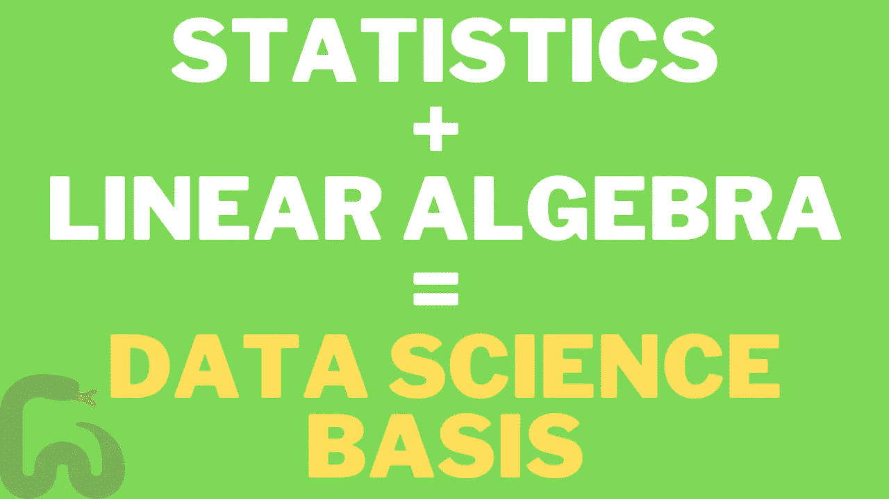
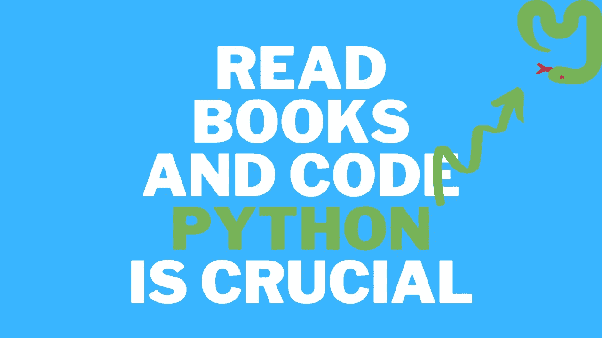
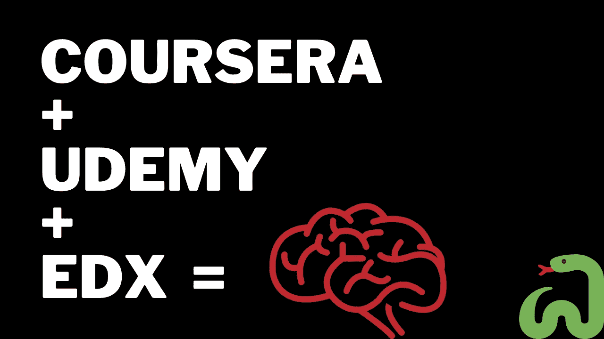
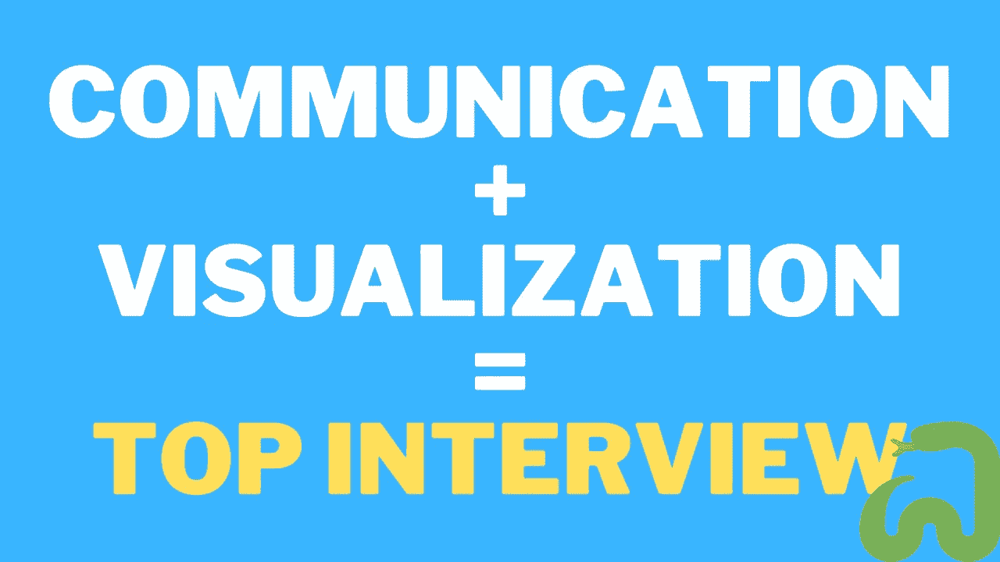
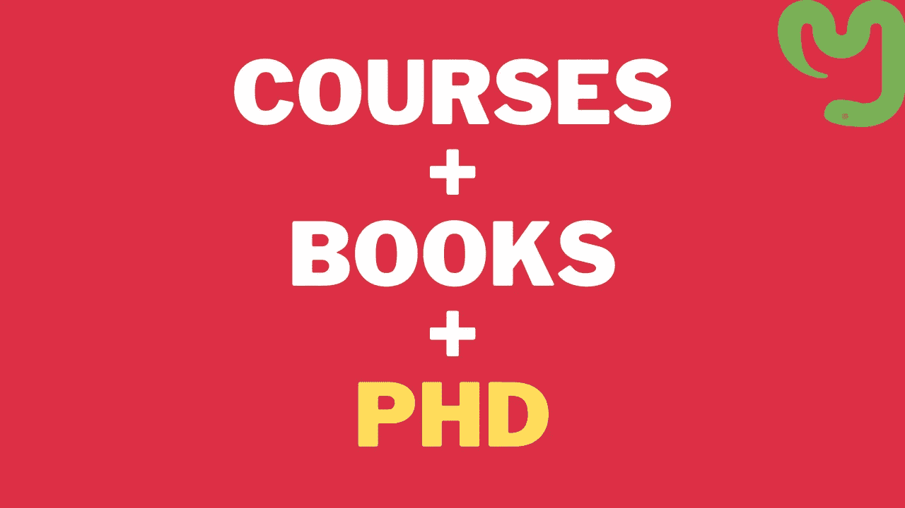

# 数据科学可视化指南

> 原文：<https://towardsdatascience.com/visual-guide-to-data-science-d46bd3d9c69f?source=collection_archive---------24----------------------->

厌倦了阅读关于进入数据科学的长文？这是最短的一个。

数据科学是目前最热门的工作之一。全球有大量的机会，而且肯定会更多，因为我们才刚刚进入数据时代。那么，为什么不[自己成为一名数据科学家](/practical-guide-to-become-a-data-scientist-2483a5f83770)？这应该是视觉引导，使你容易。那就是我:

Hello!

## 步骤 0:修改你的统计学和线性代数

## 第一步:阅读[数据科学书籍](/data-science-books-you-should-read-in-2020-358f70e1d9b2)从 Python 开始

## 第二步:[在 GitHub 上建立一个开源项目组合](/5-ideas-for-data-science-projects-you-can-try-now-b6745d445d02)。使用 [Kaggle](http://www.kaggle.com) 数据集。

## 第三步:[免费学习哈佛和其他好地方的在线课程](/complete-guide-to-become-a-data-scientist-1e08bc54688d)！

## 第 4 步:准备[数据科学面试](/best-tips-for-data-scientists-a52d7cace027)

## 第五步:[永远不要停止学习](/should-you-do-a-phd-in-data-science-3285f1086361)！

让我知道你如何喜欢这个指南，你会有什么建议。

如果你喜欢我创造的东西，请关注[我的媒体频道](http://www.medium.com/@pchojecki)或[订阅我的 YouTube 频道](https://www.youtube.com/channel/UCEq0oQsS-voRnSWbcviIDGA?sub_confirmation=1)，在那里我也每天谈论数据科学和机器学习。

最后，如果你想了解成为一名数据科学家意味着什么，那么看看我的书[数据科学工作:如何成为一名数据科学家](https://amzn.to/3aQVTjs)，它将指导你完成这个过程。

Data Science Job