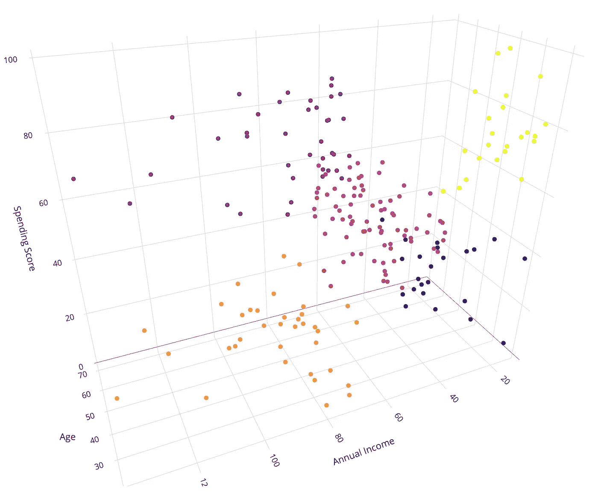
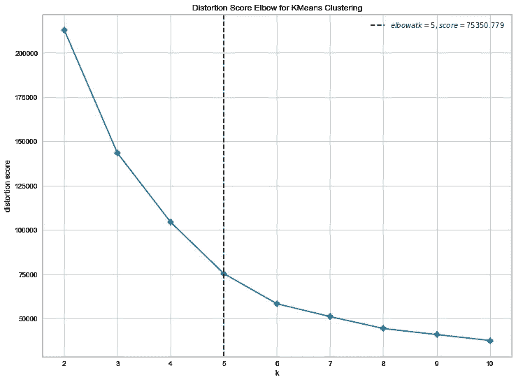
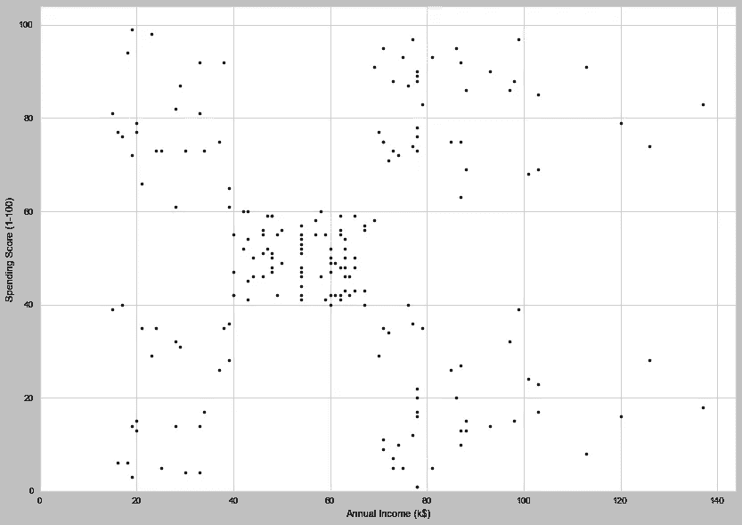
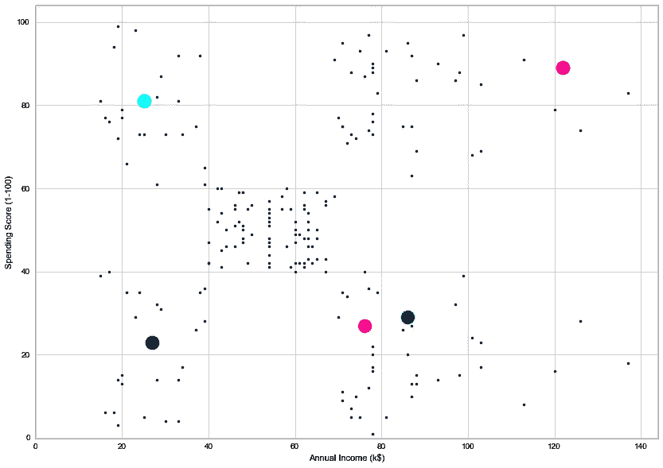
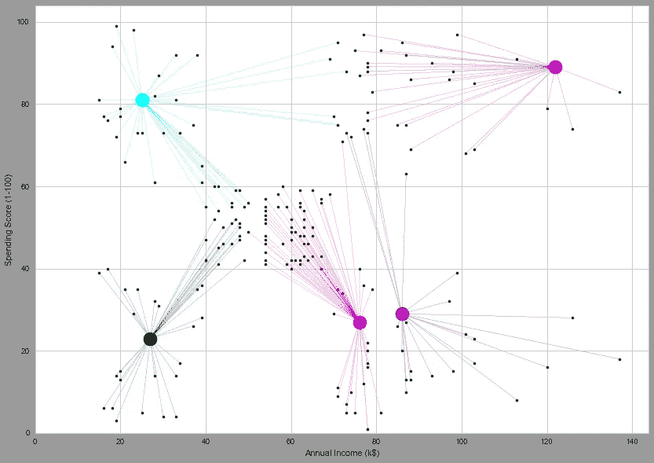
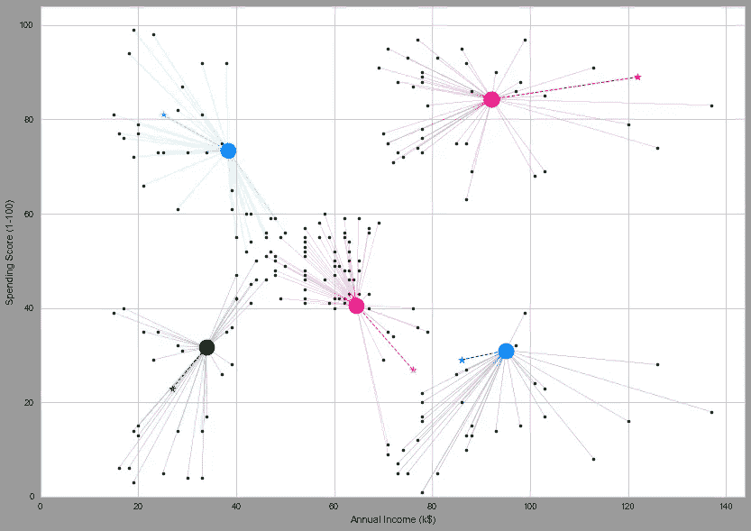
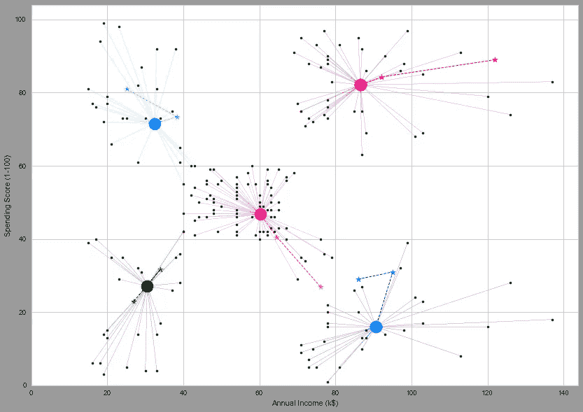

# 用 KMeans 进行聚类的直观介绍

> 原文：<https://towardsdatascience.com/visual-introduction-to-clustering-with-kmeans-89e71e97c60f?source=collection_archive---------27----------------------->

## 通过二维和三维空间以及交互式图形中的可视化方式直观了解 KMeans 聚类

聚类是一种无监督学习，当我们事先不知道数据中的每个观察值属于哪个组时，我们会使用它。

用于聚类的 KMeans 算法基本上由 5 个步骤组成:

*   **第一步:**选择簇的数量 *K*
*   **第二步:**随机选择 *K 个*点作为聚类中心
*   **步骤 3:** 将每个数据点分配到最近的质心
*   **步骤 4:** 计算并放置每个聚类的新质心
*   **步骤 5:** 重复步骤 4，直到没有观察值改变聚类



因此，让我们先看看我们将使用的数据，然后再进入下一步。

**加载数据**

```
**In [1]:**import pandas as pd
data = pd.read_csv('mall.csv')
data = data.drop(['CustomerID', 'Genre'], axis=1)
data.head() **Out [1]:** **Age  Annual Income (k$)  Spending Score (1-100)**
0   19                  15                      39
1   21                  15                      81
2   20                  16                       6
3   23                  16                      77
4   31                  17                      40
```

*注意:我只放弃了流派特性，因为二进制数据在可视化时看起来不那么吸引人。这个功能本来也可以用的。*

该数据描述了商场中顾客的 3 个特征，总共有 200 次观察。在接下来的步骤中，我们将只处理年收入(k$)和支出分数(1-100 ),并将其可视化为二维。稍后我会用所有的数据展示它在三维空间中的样子。

**第一步:选择簇的数量*K***

不幸的是，对于聚类来说，没有找到准确的聚类数的终极方法。然而，有相当多的好工具可以帮助你，其中之一就是使用 yellowbrick 库中的 KElbowVisualizer。正如你在下面看到的，自动“肘”检测器说 5 个集群将是最好的选择。我们选择最佳点的方法是找到曲线上开始变平最多的点(这导致大量的自我解释)。



通过绘制数据，我们可以看到，这看起来确实是数据中合理的集群数量。



**第二步:随机选择 K 个点作为聚类中心**

在我们的下一步中，我们基本上只是在图上选择 5 个随机点作为初始聚类。



**步骤 3:将每个数据点分配到最近的聚类**

在下一步中，我们只需计算所有观测值到每个聚类的距离，并找出距离最小的聚类，这将是该观测值将被分配到的聚类。我们使用的距离就是我们所说的*欧几里德*距离，这只是直接距离的一种数学说法。



**步骤 4:计算并放置每个聚类的新质心**

这是我们看到算法开始工作的一步，捕捉数据中的模式。对于数据集中的每个聚类，我们计算分配给该聚类的观察值的平均年收入(k$) 和平均支出分数(1-100)*。我们看到，紫色的聚类在中间获得了相当多的分配给它的观察值，这意味着*支出得分(1–100)*的平均值很可能会向上和向左移动一点(这意味着当我们移动聚类时，它可能会更接近最初没有连接到该聚类的其他观察值)。我们看到在下一张图中也是这种情况，星星显示了星团的初始位置。注意一些观察是如何改变聚类的。中间几乎所有的观测都和现在的紫色星团有联系。*



**步骤 5:重复步骤 4，直到没有观察值改变聚类**

最后，我们只需重复第 4 步，直到没有观察值改变集群，我们有我们的最终集群指定。对于下图，我们只是在第二次迭代，我们看到集群已经看起来相当合理。实际上，我们可能需要重复第四步一到两次，才能让星团稳定在它们真正的中心。



# **在三维空间中可视化**

实际上，当我们进入高维空间时，KMeans 聚类并没有什么不同。唯一的区别是，当我们超过 3 个特征时，我们就不能再想象它了。让我们试着检查一下星团在三维空间中的样子。

# 获取代码

If the code does not appear properly, you can click the filename at the bottom and jump directly to GitHub or download the Jupyter Notebook directly here: [click here](https://gist.github.com/mikkelduif/11d33d2f86c6083378f3bf33eaea4e01/archive/b527da007faafc3dfa054cda356aece8d67ae62e.zip).

我希望这篇简短的介绍和对 KMeans 的可视化描述能够帮助您更好地理解集群。请随意留下您的评论或问题。你也可以看看更多关于[神经网络](/exploring-how-neural-networks-work-and-making-them-interactive-ed67adbf9283)或者[决策树](/an-introduction-to-decision-trees-with-python-and-scikit-learn-1a5ba6fc204f)的其他文章。