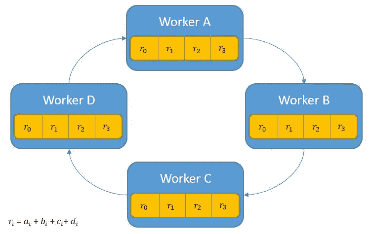

# 面向分布式深度学习的环形全递归视觉直觉

> 原文：<https://towardsdatascience.com/visual-intuition-on-ring-allreduce-for-distributed-deep-learning-d1f34b4911da?source=collection_archive---------5----------------------->

最近，我发现自己正在处理一个非常大的数据集，这是一个需要并行学习才能实现的数据集。我立刻想到了优步的 [Horovod](https://github.com/horovod/horovod) 。我之前在优步的一次技术演讲中听说过它，但并没有真正使用过。我发现它非常有趣，是一个很棒的框架，从高级简化到支持这个框架的算法。在这篇文章中，我将尝试描述我对后者的理解。

## 那么它到底是做什么的呢？

对此需要理解的重要一点是，在深度学习中，我们需要计算梯度，以便能够调整我们的权重。没有这个学习就不可能发生。为了计算这个梯度，我们需要处理所有的数据。当这样的数据太大时，这就成了一个问题。这就是我们并行处理这些计算的原因。这意味着我们将有几台计算机并行处理一部分数据。当这些处理单元或工作者(它们可以是 CPU、GPU、TPU 等)中的每一个时，)完成了对其子集的梯度计算之后，他们需要将其结果传达给所涉及的其余过程。实际上，每个流程都需要与其他流程/工作人员交流结果。幸运的是，其他人在过去也遇到过这个问题，并设计了 Allreduce 算法，它正好可以做到这一点。我先描述一下这个。

## 全归算法

从概念上讲，该算法让每个进程/工作者与所有其他进程共享其数据，并应用归约操作。这种运算可以是任何一种归约运算，如求和、相乘、求最大值或最小值。换句话说，它将所有进程/工作进程中的目标数组缩减为一个数组，并将结果数组返回给所有进程。

例如，这个:

Before Allreduce operation

在所有的减少总和之后会变成这样:

After Allreduce operation

那么你真的会怎么做呢？我马上想到了天真的方法。互相发送数据数组，然后对每个进程应用 sum 运算，如下所示:

Message passing using naive Allreduce

事实证明，这种方式并不理想。它发送了太多不必要的消息，可能会使消息网络饱和。

另一种更简单的常见方法是选择一个流程/工人作为驱动者。然后，所有其他进程会将其数组发送给驱动程序，驱动程序会应用该操作，并将结果重新分配给工作进程。看起来像这样的东西:

这种方法的问题是它不能很好地扩展。驱动程序进程成为瓶颈，因为它的通信和归约操作的应用与进程的数量成比例增加。这在我只有 4 个进程的玩具例子中可能不明显。

Allreduce 算法还有许多其他实现。一些尝试最小化带宽，一些尝试最小化延迟。在研究这个问题的时候，我意识到还有很多其他的架构可以让我在这篇文章中讨论，而不会让它变得无聊。如果你想知道更多，我找到了这篇[伟大的论文](https://www.researchgate.net/publication/259239833_Sparse_Allreduce_Efficient_Scalable_Communication_for_Power-Law_Data)，它描述了一些最常见的方法。

Figure 2, from the paper, copyright by [John Francis Canny](https://www.researchgate.net/profile/John_Canny2)

现在我们已经知道了一些不同的实现方法，让我们来描述它的环形版本，并探索它的好处。

## 环所有-减少

Allreduce 的环形实现有两个阶段。第一阶段，份额减少阶段，然后是纯份额阶段。

在 share-reduce 阶段，每个进程 *p* 向进程 *(p+1) % p* 发送数据，其中%是模运算符。所以进程 A 会发送给进程 B，以此类推。这就是产生类似环的连接的原因。此外，长度为 *n* 的数据数组除以 *p，*这些块中的每一个都将由 *i* 向前索引。大概是这样的:

Each process sends chunks of its array to the next process

第一个份额减少步骤会让进程 A 将 *a0* 发送给进程 B，进程 B 将 b1 发送给进程 C，依此类推。大概是这样的:

然后，当每个进程接收到来自前一个进程的数据时，它会应用 reduce 操作符，然后继续将它再次发送到环中的下一个进程。请记住，在我们的示例中，归约运算符是一个 sum。它看起来像这样:

Each process sends an intermediate result of the reduce operation.

同样重要的是，我们的归约运算符是 [*关联的*](https://en.wikipedia.org/wiki/Associative_property) ，以及[*交换的*](https://en.wikipedia.org/wiki/Commutative_property) 否则您无法将中间结果从一个流程传递到另一个流程。当每个进程持有块的完全缩减时，共享缩减阶段结束。此时，每个进程持有最终结果的一部分，它看起来像这样:

The state of the processes after the share-reduce step is completed

第二步，仅共享步骤非常简单，只是以类似环形的方式共享数据的相同过程，而不应用 reduce 操作。这巩固了每个进程中每个块的结果。

像这样:

The state of all processes after the Allreduce is completed

## 对发送数据的简单分析

如果我们比较驱动程序进程 Allreduce 和环 Allreduce 发送的数据量，我们会发现为什么环 Allreduce 是现代网络架构中共享梯度的最佳选择。

在我们的驱动程序进程 Allreduce 中，在这篇文章的前面描述过；其他所有进程都将其数组发送给驱动程序。最初的发送是发送 N 个元素(P-1)次，然后驱动程序进程将应用归约操作符并将结果发送回其他进程，因此将是另一个 N × *(P-1)* 通过网络发送，总共是 *2(N ×(P-1))。*这是一个与 p 成正比的项。

在 ring Allreduce 的 share-reduce 步骤中，每个进程发送 *(N/P)* 个元素，它执行 *(P-1)* 次，所以 *(N/P) ×(P-1)。*在仅共享步骤中，每个进程发送它计算的块的结果。那就是一个附加的(N/P)元素做了(P-1)次，所以一个附加的 *(N/P) ×(P-1)。*总共加起来是*2(*(N/P)×(P-1))**

*从这里我们可以观察到，这将缓解瓶颈，因为这是几乎相同的术语，只是驱动程序进程的 *N* 和环形进程的 *(N/P)* 不同。让我们记住，这个计算只针对环形体系结构的一个过程。即使你将得到的等式乘以 *P* 你也会得到同样的另一个等式，但是它仍然分布在 *P* 进程中，而不是全部在驱动程序进程中。这就是如何缓解瓶颈，这就是为什么他们称这种算法为最佳带宽。*

## *结论*

*我们调查了为什么在计算深度神经网络中的梯度时，我们需要分布数据。我们直观地探索了 ring Allreduce 算法是如何工作的，并执行了一个基本的分析，将它与其他 Allreduce 范式进行了比较，了解了什么使它成为更好的选择，以及为什么它被用在 Horovod 这样的框架中。据我所知，它现在甚至内置在 tensor flow[collectiveallreducedstrategy](https://www.tensorflow.org/api_docs/python/tf/contrib/distribute/CollectiveAllReduceStrategy)中。*

*参考文献:
https://eng.uber.com/horovod/*

*[https://www . research gate . net/publication/259239833 _ Sparse _ all reduce _ Efficient _ Scalable _ Communication _ for _ Power-Law _ Data](https://www.researchgate.net/publication/259239833_Sparse_Allreduce_Efficient_Scalable_Communication_for_Power-Law_Data)*

*[https://preferred research . jp/2018/07/10/technologies-behind-distributed-deep-learning-all reduce/](https://preferredresearch.jp/2018/07/10/technologies-behind-distributed-deep-learning-allreduce/)*

*[https://www . toms hardware . com/news/Baidu-svail-ring-all reduce-library，33691.html](https://www.tomshardware.com/news/baidu-svail-ring-allreduce-library,33691.html)*

*https://mpitutorial.com/tutorials/mpi-reduce-and-allreduce/*