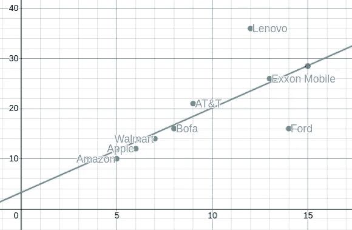
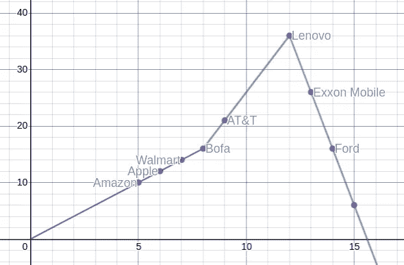
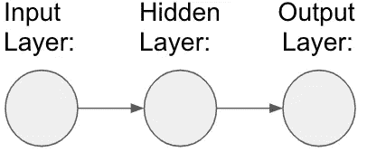
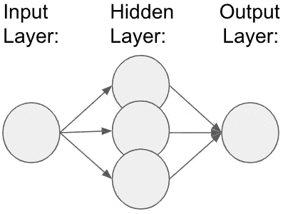
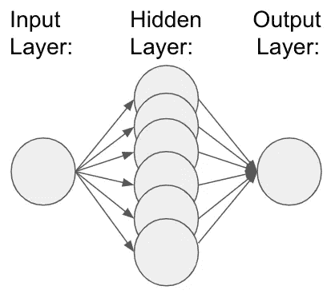
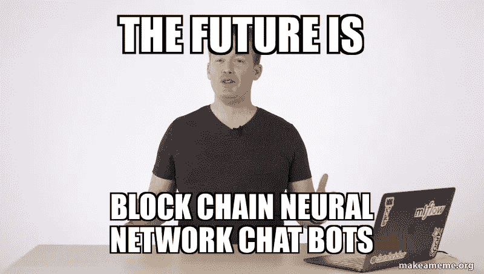

# 视觉网络:营销顾问

> 原文：<https://towardsdatascience.com/visual-networks-the-marketing-consultant-d152b04a5e46?source=collection_archive---------42----------------------->

## 理解非线性关系和营销诡计

神经网络在[分类图像](https://www.youtube.com/watch?v=8jfscFuP_9k)和[创建原文](https://www.nytimes.com/2018/11/18/technology/artificial-intelligence-language.html)方面取得成功的原因有很多。其中的几个原因是低廉的培训成本、可扩展的实现和该领域的投资。特别有趣的是他们捕捉非线性关系的能力。这种关系的一些例子是税级和收入、关税和贸易量、你的年中公司销售奖金、人口数量和时间等。像“过了这一点它会翻倍”或者“它会变得越来越糟糕”这样的短语隐藏了非线性关系。

Tax Brackets(y) and Income(x)

另一方面，线性关系是直接的。以工资和工作时间为例。你打卡的时间越多，月底你得到的存款就越多。很简单，每小时工资 10 美元，你工作 7 小时可以赚 70 美元。

营销投资并非一帆风顺。公司在广告上的花费和他们的回报当然是非线性的。让我们试着用神经网络来捕捉这种关系。

想象一下，你有数百家公司的营销投资和预算，你想要一种方法来预测你未来的回报。你知道，沃尔玛投资 7 美元获得 14 美元的回报，埃克森美孚投资 13 美元获得 26 美元的回报，数百美元也是如此。你能预测你的投资会有什么回报吗？

Return(Y) and Investment(X)

鉴于你要投资 15 美元，之前公司的经验对你有什么帮助？有没有办法用数据捕捉投资和回报之间的关系？

在这种情况下最常用的工具是[线性回归](http://news.mit.edu/2010/explained-reg-analysis-0316)。我们试图找到一条尽可能接近图中所有点的线。德斯莫斯建立了线性回归模型。这里有一个[链接](https://www.desmos.com/calculator/poes7yejoa)到这个例子。

Linear Regression in Desmos

我们将直线与点拟合，并找到一种方法来预测我们的回报。看起来我们会做得很好。红点在上面很高，只在联想下面。你很兴奋，决定投资 15 美元到脸书广告公司。几个星期后，你看到你的回报，得到 6 美元。如何解释如此灾难性的表现？你用了数学，你试图从以前的经验中学习，但还是失败了。

> “营销投资并不是直截了当的。公司在广告上的花费和他们的回报当然是非线性的”

至少这不是世界末日，你只损失了 15 美元。但你还是想明白为什么会这样。幸运的是，你有一个每天都在做脸书广告的朋友。他是[领域专家](https://twitter.com/probotticelli/status/958675970764034048)。你给他看数据，他马上就能看出你失败的原因。他说是“创造性疲劳”。显然，脸书用户对一个创意感到[疲惫](https://www.marketing-interactive.com/facebook-ads-creative-fatigue-how-to-identify-and-combat-it/)，并停止点击它。你还在花钱却没有得到好的业绩。

在你决定数学是一个骗局之前，我们需要再看看数据。用线性模型获取数据不是正确的方法。让我们回到德斯莫斯，现在我们知道了创造性枯竭。看来投资太多是要罚款的。也许福特在埃克森美孚之下的原因不是随机的。

我们不能使用线性模型。我们需要一种非线性的方法来拟合数据。这就是机器学习的全部内容。[曲线拟合](https://flowingdata.com/2018/09/20/xkcd-curve-fitting-messages/)。有关曲线拟合工作原理的更多详细信息。[连杆](http://karpathy.github.io/neuralnets/)、[连杆](http://neuralnetworksanddeeplearning.com/chap2.html)和[连杆](https://playground.tensorflow.org/#activation=tanh&batchSize=17&dataset=spiral&regDataset=reg-gauss&learningRate=0.03&regularizationRate=0&noise=0&networkShape=4&seed=0.60558&showTestData=false&discretize=false&percTrainData=40&x=true&y=false&xTimesY=false&xSquared=false&ySquared=false&cosX=false&sinX=false&cosY=false&sinY=false&collectStats=false&problem=regression&initZero=false&hideText=false&discretize_hide=false)。

我们需要一种工具来适应不断变化的市场决策。这就是神经网络可以发挥作用的地方。你可以点击以下 3 个交互式可视化来了解更多关于神经网络如何工作的信息。

**直观解释**

One Neuron

在其最简单的形式中，神经网络只能描述线性关系。一个神经元不会让你走那么远。

**点击这里:** [**链接**](https://www.desmos.com/calculator/qjgc64m8at)

Three Neurons

**三个神经元**能够紧密配合我们的非线性问题。有一些误差，但比线性模型小。您可以移动不同的值，看看可以描述什么类型的关系。

**点击这里** : [链接](https://www.desmos.com/calculator/83qvavlt4y)

Six Neurons

我们可以用六个神经元来拟合任意的关系。

**点击这里:** [**链接**](https://www.desmos.com/calculator/tcd1g3tp3n)

最后，神经网络可以捕捉任意怪异的关系。您只需要数据，输出是一个定义明确的函数。很多问题随之而来。怎样才能开始做[推理而不是预测](https://stats.stackexchange.com/questions/244017/what-is-the-difference-between-prediction-and-inference)？我们如何[避免过度拟合](https://www.investopedia.com/terms/o/overfitting.asp)？我们如何从神经网络中提取人类可解释的关系？当你在查看 3 个或数千个输入变量时，这变得越来越复杂。我们如何解释一段有数千个变量的关系？很多人都在研究这些问题，并取得了令人兴奋的成果。更多信息[这里](https://www.kaggle.com/learn/machine-learning-explainability)，这里[这里](https://www.oreilly.com/ideas/ideas-on-interpreting-machine-learning)，这里[这里](https://github.com/AppliedDataSciencePartners/xgboostExplainer)，这里[这里](https://homes.cs.washington.edu/~marcotcr/blog/lime/)。

Recurrent Neural Chat Boats is where it’s at.