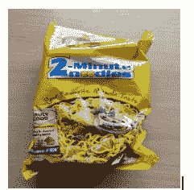
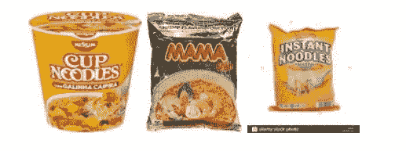
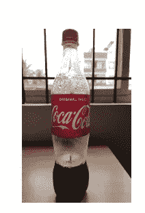
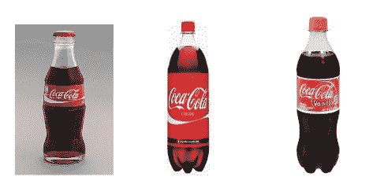

# 智能零售收银台的视觉产品搜索

> 原文：<https://towardsdatascience.com/visual-product-search-for-smart-retail-checkout-eb7e1f34a351?source=collection_archive---------21----------------------->

## *用数据做酷事！*

**简介**

人工智能正在改变几个经济领域，如汽车、营销和医疗保健。零售业可能是下一个。在商店购物的基本零售体验几十年来一直没有改变。人工智能可以从根本上改变这种体验，让它以高成本效益的方式为每个消费者提供大规模的完全个性化、沉浸式和优化的体验。

我们正在这里写一系列博客，详细介绍人工智能在零售业的应用。每个博客处理不同的用例，并分享演示可行性的实际代码。这是第一个。

**视觉产品搜索**

很多时候，我们发现很难回忆起一件产品的确切名称，或者无法清晰地描述它以便谷歌搜索，或者想要重新订购我们看到别人穿的衣服。在所有这些情况下，以及更多的情况下，“视觉产品搜索”是拯救。我们不需要描述，只需要给产品拍张照片，然后搜索它。

Visual Product Search

**视觉产品搜索是如何工作的？**

视觉产品搜索的概念也称为反向图像搜索，是将图像表示为特征向量。现代深度学习技术可以使用预训练的 CNN 将图像编码成特征向量。特征向量类似于图像描述符，并对深度学习已经学习到的相关图像信息进行编码。为了运行视觉产品搜索，我们有一个可以编码成特征向量的图像数据库。然后，我们获得一个**查询**图像，并将其向量与整个数据库进行比较，以获得最接近的匹配。

**视觉产品搜索的应用**

视觉产品搜索在人工智能中可以有很多应用。两个这样的应用是:

*   对于在线订购，我们可以使用摄像头进行搜索，并自动将商品添加到商店购物车中。许多大型零售商如亚马逊、Nordstrom 已经提供这种服务。只需拍摄一张照片即可添加到购物车中
*   对于实体店，我们可以有一个智能结账系统，它可以使用一个摄像头来自动为产品向客户收费。零售商会喜欢它，因为它会削减成本，顾客会享受顺利结账的体验。干脆买了就走。没有队列。

我们已经通过可视化产品搜索为智能结账做了一个演示。我们开始吧！

Who likes long checkout queues?

**智能结账系统**

我们使用 [Google Vision API](https://cloud.google.com/vision/) 来构建这个应用程序。他们有一个功能叫做视觉产品搜索。如果您是 API 的新手，请参考这个[文档](https://cloud.google.com/vision/docs/quickstart)了解如何开始。

## **创建一个物品数据库**

有两种方法可以创建将被搜索的数据库:

1.  创建一个空的产品集，并使用在线导入向其中逐个添加图像
2.  使用批量导入同时创建产品集，创建多个产品及其参考映像。

我们通过从互联网上抓取图片，创建了一个常见零售商品的数据库——冷饮、饼干、薯条、面条等。然后，我们使用批量导入将这些图像添加到 API 中。通过这样做，API 将每个图像转换成一个特征向量。

对于批量导入，主要步骤是:

*   将你的数据库上传到谷歌云存储
*   创建描述数据库中图像的 CSV 文件。CSV 文件的细节在下一节给出。将这个 CSV 文件上传到 Google 云存储桶中。
*   使用存储在 Google 云存储桶中的图像或 base64 编码的本地图像向 Vision API 产品搜索发出请求。

CSV 包含各种列。列名及其说明如下:

*   **image-uri** :参考图片的 Google 云存储 uri。
*   **image-id** :您可以提供的唯一值。否则，系统将分配一个唯一的值。
*   **product-set-id** :导入图像的产品集的唯一标识符。
*   **产品类别**:允许值为家居用品-v2、服装-v2、玩具-v2 和包装商品-v1。
*   **产品-显示-名称** : ***可选*** 。如果不为产品[提供名称，显示名称](https://cloud.google.com/vision/product-search/docs/reference/rest/v1/projects.locations.products#Product.FIELDS.display_name)将被设置为" "。
*   **标签** : ***可选*** 。描述参考图像中产品的键值对字符串(带引号)。比如:“品类=鞋子”，“颜色=黑色，款式=正式”。
*   **包围多边形** : ***可选*** 。指定参考图像中的感兴趣区域。如果一个边界框没有被指定。如果 API 检测到多种产品，单个图像中的多个区域可能会被编入索引。

我们现在可以用我们的查询图像向 api 发出请求。这是使用 curl 完成的，如这里的所述[。](https://cloud.google.com/vision/docs/using-curl)

**实验及结果:**

我们通过网络搜集创建了一个普通零售产品的图片数据库。对于实际用例，这将是零售商存档的产品图像。为了测试 API，我们传递了一个通过手机摄像头捕捉的查询图像。以下为面条的查询图片:

Noodles Query Image

对 api 的请求给出了以下匹配的产品

API result on Noodles Image

然后我们传递了一张可口可乐的查询图片如下:

Coke Query Image

对 api 的请求为 coke image 提供了以下匹配产品。

API result for Coke Query image

还不错！API 能够非常准确地导航到正确的产品类型。这是很有希望的，因为过程相对简单，API 成本也相当合理。

这个简单的演示表明，通过对商店销售的整个数据库进行编码，上述技术可以扩展到更智能的客户结账。在结账时，安装的摄像头可以检测每个对象的位置，裁剪它们的图像，并对 API 进行批量查询，以获得数据库中最匹配的产品，从而进行结算。

**结论**

根据[全球市场洞察](https://www.gminsights.com/industry-analysis/artificial-intelligence-ai-retail-market)，到 2024 年，零售部门对人工智能的投资将超过 80 亿美元。人工智能在零售领域有很多应用，智能结账将是一个革命性的变化。

我有自己的深度学习咨询公司，喜欢研究有趣的问题。我已经帮助许多初创公司部署了基于人工智能的创新解决方案。请到 http://deeplearninganalytics.org/[来看看我们。如果你有一个我们可以合作的项目，那么请通过我的网站或在**info@deeplearninganalytics.org**联系我](http://deeplearninganalytics.org/)

你也可以在[https://medium.com/@priya.dwivedi](https://medium.com/@priya.dwivedi)看到我的其他作品

**参考文献:**

*   [云视觉 API](https://cloud.google.com/vision/)
*   [人工智能零售趋势](https://www.retail-insight-network.com/digital-disruption/ai-trends-retail/)