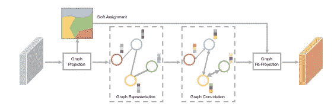
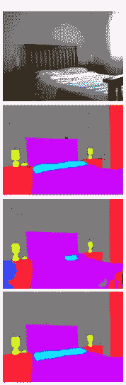
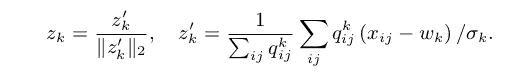
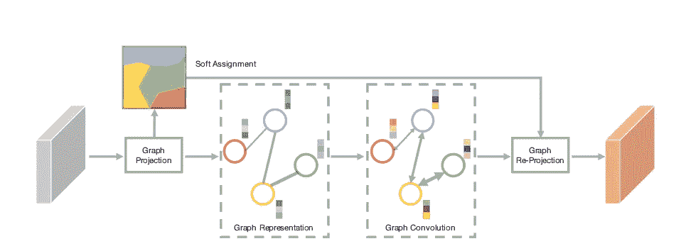
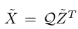
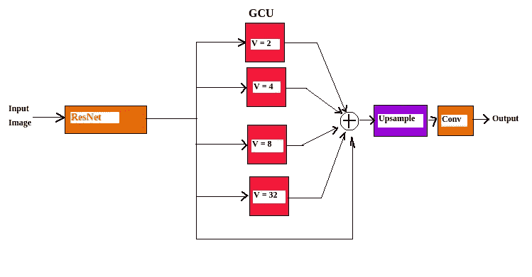
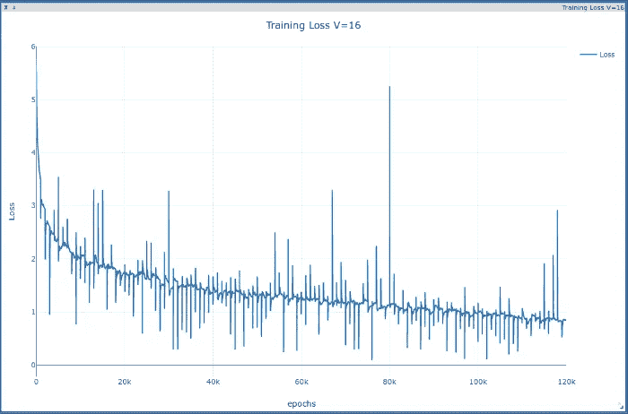
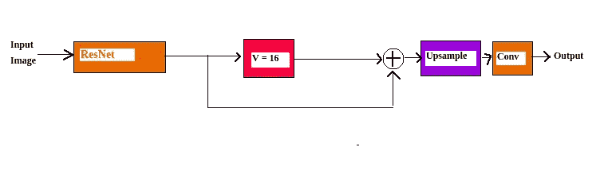

# 使用图形的视觉识别

> 原文：<https://towardsdatascience.com/visual-recognition-using-graphs-9c446005736e?source=collection_archive---------18----------------------->

[Graph convolutions](https://papers.nips.cc/paper/8135-beyond-grids-learning-graph-representations-for-visual-recognition.pdf)

# 介绍

[卷积神经网络](/a-comprehensive-guide-to-convolutional-neural-networks-the-eli5-way-3bd2b1164a53)在视觉识别任务中取得了巨大成功。本文特别关注语义分割。使用 CNN 背后的逻辑是图像具有位置感，也就是说，彼此靠近的像素更相关。CNN 能够通过卷积运算捕捉到这一点，并且考虑的局部区域(正式称为感受野)取决于核的大小。图像中还存在长程相关性，这有助于视觉识别任务。为此，概念是堆叠许多卷积层，这将在理论上增加感受野。因此，现在长程和短程依赖性都被考虑在内，把网络放在训练上，你很容易得到结果，对不对！

但是我相信你很清楚，理论和实践并不总是一致的。最近发表了一篇论文(作者罗、等)表明感受野并不随卷积层数线性增长，而且受到严格限制。此外，感受野取决于各种其他因素，如初始化方案。那么解决办法是什么呢？

# 图表来拯救

如果我们能够将图像分组为区域，并使用这些区域来提取特征并进一步处理图像，情况会怎样？除此之外，地区之间也存在依赖关系，这将有助于获得长期依赖关系。所有这些都可以使用图像的图形表示来实现。

广义地说，图中的所有顶点代表图像中的不同区域。边缘将表示区域之间的关系或相似性。

圆圈代表具有代表该区域的相应特征向量的区域。边缘是区域之间的相似之处。

# 语义分割

语义分割是给每个像素分配其所属的类别的任务。一个基本的技术是，将有一个编码器，后面跟着一个解码器，其输出将是像素级的分配。

分段是如何工作的？让我们举一个非常基本的例子，假设有一个图像只由红色、蓝色、绿色组成，如

Fig1

假设这些颜色代表一些物体。现在假设谁想把图像分割成用颜色表示的三个物体。要做到这一点，你需要什么样的特征向量？对这个只有颜色就足够了。如果我们说根据特征向量，那么每个特征向量的深度是 3；对于红色[0，0，1]，对于蓝色[1，0，0]，对于绿色[0，1，0]。正如你所看到的，这些特征足以将图像分割成 3 个区域。现在考虑一个现实生活中的图像，如图 2 所示。只用颜色你能完成任务吗？不，没错。我们需要图像中存在的每个对象的特征表示，以将其与其他对象分开，并使相似的对象更加接近，这就是编码器发挥作用的地方。它将彩色图像表示转换成某种潜在空间表示，在这种潜在空间表示中，同一物体的特征更接近，而不同物体的特征彼此远离。显然，编码器需要训练。一旦我们在一些分离不同物体的潜在空间中有了特征，我们就需要将信息传播到像素级，这就是解码器发挥作用的地方。

让我们理解图在语义分割中是如何有用的。一旦使用编码器提取了特征向量，图形就开始发挥作用。考虑图 2 中的图像。图像从上到下依次分别是实际图像、地面真实、用 FCN 分割、用 GCU 分割。在此图中，使用 FCN 时，枕头和床类别的概率非常接近。因此，你可以在图 2 中看到枕头和床被合并。

现在假设编码器后面有一个图形表示。从编码器得到的图像的特征向量表示被迫分成多达 8 个区域(即 8 个顶点的图)]。如果我说就损失而言，如果顶点是空的，即没有像素被分配给它，则损失更高。在训练的初始阶段，枕头和床也将被分配到同一个班级。但是当我们进一步训练网络时，每个特征向量被分配给一个顶点，即没有顶点是空的。图像在图形表示中被分割的可能区域是在地面上的区域。因此在训练结束时枕头和床将被分割成两个不同的区域。通过乘以一些权重来进一步处理分配给顶点的特征，并且所得到的特征向量与来自编码器的特征向量一起被进一步用于分割。因此，图形表示进一步改进了图像的特征表示。

一个显而易见的可能发生的事情是当将图像划分为区域时，图像的过度分割。但是过度分割的区域将在进一步的操作如卷积后重新组合。

现在的问题是如何将基于网格的图像表示转换为这种图形表示，并学习图形表示的参数，答案是图形卷积单元(GCU)。

[Fig2](https://papers.nips.cc/paper/8135-beyond-grids-learning-graph-representations-for-visual-recognition.pdf)

# 图形卷积单位(GCU)

就像卷积在网格状结构上操作一样，GCU 在图形状结构上操作。GCU 有三个主要步骤

1.  **图形投影:**在这个步骤中，图像的网格状表示被转换成图形表示。该图由以下参数参数化:

*   *V* :图中顶点的数量，暗示图像将被分割的区域的数量。
*   *W* :表示区域的特征向量。形状是(d，V)，其中 d 是特征向量的维数
*   *方差*:它是分配给特定顶点的所有像素在每个维度上的方差。形状是(d，V)，其中 d 是特征向量的维数。

*V* 是固定的，而 *W* 和*方差*是在训练中学习的。假设存在具有高度 H 和宽度 W 的图像的 2-D 特征图，并且每个元素具有维度 D。计算属于每个顶点的每个特征向量的概率，这产生概率矩阵 q。下面的等式用于计算概率:

其中，xᵢⱼ是二维特征图的 iᵗʰ行和 jᵗʰ列的特征向量，wₖ是表示 kᵗʰ区域(顶点)的特征，σₖ是沿着顶点 k 的所有维度的方差。现在，通过取残差的加权平均值来计算所有顶点的特征编码。残差越多，它在计算编码特征中的贡献就越小。使用下面给出的等式:

其中 zₖ是编码特征。邻接矩阵由 ZᵀZ 计算，它给出不同顶点之间的余弦相似性。这一步总共计算了 3 样东西

*   概率矩阵 Q，形状(HW，d)
*   编码特征 Z，形状(d，V)
*   邻接矩阵 A，shape ( V，V)-表示区域之间的相似性，因此它捕获了图像中的长程相关性。

[Overall pipeline for GCU](https://papers.nips.cc/paper/8135-beyond-grids-learning-graph-representations-for-visual-recognition.pdf)

2.**图形卷积:**该步骤类似于卷积的前一步，即在生成的图形上进行卷积。使用下面给出的公式:

其中 W g 是形状的权重矩阵(d，dₒᵤₜ).如您所见，等式中有一个邻接矩阵 A，在计算新的编码特征时会考虑长程相关性。因此新的编码特征依赖于所有的区域(A)和当前的编码特征(Z)。关于图形卷积的阅读，请参考这篇[文章](/how-to-do-deep-learning-on-graphs-with-graph-convolutional-networks-7d2250723780)和[这篇](/how-to-do-deep-learning-on-graphs-with-graph-convolutional-networks-62acf5b143d0)。这些文章中给出了非常容易理解且足够的信息。

3.**图形重投影:**最后将图形转换回网格状结构，以便可视化或做进一步操作。等式如下所示

# 架构和实现

使用的架构是预训练的 ResNet 50/101，扩展被添加到最后两层，因此输出被降采样 8 倍。其次是 GCU。在最初的实现中，4 个 gcu 的输出连接到 ResNet 的输出，如下图所示。

在这种情况下，d 是 1024，dₒᵤₜ是 256。串联后输出的深度将是 1024(来自 ResNet50) + 256x4 = 2048。使用双线性插值对级联输出进行上采样。接下来，卷积层用于将像素分配到不同的类别。用于最小化误差的损失函数是[负对数似然](https://ljvmiranda921.github.io/notebook/2017/08/13/softmax-and-the-negative-log-likelihood/)损失函数。

Fig3 Training loss curve

我实现的 Pytorch 在这里[可用](https://github.com/vidit98/graphconv)。我在下面给出了实现细节。使用的数据集是 ADE20K。

*   使用 resnet 50 expanded，在 ADE20K 上进行预训练，此处[可用](https://github.com/CSAILVision/semantic-segmentation-pytorch)。ResNet50 的输出深度是 2048。
*   gcu 跟随 ResNet50。在论文中，4 个 GCU 单元被连接在一起，但由于计算能力有限，我只使用了 1 个 16 顶点的 GCU。我写了一个通用代码，所以你可以很容易地修改 4 个 gcu 的代码。要了解更多关于 GCU 实现的细节，请参考我的下一篇[帖子](https://medium.com/p/b1c18edab048/edit)。
*   在这种情况下，d 是 2048，dₒᵤₜ是 256。串联后输出的深度将是 2048(来自 ResNet50) + 256= 2304
*   接着是双线性上采样操作，然后是 1 个卷积层。
*   图像在传送到网络之前会被调整到 512×512 的大小。
*   由于计算量有限，我使用的批量大小为 1，训练了 120 个时期，每个时期有 1000 次迭代。
*   SGD 用的是 0.9 的动量。学习率从 0.01 开始，并随着训练的进行而衰减
*   目前，该模型使用 2 个 GPU。一个 GPU 专用于 ResNet，另一个用于所有其他计算，如 GCU、上采样和卷积。

培训损失图如图 3 所示。用给定的超参数进行训练后，训练准确率约为 78%。

这篇文章基于李因和阿比纳夫·古普塔的论文。

*如有任何疑问或建议，欢迎联系我*😃。*还有，在* [*Twitter*](https://twitter.com/ViditGoel7) *和*[*Linkedin*](https://www.linkedin.com/in/vidit-goel-71359b14a/)*上找我。再见！！*