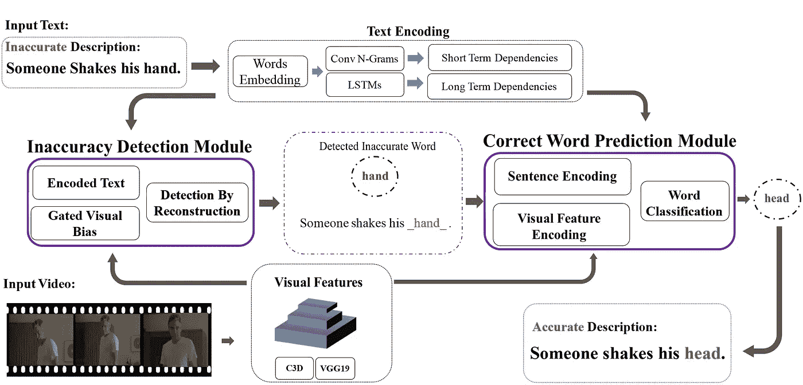

# 视觉文本校正

> 原文：<https://towardsdatascience.com/visual-text-correction-can-we-detect-and-fix-an-inaccuracy-in-a-video-caption-38540312dbc4?source=collection_archive---------37----------------------->

## 我们可以检测并修复视频字幕中的错误吗？

Given a video and an inaccurate description, the Visual Text Correction (VTC) task is to detect and fix the inaccurate word(s). [1]

数据集、论文和幻灯片:[https://amirmazaheri1990.github.io/VTC/](https://amirmazaheri1990.github.io/VTC/)

代号:【https://github.com/amirmazaheri1990/Visual-Text-Correction 

视频、图像和句子是可以表达相同语义的媒介。人们可以通过阅读一个句子来想象一幅图画，或者用一些词语来描述一个场景。然而，句子中即使很小的变化也会导致与相应视频/图像的显著语义不一致。例如，通过改变一个句子的动词，意思可能会彻底改变。已经有许多努力来编码视频/句子并将其解码为句子/视频。

在这篇文章中，我将介绍我最近的一篇论文。本文介绍了一个新的问题，称为视觉文本校正(VTC)，即在视频的文本描述中找到并替换一个不准确的单词。句子和视频之间或者句子的单词之间的语义不一致会导致不准确的描述。我们提出了一个深度网络，它可以同时检测句子中的错误，并通过替换不正确的单词来修复它。我们的方法利用了视频和单词的语义相互依赖性，以及句子中单词的短期和长期关系。据我们所知，这项工作是视觉文本校正任务的第一次。

作为一名社交媒体爱好者，我不得不说，在很多场合，我看到过朋友们发来的视频，标题写得不太好。在许多情况下，字幕有语法错误，或者与上传的视频并不相关。主要问题是，机器能学会阅读视频字幕并修复不太准确的字幕吗？

尽管社交媒体是第一个想到视觉文本纠正(VTC)的例子，但它有许多应用程序。例如，想象一个人工智能(AI)系统，它可以根据警官可穿戴相机或犯罪现场可用的安全相机记录的视频来验证警方的报告。多酷啊。

# 方法:

The proposed framework for Visual Text Correction. The goal is to find and replace the inaccurate word in the descriptive sentence of a given video. There are two main modules: 1) The Inaccuracy Detection module finds the inaccurate word, and 2) the Correct Word Prediction module predicts an accurate word as a substitution. Both of these modules use the encoded text and visual features. The Inaccuracy Detection uses Visual Gating Bias to detect inaccuracy and the Word Prediction Modules uses an efficient method to encode a sentence and visual features to predict the correct word. [1]

## 视觉编码:

我们使用预训练的 VGG19 和 C3D 网络来编码视频。然而，我们使用时间最大池从整个视频中获得一个特征向量。在消融研究中，我们表明每个特征都对最终结果有贡献。

## 文本编码:

一个句子中有两种类型的依存关系，叫做长期依存关系和短期依存关系。句子中每个单词的意义和作用会受到相邻单词的影响，也会受到句子中所有单词的影响。在我们的方法中，我们分别使用 1D CNN 和比尔斯特姆对短期和长期依赖性进行建模。

我们可以仅通过使用文本来找到不准确性分数:

Detection by reconstruction for inaccurate word detection in a sentence. [1]

事实上，我们试图重构每个单词，并通过句子中的实际单词来找到它的距离。

## 视觉门控偏差:

不是所有的单词都有视觉外观。例如，像颜色、物体和动作动词这样的词具有清晰的视觉外观。另一方面，许多单词在视觉单词中没有任何模式。比如“满意”这个词，并不是一个视觉概念。

为了解决这一现象，我们引入了一种新的融合方法，其中，我们与每个词的视觉特征门。事实上，没有任何视觉外观的单词可以关闭视觉特征上的所有闸门，使其成为全零向量。

Gating the visual features based on each of words in the sentence. [1]

最后，我们将门控视觉偏差与重建项相加:

The visual bias term is added to the detection by reconstruction formulation. [1]

事实上，视觉特征对不同的单词重构有不同的影响。

在找到句子中最不准确的单词后，任务是建议字典中最好的单词来替换句子中不准确的单词。为此，我们使用重构的单词向量来预测正确的单词，以替换不准确的单词。

关于更详细的公式，请看看[的原始论文](http://openaccess.thecvf.com/content_ECCV_2018/papers/Amir_Mazaheri_Visual_Text_Correction_ECCV_2018_paper.pdf)，或者看看我在这篇文章底部的 YouTube 演示文稿。

# 实验:

据我们所知，没有关于“视觉文本校正”任务的可用数据集。因此，我们建议生成一个。我们为 VTC 任务构建数据集的方法背后的主要思想是从每个句子中删除一个单词，并用一个不准确的单词替换它；然而，为了构建真实的数据集，有几个挑战需要解决。在这里，我们列举了一些，并提出了我们应对这些挑战的方法。我们的目标是建立一个包含各种视频和文本描述的大型数据集。我们要求数据集的词汇和视频样本的数量足够大，以训练一个深度网络；因此，我们选择“大规模电影描述挑战(LSMDC)”数据集[ [链接](https://sites.google.com/site/describingmovies/previous-years/lsmdc-2016) ][2]，这是可用的最大视频描述数据集之一。此外，LSMDC 还被注释为“视频填空(FIB)”任务[2][3]。在 FIB 数据集中，每个视频描述包含一个或多个需要填充的空白。对于 VTC 问题，我们引入不准确的词来代替 FIB 数据集中的空白。如果在 FIB 数据集的一个句子中有一个以上的空格，我们生成该句子的多个例子。

请注意，有一些与替换单词的选择相关的要点，我们需要记住。首先，原始单词和替换单词之间不应该有很高的相关性。比如我们经常把“car”这个词换成“bicycle”，任何方法都会有偏差，总会建议在所有的句子里把“bicycle”换成“car”。第二，我们希望我们的句子即使在单词替换后看起来也很自然。因此，替换单词应该具有相同的“词性”(POS)标签。比如一个单数动词最好换成另一个单数动词。为每个样本手动标注和选择替换词的成本很高，因为视频数量很大，并且数据集的词汇量很大。此外，人类注释者很难防止原始单词和替换单词之间的相关性。我们已经考虑了所有提到的要点来构建我们的数据集。有关如何生成数据集的更多信息，请阅读我们的[全文](http://openaccess.thecvf.com/content_ECCV_2018/html/Amir_Mazaheri_Visual_Text_Correction_ECCV_2018_paper.html)。

# 结果:

为了成功地解决 VTC 任务，应该正确地检测不准确的单词，并且找到最准确的单词进行替换。这两个步骤中任何一步的失败都意味着整个 VTC 任务的失败。下面我们展示我们的结果表:

K: Number of inaccurate words in the sentence, WB: Word Based measurement in which each corrected word has a value, SB: Sentence Based measurement in which the whole corrected sentence has a value. We also show both MAP and Accuracy measurements.

提出的职训局问题是其研究路线的第一项工作。我们希望将这项工作扩展到更真实的数据集，并将其应用于社交媒体中人为的不准确性。

我想邀请观众观看我的 18 分钟 YouTube 演示，并阅读我们的[全文](http://openaccess.thecvf.com/content_ECCV_2018/papers/Amir_Mazaheri_Visual_Text_Correction_ECCV_2018_paper.pdf)。我感谢任何意见，以改善这项研究在未来。

## 参考资料:

[1]马扎赫里，阿米尔，和穆巴拉克沙阿。"视觉文本校正。"*欧洲计算机视觉会议论文集(ECCV)* 。2018.

[2]马哈拉杰、甘特等人，“通过填空问答理解视频数据的数据集和模型探索。”*IEEE 计算机视觉和模式识别会议论文集*。2017.

[3]马扎赫里、埃米尔、董璋和穆巴拉克·沙阿。"视频使用 lr/rl lstm 填补空白，具有时空注意力."IEEE 计算机视觉国际会议论文集。2017.