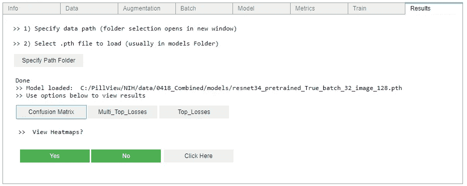

# Visual_UI

> 原文：<https://towardsdatascience.com/visual-ui-54ab27216c8e?source=collection_archive---------11----------------------->

***我的任务是为机器学习库创建一个图形用户界面(GUI)(在这里是***[***【fastai】***](https://www.fast.ai/)***)，目的是提供各种训练参数的无缝集成，提高用户可用性，并且不需要任何代码！***

学习机器学习中的各种概念和训练机器学习模型时可用的过多选项已经足够具有挑战性了。

例如，您必须选择您的标准化参数(imagenet、cifar、mnist 或自定义设置)、您的架构(resnet18、resnet34、resnet50、xresnet、alexnet、vgg16、vgg19、densenet121、densenet161、densenet169、squeeznet1_0、squeeznet 1 _ 1…仅举几个例子)、您是否想要预训练的权重、选择您的批量大小、图像大小、众多增强参数(缩放、旋转、扭曲、光照、翻转…)、训练)，你的学习速度，周期长度，如何查看你的结果… **列表很广泛**。

这导致必须按顺序运行大量单元来执行您的代码。

## 很明显，选择的数量是巨大的，在某些情况下，你甚至不知道所有的选项是什么。

下面是一个 Jupyter 笔记本或 Google Colab 笔记本目前可能的样子:

code from fast.ai

> **该项目的目标是将多个代码单元转换为一个代码单元，允许用户在一个视线内改变各种参数:**

GUI displaying ‘Data’ and ‘Augmentation’ tabs

**概念**

我喜欢演奏音乐，并拥有许多合成器。我对雅马哈的[***DX7***](https://en.wikipedia.org/wiki/Yamaha_DX7)特别着迷，这是第一个成功的数字合成器。

Yamaha DX7 (1983–1989)

我喜欢键盘上显示按钮和算法的方式，这简化了合成器的功能。各种算法的图形表示打印在各种按钮上方，向用户显示每种算法的功能。

这就是我最终想要为机器学习库重新创建的图形用户界面..然而..但这是一项正在进行的工作。

> 如前所述**f**[**astai**](https://www.fast.ai/)**在我看来是目前为止最好的机器学习库，这个项目( **Vision_UI** )是基于使用 fastai 库创建一个图形用户界面。你可以通过从我的 GitHub 页面[***克隆我的项目来使用 Visual _ UI***](https://github.com/asvcode/Vision_UI)*或者直接在*[***Google Colab***](https://colab.research.google.com/drive/1O_H41XhABAEQxg_p8KZd_BCQ8pj-eJX6)***上实验。*******

****Visual_UI 是使用 [**ipywidgets**](https://github.com/jupyter-widgets/ipywidgets) 制作的，它们是用于 Jupyter 笔记本和 IPython 内核的交互式 HTML 小部件。这允许用户获得对其数据的控制，并且可以可视化数据中的变化。对于文件选择，我决定使用 [**Tkinter**](https://docs.python.org/3/library/tkinter.html) ，它是一个内置的 Python 模块，可以跨不同的平台兼容(*虽然不是在 Google Colab 或 AWS 上，因为 Tkinter 为文件选择创建了一个新窗口，而 Colab 和 AWS 是在云上运行的，它们不能在你的机器上打开一个窗口。在这种情况下，使用了 Colab 章节*中提到的另一种方法。这允许 GUI 使用面向对象编程的形式，即 ***事件驱动*** ，程序响应*事件*，这些事件是用户采取的*动作*。****

******设计******

****[**Fastai**](https://www.fast.ai/) 提供了一种组织管道的结构化方式。加载数据、选择您的增强参数、学习率、选择您的训练指标、训练并查看结果)****

********

****Model Pipeline****

****这是 Visual_UI 中选项卡的基础(后来添加了其他选项卡)。该设计是使用 ipywidgets 的 Accordion 小部件实现的。****

********

*******>信息*** 标签:方便查看相关系统信息，如 fastai 版本、GPU 信息(或 TPU，如果使用 Colab)、python 版本、访问 fastai 文档以及选择数据所在文件夹的路径。****

********

****‘Info’ tab****

****选择数据所在的文件夹需要使用 Tkinter，这会打开一个新窗口，您可以从中选择文件夹。(对于 Colab，我使用了另一种方法，因为 Tkinter 不支持 Colab)****

********

****Tkinter is a great tool that allows the ability to choose folders and files within a notebook****

*******>数据*** 选项卡:方便地允许选择各种数据参数，例如指定如何存储您的数据(目前 Visual_UI 仅适用于存储在文件夹中的数据，我正在处理包括来自数据框和来自 csv 的数据)、归一化值、架构、预训练值、批量大小和图像大小。****

********

****‘Data’ tab uses a mixture of widgets to construct a GUI****

****“数据”选项卡使用了许多小部件(完整列表可在此处找到*)，与雅马哈 DX7 的概念非常相似。Toggle 小部件(提供一种方便的方式来查看所有可用的选项，以及使用不同的颜色来区分小部件的其他部分)，CheckBox 小部件和 FloatSlider 小部件被用来构建界面。*****

********>增强*** 选项卡:该选项卡显示各种增强参数，并混合使用 Toggle 和 FloatSlider 小部件来创建效果。您可以将增强图像作为一批 8 张图像进行查看。*****

**********

*****真正方便的是能够查看不同的增强参数如何影响图片(例如，在下图中，缩放和扭曲参数被更改，我们可以看到这如何影响图像)*****

**********

*****Example of 2 different augmentations used (bottom picture: zoom and warp parameters were changed)*****

********>批量*** 选项卡:该选项卡方便地显示从前两个选项卡中选择的所有参数，数据和增强，并显示一批将用于训练的图像。这是查看所使用的增量是否适合训练数据的好方法。*****

**********

********>模型*** 标签:这可以方便地显示模型的概要表示*****

**********

*****‘Model’ tab*****

********>指标*** 选项卡:允许轻松选择将在培训中使用的指标。在这种情况下，再次使用了垂直对齐的 Toggle 小部件。在未来的更新中，将添加更多指标。*****

**********

*****‘Metrics’ tab*****

*****> ***训练*** 选项卡:该选项卡再次允许查看训练参数的选项，以及使用学习率查找器的选项，以便找到训练的最佳学习率。一旦确定了这一点，就可以设置学习率和周期长度。目前，Visual_UI 使用 Leslie Smith 提出的单周期策略，并在本文****中进行了讨论。**特别是，在训练复杂模型时，这种策略可以快速给出结果。这个政策在这个 [**帖子**](https://sgugger.github.io/the-1cycle-policy.html) 里解释的极其到位。*******

*******一旦训练完成，模型将自动保存在 *models* 文件夹中，命名顺序如下:' architecture '+' pre trained '+batch size+image size，因此使用批大小为 32、图像大小为 128 的预训练 resnet34 architectur 将保存为 resnet 34 _ pre trained _ True _ batch _ 32 _ image _ 128 . PTH*******

**************

*******‘Train’ tab*******

**********>结果*** 选项卡:*这是迄今为止所有选项卡中最有趣的一个！还有选择最多的一个*。结果选项卡是一个独立的实体，因为它不需要来自任何其他选项卡的输入。在这种情况下，必须指定文件夹路径以及加载保存的模型文件。再次使用 Tkinker 允许无缝集成选择相关文件夹和。pth 文件。*******

**************

*******在这种情况下，可以轻松加载之前保存的文件 resnet 34 _ pre trained _ True _ batch _ 32 _ image _ 128 . PTH。一旦模型被加载，附加选项变得可用(混淆矩阵、多 _ 顶 _ 损失、顶 _ 损失)。关于这些选项的更多信息可以在 fastai 优秀的 [**文档**](https://docs.fast.ai/vision.learner.html) 中找到*******

**************

*******我在'*混淆矩阵*'选项卡中做了最大的改动(需要注意的是，目前，这仅在不超过 2 个类的情况下有效)。我经常发现自己想知道更多关于混淆矩阵的结果。*******

*******典型的混淆矩阵是这样的:*******

**************

*******Typical Confusion Matrix*******

*******除了这些数字，很难看出是什么驱使这个模型得出这些结果。我想知道更多关于真阳性、真阴性、假阳性和假阴性的图像。我还想选择使用热图(一种很好的可视化模型所关注的内容的方式)以及查看分配到 4 个象限的图像的能力。考虑到这一点，我对混淆矩阵选项进行了改进。*******

*******首先是查看结果是否带有热图的选项*******

**************

*******View Heatmaps?*******

*******其次是选择色图、插值和阿尔法参数的选项，以便更好地匹配正在查看的数据*******

**************

*******Various Heatmap options*******

*******下图显示了使用不同色彩映射表选项的示例:*******

**************

*******并且通过添加 4 个可点击的按钮来更新混淆矩阵本身，这 4 个按钮全部对应于每个象限中的值*******

**************

*******Updated confusion matrix*******

*******每个可点击的按钮将相应的图像保存到单独的文件夹中(假阴性、真阳性、假阳性、真阴性)，从而允许用户更详细地查看图像。下图是打开热图选项时每个文件夹中图像的外观示例。*******

**************

*******Images above using the Chest Xray dataset*******

## *******在 Google Colab 上使用 Visual_UI*******

**************

*******让 Visual_UI 在 Google Colab 上工作存在一些挑战。点击 [**这里**](https://colab.research.google.com/drive/1O_H41XhABAEQxg_p8KZd_BCQ8pj-eJX6) 可以进入 Colab 笔记本:*******

*******第一个挑战是 Colab 中 Accordion 小部件的不兼容性。不幸的是，这将所有选项卡显示在一起，您无法单独单击任何选项卡。*******

**************

*******ipywidgets Accordion does not render correctly in Google Colab*******

*******这里的修正是改为使用 Colab 小部件，这里有一个很棒的教程**了解更多信息。第二个挑战是决定如何选择文件夹路径或增强图像，因为Tkinter 与 Colab 不兼容，您必须安装 Google drive 才能访问文件。*********

*********“ ***驱动器*** ”选项卡自动装载驱动器。*********

**************

*******选择文件夹或图像路径的选项是通过使用文本小部件来完成的，它允许您轻松地复制和粘贴文件或文件夹路径，并使用按钮小部件来执行选择。这个选项延续了不使用任何代码的主题。*******

**************

*******It is easy to copy and paste the path*******

*******总结一下我想要实现的概念:*******

**************

*******目前，Visual_UI 是这样的:*******

**************

*******有一些相似之处，但显然需要做更多的工作，因为我希望包括额外的功能，并希望在未来形成各种架构和参数的可视化表示。您可以通过在我的 [***github 页面***](https://github.com/asvcode/Vision_UI)*上克隆这个项目或者在 Google Colab 上测试 [***Visual_UI 来查看代码并进行测试。***](https://colab.research.google.com/drive/1O_H41XhABAEQxg_p8KZd_BCQ8pj-eJX6)********