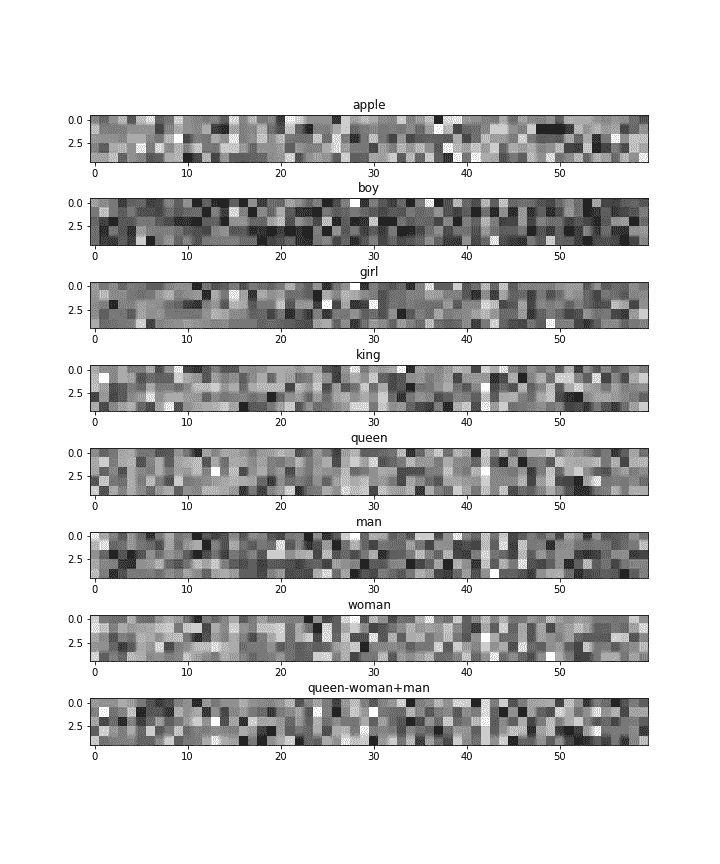
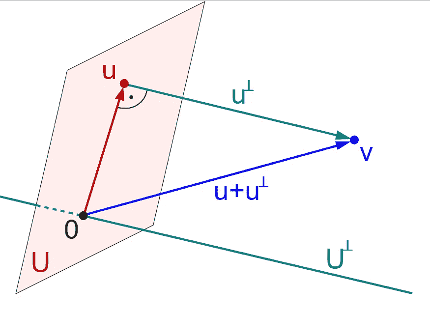
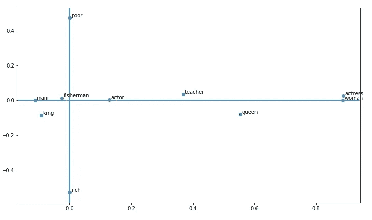
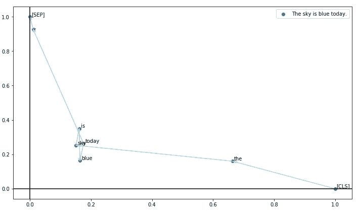
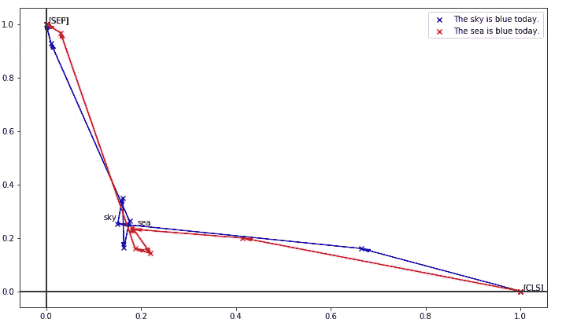
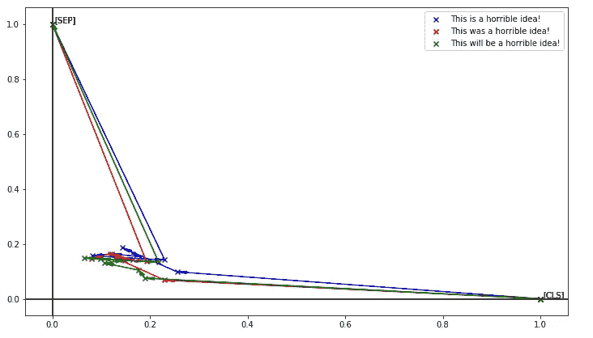
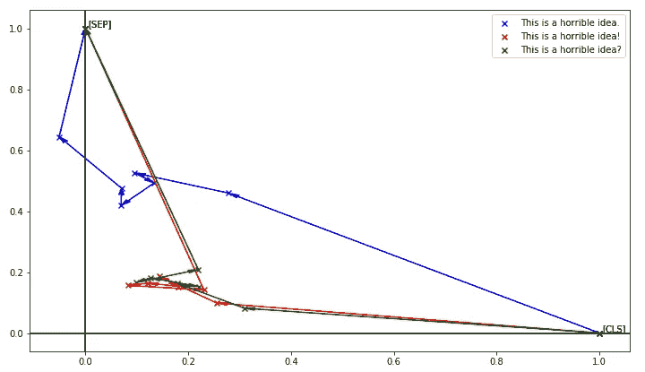
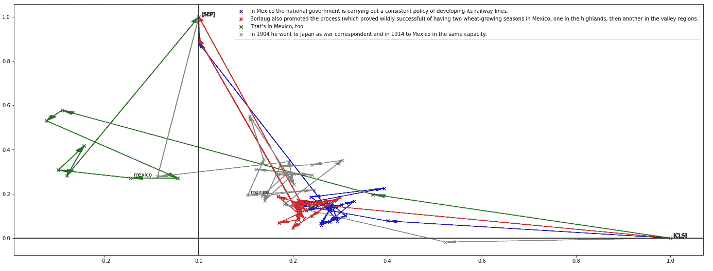
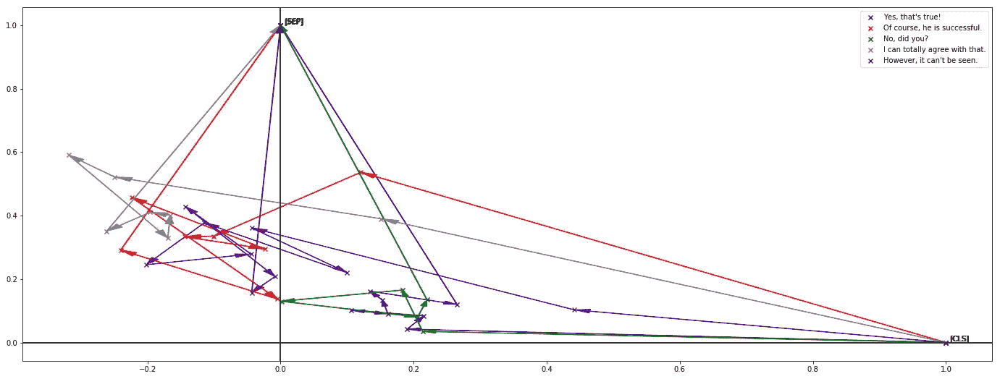
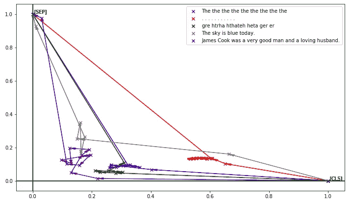

# 嵌入关系的可视化

> 原文：<https://towardsdatascience.com/visualisation-of-embedding-relations-word2vec-bert-64d695b7f36?source=collection_archive---------17----------------------->

在这个故事中，我们将可视化单词嵌入向量，以理解由嵌入描述的单词之间的关系。这个故事重点讲 word2vec [1]和 BERT [2]。为了理解嵌入，我建议阅读不同的介绍(比如[这个](http://jalammar.github.io/illustrated-bert/))，因为这个故事并不打算描述它们。

这个故事是我使用 BERT 情境化嵌入向量开发神经机器翻译(NMT)之旅的一部分。欢迎建议！

# 单词嵌入

单词嵌入是为单词生成计算机友好的数字向量表示的模型。Word2vec 为每个单词产生 300 个介于 0 和 1 之间的浮点数。对计算机来说可能更容易理解，但对人来说则相反。

下图显示了 5x60 矩阵中 300 数值的灰度像素。看着图像，我们能观察到的东西并不多。

我们可以认为，第 42 列的较轻值在所有与人类相关的单词中是相似的，而在单词 *apple* 中是完全不同的。

另外，`queen-woman+man = king`是计算机可以理解的东西。字典中与`queen-woman+man`最接近的单词是`king`，这被认为是单词嵌入的重要特征之一。但是*很难看到*。

Word2vec representation of certain words

# 嵌入投影

嵌入投影背后的基本思想是将表示向量的维度减少到 2D 或 3D，因此它可以被可视化。这背后的数学称为线性投影:如果我们有一个 n 维向量 **x** ，我们想要一个 m 维投影(m < n) **y** ，我们需要找到一个 m*n 矩阵 **A** ，秩为 m，并计算 **y** =A **x** 。

[Illustration of projection in Wikipedia (cc)](https://de.wikipedia.org/wiki/Projektion_(Lineare_Algebra)#/media/Datei:Orthogonal_Decomposition_qtl1.svg)

让我们关注 2D！如果我们想要一个投影，其中某个单词到(1，0)点，而另一个单词到(0，1)点，我们想要解 I=AX 线性方程，其中 *I* 是 2 大小相同的矩阵， *A* 是投影的矩阵， *X* 矩阵包含我们想要的作为列的基础中的向量。

如果 A 矩阵是一个方阵，这就是 X 的逆矩阵，这个问题可以用高斯消去法很容易地解决。这里，我们希望将更大的向量投影到 2D 子空间中，因此，它不是一个正方形矩阵(对于 word2vec 为 2x300，使用 BERT base 为 2x768)。这里我们要的叫做*左逆矩阵*。然而，我们将使用伪逆或 [*Moore-Penrose 逆*](https://en.wikipedia.org/wiki/Moore%E2%80%93Penrose_inverse) ，因为它在 Numpy 中有一个实现，并且生成一个接近于单位(`[numpy.linalg.pinv](https://docs.scipy.org/doc/numpy/reference/generated/numpy.linalg.pinv.html)`)的矩阵。

好吧。我们来编码吧！我们有一个单词列表:`[‘man’, ‘woman’, ‘rich’, ‘poor’, ‘queen’, ‘king’, ‘fisherman’, ‘teacher’, ‘actress’, ‘actor’]`我们想要一个 2D 子空间，其中男女线是一个轴，贫富线是另一个轴。为此，我们将把`man-woman`投影到(1，0)并将`rich-poor`投影到(0，1)，在投影之后，我们将移动这些点以适合轴。

Code to project words for 2D visualisation

下图显示了投影的结果。观察这张图片*我们可以看到*一个*渔夫*，一个*国王*和一个*演员*更像一个*男人*，而不是一个*女王*或*女演员*。同样，我们可以说一个*国王*和一个*王后*接近*富*而一个*老师*接近*穷*。

Projection of the words in a subspace with poor-rich and man-woman axes

要看更高级的 word 投影，我可以推荐 TensorFlow [嵌入式投影仪](http://projector.tensorflow.org/)。

# 句子投射

BERT 提供了依赖于上下文的嵌入。在这里，我们想要研究，我们能从中观想什么。我之前没有看到类似的东西，所以可能是第一次有人这么做。否则，我很高兴在评论中看到其他解决方案！

这种可视化背后的思想是，BERT 中的每个句子都以一个`[CLS]`标记开始，以一个`[SEP]`标记结束，因此，将句子投影为(1，0)是`[CLS]`标记，而(0，1)是`[SEP]`标记，我们可以在 2D 子空间中说明句子，并且嵌入以所有句子都从(1，0)开始并以(0，1)结束的方式进行归一化。

`[CLS] This is a sentence example. [SEP]`

这背后的数学原理和以前一样。我们使用预先训练好的 BERT base `bert_12_768_12_book_corpus_wiki_en_uncased`。

Code for the sentence-dependent embedding projection

为了演示令牌的顺序，让我们用箭头将点连接起来！我们可以观察到第一个标记'*，*'更靠近起始标记和最后一个标记'*。*’离安德令牌更近，但其他的都在相对较小的区域。

Sentence visualisation using contextualised embeddings

让我们把句子中的单词' *sky* 改成' *sea* '！点天空和海洋被标记。我想指出的是，主要区域中的点的顺序被改变了(尝试在故事的结尾链接的代码以获得更好的分辨率)。虽然海句子没有十字箭头，但天空句子的顺序看起来完全是随机的。

Difference between the sky and the sea in the sentence “The … is blue today.”

让我们来调查时态的变化！从这张图片(与其他句子相比)来看，我认为这个模型在句子的时态方面没有太大的差异。

Difference between tenses. is / was / will be

与时态相比，句末的标点符号对嵌入的影响更大。

Difference between punctuation characters.

正如我们之前提到的，BERT 嵌入是依赖于上下文的。为了说明这一点，下面的例子展示了包含单词 *Mexico* 的复杂句子。墨西哥点被标记。

Sentences with Mexico in it

在前面的例子中，我们可以看到句子“*那也在墨西哥*”与我们到目前为止看到的其他句子有些不同。它主要在 2D 空间的负域区域上。换句话说，离`[CLS]`令牌还远着呢。

为了猜测为什么会发生这种情况，我们必须研究一下 BERT 的训练数据。使用两个无监督的任务来训练 BERT，其中一个是掩蔽语言建模(Masked LM)，另一个是下一句预测(NSP)。在第二个任务中，句子对用一个分隔符训练，像这样:
`[CLS] This is the first sentence. [SEP] This is the second one. [SEP]`

正如我们在这里看到的，第二个句子以一个`[SEP]`标记开始，而不是以`[CLS]`标记开始。我认为这是观察到的不规则现象背后的原因。换句话说，句子，即对话中的反应，可能离`[CLS]`标记更远。让我们看看能否用更多的例子来支持这个论点！

Possible reaction sentences to see x<0 points

我们也可以在 y<0 区域捕捉到一些点，但是不太明显。我认为对这些特殊句子的观察显示了进一步工作的潜力。

最后，让我们检查一些不正确的句子！我们可以看到，这些非句子也试图适应点的规则区域。

Incorrect sentences compared to two correct ones

# 摘要

在这个故事中，我们讨论了一种可视化单词嵌入的方法，并以一种新颖的方式讨论了将其用于句子可视化的想法。

所有代码都可以在 Google Colab 上找到。

# 参考

[1] Mikolov，t .，Chen，k .，Corrado，g .，& Dean，J. (2013 年)。[向量空间中单词表示的有效估计。](https://arxiv.org/abs/1301.3781) *arXiv 预印本 arXiv:1301.3781* 。

[2] Devlin，j .，Chang，M. W .，Lee，k .，& Toutanova，K. (2018 年)。 [Bert:用于语言理解的深度双向转换器的预训练。](https://arxiv.org/abs/1810.04805) *arXiv 预印本 arXiv:1810.04805* 。

# 用伯特的故事学习 NMT

1.  [BLEU-BERT-y:比较句子得分](https://medium.com/@neged.ng/bleu-bert-y-comparing-sentence-scores-307e0975994d)
2.  [嵌入关系的可视化(word2vec，BERT)](https://medium.com/@neged.ng/visualisation-of-embedding-relations-word2vec-bert-64d695b7f36)
3.  [机器翻译:简要概述](/machine-translation-a-short-overview-91343ff39c9f)
4.  [使用 BERT 识别单词的正确含义](/identifying-the-right-meaning-of-the-words-using-bert-817eef2ac1f0)
5.  [机器翻译:对比 SOTA](/machine-translation-compare-to-sota-6f71cb2cd784)
6.  [使用 TensorFlow 2.0 的简单 BERT](/simple-bert-using-tensorflow-2-0-132cb19e9b22)