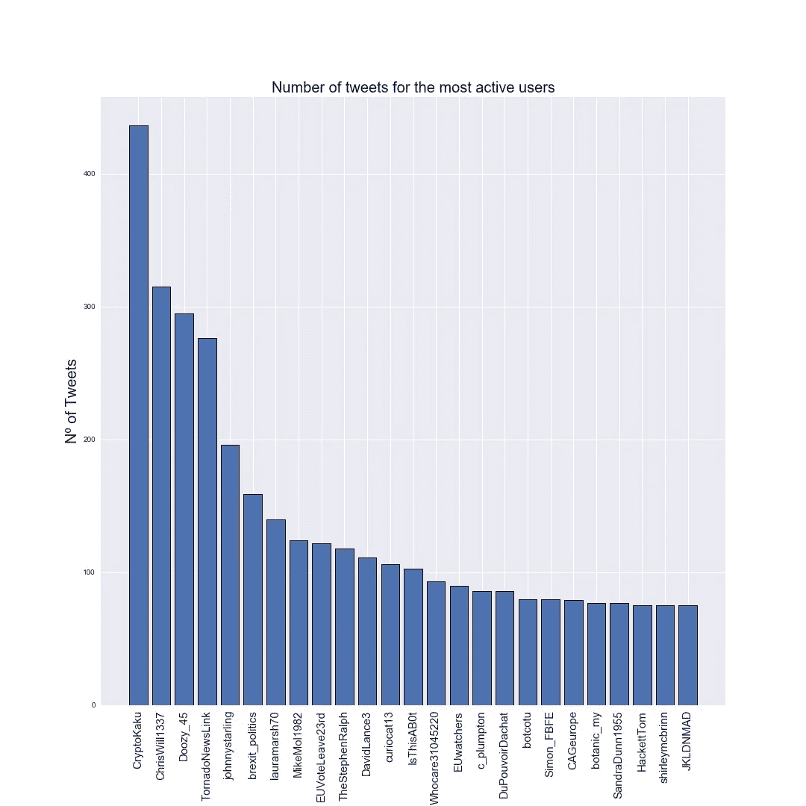
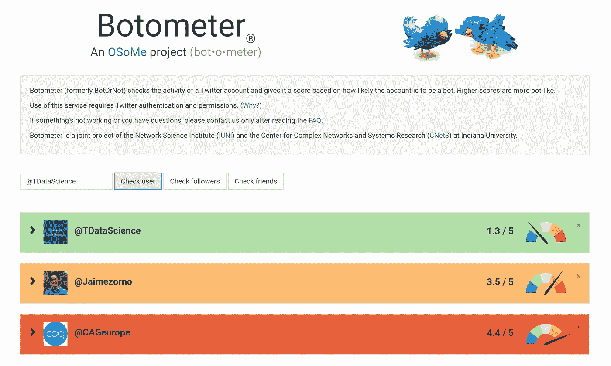
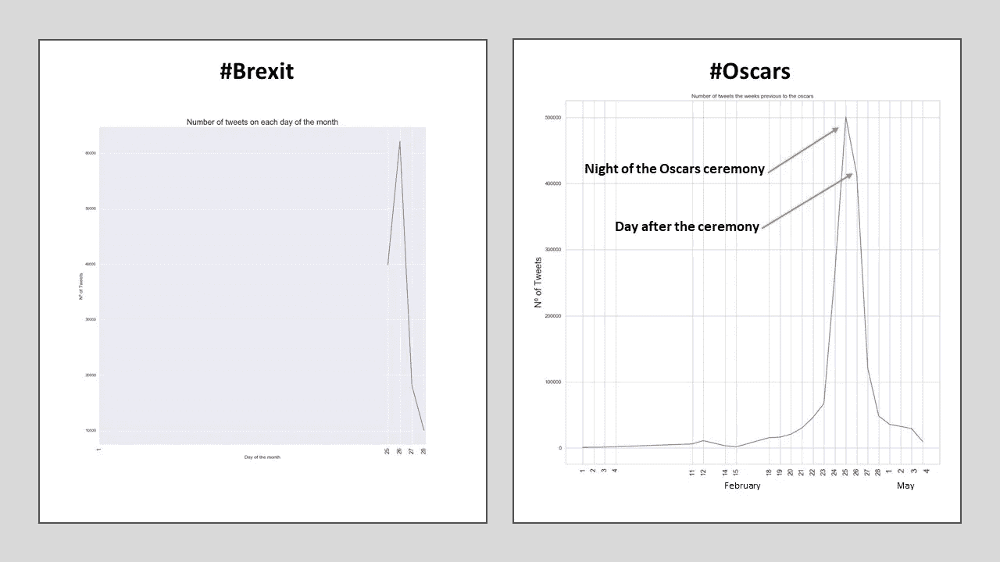
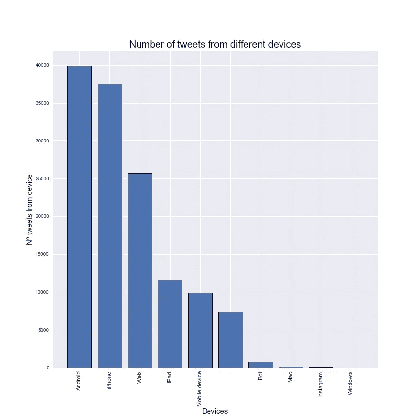

# 来自原始 Twitter 数据的信息可视化——第二部分

> 原文：<https://towardsdatascience.com/visualisation-of-information-from-raw-twitter-data-part-2-11707a65e920?source=collection_archive---------22----------------------->

## 想要了解用户活动，查看某些用户是否是机器人，制作 Tweet 出版物的时间序列等等吗？接着读下去！


前一篇文章介绍了如何从 Twitter 下载关于某个主题的数据，在 Jupyter 笔记本中准备好这些数据**，从这些数据中发现**的见解**，并探索了一些非常酷的**可视化**技术。如果您尚未阅读，您可以在此处找到它:**

[](/visualization-of-information-from-raw-twitter-data-part-1-99181ad19c) [## 来自原始 Twitter 数据的信息可视化—第 1 部分

### 让我们探索一下我们可以从原始 Twitter 数据中轻松检索到什么样的信息！

towardsdatascience.com](/visualization-of-information-from-raw-twitter-data-part-1-99181ad19c) 

这第二篇文章将描述其他令人敬畏的可视化，同时也探索一些可以从下载的 *tweets* 中获得的更多信息。

我们将从发现发布*推文*的用户的信息开始:

```
#Lets take a look at the users who are posting these tweets:print("There are {} different users".format(tweets['Username'].nunique()))
```

在我的例子中，*条推文*是由 **59508 个不同的用户**发布的。

使用我们精心准备的**数据框架**我们可以看到谁是发布最多*推文*的用户，更酷的是:看到高度活跃的用户成为**机器人**的几率！

```
#Going to see who are the users who have tweeted or retweeted the #most and see how
#Likely it is that they are botsusertweets = tweets.groupby('Username')#Taking the top 25 tweeting userstop_users = usertweets.count()['text'].sort_values(ascending = False)[:25]
top_users_dict = top_users.to_dict()
user_ordered_dict =sorted(top_users_dict.items(), key=lambda x:x[1])
user_ordered_dict = user_ordered_dict[::-1]#Now, like in the previous hashtags and mention cases, going to make #two lists, one with the username and one with the valuedict_values = []
dict_keys = []
for item in user_ordered_dict[0:25]:
    dict_keys.append(item[0])
    dict_values.append(item[1])
```

这段代码非常类似于我们在[上一篇文章](/visualization-of-information-from-raw-twitter-data-part-1-99181ad19c)中使用的代码，以查看最常用的*标签*或提到的用户。现在，像前面的例子一样，我们将绘制结果。

```
#Plot these resultsfig = plt.figure(figsize = (15,15))
index = np.arange(25)
plt.bar(index, dict_values, edgecolor = 'black', linewidth=1)
plt.xlabel('Most active Users', fontsize = 18)
plt.ylabel('Nº of Tweets', fontsize=20)
plt.xticks(index,dict_keys, fontsize=15, rotation=90)
plt.title('Number of tweets for the most active users', fontsize = 20)
plt.savefig('Tweets_of_active_users.jpg')
plt.show()
```



Bar chart of the number of tweets produced by the top 25 tweeting users.

我们可以看到，**最活跃的用户**是 *@CrytoKaku* ，发布的推文超过 400 条。太多了！他/她是机器人吗？让我们来看看吧！

为此，我们需要下载并导入**僵尸工具** Python 库，并获得一个能够使用他们的 API 的密钥。有关如何做到这一点的信息可以在以下链接中找到:

 [## Botometer API 文档(OSoMe) | RapidAPI

### Botometer(以前的 Truthy BotOrNot)检查 Twitter 账户的活动，并根据可能性给它打分

rapidapi.com](https://rapidapi.com/OSoMe/api/botometer?utm_source=mashape&utm_medium=301) 

此外，我们将需要检索我们的 **Twitter API 密钥**，因为我们将需要它们来允许 Botometer 访问我们想要研究其活动的帐户的信息。


首先，我们将导入两个库。考虑到 Botometer 和 Tweepy 都必须使用您选择的软件包管理器**预先下载**。

```
#Now we will see the probabilities of each of the users being a bot #using the BOTOMETER API:import botometer
import tweepy
```

之后，我们将**输入所需的 API 键**:

```
#Key from BOTOMETER API
mashape_key = "ENTER BOTOMETER API KEY"#Dictionary with the credentials for the Twitter APIs
twitter_app_auth = {
    'access_token' : "ENTER ACCESS TOKEN",
    'access_token_secret' : "ENTER ACCESS TOKEN SECRET",
    'consumer_key' : "ENTER CONSUMER KEY",
    'consumer_secret' : "ENTER CONSUMER SECRET",    
}
```

像以前的文章一样，把“ ***回车…*** ”换成相应的键，就可以了。

运行下面的代码块来访问**僵尸工具 API，**，让我们看看前 25 名推特用户中哪些账户最有可能成为僵尸工具！

```
#Connecting to the botometer API
bom = botometer.Botometer(wait_on_ratelimit = True, mashape_key = mashape_key, **twitter_app_auth)#Returns a dictionary with the most active users and the porcentage #of likeliness of them bein a Bot using botometerbot_dict = {}
top_users_list = dict_keys
for user in top_users_list:
    user = '@'+ user
    try:
        result = bom.check_account(user)
        bot_dict[user] = int((result['scores']['english'])*100)
    except tweepy.TweepError:
        bot_dict[user] = 'None'
        continue
```

这个模块的输出是一个**字典 *(bot_dict)*** ，其中的关键字是我们正在检查的帐户名称，值是一个介于 0 和 1 之间的数值**分数，它描述了每个用户成为机器人的概率，其中考虑了某些因素，如关注者/被关注者的比例、帐户描述、发布频率、发布类型以及更多参数。**

对于一些用户，Botometer API 得到一个 ***拒绝请求*错误**，所以这些将有一个“*无*”作为它们的值。

对我来说，我在检查 ***bot_dict*** 时得到如下结果:

```
{'@CryptoKaku': 25,
 '@ChrisWill1337': 'None',
 '@Doozy_45': 44,
 '@TornadoNewsLink': 59,
 '@johnnystarling': 15,
 '@brexit_politics': 42,
 '@lauramarsh70': 32,
 '@MikeMol1982': 22,
 '@EUVoteLeave23rd': 66,
 '@TheStephenRalph': 11,
 '@DavidLance3': 40,
 '@curiocat13': 6,
 '@IsThisAB0t': 68,
 '@Whocare31045220': 'None',
 '@EUwatchers': 34,
 '@c_plumpton': 15,
 '@DuPouvoirDachat': 40,
 '@botcotu': 5,
 '@Simon_FBFE': 42,
 '@CAGeurope': 82,
 '@botanic_my': 50,
 '@SandraDunn1955': 36,
 '@HackettTom': 44,
 '@shirleymcbrinn': 13,
 '@JKLDNMAD': 20}
```

这其中，成为 Bot 几率最高的账号是 **@CAGeurope，概率为 82%。**让我们来看看这个账户，看看为什么 Botometer 赋予它如此高的概率成为一个机器人。


Twitter account of **@CAGeurope**

这看起来像一个合法的帐户，然而，有各种各样的原因解释为什么 Botometer 给了它这么高的概率是一个机器人。首先，这个账户关注的账户数量几乎是关注它的账户数量的三倍。其次，如果我们看看他们的*推文*出版物的**周期性，我们可以看到他们始终如一地每小时发布各种推文，有时间隔 5 分钟，这是一个很大的*推文*。最后，他们的*推文*的**内容**总是非常相似，都是简短的文本、一个 URL 和一些标签。**

如果您不想编写任何代码或获取 API 密钥，Botometer 还提供了一个基于 web 的解决方案**，在这里您还可以检查帐户成为机器人的可能性:**



Web based solution offered by Botometer

看来我不得不停止发送垃圾消息和大量关注他人，以使我的 Twitter 账户更像人类:P

酷！通过 *tweet 的* JSON 中的*‘user*’对象，我们可以看到更多关于用户的信息，然而，这将留到另一篇文章中。

现在，让我们制作一个*推文*出版物的**时间序列，这样我们就可以看到哪一天关于所选主题的*推文*比较多，并尝试找出**哪些事件导致了这些较高的*推文*产量**。**

我们将绘制特定月份每天发布的*条推文*的数量。要显示与此类似的图，但时间更长，必须添加一些额外的代码。

首先，我们需要修改 dataframe 的“*时间戳*字段，使用 Pandas incorporated 函数 *to_datetime* 将其转换为 **Datetime 对象**。

```
tweets['Timestamp'] = pd.to_datetime(tweets['Timestamp'], infer_datetime_format = "%d/%m/%Y", utc  = False)
```

然后，我们创建一个返回 DateTime 对象的日期的函数，并将其应用到我们的' *Timestamp'* '字段，为我们的 dataframe 创建一个新列，存储发布 *tweet* 的日期。此外，我们将把这些天组合在一起，统计每天产生的 *tweets* (使用' *text'* 字段)的数量，并用结果创建一个字典 **( *timedict)*** ，其中键是对应于一个月中某一天的数字，值是当天发布的 *tweets* 的数量。

```
def giveday(timestamp):
    day_string = timestamp.day
    return day_stringtweets['day'] = tweets['Timestamp'].apply(giveday)
days = tweets.groupby('day')
daycount = days['text'].count()
timedict = daycount.to_dict()
```

做完这些，我们就可以准备好**绘制我们的结果了！**

```
fig = plt.figure(figsize = (15,15))
plt.plot(list(timedict.keys()), list(timedict.values()))
plt.xlabel('Day of the month', fontsize = 12)
plt.ylabel('Nº of Tweets', fontsize=12)
plt.xticks(list(timedict.keys()), fontsize=15, rotation=90)
plt.title('Number of tweets on each day of the month', fontsize = 20)
plt.show()
```



Time Series of 2 days tweet collection for the #Brexit (Left) and for a whole month on the #Oscars (right)

如果像我一样，你只收集了几天的推文，你会得到一个很短的时间序列，就像左边的图片。然而，右边的一个显示了从关于*奥斯卡的*推文*的数据集制作的**整月时间序列**，这是通过查询一个多月推文的流媒体 API 构建的。在这第二个时间序列中，我们可以看到在月初很少有*推文*被生成，随着仪式日期的临近*推文*的生成开始上升，在活动当晚达到顶峰。*

*厉害！现在，我们将绘制一个关于从产生*推文*的**设备的图。***

*由于该代码与前面的条形图所使用的代码非常相似，所以我将在这里发布它，不做进一步的解释:*

```
*#Now lets explore the different devices where the tweets are #produced from and plot these resultsdevices = tweets.groupby('device')
devicecount = devices['text'].count()#Same procedure as the for the mentions, hashtags, etc..
device_dict = devicecount.to_dict()
device_ordered_list =sorted(device_dict.items(), key=lambda x:x[1])
device_ordered_list = device_ordered_list[::-1]device_dict_values = []
device_dict_keys = []
for item in device_ordered_list:
    device_dict_keys.append(item[0])
    device_dict_values.append(item[1])*
```

*现在我们绘图，看看结果:*

```
*fig = plt.figure(figsize = (12,12))
index = np.arange(len(device_dict_keys))
plt.bar(index, device_dict_values, edgecolor = 'black', linewidth=1)
plt.xlabel('Devices', fontsize = 15)
plt.ylabel('Nº tweets from device', fontsize=15)
plt.xticks(index, list(device_dict_keys), fontsize=12, rotation=90)
plt.title('Number of tweets from different devices', fontsize = 20)

plt.show()*
```

**

*Plot of tweet production from different devices*

*通过查看这张图表，我们可以看到大多数推文是由智能手机发布的，在这一类别中，Android 设备以微弱优势击败了 Iphones。*

*网络产生的推文也可能来自移动设备，但产生于浏览器，而不是 Twitter 应用程序。除了这些网络发布的推文(我们无法判断它们是来自 PC、Mac 还是移动网络浏览器)，很少有推文来自公认的 Mac 或 Windows 设备。这些结果非常符合社交网络的**轻松随和的本质。***

*最后，让我们看看一些可以从收集的数据中容易获得的额外信息*

```
*#Lets see other useful information that can be gathered:#MEAN LENGTH OF THE TWEETS
print("The mean length of the tweets is:", np.mean(tweets['length']))#TWEETS WITH AN URL
url_tweets = tweets[tweets['text'].str.contains("http")]
print(f"The percentage of tweets with Urls is {round(len(url_tweets)/len(tweets)*100)}% of all the tweets")#MEAN TWEETS PER USER
print("Number of tweets per user:", len(tweets)/tweets['Username'].nunique())*
```

*对我来说，这是平均长度为的**145 条推文，**23%的推文有 URL**，平均每个用户的推文产量为**2.23 条推文**。***

*就是这样！你可以在这里 找到这篇文章和上一篇文章 [**使用的 Jupyter 笔记本，以及我关于 Twitter 数据收集的其他文章的脚本和笔记本。**](https://github.com/jaimezorno/Twitter_Medium)*

*还有，更多关于自然语言处理和机器学习的牛逼资源，可以看看这个牛逼的博客: [**如何学习机器学习**](https://howtolearnmachinelearning.com/books/machine-learning-books/) 。*

*非常感谢你的阅读，请鼓掌，继续发微博，再见！*