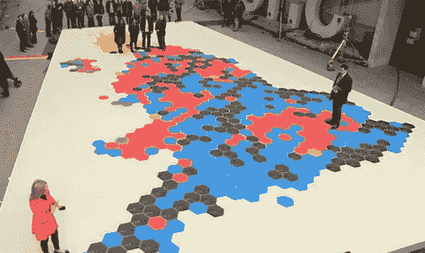
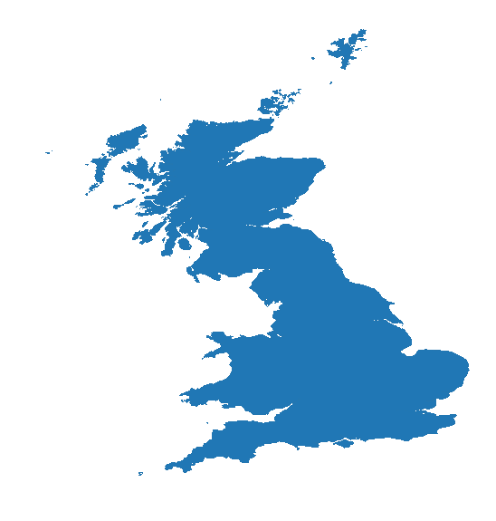
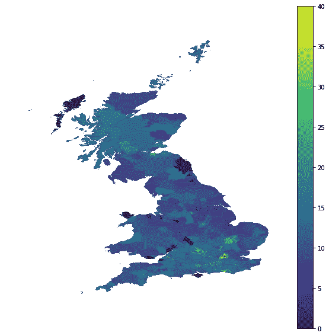
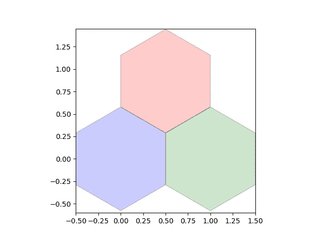
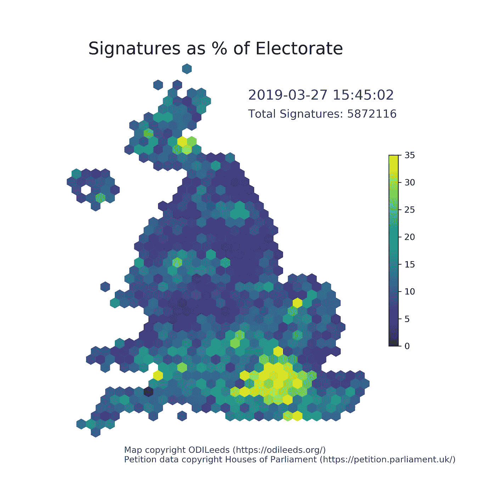
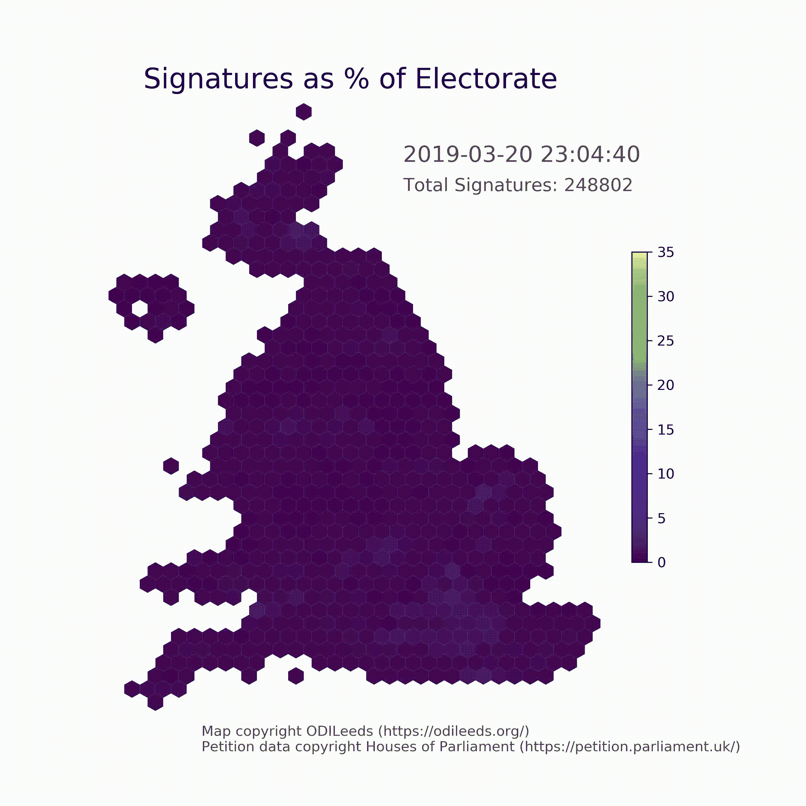

# 用 Python 可视化选举

> 原文：<https://towardsdatascience.com/visualising-elections-with-python-4973c0c60bbe?source=collection_archive---------11----------------------->

公平地说，全球政治格局目前正在发生很多变化，无论你是美国人、T2 人、以色列人、委内瑞拉人，还是介于两者之间的任何人(作为一名英国人，我有自己的地狱般的经历，比如英国退出欧盟)。不管任何政治局势的细微差别，它们都有一个共同点，那就是它们产生的**丰富多样、复杂的数据**，等待人们去探索。例如，考虑一下你可能需要知道什么来完美预测选举之夜的表现:理解宣言**政策**及其后果；对人们将如何对政策和政治家做出反应的心理理解；**社会学**关于人口变化和人们作为一个群体如何投票的知识；以及**博弈论**预测在给定的制度下人们会如何投票。

但在所有这些之前，一个未来的政治学家必须能够捕捉和想象人们的情绪。在本帖中，我们将通过绘制英国的选举地图，向选举之夜优势迈出第一小步。

这种地图，正式名称为 **choropleth** 地图，有多种风格。我将详细介绍我如何使用 Python 创建两种类型的 choropleth 地图:**英国的地理现实地图**和 **hex 地图**，如下所示。对这里产生的观想的分析将在以后的文章中讨论。用于生成地图的代码可以在我的 Github 上看到。



A giant election map on the BBC piazza. I’ve opted for a slightly higher-tech approach.

## 创建地理地图

为了创建英国的基本 choropleth，我选择使用 Python 包 [**GeoPandas**](http://geopandas.org/) ，它扩展了 Pandas 来处理地理空间数据。

GeoPandas 使得使用一种流行的 GIS 数据格式 **shapefile** 绘制地图变得很简单。对那些试图绘制英国地图的人来说幸运的是，划分成选区的地图——英国的投票边界——是由国家统计局免费提供的。只需从网站上下载你选择的任何粒度的地图作为形状文件。

*注意:shapefiles 由几个单独的文件组成，它们包含独立的信息。你需要保存 zip 文件夹中提供的所有文件。*

要在 GeoPandas 中加载和绘制 shapefile:

```
import geopandas as gpd
import matplotlib.pyplot as pltmap_df = gpd.read_file("uk_generalized_2015.shp")
# map_df is a Pandas dataframef, ax = plt.subplots(1, figsize=(6, 6))
ax = map_df.plot(ax=ax)
ax.set_axis_off()
```



Sorry, Northern Ireland.

正如我们所看到的，GeoPandas 将 shapefile 转换成我们都熟悉和喜爱的数据帧。

# 增添一些趣味

我们开始得很好，但是地图看起来很无趣。我们现在需要掌握一些选区级别的变量，通过这些变量我们可以给地图着色。

为了这篇文章的目的，我们决定使用签署请愿书的选民的百分比来*废除第 50 条*。给那些不知情的人一个简单的入门:英国公民可以通过政府官方网站发起请愿，如果达到一定数量的签名，政府将在议会辩论请愿的主题。2019 年 3 月，一份要求撤销英国离开欧盟的法律机制**第 50 条**的请愿书在短短几天内就获得了数百万个签名。

每份请愿书都附有一份 JSON，其中包括按议会选区划分的签名数量，因此我们可以很容易地绘制一张地图，直观地显示国民对任何请愿书的情绪。但是，在将这些数据添加到 dataframe 之前，我们需要将 JSON 转换成 csv。

```
import csv
import jsonfile = "petition_data.json"
with open(file, "r", encoding="utf-8") as json_file:
  data = json.load(json_file)
data = data["data"]["attributes"]["signatures_by_constituency"]keys = data[0].keys()
save_file = "petition_data.csv"
with open(save_file, 'w') as f:
  dict_writer = csv.DictWriter(f, keys)
  dict_writer.writeheader()
  dict_writer.writerows(data)
```

现在我们需要结合数据，计算签名数占选民的百分比。请注意，要做到这一点，我们还需要关于每个选区选民规模的信息，这些数据也可以在国家统计局网站上获得。

```
import pandas as pddata_df = pd.read_csv("petition_data.csv")# Combine the two dataframes by their constituencies
combined = map_df.set_index("pcon15nm")
           .join(data_df.set_index("name"))
           .reset_index()# Also join the dataset containing electorate numbers
# Not included here for brevity# Clean the data
combined["electorate"].fillna(1e8, inplace=True)
combined["mp"].fillna("No MP", inplace=True)
combined["signature_count"].fillna(0, inplace=True)# Calculate the percentage votes
combined["signature_pc"] = 100 * combined["signature_count"] /           
                           combined["electorate"] 
```

虽然我们从中检索数据的请愿书非常受欢迎，但任何选区的最大签名比例只有 40%左右。我们将色彩映射表的最大值设置为这个值，否则大部分选区会向色谱的一端移动到无法区分的程度。

```
fig, ax = plt.subplots(1, figsize=(6, 6))
combined_data.plot(column="signature_pc", cmap="viridis", 
                   linewidth=0.8, ax=ax)
ax.axis("off")

vmin = 0.
vmax = 40.
sm = plt.cm.ScalarMappable(cmap="viridis", 
                           norm=plt.Normalize(vmin=vmin, 
                           vmax=vmax))
sm._A = []
cbar = fig.colorbar(sm)
```



Overly large colourbars are in this year.

虽然这不是你见过的最漂亮的地图，但它让我们可以快速方便地看到某样东西在全国的受欢迎程度。

## 创建十六进制地图

看着上面的地图，你会有这样的想法，因为请愿书只在几个选区获得了很高比例的签名，所以总体来说，它不受欢迎。然而，熟悉这个国家的人可能会认出地图右下角的亮点。那个亮点是伦敦，它是几百万人的家园。

这很好地证明了绘制百分比而非绝对受欢迎程度的地图在得出结论时会误导人们。虽然像这样的地图对于展示一个事物的地理分布非常有用，但我们偏向于赋予更大的区域更大的重要性。

努力创造无偏见的视觉效果，无论最终可能多么徒劳，我们现在将绘制六边形地图——在地图中，每个选区由一个大小相等的六边形表示。这些地图**用地理现实主义**来平衡地图上每个区域的重要性。

首先，我们需要每个选区六边形的坐标。因为在十六进制地图中，区域的大小被严重扭曲(在英国，最小的选区是一平方英里，最大的选区超过 4000 平方英里)，所以不可能像在更真实的地图上那样排列选区。

在这篇文章中，我们从 ODILeeds 那里得到了底图，他们创造了一个神奇的工具来生成你自己的英国[十六进制地图。](https://odileeds.org/projects/petitions/?241584)对地图满意后，下载 **HexJSON** 并将其转换为 CSV 格式，如前所述。

不幸的是，研究用 Python 绘制这种地图的现成方法并没有取得成功:Matplotlib 的 hexbin 虽然目的相似，但将数据点隐藏起来，并且证明太难正确组织。有必要绘制单独的六边形，为此使用了 Matplotlib 补丁。下面是如何实现这一点的简单示例:

```
from matploblit.patches import RegularPolygon
import numpy as np

d = 0.5 / np.sin(np.pi/3)  # radius of poylgon
o = 0.5 * np.tan(np.pi/3)  # orientation of polygon
y_diff = np.sqrt(1 - 0.5**2)  
# difference in y location for consecutive layers

colors = ["red", "blue","green"]
hcoord = [0.5, 0, 1]
vcoord = [y_diff, 0, 0]

fig, ax = plt.subplots(1)

for x, y, c in zip(hcoord, vcoord, colors):
    hex = RegularPolygon((x, y), numVertices=6, radius=d,
                         facecolor=c, alpha=0.2, edgecolor='k')
    ax.add_patch(hex)ax.set_xlim([-0.5, 1.5])
ax.set_ylim([-0.6, 1.45])
plt.show()
```



Great maps, like great food, are built on honeycombs.

在创建全英国地图之前，剩下的一个挑战是计算出六边形的坐标:**连续的行有一个交替的起点**，这是蜂窝的性质。ODILeeds 提供的地图使用“ **odd-r** ”格式，这意味着奇数行包含最右边的六边形。

```
def calc_coords(row, column):
  if row % 2 == 1:
    column = column + 0.5
  row = row * y_diff
  return row, column
```

为了创建英国，我们遍历选区，并为每个区域绘制一个六边形。然而，当试图创建平滑的颜色图时，如上所述，手动提供颜色将是一项乏味的任务。我们利用 **PatchCollection** 对六边形进行分组，并提供一个 Matplotlib colourmap 来完成繁重的彩色提升。

```
from matplotlib.collections import PatchCollectionfig, ax = plt.subplots(1, figsize=(6, 6))
ax.axis("off")patches = []
colours = []
for i in range(combined.shape[0]):
  # here, combined is a join of hex csv and petition data
  # creating combined has been omitted for brevity
  row = combined.loc[i, "r"]
  col = combined.loc[i, "q"]
  row, col = calc_coords(row, col)
  c = combined.loc[i, "signature_pc"]hexagon = RegularPolygon((col, row), numVertices=6, radius=d, 
                         edgecolor='k')
patches.append(hexagon)
colours.append(c)p = PatchCollection(patches, cmap=plt.get_cmap("viridis"), 
                    alpha=1.0) 
```



Title and labels not included.

有了这张地图，我们可以看到伦敦的全貌，以及它与周围地区的对比。知道了选区的人口大致相似，我们就能更清楚地看到这一请愿在英国有多普遍。

## 最后的想法和下一步

除了这篇文章中所展示的，我还使用了定期从*撤销第 50 条*请愿书中获取的数据，以可视化整个英国的请愿书的传播。生成的地图可以在 [GitHub](https://github.com/TTitcombe/ConstituencyMap/) 上看到。我最诚挚地感谢奥迪利兹的斯图尔特·劳收集并提供了请愿资料。

虽然回想起来我会认为这是一次成功的练习，但创建十六进制地图的过程让我相信，使用奇异的地图来可视化选举并不是 Matplotlib 非常适合的工作。如果我或任何阅读这篇文章的人决定创建更复杂的地图，可能有必要看看其他工具，如 [d3](https://d3js.org/) 或[牵牛星](https://altair-viz.github.io/)。

毫不奇怪，选举报道和分析的范围远远超出了本文的范围。有各种各样的地图用于覆盖世界各地的选举，每一张部署到[传达稍微不同的意思](https://www.wired.com/story/is-us-leaning-red-or-blue-election-maps/)。然而，这里探讨的两种类型可以构成相当翔实的政治分析的基础。

在这个项目之后，就我而言，我期待着英国的下一次选举，期待着有机会利用这些地图，如果没有其他事情的话。在那之前，我只能满足于请愿。

