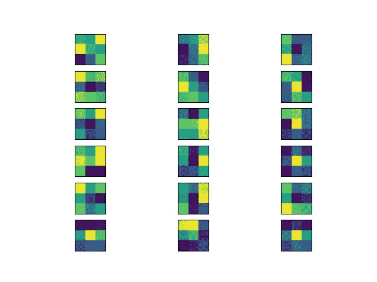
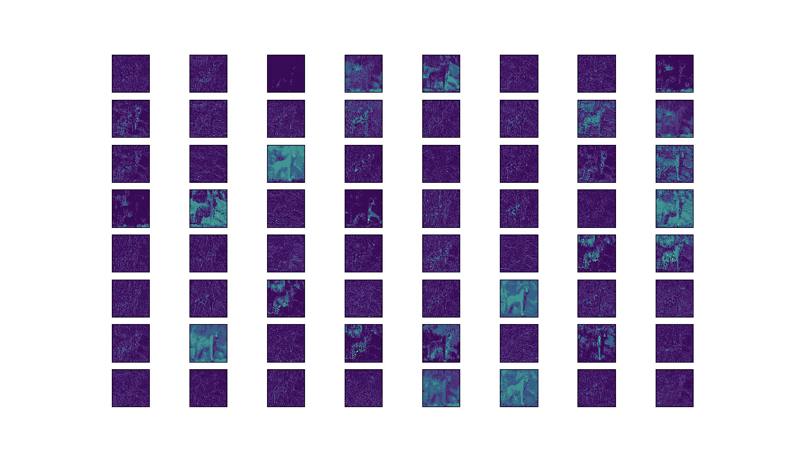

# 为深度学习可视化过滤器和特征图

> 原文：<https://towardsdatascience.com/visualising-filters-and-feature-maps-for-deep-learning-d814e13bd671?source=collection_archive---------4----------------------->

> 想获得灵感？快来加入我的 [**超级行情快讯**](https://www.superquotes.co/?utm_source=mediumtech&utm_medium=web&utm_campaign=sharing) 。😎

深度神经网络是最强大的机器学习模型之一。有了足够的数据，它们在计算机视觉和自然语言处理(NLP)等任务中的准确性是无与伦比的。

许多科学家会评论的唯一缺点是，这些网络完全是黑箱作业。对于深度网络如何如此好地学习它们的目标模式，尤其是所有神经元如何一起工作以实现最终结果，我们仍然知之甚少。

对 ML 模型如何工作有某种内部了解会带来一些关键优势:

*   它们更容易调整，因为当我们看到网络出错时，我们可以直接指出原因
*   可以解释网络的功能和预期行为，特别是对非技术利益相关者
*   我们可以进一步扩展和改进模型的整体设计，因为我们已经了解了当前的设计，包括它的优点和缺点

令人高兴的是，研究人员已经开始探索理解深层网络内部情况的技术。特别是，我们现在有能力可视化卷积神经网络(CNN)从其计算机视觉任务训练中学习的过滤器，以及 CNN 应用于图像时产生的特征图。

本教程将教你如何做到这一点:可视化的过滤器和特征地图的 CNN 训练的图像分类。我们甚至可以在超级易用的 Keras 中完成！

# 挑选我们的模型

首先，我们需要选择一个模型来可视化。

在 Keras 中，最简单的方法是选择一个预先训练好的图像分类模型。在它的[应用](https://keras.io/applications/#resnet)页面中有很多这些表现最好的模型。他们都在 ImageNet 数据集上进行了训练，该数据集包含超过 100 万张图片。

对于本教程，我将挑选 VGG16 型号。它很简单，我们可以浏览我们的教程，并仍然保持其作为一个相当准确的模型。结构如下所示。

在 Keras 中加载模型的过程如下所示。当您从`keras.applications`导入模型时，Keras 会自动将权重下载到适当的目录中。然后，我们加载模型并打印出它的结构概要。

# 可视化过滤器

我们将创建的第一个可视化是 CNN 过滤器。

当深度学习的人们谈论“过滤器”时，他们指的是卷积的学习权重。例如，单个 3×3 卷积称为“滤波器”，该滤波器总共有 10 个权重(9 + 1 偏差)。

通过可视化学习的权重，我们可以了解我们的网络学习得有多好。例如，如果我们看到许多零，那么我们将知道我们有许多对我们的网络没什么用的死过滤器——这是为模型压缩做一些修剪的好机会。

看看下面可视化过滤器的代码，然后向下滚动查看它如何工作的解释。

在导入了所有必需的库并加载了模型之后，我们在第 7 行构建了模型中各层的字典。这将允许我们通过层名称访问每个层的权重。如果你想查所有的名字，你可以打印出字典中的关键字。

接下来，我们将在第 9 行设置我们想要显示其滤镜的图层的名称。我选择了“block5_conv1 ”,但您可以选择任何您喜欢的卷积块。

在第 13 行中，我们调用`get_weights()`函数从我们选择的层中获取过滤器和偏置权重。

在第 16 行和第 17 行，我们对过滤器值进行了归一化处理，使它们介于 0 和 1 之间。当我们在屏幕上以颜色显示重量时，这将有助于创建清晰的视觉效果。

最后，我们从第 21 行开始的循环显示了一些过滤器。对于我们选择的“绿色”色图，黄色代表值 1，深蓝色代表值 0。

查看下面 VGG16 的 block5_conv1 层的输出！

# 可视化特征地图

CNN 的特征图捕捉将过滤器应用于输入图像的结果。即在每一层，特征图是该层的输出。

将特定输入图像的特征映射可视化的原因是为了试图了解我们的 CNN 检测到了什么特征。也许它检测到了我们想要的物体的某些部分，而没有检测到其他部分，或者激活在某一层消失了。

直接观察深度学习中的一个常见想法也很有趣，即网络的早期层检测低级特征(颜色、边缘等)，网络的后期层检测高级特征(形状和对象)。

看一下下面的可视化特征地图的代码，然后向下滚动查看它是如何工作的解释。

前两个步骤保持不变:加载模型并选择你想要可视化的层的名称。一个小的变化是我们修改了我们的模型，使得最终输出是 VGG16 的最后一个特征地图的输出，因为我们并不真正需要最后两个完全连接的层。

接下来，我们将在第 16 到 19 行加载并准备我们的图像。你可以选择任何你喜欢的图像；我选择了一个老虎的形象，因为老虎是令人敬畏的。

第 16 到 19 行的代码将读取图像并应用 VGG16 模型所需的必要预处理。如果您的图像像 4K 分辨率一样大，也不用担心，因为 VGG 总是希望图像的大小为 224x224，所以输入在处理之前总是会重新调整大小。

在第 22 行，我们将 VGG16 模型应用于输入图像；输出将是我们想要的特征地图。我们将遍历地图的几个通道，并在 matplotlib 图形中可视化它们。

查看下面的结果图。注意在图像的边缘和纹理上有很多激活，尤其是我们的老虎的轮廓！

# 喜欢学习？

在 twitter 上关注我，我会在这里发布所有最新最棒的人工智能、技术和科学！也在 [LinkedIn](https://www.linkedin.com/in/georgeseif/) 上和我联系吧！