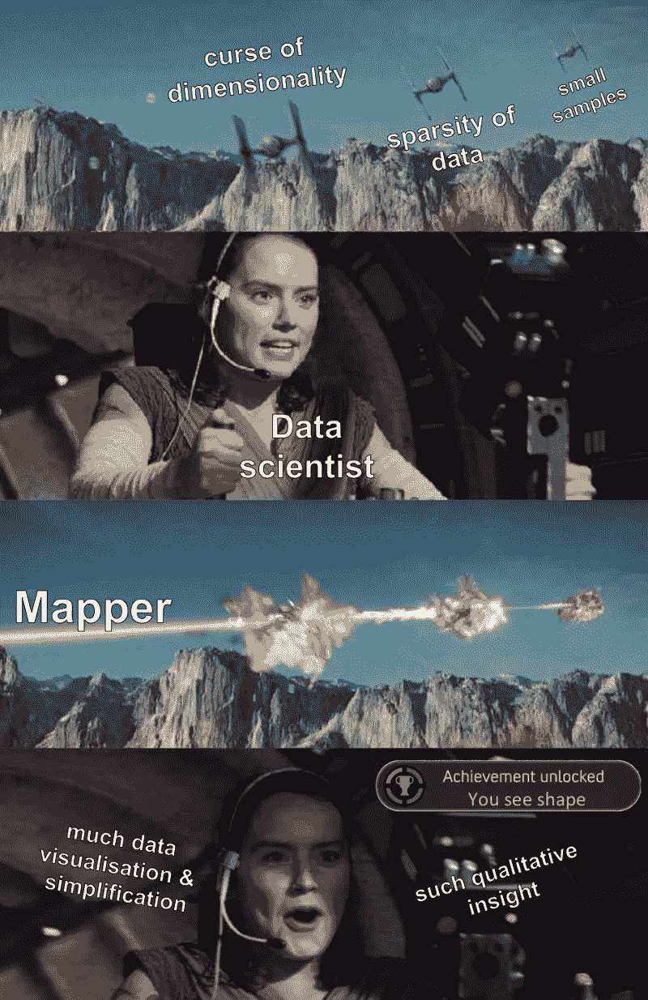
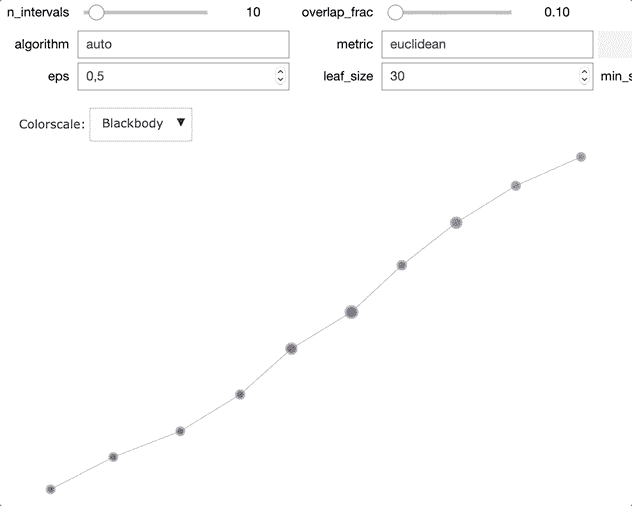
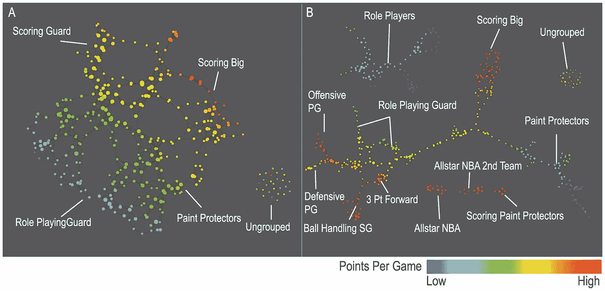
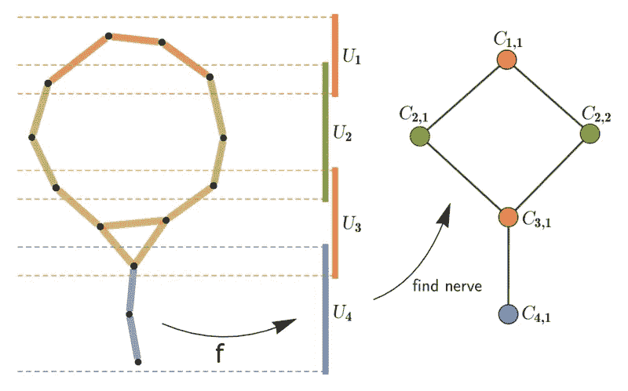
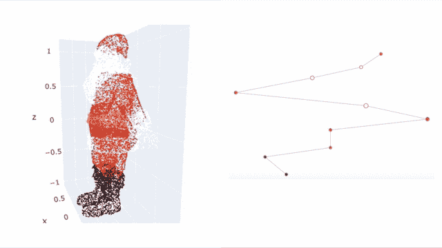
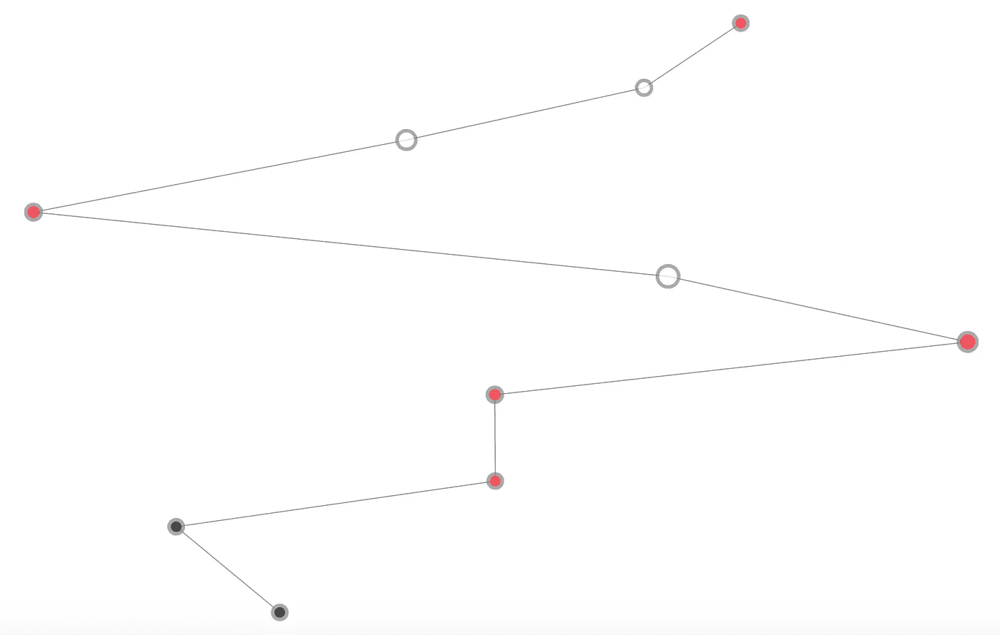
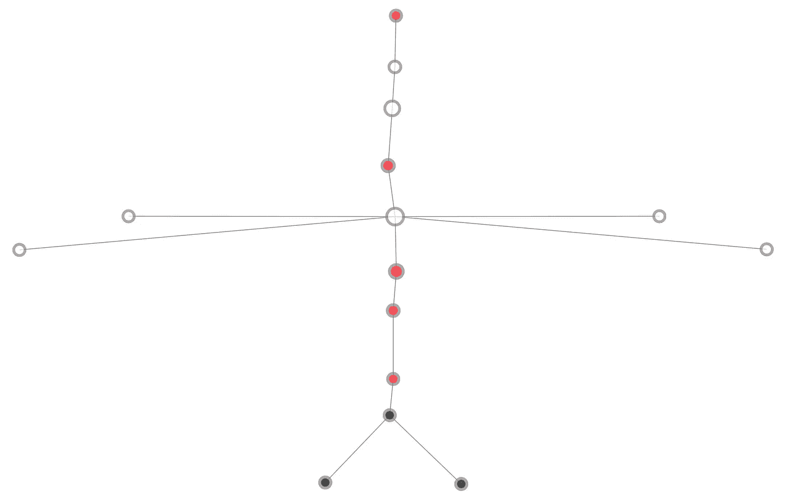
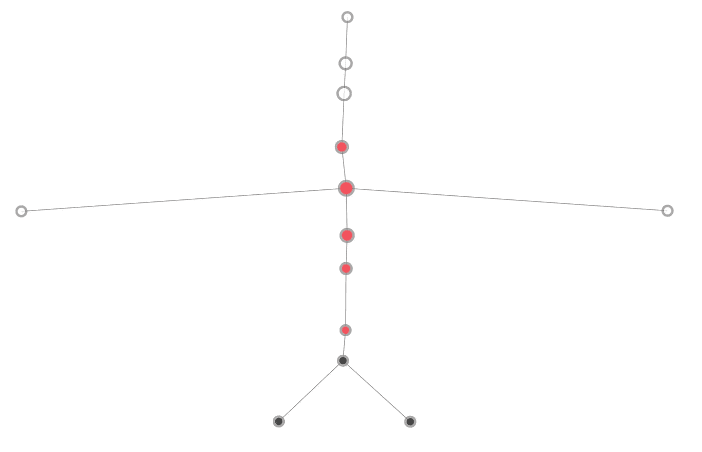
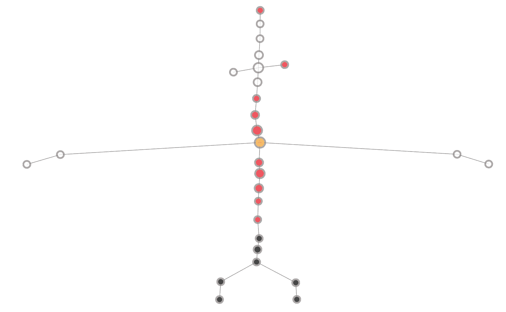

# Santa2Graph:使用 Giotto Mapper 可视化高维数据

> 原文：<https://towardsdatascience.com/visualising-high-dimensional-data-with-giotto-mapper-897fcdb575d7?source=collection_archive---------13----------------------->

## 拓扑数据可视化的 Mapper 算法的简单介绍，包括使用 giotto-learn 中的实现的教程

> 由弗朗西斯科·帕尔马、[大卫·伯巴、](https://medium.com/@davide.burba)[路易斯·汤斯顿、](https://medium.com/@lewis.c.tunstall)[托马斯·博伊斯](https://medium.com/@t.boys_87095)编剧

教程链接:[https://github.com/giotto-ai/tutorial_mapper](https://github.com/giotto-ai/tutorial_mapper)

除非你天生擅长数字，否则数据可视化仍然是数据分析最直接、最有效的洞察来源。特征之间的视觉相互作用提供了影响许多选择的洞察力，如特征工程和特征选择。



我们都喜欢有很多功能。好的一面是潜在的更多信息；不利的一面是很难分离这些信息。由于我们不能轻易地可视化三维以上的物体，标准的可视化方法不太适合高维数据。

[Mapper 算法](https://research.math.osu.edu/tgda/mapperPBG.pdf)提供了一种在单个图形中可视化数据内在形状的方法。这个图表是通过一个巧妙的聚类过程构建的，揭示了底层数据的粗略结构。实际上，理论结果证实了输出的拓扑准确性。

在本文中，我们将介绍映射器算法，以及基于 [giotto-learn](https://github.com/giotto-ai/giotto-learn) 库给出的实现的[教程](https://github.com/giotto-ai/tutorial_mapper)。它的一个很酷的特性允许您与一些映射器参数进行交互，而无需重新运行代码。



Interactive Mapper available in giotto-learn.

# 映射器算法的应用

自 2007 年以来，Mapper 一直用于简化复杂交互的可视化。它提供了对大特征空间的定性分析，有助于在医学、材料科学和基因组学中的应用。最近，它也被应用于提高神经网络的鲁棒性。

下面我们总结了映射器算法的两个著名应用:

## [1)乳腺癌患者分析](https://www.ncbi.nlm.nih.gov/pubmed/21482760)

在一项乳腺癌研究中，只有 200 名患者，需要一种专门的方法来处理基因型特征空间的 30k 维。Mapper 算法已成功应用于对患者进行更精细的细分，从而大大改善了靶向治疗。在两个不同的数据集上进行了相同的分析，并提供了一致的输出，证明了算法的稳定性。

## [2)NBA 球员的分类](https://www.nature.com/articles/srep01236)

如果你打过篮球，你就会知道篮球一直有五个位置:*控卫、得分后卫、小前锋、大前锋和中锋*。使用球员的统计数据和比赛中的表现，Mapper 算法确定了 13 种反映现代篮球动态的新打法。这让团队的总经理知道了组建团队时不可错过的技能。



# 映射器算法

摘自[原创论文](https://research.math.osu.edu/tgda/mapperPBG.pdf):

> 我们并不试图获得一个数据集的完全准确的表示，而是获得一个易于理解的低维图像，它可以指出感兴趣的领域。

为了生成表示数据结构的粗略图形，该算法将点合并成节点，并在不同节点的公共点处连接它们。

这个过程是由[神经定理](https://en.wikipedia.org/wiki/Nerve_of_a_covering)驱动的，它保证了映射器输出在拓扑上等同于数据采样的形状。

实际上，该算法是一个三步过程:

1.  **过滤**:我们通过使用过滤函数 *f.* 将数据点映射到ℝ
2.  **覆盖**:我们用重叠区间覆盖过滤值。
3.  **聚类**:对于每个区间，我们将一个聚类算法应用于在该区间中映射的观察值。



Among the points that are close in filter value, we cluster together the one that are similar in the original space. Nodes are connected whenever they share a point. (Source: [https://arxiv.org/abs/1904.11044](https://arxiv.org/abs/1904.11044))

# 1)过滤

映射器的第一步在于通过**过滤函数***f*:ℝⁿ**→**ℝᵐ.将每个数据点 **x** 映射到低维空间ℝᵐ通常我们选择 *m=1* 或者 *m=2* 。

过滤函数的选择对映射结果有很大的影响，因为过滤值较远的点没有机会聚集在一起。因此，过滤函数用作接近度的粗略测量。

在上图中，作者使用了高度函数，但是原则上任何函数都可以完成这项工作。但是，一些常见的选择是:

1.  轴上的投影
2.  [PCA](https://en.wikipedia.org/wiki/Principal_component_analysis)
3.  [怪癖](https://research.math.osu.edu/tgda/mapperPBG.pdf)
4.  [密度](https://research.math.osu.edu/tgda/mapperPBG.pdf)
5.  [熵](https://docs.scipy.org/doc/scipy/reference/generated/scipy.stats.entropy.html)

# 2)覆盖

我们以覆盖所有滤波器值的方式将图像空间划分成重叠的区间(或者区间的乘积，如果 *m > 1* )。我们称这样的结构为盖。

通常我们将封面设定为由相同尺寸的 *m* 维间隔制成。例如，如果 filter 函数采用ℝ中的值，则 cover 由一系列等长的重叠线段组成。

在这种情况下，要选择的参数是间隔数及其重叠百分比。在上面的例子中，有 4 个 25%重叠的区间。

# 3)聚类

在最后一步中，我们在封面的每个区间上连续地执行聚类。通过过滤函数每次取间隔的预图像，在原始空间上进行聚类。输出图由以下部分组成:

*   **节点**，表示数据点的集群；
*   **边缘**代表聚类对(共享一些数据点的聚类)之间的非空交集。由于时间间隔重叠，这是可能的。

在这一点上，每个聚类代表图的一个节点，并且边对应于具有共同观察的聚类。

# 教程:使用映射器检索圣诞老人

直观理解映射器如何工作的最好方法是使用它并“玩”它的参数。

[Giotto](https://giotto.ai) 是一个开源项目，包含 giotto-learn，一个易于使用的拓扑数据分析工具包。它使用了一个类似 Scikit-learn 的 API，并提供了一种通过管道函数来适应映射器的便捷方法。给定 Numpy 数组形式的数据集，构建图形的代码如下:

```
pipeline = make_mapper_pipeline(
    filter_func=Projection(column_indices=2),
    cover=OneDimensionalCover(n_intervals=10, overlap_frac=0.1),
    clusterer=DBSCAN(eps=0.5),
)
graph = pipeline.fit_transform(data)
```

我们将 Mapper 算法应用于数据集，该数据集包含从圣诞老人形状(即所谓的“圣诞老人云”)中采样的 20，000 个三维数据点。



Left: dataset sampled from [here](https://free3d.com/3d-model/santa-clau-77751.html) using [CloudCompare](https://www.cloudcompare.org). Right: Mapper output using different parameters.

作为第一次尝试，我们使用覆盖和聚类的默认参数以及高度上的投影作为过滤函数，即 *f:* **[** x，y，z **]↦** z。我们通过点的平均颜色给每个节点着色:



With the default parameters Santa might make it through the chimney.

该图不代表数据集，因为我们无法区分圣诞老人身体的任何特征。除了节点的任意位置之外，给圣诞老人一个蛇形的外观，该图相当于一条连接节点的线。这表明聚类算法的默认参数需要改变，因为我们总是将所有的过滤器间隔聚集在一起。

为了解决这个问题，我们执行了更精细的聚类:



Mapper output: DBSCAN(eps = 0.06).

太好了！这是一个不平凡的图形结构。特别是我们看到树枝的外观，代表圣诞老人的胳膊和腿。然而，在这幅画中，圣诞老人有四只手臂。

我们通过调整封面中间隔之间的重叠部分(默认值为 0.1)来解决这个问题:



Mapper output: DBSCAN(eps = 0.06), overlap_frac = 0.35.

这次我们可以清楚地分辨出腿、胳膊和头。虽然它非常简单，但一般来说，这足以抓住主要结构。

我们可以通过**增加封面中的区间数**(默认为 10)来进一步完善我们的研究。这样，我们看到了代表帽子的节点的外观，以及将胸部与胡须分开的分支:



Mapper output: DBSCAN(eps = 0.06), overlap_frac = 0.35, n_intervals = 20.

# 结论

giotto-learn 库提供了 Mapper 算法的快速完整的 Python 实现。我们正在分享一个关于 3-d 数据的教程，现在你可以用你自己的映射图来表现高维数据集了。

*特别感谢 Umberto Lupo 和*[*Lewis Tunstall*](https://medium.com/@lewis.c.tunstall)*在 giotto-learn 中实现映射器。*

# 链接:

*   [Github 上的 Giotto 库](https://github.com/giotto-ai/giotto-learn)
*   [包含代码的笔记本](https://github.com/giotto-ai/tutorial_mapper/blob/master/Christmas%20Mapper.ipynb)
*   更多学习资料请访问[网站](https://giotto.ai/)
*   [化学函数的形状](/the-shape-of-chemical-functions-d1e1568d020)及其[笔记本](https://github.com/giotto-ai/the-shape-of-chemical-functions)
*   [足球的形状](/the-shape-of-football-games-1589dc4e652a)及其[笔记本](https://github.com/giotto-ai/noise-to-signal)
*   [检测股灾](/detecting-stock-market-crashes-with-topological-data-analysis-7d5dd98abe42)及其[笔记本](https://github.com/giotto-ai/stock-market-crashes)