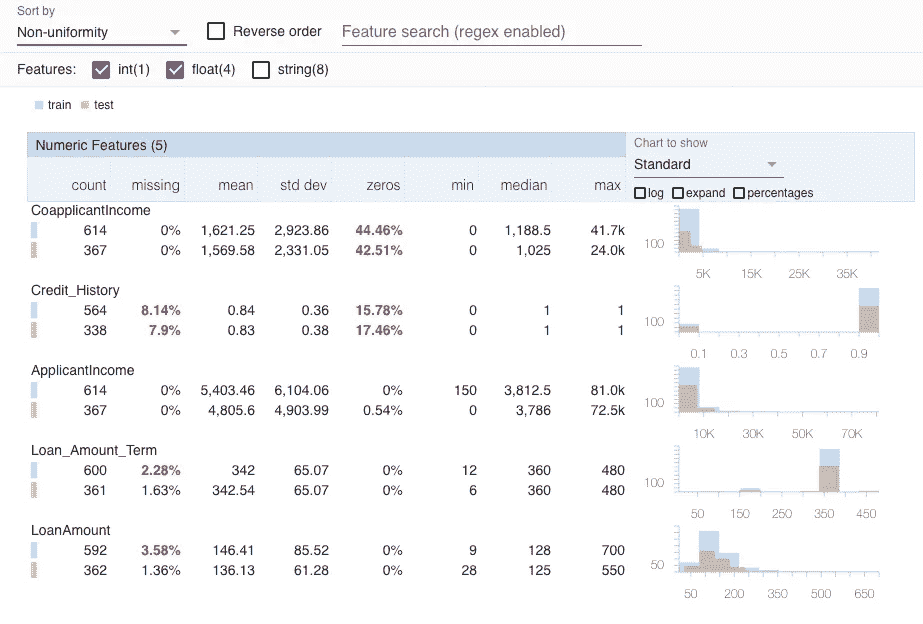
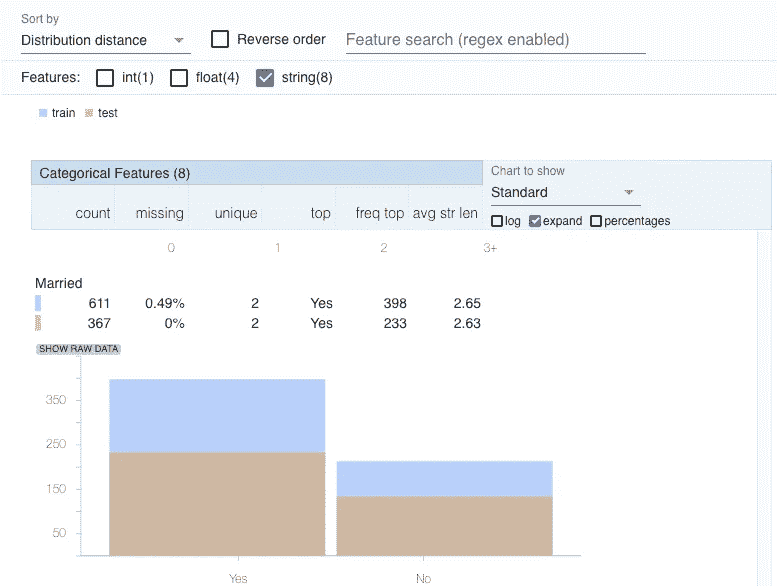
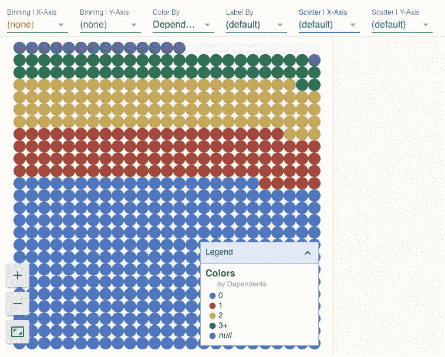
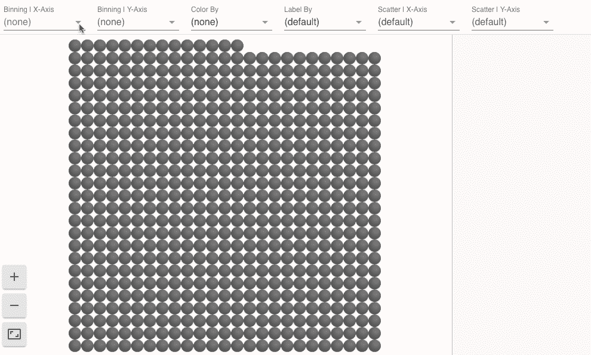
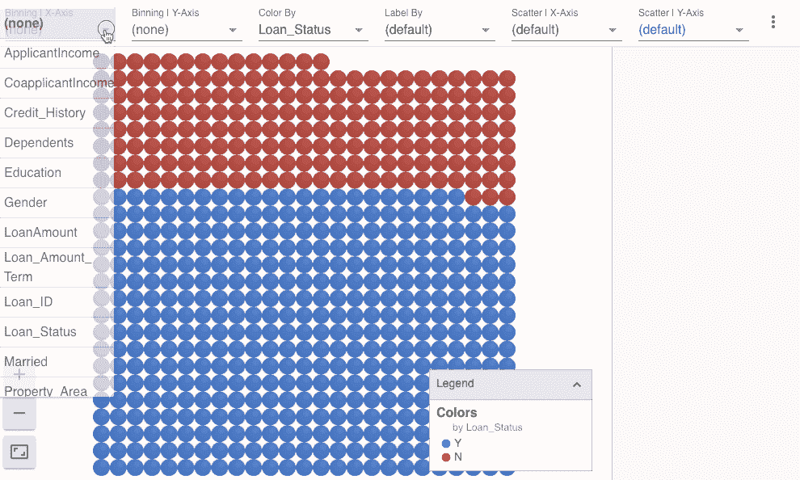

# 用 Google 的 FACETS 可视化机器学习数据集。

> 原文：<https://towardsdatascience.com/visualising-machine-learning-datasets-with-googles-facets-462d923251b3?source=collection_archive---------8----------------------->

## 谷歌的一个开源工具，可以从大量数据中快速学习模式


Photo by [Franki Chamaki](https://unsplash.com/@franki?utm_source=medium&utm_medium=referral) on [Unsplash](https://unsplash.com?utm_source=medium&utm_medium=referral)

> 更多的数据胜过聪明的算法，但更好的数据胜过更多的数据

关于大量训练数据如何对机器学习模型的结果产生巨大影响，已经有了很多争论。然而，除了数据量之外，质量也是构建一个强大而健壮的 ML 系统的关键。毕竟，“垃圾输入:垃圾输出”，也就是说，你从系统中得到的，将代表你输入到系统中的。

机器学习数据集有时由数千到数百万的数据点组成，这些数据点可能包含数百或数千个特征。此外，现实世界的数据是混乱的，包括缺失值、不平衡数据、异常值等。因此，在继续建模之前，我们必须清理数据。可视化数据可以帮助定位这些不规则性，并指出数据需要清理的地方。数据可视化提供了整个数据的概览，无论其数量多少，并能够快速准确地执行 EDA。

# 面状


facets 在字典中的意思可以归结为某事物的某一方面或特征。同样的， [**FACETS**](https://ai.googleblog.com/2017/07/facets-open-source-visualization-tool.html) 工具帮助我们理解数据的各种特性并探索它们，而无需显式编码。

Facets 是 Google 在 [**对**](https://ai.google/research/teams/brain/pair)**(People+AI Research)**倡议下发布的开源可视化工具。这个工具帮助我们理解和分析机器学习数据集。Facets 由两个可视化组成，这两个可视化有助于挖掘数据并提供很好的洞察力，而无需在用户端做太多工作。

*   **刻面概述**

顾名思义，这种可视化提供了整个数据集的概览，并提供了数据的每个要素的形状。Facets Overview 总结了每个功能的统计信息，并比较了训练数据集和测试数据集。

*   **刻面跳水**

此功能有助于用户深入研究数据的单个特征/观察结果，以获得更多信息。它有助于一次交互式地探索大量数据点。

> 这些可视化实现为[聚合物](https://www.polymer-project.org/)网络组件，由[打字稿](https://www.typescriptlang.org/)代码支持，可以很容易地嵌入到 Jupyter 笔记本或网页中。

# 使用和安装

有两种方法可以将方面用于数据:

## **网络应用**

它可以直接从它的演示页面使用，其链接嵌入在下面。

[](https://pair-code.github.io/facets/) [## 面向 ML 数据集的可视化

### Dive 提供了一个交互式界面，用于探索所有不同的数据点之间的关系…

配对代码. github.io](https://pair-code.github.io/facets/) 

这个网站允许任何人直接在浏览器中可视化他们的数据集，而不需要任何软件安装或设置，数据不会离开你的计算机。

## **在 Jupyter 笔记本/合作实验室内**

也可以在 Jupyter 笔记本/协作室中使用刻面。这提供了更大的灵活性，因为整个 EDA 和建模可以在一个笔记本上完成。请参考他们的 [Github 库](https://github.com/pair-code/facets#setup)以获得安装的完整细节。然而，在本文的后面，我们将看到如何在 colab 中使用刻面。

# 数据

虽然您可以使用演示页面上提供的数据，但我将使用另一组数据。我将在**贷款预测数据集**上做 EDA。问题陈述是为了预测一个申请人是否会偿还一家公司给予的贷款。这在 ML 社区中是一个众所周知的例子。

已经划分为训练集和测试集的**数据集，**可以从这里的 [**进入**](https://github.com/parulnith/Data-Visualisation-Tools/tree/master/Data%20Visualisation%20with%20Facets%20) 。让我们把数据载入数据库。

```
import pandas as pd
train = pd.read_csv('train.csv')
test = pd.read_csv('test.csv')
```

现在让我们了解如何对这些数据使用 Facets Overview。

## 方面概述

概览自动让您快速了解数据各种要素的值分布。还可以即时比较训练和测试数据集之间的分布。如果数据中存在某种异常，它会立即从数据中跳出来。

通过此功能可以轻松访问的一些信息包括:

*   平均值、中值和标准差等统计数据
*   列的最小值和最大值
*   缺失数据
*   值为零的值
*   由于可以查看测试数据集的分布，我们可以很容易地确认训练和测试数据是否遵循相同的分布。

> 有人会说，我们可以用熊猫轻松完成这些任务，为什么我们要投资另一种工具。这是真的，当我们只有少量具有最小特征的数据点时，可能不需要。然而，当我们谈论大型数据集时，情况就不同了，在这种情况下，分析多列中的每个数据点变得有点困难。

谷歌协同实验室使工作变得非常容易，因为我们不需要安装其他东西。通过编写几行代码，我们的工作就完成了。

```
# Clone the facets github repo to get access to the python feature stats generation code
!git clone [https://github.com/pair-code/facets.git](https://github.com/pair-code/facets.git)
```

为了计算特征统计数据，我们需要使用 Python 脚本中的函数`GenericFeatureStatisticsGenerator()` 。

```
 # Add the path to the feature stats generation code.
import sys
sys.path.insert(0, '/content/facets/facets_overview/python/')# Create the feature stats for the datasets and stringify it.
import base64
from generic_feature_statistics_generator import GenericFeatureStatisticsGeneratorgfsg = GenericFeatureStatisticsGenerator()
proto = gfsg.ProtoFromDataFrames([{'name': 'train', 'table': train},
                                  {'name': 'test', 'table': test}])
protostr = base64.b64encode(proto.SerializeToString()).decode("utf-8")
```

现在，通过下面几行代码，我们可以轻松地在笔记本上显示可视化效果。

```
# Display the facets overview visualization for this data
from IPython.core.display import display, HTMLHTML_TEMPLATE = """<link rel="import" href="[https://raw.githubusercontent.com/PAIR-code/facets/master/facets-dist/facets-jupyter.html](https://raw.githubusercontent.com/PAIR-code/facets/master/facets-dist/facets-jupyter.html)" >
        <facets-overview id="elem"></facets-overview>
        <script>
          document.querySelector("#elem").protoInput = "{protostr}";
        </script>"""
html = HTML_TEMPLATE.format(protostr=protostr)
display(HTML(html))
```

当您输入`Shift+Enter`时，您会受到这个优秀的交互式可视化的欢迎:



在这里，我们看到了贷款预测数据集的五个数字特征的方面概述可视化。要素按不均匀性排序，分布最不均匀的要素位于顶部。红色的数字表示可能的故障点，在这种情况下，数字特征具有设置为 0 的高百分比值。右侧的直方图允许您比较训练数据(蓝色)和测试数据(橙色)之间的分布。



上面的可视化显示了数据集的八个分类特征之一。要素按分布距离排序，训练数据集(蓝色)和测试数据集(橙色)之间偏斜最大的要素位于顶部。

## 多面跳水

[Facets Dive](https://ai.googleblog.com/2017/07/facets-open-source-visualization-tool.html) 提供了一个易于定制的直观界面，用于探索不同特征之间的数据点关系。使用 Facets Dive，您可以根据其特征值控制每个数据点的位置、颜色和视觉表示。如果数据点具有与其相关联的图像，则图像可以用作视觉表示。

要使用 Dive 可视化，必须将数据转换成 JSON 格式。

```
# Display the Dive visualization for the training data.
from IPython.core.display import display, HTML**jsonstr = train.to_json(orient='records')**
HTML_TEMPLATE = """<link rel="import" href="[https://raw.githubusercontent.com/PAIR-code/facets/master/facets-dist/facets-jupyter.html](https://raw.githubusercontent.com/PAIR-code/facets/master/facets-dist/facets-jupyter.html)">
        <facets-dive id="elem" height="600"></facets-dive>
        <script>
          var data = {jsonstr};
          document.querySelector("#elem").data = data;
        </script>"""
html = HTML_TEMPLATE.format(jsonstr=jsonstr)
display(HTML(html))
```

运行代码后，您应该能够看到以下内容:



Facets Dive Visualisation

现在，我们可以轻松地执行单变量和双变量分析，并让我们看看获得的一些结果:

## 单变量分析

在这里，我们将单独查看目标变量，即 Loan_Status 和其他分类特征，如性别、婚姻状况、就业状况和信用历史。同样，您也可以尝试不同的功能。



## 推论:

*   数据集中的大多数申请者都是男性。
*   同样，数据集中的大多数申请人都已经结婚并偿还了债务。
*   此外，大多数申请人没有家眷，是半城市地区的毕业生。

现在让我们来看一下顺序变量，即受抚养人、教育和财产面积。


从上面的柱状图可以得出以下推论:

*   大多数申请人没有任何家属。
*   大多数申请者都是毕业生。
*   大多数申请者来自半城市地区。

现在，您可以继续使用数字数据进行分析。

## 双变量分析

我们将找到目标变量和分类自变量之间的关系。



从上面的柱状图可以推断出:

*   对于已批准的贷款，已婚申请人的比例较高。
*   有一个或三个以上受抚养人的申请者在两种贷款状态类别中的分布是相似的。
*   似乎信用记录为 1 的人更有可能获得贷款批准。
*   半城市地区获得贷款批准的比例高于农村或城市地区。

# 结论

FACETS 提供了一个简单直观的环境来为数据集执行 EDA，并帮助我们获得有意义的结果。唯一的问题是，目前，它只适用于 **Chrome** 。

在结束本文之前，让我们也看看一个**有趣的事实**，它强调了如何使用 FACETS Dive 捕获 CIFAR-10 数据集中的一个小的人为标记错误。在分析数据集时，它注意到一张青蛙的图片被错误地标注为猫。嗯，这的确是一项成就，因为对于人类的眼睛来说，这是一项不可能完成的任务。


[Source](https://ai.googleblog.com/2017/07/facets-open-source-visualization-tool.html)