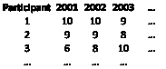
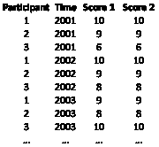
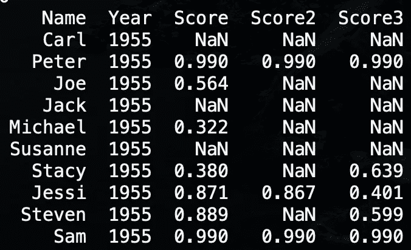
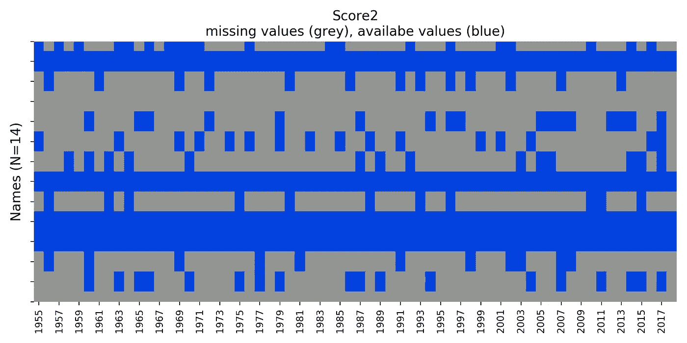
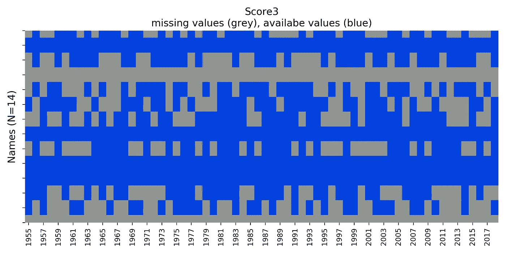

# 在 Python 中可视化缺失的面板数据

> 原文：<https://towardsdatascience.com/visualising-missing-panel-data-in-python-8dc79f6dbeb3?source=collection_archive---------20----------------------->

Photo by [Iker Urteaga](https://unsplash.com/@iurte?utm_source=medium&utm_medium=referral) on [Unsplash](https://unsplash.com?utm_source=medium&utm_medium=referral)

如果您开始处理新的数据集，一个重要的分析是完整性测试。现实生活中的数据从来都不是完美的，可能经常包含缺失值。如果您正在使用 Pandas(如果您正在进行数据争论，您应该这样做)，有一些简洁的函数可以填充缺失的数据，比如 [**。菲尔娜()**](https://pandas.pydata.org/pandas-docs/stable/reference/api/pandas.DataFrame.fillna.html) **。**但是，在填充缺失的数据之前，最好先了解缺失的内容等。这个简短的教程展示了面板数据完整性的一些可视化。

**什么是面板数据？**

Score 1 Dataframe

Score2 Dataframe

面板数据是多维数据，通常包含多个时间段的多个变量。例如，假设我们跟踪不同的健康得分(身体质量指数、血糖等。)对于一群多年来的参与者来说。对于每个变量(例如，得分 1、得分 2)，这将导致二维数据框架。这显然是不方便的，因为我们不想处理多个数据帧，并且认为 3D 是不直观的。因此，我们通常“堆叠”数据帧，其中每一行代表参与者和年份的唯一组合。

Stacked dataframe

让我们以堆叠格式创建一个面板数据集:

该样本包含一组人在 1955 年至 2019 年之间的(健康)得分。数据中有我们想要探究的缺失值(代码在最后)。打印数据帧的头部，我们可以看到很多缺失的数据。因此，我们希望对缺失的数据有更好的感觉，并试图了解是否有任何模式。

Head of the dataframe

我写了一个小函数，为感兴趣的变量创建一个图形。在 y 轴上，您可以看到观察结果(本例中为名称)。在 x 轴上你看到了年份。可用值以蓝色高亮显示，而缺失数据以灰色显示。

## 我们在这里能看到什么？

我们可以看到，Score 的可用值最多，而 Score 2 的可用值最少。大多数缺失值是随机的，但也有少数组成员没有值或所有值都可用(例如蓝色水平线)。这个函数可以在一个循环中使用，以方便地遍历所有变量，并允许直接发现模式。如果一些分数可以作为替代，我们应该在这种情况下使用 score1，因为它具有最完整的信息。

使用 2000 年至 2019 年间 1000 家公司的真实财务信息，图表如下所示。还有更多的信息缺失。我们可以直接发现，没有 2000 年的信息。此外，我们看到一些公司不是每季度报告一次，而是每年报告一次，只有每年第四季度的数据。一些公司只是出现的时间晚一些，而另一些则消失了。

