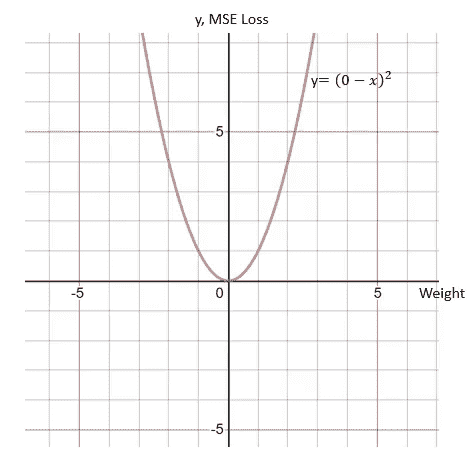
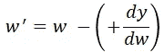
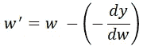
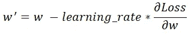
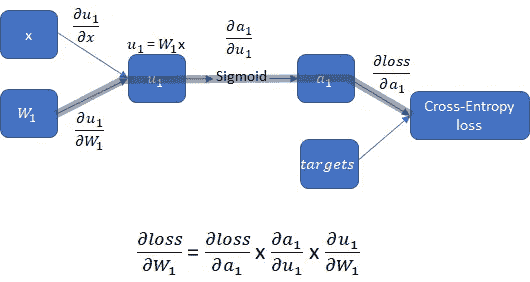
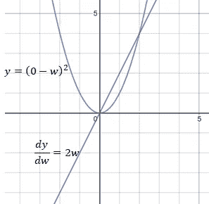
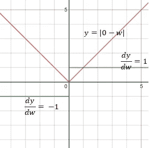
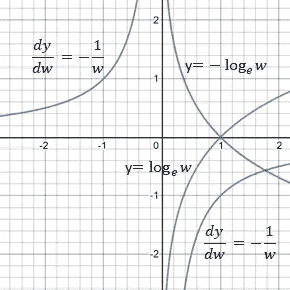
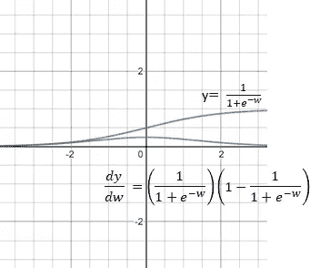
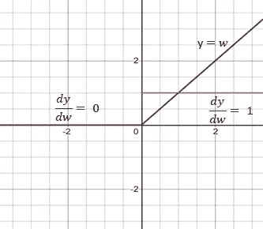

# 可视化损失函数和梯度下降之间的关系

> 原文：<https://towardsdatascience.com/visualising-relationships-between-loss-activation-functions-and-gradient-descent-312a3963c9a5?source=collection_archive---------6----------------------->

## 梯度下降处理损失/激活函数

本文假设你有训练神经网络的先验知识，并试图通过可视化揭示损失函数、梯度下降和反向传播之间的关系。

左图显示了损失函数和梯度下降之间的关系。

为了可视化梯度下降，想象一个过度简化为神经网络的最后一个节点输出一个权重值 w，目标值为 0 的例子。在这种情况下，损失函数是均方误差(MSE)。

当 w 大于 0 时，MSE 的导数 dy/dw 为正。正 dy/dw 可以解释为 w 的正阶跃将导致 y 的正变化，为了降低损耗，需要 w 方向的负阶跃:

当 w 小于 0 时，MSE 的 dy/dw 为负，这意味着 w 的正阶跃将导致 y 的负变化，为了降低损耗，需要在 w 方向上有一个正阶跃:

因此，总结权重更新的公式如下:

其中 learning_rate 是一个常数，用于调整导数应该步进的百分比。应该调整 Learning_rate，防止 w 的步长太小或太大。还应该调整 Learning_rate，以防止梯度爆炸(梯度过大)或消失梯度问题(梯度过小)。

对于更长且更实际的计算图，其中权重在 sigmoid 激活之后，为了更新权重 w1，损失相对于 w1 的导数可以如下找到:

the derivative of loss with respect to weight, w1

从上述步骤可以看出，神经网络中的权重是由损失函数的导数而不是损失函数来修正或反向传播的。损失函数对反向传播没有贡献。

L2 Loss

MSE (L2 损耗)的导数的大小为 2w。MSE 的导数的幅度变化有助于当 w 远离目标 0 时向 w 反向传播较大的步长，而当 w 靠近目标 0 时向 w 反向传播较小的步长

L1 Loss

平均绝对误差(MAE)(L1 损失)具有 1 或负 1 的常数导数，这在区分 w 离目标有多远时可能不理想。反向传播只使用损失函数的导数，不使用损失函数。

Cross-Entropy Loss

交叉熵损失只涉及 0 和 1 之间的 w 的定义域。当 w 接近 1 时，交叉熵减小到 0。交叉熵的导数是-1/w。

Sigmoid activation

Sigmoid 函数的导数范围在 0 到 0.25 之间。sigmoid 函数的导数的乘积可能导致非常小的接近于 0 的数，这使得反向传播无用。这就是所谓的消失梯度问题。

Relu activation

当导数为 1 或 0 时，Relu 成为良好的激活函数，允许在反向传播中对权重进行恒定更新或对权重进行 0 更新。