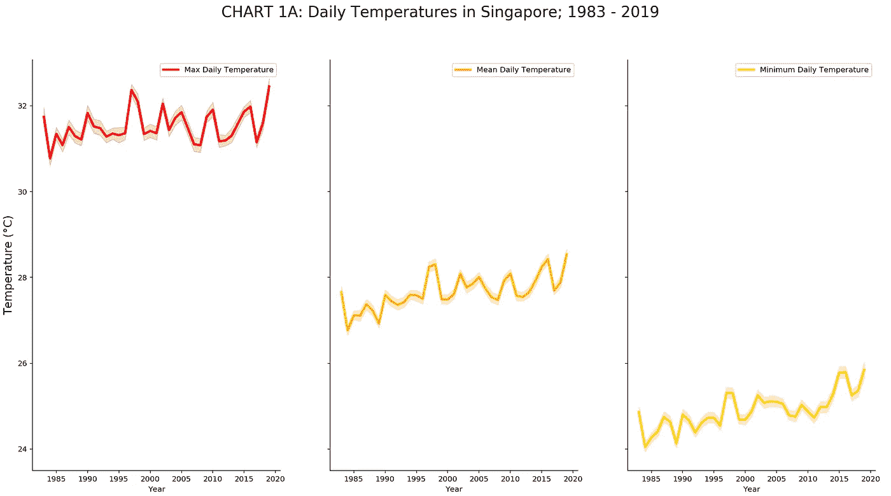
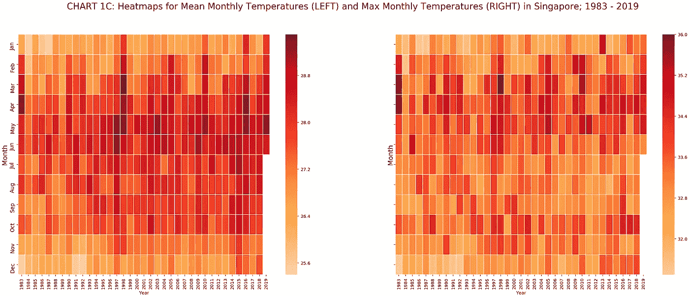
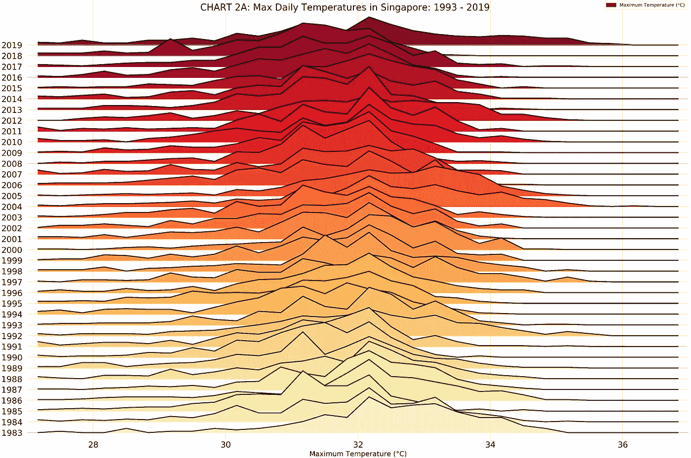
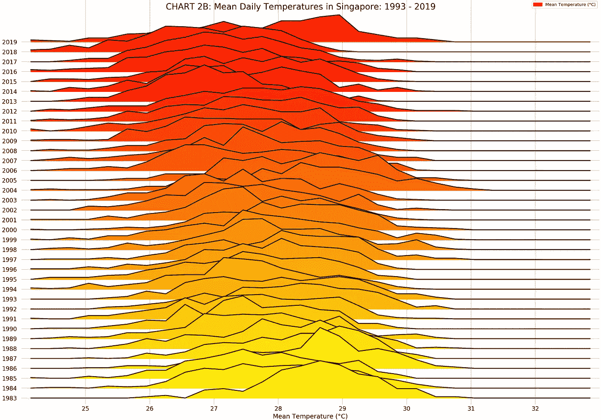
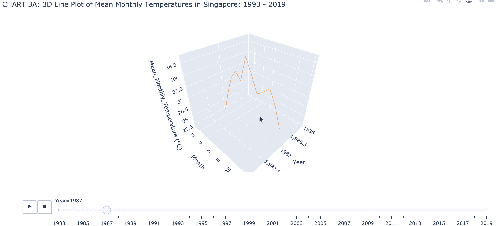
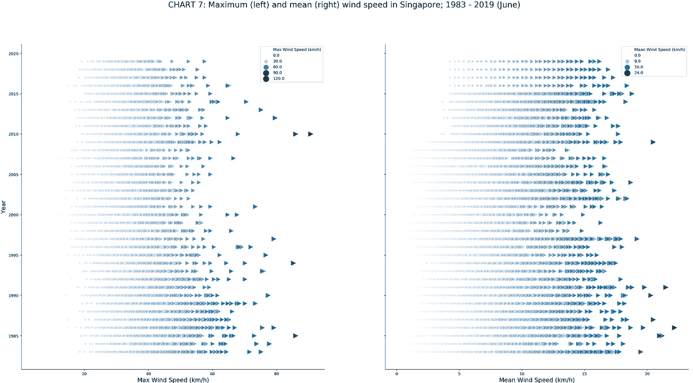
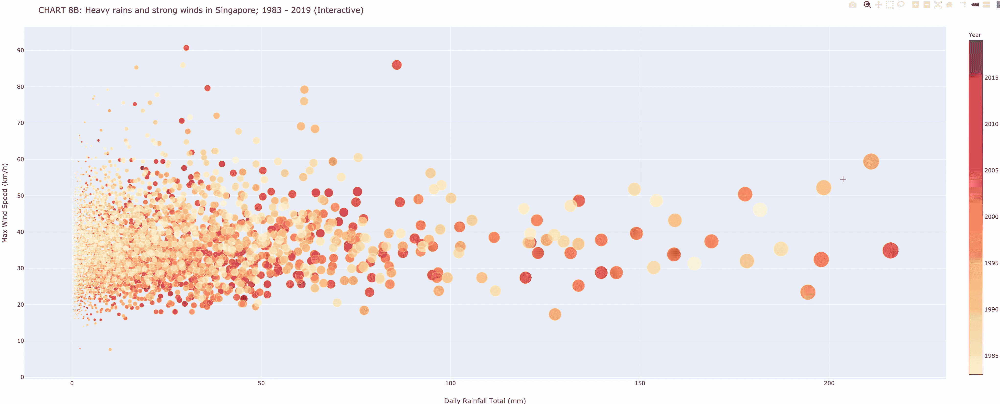

# 想象新加坡不断变化的天气模式:1983–2019

> 原文：<https://towardsdatascience.com/visualising-singapores-changing-weather-patterns-1983-2019-a78605fadbdf?source=collection_archive---------11----------------------->

## 通过使用像 Plotly Express 这样的经典和新的可视化库，我试图发现东南亚城市国家 36.5 年的天气数据背后的模式。

Animated gif of maximum monthly recorded temperatures in Singapore from 1983 to June 2019.

缺少季节变化使许多人认为新加坡的天气是可预测的，不会改变。事实并非如此，气候变化让这个城市国家的天气变得更加不可预测。

我们开始感受到更暖和的天气和更强烈的风暴的影响。从地面来看，新加坡似乎在较早的时候变得更暖和了。

在许多日子里，早上 8 点迎接我的太阳感觉更像是我在上午晚些时候期待的东西。午后的火焰从未如此强烈。

在这个项目中，我将尝试使用经典的和新的可视化库，如 [Plotly Express](https://plot.ly/python/plotly-express/) ，来展示新加坡不断变化的天气模式。

该项目的回购在此为。这个中帖的图表可以在这个[笔记本](https://github.com/chuachinhon/weather_singapore_cch/blob/master/notebooks/2.0_visualisation_cch.ipynb)中找到，而数据可以在[这里](https://github.com/chuachinhon/weather_singapore_cch/tree/master/data)和[这里](https://github.com/chuachinhon/weather_singapore_cch/tree/master/raw) (raw 版本)。

# **1。数据预处理**

这个数据集是我能在新加坡公共领域找到的为数不多的详细的多年数据集之一。本文中的图表来自四个表格，这些表格针对少量缺失值进行了轻微处理，并针对额外的日期时间相关列进行了功能设计(参见笔记本[此处](https://github.com/chuachinhon/weather_singapore_cch/blob/master/notebooks/1.0_data_cleaning_cch.ipynb))。

[第一张表](https://github.com/chuachinhon/weather_singapore_cch/blob/master/data/weather.csv)是来自[气象局网站](http://www.weather.gov.sg/climate-historical-daily/)的一组每日记录，从 1983 年 1 月 1 日到 2019 年 6 月 30 日。虽然每日记录可以追溯到 1980 年，但 1980 年至 1982 年之间的记录大多不完整。出于一致性的考虑，我将所有四个表的共同起点设置为 1983 年。

第二张[、](https://github.com/chuachinhon/weather_singapore_cch/blob/master/data/max_temp_monthly.csv)[第三张](https://github.com/chuachinhon/weather_singapore_cch/blob/master/data/mean_temp_monthly.csv)和[第四张](https://github.com/chuachinhon/weather_singapore_cch/blob/master/data/rain_monthly.csv)表格是来自新加坡政府[数据机构](https://data.gov.sg/group/environment)网站的月度综合天气数据——分别为最高月气温、平均月气温和月降雨量。

本项目气象数据的原始来源可以在[这里](http://www.weather.gov.sg/climate-historical-daily/)和[这里](https://data.gov.sg/group/environment)找到。

# 2.暖气打开了——显示每日和每月的温度记录

根据新加坡国家气候变化秘书处的数据，从 1948 年到 2016 年，该国的年平均气温平均每十年上升 0.25 摄氏度。

该机构预测，未来日平均气温将上升 1.4 摄氏度至 4.6 摄氏度，在本世纪余下的时间里，从 2 月到 9 月，白天和夜晚将更加温暖。一组简单的折线图显示了我们的前进方向:

无论你怎么看，新加坡正在变暖，最高、最低和平均记录温度的趋势线都指向上方。

然而，在线图中经常会丢失细节，尤其是当彼此相邻分组时。在这种情况下，箱线图会很有用，它让我们深入了解多年来中值的分布以及异常值在哪里。

每个方框末端的水平线(或“胡须”)指的是当年各自的最小值和最大值，而中间的线指的是中间值。黑色的“钻石”是异常值。

一目了然，我们可以知道某一年的最高或平均温度范围，以及哪些年份的温度高于或低于正常温度。

可视化温度变化的另一个经典方法是使用热图:

左侧的热图显示的是月平均气温，描绘了几十年来更清晰的趋势，右侧较暗的斑块表明月平均气温在上升。中间较暗的区域也告诉你哪里最热。

右侧热图中最高月气温的模式有点难以解读。较暗的部分主要集中在 2 月至 5 月期间，尽管近年来从 2014 年开始，10 月份也有一片有趣的深红色。

# **2.1 实验#1:脊线图**

随着更严肃的图表的出现，让我们看看更不常见的技术/库是否会产生更有趣的东西。

自从我在 2018 年末第一次遇到[山脊线地块](https://github.com/sbebo/joypy/blob/master/joypy/joyplot.py)(或曾被称为 joyplots)以来，我一直很喜欢它们锐利、棱角分明的外观。它们看起来很棒，但我要诚实地说，在这种情况下，它们不一定像更简单的 Seaborn 图表那样清晰地呈现温度趋势。

# **2.2 实验#2:用 PLOTLY EXPRESS 制作 3D 动画图**

Plotly Express 提供了大量有趣的功能，包括制作交互式 3D 动画图表的能力，如下图所示。诚然，这不是最清晰或最有效的方式来说明一种趋势，但它在视觉上令人兴奋，并在适当使用时为演示添加了一个有趣的新选项:

Medium 不便于将交互式图表嵌入到帖子中。要查看上图和下图，请点击查看完整的笔记本[。](https://github.com/chuachinhon/weather_singapore_cch/blob/master/notebooks/2.0_visualisation_cch.ipynb)

# 3.大雨将至——可视化每日和每月的降雨记录

在 1983 年 1 月至 2019 年 6 月期间，有 6399 天的降雨和 6931 天的干旱-大致持平。随着气候变化，预计会有更强烈的风暴。同样，让我们从经典和简单的图表开始，然后尝试不同的方法来显示每日和每月的降雨量数据。

上面的图表简单明了，总结了年降雨量并按年份分组。1997 年和 2015 年是年降雨量最少的年份，而 2007 年是年降雨量最多的年份。

但就年总降雨量而言，还没有持续的大幅上升或下降的迹象。让我们从更细的角度来看一下数据。

对于关于降雨量记录的第二个图表，我决定打破一些小规则，将 y 轴反转来模拟降雨的样子。我不确定这在“适当的”数据可视化中是否会遭到反对，但我觉得这是一种视觉上吸引人的数据呈现方式，也是数据本质的有机组成部分。

一眼看去，你就能知道异常值在哪里，是日降雨量还是月降雨量。

2011 年 1 月 30 日是过去 36 年来单日降雨量最大的一天。事实上，根据英国气象局对 2011 年天气的回顾，那是“自 1869 年有记录以来，一月份一天中最高的降雨量”。

转向右边的图表，我们看到 2006 年 12 月的月降雨量是该数据集中最大的。很快就可以看出，缺乏交互性是这种图表的一个问题，在这种图表中，您希望能够通过将鼠标悬停在特定数据点上来调出该数据点。在这种情况下，给图表添加注释会很麻烦。

同样，Plotly Express 图表在这种情况下很方便:

# **3.1 实验#3:条形图竞赛**

最近，条形图比赛在社交媒体上变得非常流行。我用[荣景](https://flourish.studio/2019/03/21/bar-chart-race/)上的模板为每月的降雨数据做了一个:

我明白为什么这样的图表在社交媒体上表现良好。但它们在传达趋势方面是否真的有效值得怀疑。你能把这个放在正式的报告里吗？

# 4.当风吹过的时候

由于地理位置的原因，风速在新加坡没有得到太多关注，这使得该岛免受热带气旋等严重风暴的影响。但快速浏览一下风力数据的历史模式，寻找潜在变化的迹象，仍然很有意思。

右边的图表表明，新加坡的平均风速在过去几十年里没有增加多少。在左图中，有趣的是看到了 2010 年以来记录的一系列强风。

过去 36 年中记录的最强阵风是在 2010 年 11 月 29 日，当时最大风速达到 90.7 公里/小时——约为同期记录的平均最大风速的 2.6 倍。

# **4.1 风&雨**

我们自然也会把强风和暴雨联系在一起。让我们看看这两个条件是如何随时间变化的:较大的三角形表示降雨量较高，阴影较暗的三角形表示较新的降雨量，而阴影较浅的三角形则反映较早的降雨量记录。

这是使用 Plotly Express 复制的同一张图表，因此可以使用交互功能快速调用各个值:

# **5。一次又一次:矩阵面板比较**

如果你想把天气数据按照月和日分解成一个面板矩阵，Plotly Express 有一个简洁的功能。

我为 1988 年、1998 年、2008 年和 2018 年的天气记录绘制了四个这样的矩阵，以比较四十年来的温度-降雨模式。较大和较暗的圆圈表示暴雨较大。

我在这里只包括了图表的截屏。对于完整的交互式图表，请查看笔记本[这里](https://github.com/chuachinhon/weather_singapore_cch/blob/master/notebooks/2.0_visualisation_cch.ipynb)，您可以将鼠标悬停在各个点上以获取更完整的数据。要放大感兴趣的特定区域，只需在图表上单击并拖动即可。

观想的可能性是无穷无尽的，这感觉像是在疲劳到来之前停下来的好时机。我很好奇你会用同样的数据集得出什么结论。请通过以下方式与我分享:

推特:@chinhon

领英:【https://www.linkedin.com/in/chuachinhon/ 