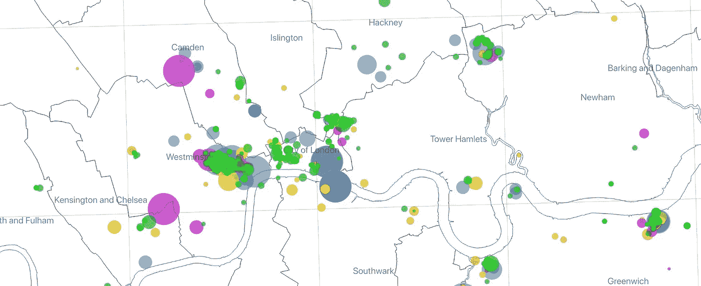
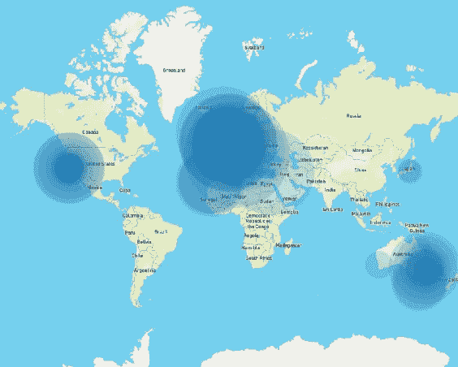
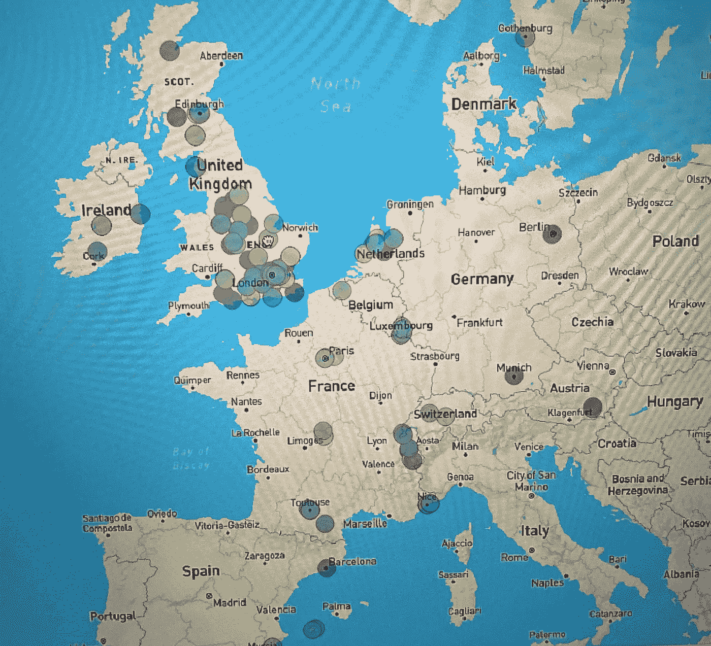
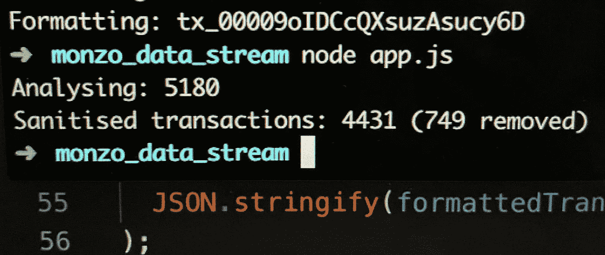
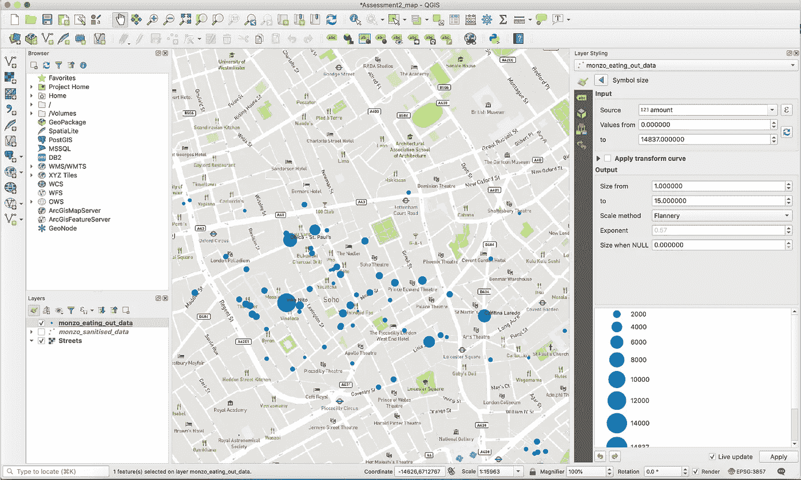
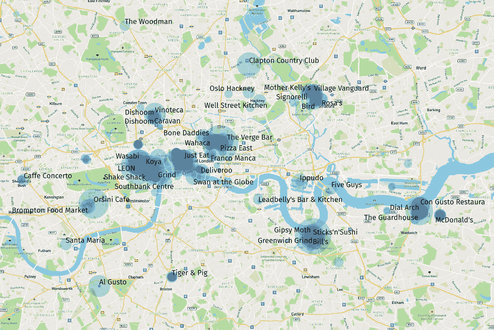
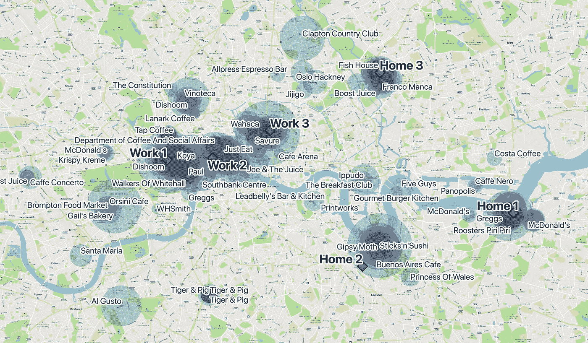
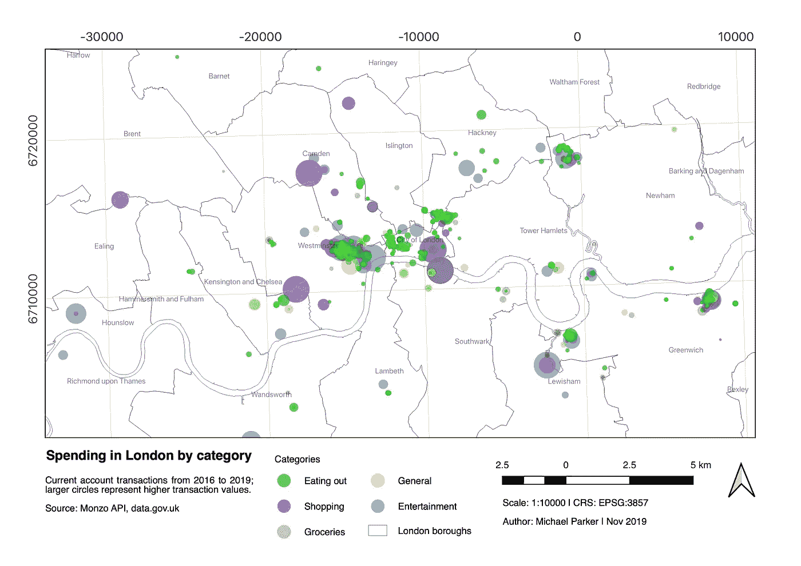
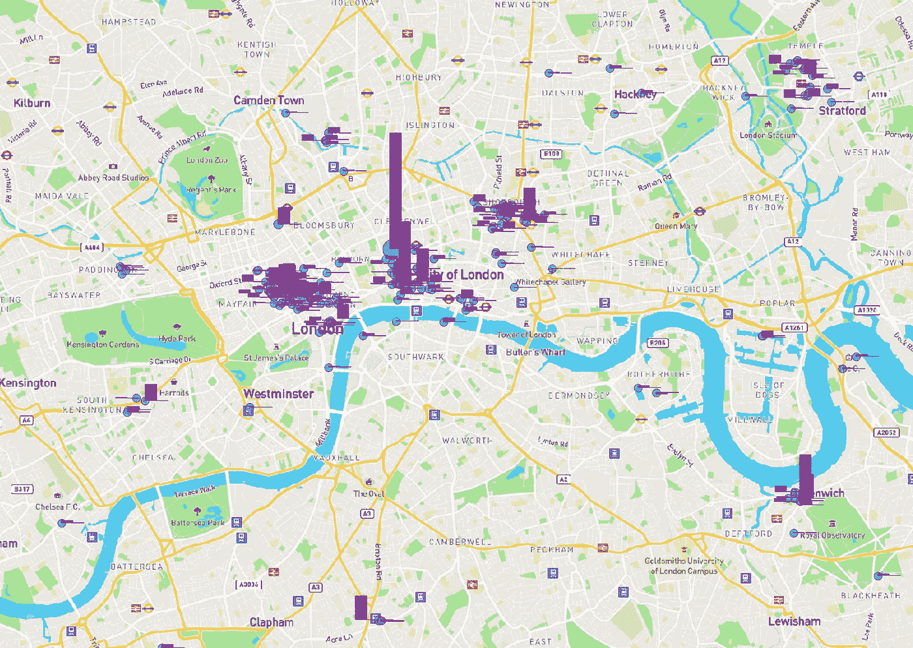

# 通过开放式银行和地理信息系统可视化消费行为

> 原文：<https://towardsdatascience.com/visualising-spending-behaviour-through-open-banking-and-gis-9e7045674538?source=collection_archive---------34----------------------->

金融习惯历来是人们不太在意的东西，但随着信息量和可用工具的增加，一种新的金融控制态度正在透明的数字银行中越来越受欢迎。新型金融机构(如 Monzo、Starling、Revolut 和 N26)正在利用数字产品让他们的客户能够更好地访问和控制他们的支出。他们通过提供现代移动应用程序、实时通知、更好的安全性和开发人员 API 来实现这一目标，这些 API 允许任何有想法的人进行分析和产品化。

技术也在其他方面帮助了人类行为。当人们想起一件事或一段记忆时，他们通常指的是它发生的地方。当试图在手机上查找一张照片时，描述照片的拍摄地点往往比日期更容易，例如“我们在西班牙”或“这是在我格林威治的家里”。同样的人类行为也适用于财务决策和支出。一份写着“XDB 商品报 82.00 美元”的声明无助于解释交易背后的故事和决定，让人们感到困惑，拼命想知道这可能是什么。

我对在地图上探索金融交易的表现很感兴趣，这有助于回答关于消费发生在哪里的问题，并引发对所去过的地方的记忆。该地图与其他数据层相结合，还可以用于识别和确定历史消费习惯，寻找新的旅游地点，甚至通过位置识别欺诈和异常交易。

## **数据大小和范围**

在这个实验中，我使用了 Monzo，它提供了一个非常全面的 API 来提取他们平台上的用户信息。收集这些数据需要非常明确的同意来收集和存储数据，因此对于这个练习，我只使用了我自己的数据，尽管可以构建一个可扩展的应用程序，并在其他用户允许的情况下分析他们的数据。

该数据集包含了过去 3 年我个人活期账户上的每一笔交易，记录刚刚超过 5000 条。数据被格式化为 JSON，并被结构化为一个对象数组，每个交易都包含时间戳、便士/美分整数形式的金额、货币、描述、类别、注释、附件(如收据)、元数据、结算信息和商家信息。商家信息包含名称、坐标、地址、Google Places ID、国家和一个近似的标志(在估计商家位置时进行标记)。

## **初步分析**

该数据集提供了一个令人兴奋的机会，可以发现和分析更多关于我的消费习惯，并更好地了解 Monzo API 的功能。我创建了一个 JavaScript 程序来解析交易，并做一些非常基本的主题分类。

在数据集中，我发现大约 1/3 的交易花在外出就餐上，1/3 的交易花在喝咖啡上。咖啡馆代表了超过 400 笔交易，但总的来说消费相对较低，平均每次消费仅超过 3.5 英镑。金额最大的交易是工作支出，最昂贵的个人购买是购物，还有一个极端的异常值，是我去年完成的一个飞行员执照预付费飞行课程的第二高交易金额的近 5 倍。大多数交易发生在伦敦，但它们分布在五大洲，最孤立的交易发生在塔斯马尼亚的霍巴特。

Figure 1: All global transactions weighted by amount

三年间，通过该账户转移的资金总额达到了惊人的 20 万英镑(其中包括业务支出和向其他银行的转账)，仅包括个人支出的 9 万英镑。Monzo 不是我唯一的银行，这些数字之间的明显差异说明了使用原始数据得出有意义的结论的复杂性。业务支出不代表个人财务习惯，很容易扭曲形象；为了确保地图的准确性和丰富性，数据需要进行消毒。

## **初始实验**

为了了解使用该数据集的可能性，并了解制图软件 QGIS 可能提供的限制和机会，我从 MapBox 加载了一个底图，并导入了所有 5000 个事务。

软件渲染速度很慢，而且所有的点都是重叠的。即使为每个类别的交易分配不同的颜色，地图也没有用，或者不容易从中得出任何有意义的东西。拥有太多的信息意味着项目重叠，并且没有像我最初希望的那样给出有用的结论。

Figure 2: All transactions layered on a base map with equal weighting

以这种方式呈现事务确实让我发现了数据集有趣的异常值和复杂性，如果不做这个实验，我是不会注意到这些的。网上购物在地理位置上尤其成问题(例如，AWS 显示美国的地理中心)。对于那些谷歌不知道他们的实际地址，而把商家放在国家地理中心的商家来说也是如此。

*伦敦的默认中心是特拉法尔加广场，那里没有商店，所以可以肯定地说这些商户的位置是不准确的。*

## **清理数据集**

我修改了 JavaScript 应用程序来迭代事务，并执行一些过滤和规范化。首先，任何被归类为费用、账单、财务和存款的交易都将被删除，只留下个人费用。我还删除了商家不存在或没有地理信息的交易。我还重命名了一些键，使数据更容易在中处理，并简化了 JSON 结构，使其更容易转换为 CSV。这就建立了一个文件，其中只包含在实体商家中发生的交易，而不是称为“Monzo Sanitised Transactions”的业务费用。

Figure 3: The node app iterates over the dataset and writes a CSV file containing the location data

为了让数据更容易实验，我还创建了一个仅包含外出就餐交易的数据子集(称为“Monzo 外出就餐”)。这个较小的数据集解决了我在使用 QGIS 时遇到的一些性能问题。

我想使用地图标记的大小参数在可视化中反映交易的价值。我面临的另一个问题是，所有的交易金额大部分都是负数(因为这些代表的是钱从账户中流出的交易)。映射软件 QGIS 需要正整数标度，因此我通过调整清理公式将交易金额乘以-1 来修改金额值。这样做的一个后果是现在退款为负值；为了解决这个问题，我将最小表示值限制为零，确保只显示借记的交易。

Figure 4: Eating out transactions individually represented in Soho, London

我担心使用单个交易不能代表每个商家的合计总额和计数(这在统计上更有意义),也不能消除积分相互叠加的问题。我在 JavaScript 应用程序中创建了一个新功能，根据唯一的商家 id 对数据进行消毒，然后为每个商家创建一个交易总和和计数。

*虽然该功能正确地减少了商家 ID 匹配的数据，但这种方法并不完美，因为商家数据是众包的，而且通常同一家商店不会共享相同的 ID。*

Figure 5: Eating out transactions in London individually sized by amount

Figure 6: Eating out transactions in London aggregated by merchant and sized by amount

当汇总的数据被导入到地图上时，结果很有趣，因为从单个的可视化中几乎不可能理解或看到差异。极端的购买是非常异常的，很难看出小额消费之间的差异(价值和数量)。即使将转换曲线应用于该数据集，可视化仍然不如单个交易那样引人注目，因此我放弃了这种方法，并专注于其他更有效地可视化信息的方法。

## **地图图层**

我最初使用 MapBox studio 创建了一个定制的基础层，以矢量格式在网络上提供服务。MapBox 是 Google maps 的一个很好的替代品，因为它可以在应用程序开发中使用。使用街道地图进行数据可视化的问题是地图在视觉上非常复杂。有许多颜色和标签分散了上层有趣数据的注意力。

我探索了一些其他地图视觉风格，并从野生动物地图中获得灵感，这些地图使用非常简单的线条和阴影来显示区域边界和重要位置。移除所有用于寻路的图层会对商家位置产生更大的影响，也更容易解释。

对于这些线，我选择了伦敦县的行政区和选区边界。这些形状文件可以在英国政府的开放数据库(data.gov.uk)上方便地获得，该数据库公布了其部门收集的开放数据，并提供了 2018 年边界测量的矢量形状文件。

## **转换坐标参考系统**

使用政府底图时，我立即注意到的一个问题是，数据集不在同一个坐标参考系统中，并且地图本身存在偏差。数据由英国政府使用本地系统[OSGB36]生成，其中 Monzo 使用全球数字标准[WGS84]。我调整了数据层以使用基础层的 CRS。

# **成品地图**

Figure 7: Map created using the sanitised data and base layers

最终的地图将 5 个支出类别分层，并对金额进行标准化，因此标记的大小代表支出的价值。

每个类别都用颜色表示，并且不透明，因此交易越频繁，颜色越丰富。兴趣点(住宅/工作地点)、铁路网络和一些有趣的异常值周围有清晰的聚类。

最大的集群并不令人惊讶，在伦敦市中心，外出就餐有大量的交易层层叠加，根据最初的分析，这大约是总交易数量的 1/3。并非巧合的是，这三个绿色集群都在我工作过的三个地方(肖尔迪奇、法灵顿和苏荷区)附近。很容易得出结论，我在工作地点附近和城市里的外出就餐上花了很多钱。

该图还显示了许多没有任何事务的空白区域。它显示了在过去的 3 年里我在伦敦西部度过的时间有多少，这可能是一个在那个地区尝试更多餐馆和商店的好机会。将这些信息与一个热门名单结合起来，可能是探索和核对伦敦和世界各地的好方法。

这种可视化也可能是抑制消费习惯的一种好方法，方法是随着时间的推移跟踪这些类别，并将目标游戏化，以取代用杂货外出就餐或减少总数来帮助省钱。

**进一步发展**

以这种方式向最终用户呈现商家数据可能是 Monzo 或 Google 验证商家位置并进一步众包关于商家正确定位的反馈的好方法。我有一个假设，人们思考他们在哪里/他们在哪里支付了一些东西，以这种方式呈现交易允许在人们质疑交易的地方询问离群值。它甚至可以帮助发现欺诈性交易，或通过提供交易发生地的急需上下文来减少假标记的欺诈。

我在我的数据集中发现了土耳其的一笔交易，我从未去过这个国家，但有一家在线商家在那里注册。我还在伦敦北部看到咖啡异常高的交易量，我很少去那里，但那里是商人总部所在地。这些例子表明，熟悉自己习惯的人可以如何对数据集做出贡献，并帮助创建更丰富、更准确的商家位置表示。

企业和政府可以从了解这些类别的位置中受益匪浅，以帮助提供信息:议会分区、企业价格设定/调整、瞄准“高流量”街道或路线、帮助个人管理他们的支出，甚至作为一种产品来帮助找到受欢迎的餐馆、景点或便利设施附近的住房。

事实证明，这项任务令人难以置信地发人深省，并开启了一种思考行为支出的新方式。在未来的版本中，我有兴趣在更大的用户群中继续这个实验，来比较人们之间的花费。探索其他参数(如一周中的某一天)如何影响消费者支出的变化和模式也是很有趣的。

Eating out locations by amount (pink) and frequency (blue)

**版权和来源**

英国政府，“国家统计”，开放数据[data.gov.uk]，2018 年

包含国家统计数据官方版权和数据库权利[2015]和包含地形测量数据官方版权和数据库权利[2015]

Monzo，“开发者 API”，开发者文档[api.monzo.com]，2019

MapBox，“工作室和地图 API”，[mapbox.com]，2019 年

图形和印刷品使用来自 Mapbox 和 OpenStreetMap 及其数据源的地图数据。要了解更多，请访问 https://www.mapbox.com/about/maps/的[和 http://www.openstreetmap.org/copyright](https://www.mapbox.com/about/maps/)的[。](http://www.openstreetmap.org/copyright)

帕克，交易数据，2019