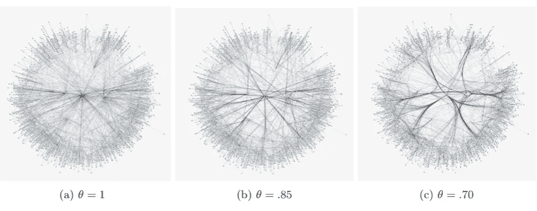
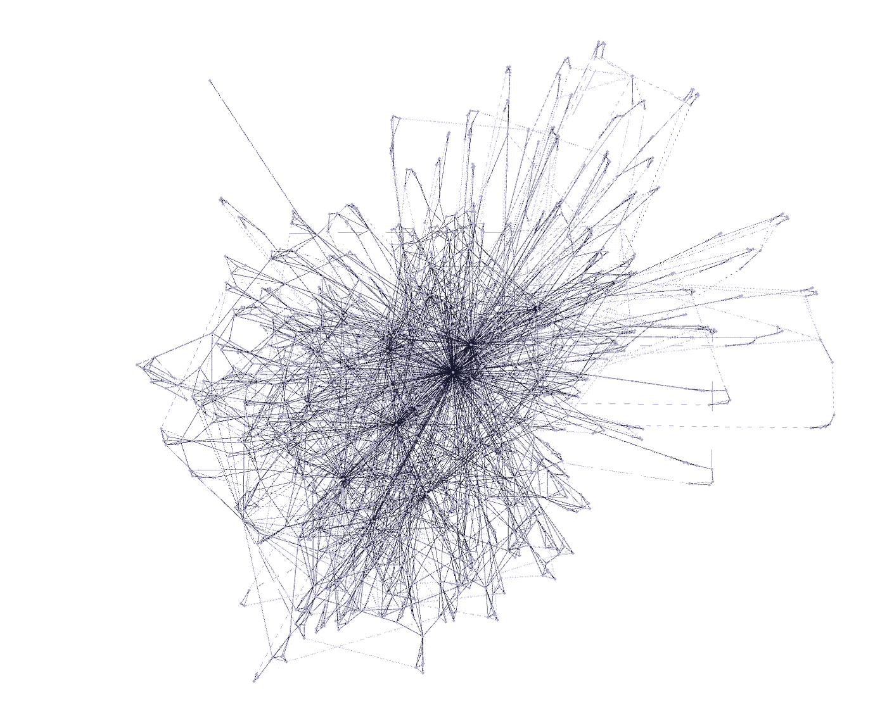
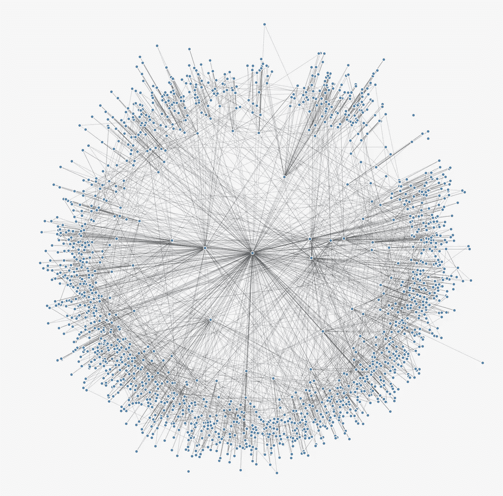
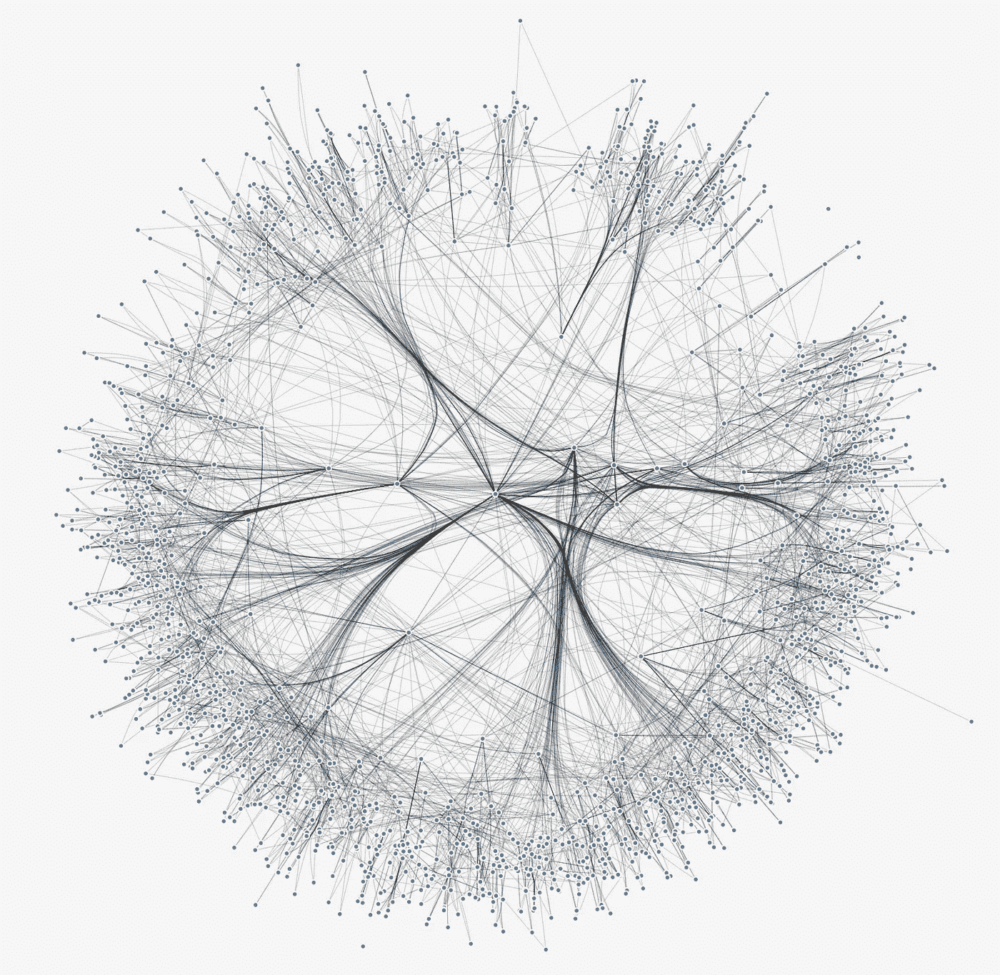

# 使用真实世界的复杂网络可视化墨卡托图布局/嵌入。

> 原文：<https://towardsdatascience.com/visualising-the-mercator-graph-layout-embeddings-using-a-real-world-complex-network-bf065c316b7a?source=collection_archive---------29----------------------->



A network of the [Master Chemical Mechanism](http://mcm.york.ac.uk)

制图领域长期以来一直使用投影将高维数据(即地球，扁球体)转换成平面表示。

在最近的一篇论文“ [*墨卡托:揭示复杂网络的忠实双曲线嵌入(2019)*](https://arxiv.org/abs/1904.10814https://arxiv.org/abs/1904.10814) *”中，*采用了将球形地球转换为圆柱形表示的相同数学方法，能够将恒定方位角映射为线性段，并应用它来产生无向和未加权网络内的节点嵌入。

## 我们的数据

我感兴趣的复杂网络是 2019 年北京空气质量活动中对流层(低层空气)化学的近显式表示。当使用传统的力定向或静电图形算法作图时，我们看到高度连接的物质形成了“毛团”。许多真实世界的图表就是这种情况。



Plotting the network using the Force Atlas algorithm.

## 应用墨卡托图布局

为了应用图表布局，我们使用[https://github.com/networkgeometry/mercator](https://github.com/networkgeometry/mercator)提供的代码。这读入我们网络的边列表，并返回我们计算嵌入的极坐标。在绘制这些图时，我们得到了下图。



Plotted output of the Mercator embedding.

## 将输出转换成 JSON 文件

因为我们的绘图将在 Javascript 中完成，所以我们将嵌入输出转换成 JSON 格式，可以由可视化软件读取。

```
'''
To plot run python plot.py <filename>
This reads <filename>.edges and <filename>.inf_coord
'''import sys,json
import pandas as pd
name = sys.argv[1]edge= pd.read_csv(name+'.edge',comment='#',header=None,sep='\s+',index_col= None)[[0,1]]
edge.columns = 'source target'.split()df = pd.read_csv(name+'.inf_coord',comment='#',header=None,sep='\s+',index_col=0)
df.columns = 'k theta r'.split()save = {}
save['nodes'] = df.T.to_dict()
save['edges'] = edge.T.to_dict()json.dump(save,open(name+'.json','w'))
```

## 使用 D3.js 绘图

如果你对 Javascript 或 D3 不熟悉，我推荐你看看[www.observablehq.com](http://observablehq.com)。这有许多关于如何制作图像和在图像中放置元素的例子。

对于那些能够分配点数的人，我们首先用`d3.json('../data.json', data => {...})`读入我们的数据，然后设置一个横跨半个页面的径向标尺:

```
size = Math.min(width,height)var r = d3.scaleLinear().domain(d3.extent(d3.values(data.nodes).map(d=>d.r))).range([0,size/2])
```

接下来，我们使用`sine`和`cosine`函数将极坐标从墨卡托输出转换成笛卡尔坐标。

```
node_data = {};
    d3.entries(data.nodes).forEach(d => {node_data[d.key] = {'x': r(d.value.r) * Math.cos(d.value.theta),
        'y':r(d.value.r) * Math.sin(d.value.theta)
      }});
```

最后，编写我们希望用来绘制节点的脚本

```
svg.selectAll(".node")
      .data(d3.values(data.nodes))
      .enter()
      .append("circle")
      .attr("r", 2)
      .attr('cx', d=> d.y)
      .attr('cy', d=> d.x)
      .style("fill", "steelblue")
      .style("opacity", 0.6)
      .attr('transform',`translate(${size/2},${size/2})`)
```

## 边缘捆绑

边捆绑是一种用于简化图中的边的技术。这里，边缘被模拟为柔性弹簧，如果满足一定的几何兼容性标准，它们会相互吸引。这通常用于减少可视化中链接的混乱。欲了解更多信息，请阅读[和](https://aviz.fr/wiki/uploads/Teaching2014/bundles_infovis.pdf)。

我们首先从[D3-forcegebundling . js](https://github.com/upphiminn/d3.ForceBundle/blob/master/d3-ForceEdgeBundling.js)下载相关的库文件，并将其放入当前目录。从这里，我们可以使用脚本标签将它导入到我们的程序中:

```
<script type="text/javascript" src="d3-ForceEdgeBundling.js"></script>
```

我们现在可以引入边缘捆绑功能:

```
var fbundling = d3
      .ForceEdgeBundling()
      .step_size(.2)
      .compatibility_threshold(.70)
      .nodes(node_data)
      .edges(data.edges);const results = fbundling();
```

然后，我们遍历每个返回的边，并将其添加到我们的图像中:

```
var d3line = d3
      .line()
      .x(function(d) {
        return d['x'] ;
      })
      .y(function(d) {
        return d['y'];
      })
      .curve(d3.curveLinear);results.forEach(function(edge_subpoint_data,i) { svg
        .append("path")
        .attr("d", d3line(edge_subpoint_data,i))
        .style("stroke", "#222")
        .style("fill", "none")
        .style("stroke-width",0.25)
        .style("stroke-opacity", .39)
        .attr('transform',`translate(${size/2},${size/2})`)});
```

## 调整兼容性阈值

最后，我们可以调整兼容性阈值来改变不同边相互吸引的程度。这将把上面的线性图转换成下列之一。


## 钦佩结果

这就是我们的数据集的墨卡托图嵌入的边捆绑表示。



> 注意:所有图像都受版权保护。如果在任何地方使用，请引用“丹尼尔·埃利斯 2019”。