# 从 Python 可视化开始— Matplotlib

> 原文：<https://towardsdatascience.com/visualization-in-python-matplotlib-c5c2aa2620a?source=collection_archive---------17----------------------->

对任何数据科学家或分析师来说，可视化数据都是一项重要的技能。这可以更好地了解数据的样子，允许检测模式或异常值的存在等。此外，它还是传达信息的一个有用工具，因为一个好的视觉效果可以很容易地告诉你很多文字不能告诉你的东西。古语有云，“一图胜千言”。这在数据科学/分析领域尤为重要。考虑到这一点，我写了这篇文章，通过 matplotlib 库向用户介绍 python 可视化的基础知识。


Photo by [Luke Chesser](https://unsplash.com/@lukechesser?utm_source=unsplash&utm_medium=referral&utm_content=creditCopyText) on [Unsplash](https://unsplash.com/s/photos/data-visualization?utm_source=unsplash&utm_medium=referral&utm_content=creditCopyText)

> 一幅画胜过千言万语

一如既往，第一步是导入所有需要的库。

```
import matplotlib.pyplot as plt
import numpy as np
from random import sample
%matplotlib inline
```

让我们为绘图练习生成一些数据，并绘制一个简单的线图。

```
x = np.linspace(0,10,20)#Generate 20 points between 0 and 10
y = x**2 # Create y as X squared
plt.plot(x,y) # Plot the above data
```

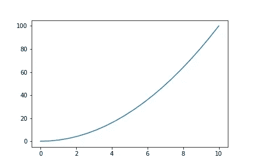

Figure 1

绘制上图只需要一行命令。虽然它很简单，但这并不意味着我们没有定制它的选项。

```
plt.plot(x, y, color='green', linestyle='--',
linewidth=2, alpha= 0.5)
```

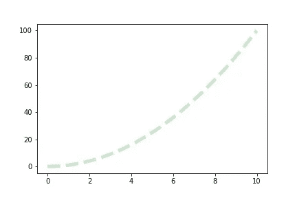

Figure 2

在绘图命令控件内传递的参数用于:

> *颜色*表示线条的颜色，甚至可以作为 RGB 十六进制代码给出
> 
> *线条样式*‘是你想要线条的样子，可以是’—‘或’—’对于虚线
> 
> *线宽*取整数输入表示线条的粗细
> 
> *alpha* 控制线条的透明度

有时一行可能还不够，您甚至需要指出哪些是确切的数据点，在这种情况下，您可以添加标记

```
plt.plot(x, y, marker = 'o', markerfacecolor = 'red', markersize = 5)
```

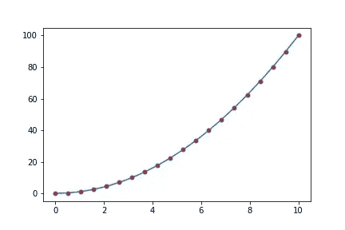

Fig 3

这块地有红色的圆形标记。这些标记可以通过修改它们的边界来进一步定制。

```
plt.plot(x, y, marker = 'o', markerfacecolor = 'red', markersize = 10, markeredgewidth = 2, markeredgecolor = 'black')
```

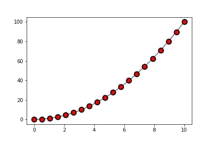

Fig 4

标记和以前一样，但现在它们有一个黑色的边界。

控制标记的参数有:

> *标记*'表示您希望标记是什么形状，可以是' o '、' * '或'+'
> 
> *标记面颜色*表示标记的颜色
> 
> *标记大小*类似于线宽控制标记的大小
> 
> *marked gewidth*和’*marked gecolor*分别用于指定边界的粗细和颜色。

让我们将以上所有内容结合到一个图中:

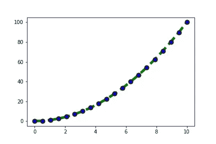

Figure 5

不是最漂亮的情节，但你得到的想法。

虽然这涵盖了绘制数据的基础，但在标题、轴范围、图例等方面还有很多工作要做。

最简单的方法是使用 Matplotlib 的面向对象方法。

# **面向对象的方法**

Matplotlib 有一个面向对象的 API，允许你创建图形和轴对象。然后可以有序地调用这些对象来执行诸如绘制数据或定制图形之类的功能。

```
fig, ax = plt.subplots()
```

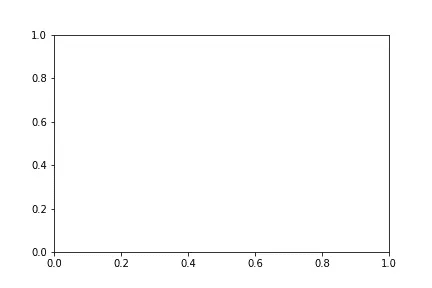

Fig 6

上述命令返回图形和轴对象，并创建一个空图。

然后，这可用于重新创建上面的图，带有图和轴标题以及图例。

```
fig, ax = plt.subplots()#Create the objects
ax.plot(x,y,label = 'X squared')#The data to be plotted and legend
ax.set_title('Plot 1')#Plot title
ax.set_xlabel('X')#X axis title
ax.set_ylabel('Y')#Y axis title
ax.set_xlim(0,10)#Range of X axis
ax.set_ylim(0,110)#Range of Y axis
plt.legend()#Command to display the legend
```

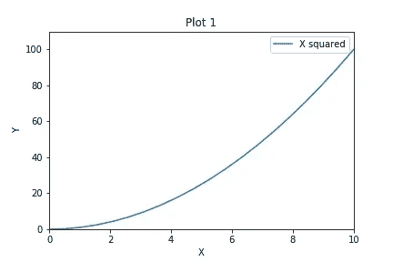

Fig 7

上面的图(图 7)具有轴和图标题、图例以及 X 轴和 Y 轴的不同范围。

**绘制多条线**

假设你想比较两组不同的数据，例如，在同一个图中绘制多条线。在这种情况下，您只需要再添加一个 plot 命令。

```
fig, ax = plt.subplots()#Create the objects
ax.plot(x,y,label = 'X squared')#The data to be plotted and legend
ax.plot(x,x**3,label = 'X cubed')#The data to be plotted and legend
ax.set_title('Plot 1')#Plot title
ax.set_xlabel('X')#X axis title
ax.set_ylabel('Y')#Y axis title
ax.set_xlim(0,10)#Range of X axis
ax.set_ylim(0,110)#Range of Y axis
plt.legend()#Command to display the legend
```

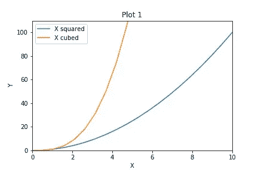

Fig 8

另一种比较方法是并排显示两个不同的图。

```
fig, ax = plt.subplots(1,2)#Create the objects
ax[0].plot(x,y,label = 'X squared')#The data to be plotted and legend
ax[1].plot(x,x**3,label = 'X cubed')#The data to be plotted and legend
ax[0].set_title('Plot 1')#Plot title
ax[1].set_title('Plot 2')#Plot title
ax[0].legend()#Command to display the legend for plot 1
ax[1].legend()#Command to display the legend for plot 2
plt.tight_layout()#To ensure no overlap
```

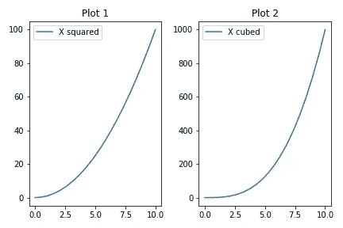

Fig 9

这是通过首先在“subplot()”函数中传递绘图的数量来完成的。上面的(1，2)意味着应该有 1 行地块和 2 列地块，实际上意味着 2 个地块。对每一个图重复这些函数，并且‘tight _ layout()’命令确保没有重叠。这里的一个小变化是显示图例的命令。plot.legend()函数只显示一个图的图例，要同时显示两个图，需要为每个图指定图例。

第三种比较方法是使用插图。在一个更大的情节里，有一个更小的情节。

```
fig, ax = plt.subplots(figsize = (12,4))
axins = ax.inset_axes([0.1,0.6,0.4,0.3] )#Left, Bottom, Width, Heightax.plot(x,y,label='X squared')# Main plot
axins.plot(x,1/x,label='X inverse')# Inset plotax.set_xlabel('X')#X axis title
ax.set_ylabel('Y')#Y axis title
axins.set_xlabel('X')#X axis title
axins.set_ylabel('Y')#Y axis titleax.set_title('Main Plot')#Main plot title
axins.set_title('Inset Plot')# Inset plot title
ax.legend()#Legend for main plot
axins.legend()#Legend for inset plot
```

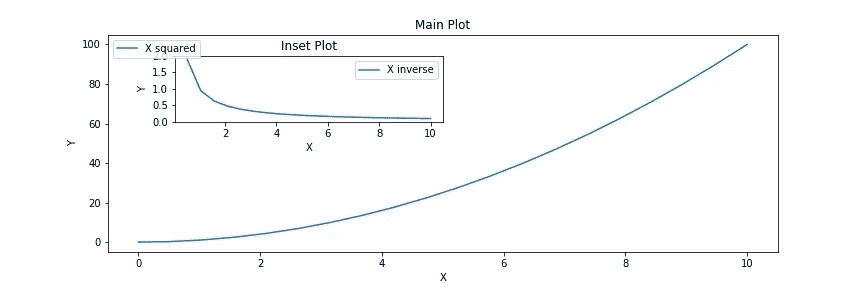

Fig 10

“subplots()”函数中的“figsize”参数允许更改图形的大小。“插入轴”功能用于创建插入图，同时指定位置和大小。前两个数字以百分比的形式指定绘图位置。在上面的例子中，前两个数字 0.1 和 0.6 指定绘图应该分别在 Y 轴和 X 轴的左侧 10%和上方 60%。最后两个数字 0.4 和 0.3 指定绘图应为主绘图宽度和高度的 40%和 30%。

您可能已经注意到主图的图例与插图重叠。虽然 matplotlib 会自动选择图例的最佳位置，但也可以使用“loc”参数手动移动。

```
fig, ax = plt.subplots(figsize = (12,4))
axins = ax.inset_axes([0.1,0.6,0.4,0.3] )#Left, Bottom, Width, Heightax.plot(x,y,label='X squared')
axins.plot(x,1/x,label='X inverse')ax.set_xlabel('X')#X axis title
ax.set_ylabel('Y')#Y axis title
axins.set_xlabel('X')#X axis title
axins.set_ylabel('Y')#Y axis titleax.set_title('Main Plot')
axins.set_title('Inset Plot')
ax.legend(loc = 4)
axins.legend()
```

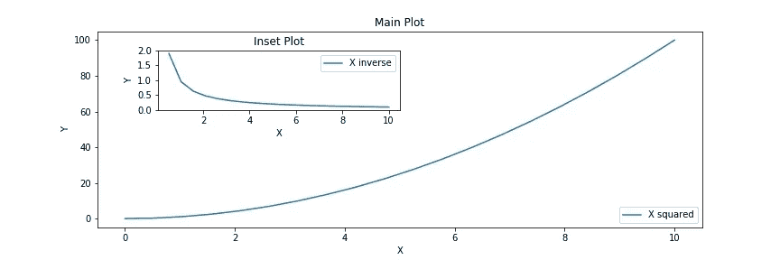

Fig 11

“loc”参数接受 0 到 10 之间的输入，对应于图中的位置。0 表示 Matplotlib 将选择可能的最佳位置，这是默认选项，所有其他整数对应于绘图中的一个位置。在这里，我将“4”传递给“loc”参数，这意味着图例位于右下角。

我将介绍的最后一个定制是改变剧情背景。

```
fig, ax = plt.subplots(figsize = (12,4))
axins = ax.inset_axes([0.1,0.6,0.4,0.3] )#Left, Bottom, Width, Heightax.plot(x,y,label='X squared')
axins.plot(x,1/x,label='X inverse')ax.set_xlabel('X')#X axis title
ax.set_ylabel('Y')#Y axis title
ax.grid(True)#Show grid
axins.set_xlabel('X')#X axis title
axins.set_ylabel('Y')#Y axis title
axins.grid(color='blue', alpha=0.3, linestyle='--', linewidth=2)#Grid modificationsax.set_title('Main Plot')
axins.set_title('Inset Plot')
ax.legend(loc = 4)
axins.legend()
```

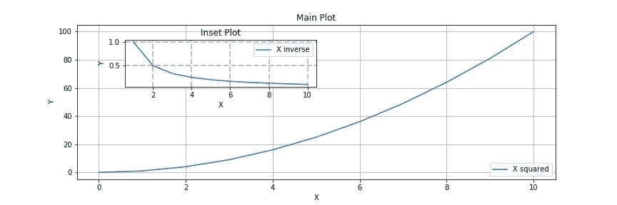

Fig 12

这里的主图有默认的网格，只需调用 grid()函数就可以创建它。

网格线也可以像地块线一样进行修改。这些修改可以在插图中看到。与主图相比，图中的网格线具有不同的颜色、样式和宽度。

# 特殊情节

除了简单的线图，matplotlib 还可以创建许多不同类型的图。

**散点图:**

```
fig, ax = plt.subplots()
ax.scatter(x,y,label='X squared')
ax.set_xlabel('X')#X axis title
ax.set_ylabel('Y')#Y axis title
ax.set_title('Plot')
ax.legend()
```

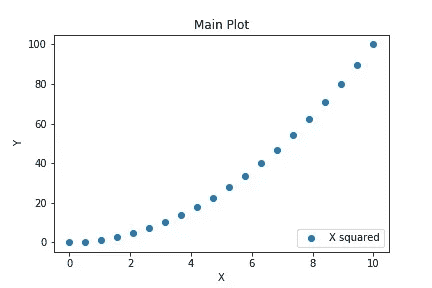

Fig 13

**直方图:**

```
x = sample(range(1,100), 60)
fig, ax = plt.subplots()
ax.hist(x)
ax.set_title('Histogram')
```

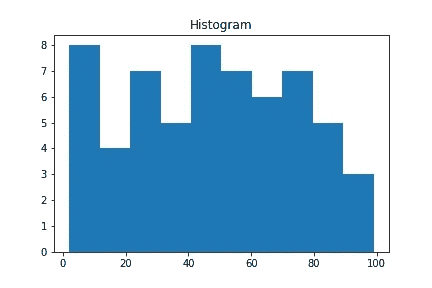

Fig 14

**柱状图**

```
x = np.linspace(0,10,11)
y = x**2
fig, ax = plt.subplots()
ax.bar(x, y)
ax.set_title('Bar plot')
```

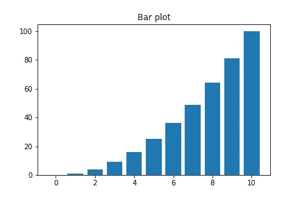

Fig 15

这涵盖了 matplotlib 可用的一些基本绘图和自定义。虽然 matplotlib 有高级绘图和统计绘图的选项，但最好使用 Seaborn 来实现。

Seaborn 是一个基于 matplotlib 构建的统计数据可视化库。我将在以后的文章中介绍它，在这里学到的基础知识也将有助于在 Seaborn 建造地块。

你也可以在 LinkedIn 上与我联系