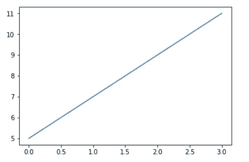
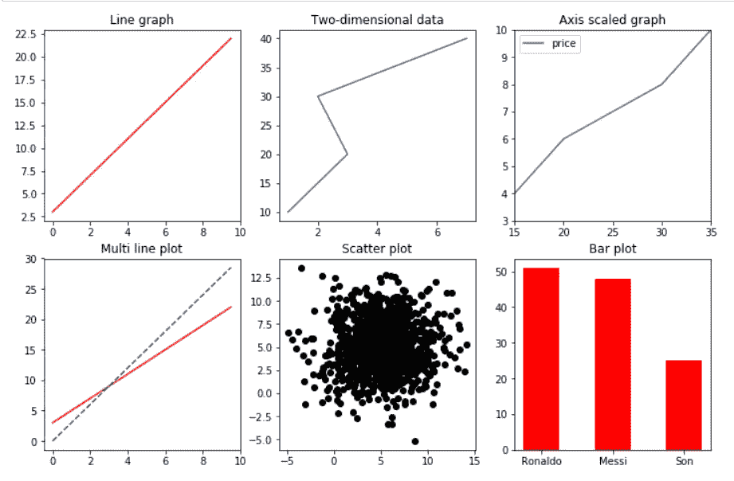
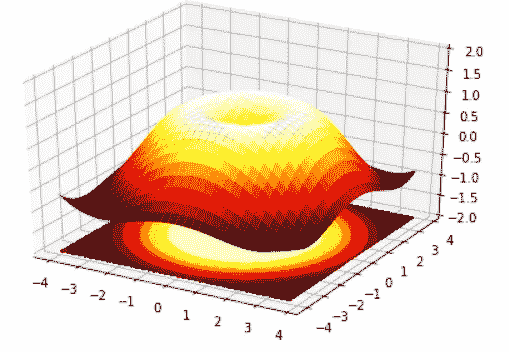
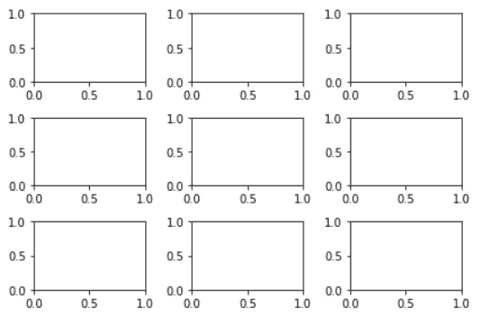
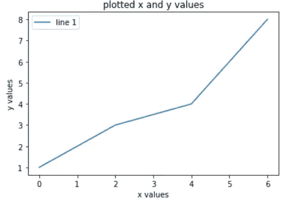
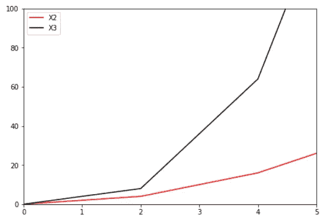

# 使用 Matplotlib 实现数据可视化

> 原文：<https://towardsdatascience.com/visualization-library-in-python-matplotlib-470a2e631d73?source=collection_archive---------35----------------------->

在我之前的故事中，我已经描述了 python 中两个最重要的 Python 库: [Numpy 和 Pandas](/top-python-libraries-numpy-pandas-8299b567d955?source=friends_link&sk=f79b2d2f0c26ad6cce3c6c868b3ddcdf) 。今天我将讲述 *Matplotlib，它是 python 中*最流行和最广泛使用的可视化库。不再耽搁，我们开始吧。

`[Matplotlib](https://www.numpy.org)`是一个 Python 2D 绘图库，它以多种硬拷贝格式和跨平台的交互环境生成出版物质量数字。这是一个流行的 python 绘图库，可以让您控制图形的各个方面。它被设计成有一种类似于*MATLAB*图形绘制的感觉。它可以提供大量的优势，如简单的绘图容易开始，支持自定义标签和文本，对图形中每个元素的良好控制，多种格式的高质量输出，非常可定制等。

要在您的系统中安装`Matplotlib`库并进一步了解 python 基础知识，您可以点击以下链接:

[](/machine-learning-and-data-analysis-inha-university-part-1-be288b619fb5) [## 机器学习和数据分析—仁荷大学(第一部分)

### 第 1 章:基本 python 和安装

towardsdatascience.com](/machine-learning-and-data-analysis-inha-university-part-1-be288b619fb5) 

现在要在程序中使用`Matplotlib`，我们需要导入模块。为了方便起见，一般将`Matplotlib`包定义为`plt`的缩写。但是您可以使用任何想要的东西来导入它。

```
**import matplotlib.pyplot as plt** # importing matplotlib**x=pd.Series([1,2,3,4])** # create pandas series **y=2*x+3** # define y **plt.plot(y)** # Functional plot **plt.show()** # show plot
```

输出:



当使用 Jupyter 笔记本作为模拟环境时，我们需要在命令行中提到`%matplotlib inline`，它允许查看 Jupyter 笔记本内部的情节。

```
**import matplotlib.pyplot as plt** # importing matplotlib
**import numpy as np  **              # importing numpy
**%matplotlib inline** # see plot in Jupyter notebook
**x=np.arange(0,10,0.5)** # define x **y1=2*x+3** # define y1 **y2=3*x** # define y2 **plt.figure(1,figsize=(12,12))** # create a figure object
**plt.subplot(331)** # divide the figure 3*3, 1st item
**plt.plot(x,y1,'r-')** # Functional plot
**plt.title('Line graph')** # define title of the plot
**plt.subplot(332)**                  # divide the figure 3*3, 2nd item
**plt.plot([1,3,2,7],[10,20,30,40])** # Functional plot
**plt.title('Two-dimensional data')** # define title of the plot
**plt.subplot(333)** # divide the figure 3*3, 3rd item
**plt.plot([10,20,30,40],[2,6,8,12], label='price')** # set label name
**plt.axis([15,35,3,10])** # axis scale - x:15-35, y:3-10
**plt.legend()** # show legends on plot
**plt.title('Axis scaled graph')** # define title of the plot
**plt.subplot(334)** # divide the figure 3*3, 4th item
**plt.plot(x,y1,'r-',x,y2,'b--')**    # y1 - red line, y2 - blue line
**plt.title('Multi line plot')** # define title of the plot
**plt.subplot(335)**                  # divide the figure 3*3, 5th item
**x=np.random.normal(5,3,1000)**      # normal distribution - mean: 5, variance: 3, number of data: 1000
**y=np.random.normal(5,3,1000)**      # normal distribution - mean: 5, variance: 3, number of data: 1000
**plt.scatter(x,y,c='k')** # Functional plot
**plt.title('Scatter plot')**
**plt.subplot(336)**                  # divide the figure 3*3, 6th item
**player=('Ronaldo','Messi','Son')**
**goal=[51,48,25]**
**plt.bar(player,goal,align='center',color='red',width=0.5)** 
**plt.title('Bar plot')** # define title of the plot **plt.show()** # show plot
```



**Matplotlib 中的 3D 绘图**

为了启动 matplotlib 中的 3D 绘图，我们需要从`mpl_toolkits.mplot3d`导入`Axes3D`。

```
**import numpy as np** # importing numpy **import matplotlib.pyplot as plt** # importing matplotlib **from mpl_toolkits.mplot3d import Axes3D** # importing Axes3D, 3d plot **fig = plt.figure()** # create a figure object **ax = Axes3D(fig)** # defining 3d figure ax **X = np.arange(-4, 4, 0.25)** # defining X **Y = np.arange(-4, 4, 0.25)** # defining Y **X, Y = np.meshgrid(X, Y)    
R = np.sqrt(X ** 2 + Y ** 2)
Z = np.sin(R)
ax.plot_surface(X, Y, Z, rstride=1, cstride=1, cmap=plt.cm.hot)**#plot **ax.contourf(X, Y, Z, zdir='z', offset=-2, cmap=plt.cm.hot)
ax.set_zlim(-2, 2)** # set z-axes limit **plt.show()**
```

**输出:**



当使用 matplotlib 执行子情节时，我们需要为每个情节保持紧凑的布局，以避免图形之间的混乱。我们可以保持*正方形图形尺寸*来避免这个问题，或者我们可以使用`tight_layout()`。

```
**fig,ax = plt.subplots(nrows=3,ncols=3)
plt.tight_layout()
plt.show()**
```

输出:



**在 Matplotlib 中保存图形**

Matplotlib 可以生成 *PNG、JPG、EPS、SVG、PGF、*和 *PDF* 格式的高质量图形，我们可以用 matplotlib 保存图形。我们还可以将图形保存在我们想要的文件位置。我们可以按照下面的例子，图保存在一个目标文件位置。

```
**import matplotlib.pyplot as plt** # importing matplotlib **%matplotlib inline** # see plot in Jupyter notebook **x = [0, 2, 4, 6]** # define x **y = [1, 3, 4, 8]** # define y **plt.plot(x,y)** # functional plot **plt.xlabel('x values')** # define x label **plt.ylabel('y values')** # define y label **plt.title('plotted x and y values')** # define title **plt.legend(['line 1'])** # define legend# save the figure **plt.savefig('plot.png', dpi=300, bbox_inches='tight')
fig.savefig('E:\Bioinformatics/foo.png')****plt.show()**
```

**输出:**



为了保存其他格式的数字，我们需要用它来代替`png`。如果你正在使用 jupyter 笔记本，并且想要将任何图形保存到另一个想要的文件夹中，那么你可以遵循命令`fig.savefig("E:\Bioinformatics/foo.png"`，其中 foo 是图形的名称。

**图例**

为了在 Matplotlib 中提到图例，我们可以使用`ax.legend()`,其中 ax 是图形的名称。我们还可以在`ax.plot()`中定义标签的名称。为了更好的理解，我们可以看下面的例子。

```
**import matplotlib.pyplot as plt** # importing matplotlib **%matplotlib inline** # see plot in Jupyter notebook **x = np.array([0, 2, 4, 6])** # define x **fig = plt.figure()** # create a figure object **ax = fig.add_axes([0,0,1,1])** # axes with (L,B,W,H) value **ax.plot(x, x**2, label = 'X2', color='red')** # functional plot **ax.plot(x, x**3, label = 'X3', color='black')** # functional plot **ax.set_xlim([0, 5])** # set x-axes limit **ax.set_ylim([0,100])** # set y-axes limit **ax.legend()** #show legend **plt.show()** # show plot
```

**输出:**



我们可以估计传说的位置。`ax.legend(loc=0)`为传说中的最佳位置，`loc=10`为中心位置。我们也可以定义位置。十六进制代码也可用于定义图中的`color`。我们还可以使用`set_xlim([0,5])`和`set_ylim([0,100])`设置 x 轴和 y 轴的极限，其中提到了极限的下限和上限。

非常感谢你的时间。你可以关注我的其他教程简介。我已经发表了**机器学习和数据分析**系列的 4 个部分，这是基于 Inha 大学提供的研究生课程。你可以按照**[**Part-1**](/machine-learning-and-data-analysis-inha-university-part-1-be288b619fb5?source=friends_link&sk=583ba29a0766ad36bc993cddc642b11f)**，**[**Part-2**](/machine-learning-and-data-analysis-inha-university-part-2-3fb599732021?source=friends_link&sk=80523165c66560e46f907da4c8af0d95)**，**[**Part-3**](/machine-learning-and-data-analysis-inha-university-part-3-51cb64c10901?source=friends_link&sk=a735571ab8f7bc418703fc3147eb6ecb)**，** [**Part-4**](/machine-learning-and-data-analysis-inha-university-part-4-67aa1aa9c95d?source=friends_link&sk=9f1a2d1a77df1e9019cfea70b9de7edb) 来获得用 Python 进行机器学习移动的起始思路。非常感谢任何建议或批评。**

**[**Part-1**](/machine-learning-and-data-analysis-inha-university-part-1-be288b619fb5?source=friends_link&sk=583ba29a0766ad36bc993cddc642b11f)**:**python 基础及安装
[**Part-2**](/machine-learning-and-data-analysis-inha-university-part-2-3fb599732021?source=friends_link&sk=80523165c66560e46f907da4c8af0d95)**:**第二章:Python 数据结构—数据类型
[**Part-3**](/machine-learning-and-data-analysis-inha-university-part-3-51cb64c10901?source=friends_link&sk=a735571ab8f7bc418703fc3147eb6ecb)**:**Python 中的控制语句(循环)
[**Part:4**](/machine-learning-and-data-analysis-inha-university-part-4-67aa1aa9c95d?source=friends_link&sk=9f1a2d1a77df1e9019cfea70b9de7edb)**:**Python 函数【T39**

# **参考链接:**

1.  ****Matplotlib cheet sheet:**[https://S3 . amazonaws . com/assets . data camp . com/blog _ assets/Python _ Matplotlib _ Cheat _ sheet . pdf](https://s3.amazonaws.com/assets.datacamp.com/blog_assets/Python_Matplotlib_Cheat_Sheet.pdf)**
2.  ****教程:**[https://www . tutorialspoint . com/matplotlib/matplotlib _ Tutorial . pdf](https://www.tutorialspoint.com/matplotlib/matplotlib_tutorial.pdf)**

**3.[http://courses . csail . MIT . edu/6.867/wiki/images/3/3f/Plot-python . pdf](http://courses.csail.mit.edu/6.867/wiki/images/3/3f/Plot-python.pdf)**

**4.[https://riptutorial.com/Download/matplotlib.pdf](https://riptutorial.com/Download/matplotlib.pdf)**