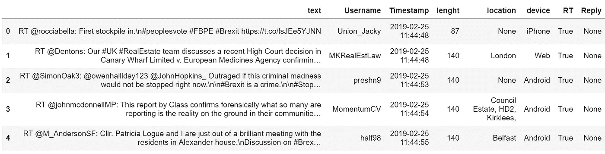
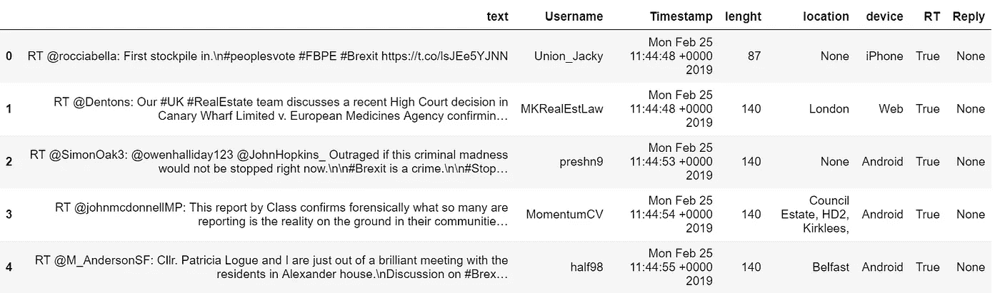
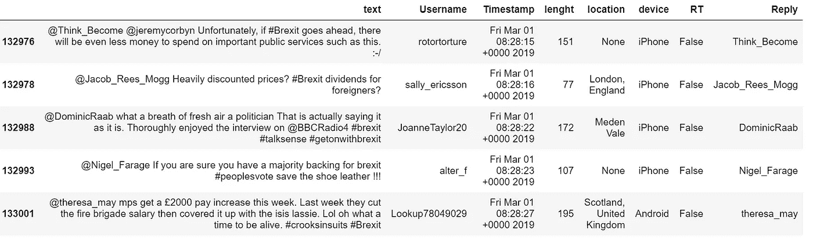
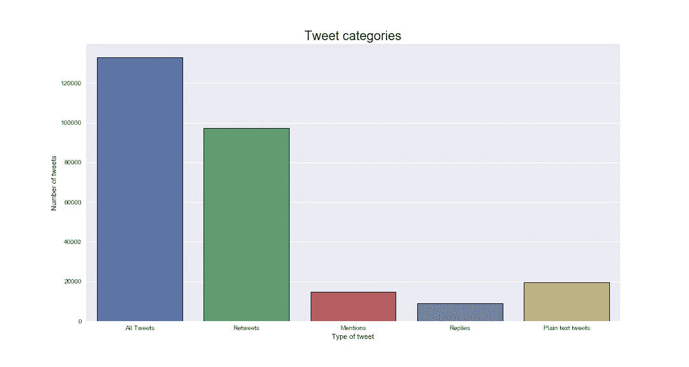
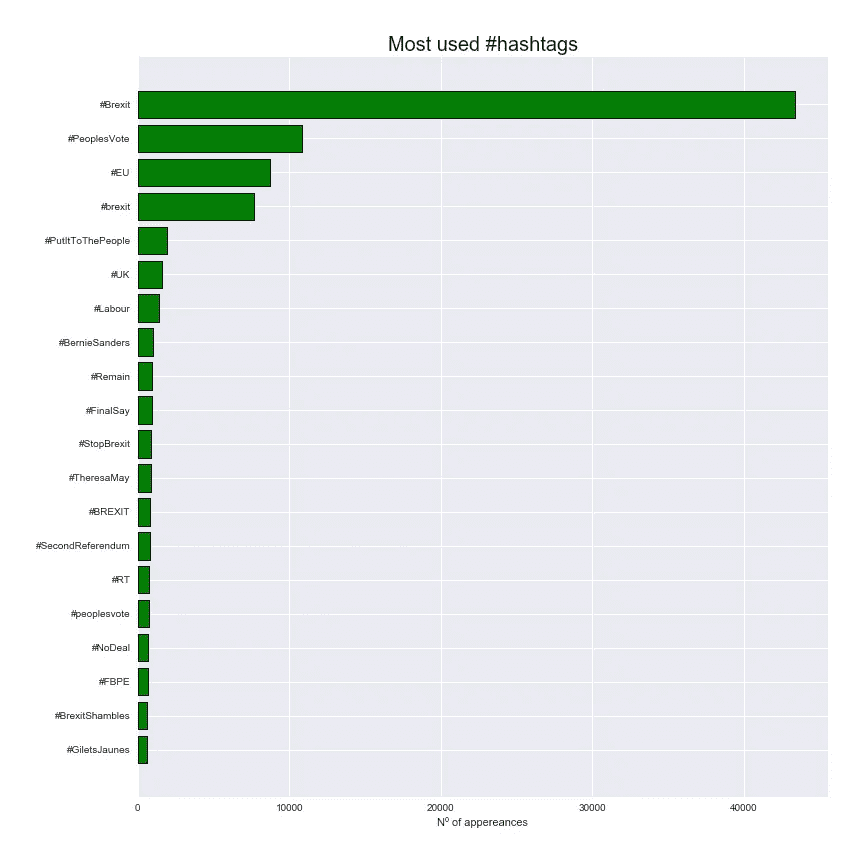
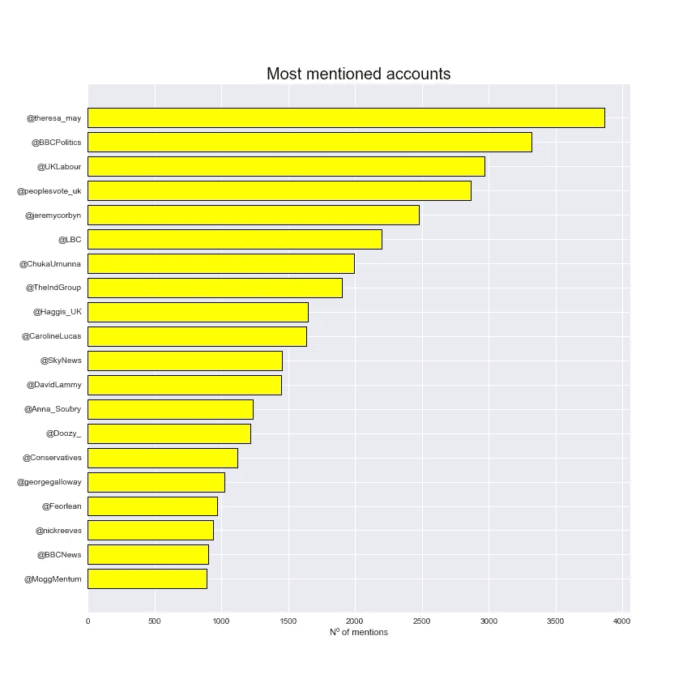

# 来自原始 Twitter 数据的信息可视化——第 1 部分

> 原文：<https://towardsdatascience.com/visualization-of-information-from-raw-twitter-data-part-1-99181ad19c?source=collection_archive---------4----------------------->

## 让我们探索一下我们可以从原始 Twitter 数据中轻松检索到什么样的信息！


大家好！在之前的文章中，我们探讨了如何使用 Python 和两个 Twitter APIs 高效地下载数据:下载实时生成的推文的[流 API](https://medium.com/@jaimezornoza/downloading-data-from-twitter-using-the-streaming-api-3ac6766ba96c) ，以及下载用户时间线和关注者等历史信息的 [REST API](/downloading-data-from-twitter-using-the-rest-api-24becf413875) 。

这篇文章是两篇文章中的第一篇，将致力于从使用 Twitter 流媒体 API 下载的数据中提取酷的可视化和信息，没有任何类型的机器学习或任何其他复杂的算法。

放松放松，让我们开始吧！

## 1.收集数据:

首先，我们需要收集我们想要可视化信息的数据。我们将使用流 API 来收集关于某个主题的 tweets，这可以通过使用 stream 对象的 filter 参数来查询特定的 hashtags 来完成。

如果您对此不熟悉，我建议您看看我关于如何使用流式 API 下载数据的帖子:

[](https://medium.com/@jaimezornoza/downloading-data-from-twitter-using-the-streaming-api-3ac6766ba96c) [## 使用流式 API 从 Twitter 下载数据

### 在这篇文章中，我们将介绍如何使用流媒体 API 来获取包含特定单词或标签的推文，以及如何…

medium.com](https://medium.com/@jaimezornoza/downloading-data-from-twitter-using-the-streaming-api-3ac6766ba96c) 

基本上，在 tweet 下载脚本中类似这样的行上面

```
l = StdOutListener()    auth = OAuthHandler(consumer_key, consumer_secret)    auth.set_access_token(access_token, access_token_secret)    stream = Stream(auth, l)    stream.filter(track=tracklist)
```

包括以下代码行:

```
tracklist = ['#HASHTAG1', '#HASHTAG2', '#HASHTAG3']
```

并将 *#HASHTAG1、#HASHTAG2 和#HASHTAG3* 的值更改为与您想要收集数据的主题相关的 HASHTAG。这个列表中可以包含或多或少的标签。

一旦脚本准备好了，就运行它，并以这种方式将其输出传输到一个. txt 文件，就像前面提到的帖子中描述的那样:

**Twitter _ downloader . py>Twitter _ data . txt**

让它运行一段时间，或者设置最大数量的推文，就这样，你的数据准备好被分析了！

## 2.准备数据:

现在我们的数据已经准备好了，让我们看看我们可以从中获得什么样的见解！为了这篇文章，我下载了大约两天的关于英国退出欧盟的推文，在 API 中查询带有英国退出欧盟相关标签的推文，如英国退出欧盟、英国退出欧盟、人民投票或游行。

打开 Jupyter 笔记本，开始编码:

首先，像往常一样，我们需要导入分析和可视化所需的库:

```
#Import all the needed libraries
import pandas as pd
import numpy as np
import matplotlib.pyplot as plt
import json
import seaborn as sns
import re
import collections
from wordcloud import WordCloud
```

然后，我们将读取我们收集的数据并对其进行处理。请记住，流式 API 的输出是每个 tweet 的 JSON 对象，其中有许多字段可以提供非常有用的信息。在下面的代码块中，我们从。txt 文件，它们存储在:

```
#Reading the raw data collected from the Twitter Streaming API using #Tweepy. 
tweets_data = []
tweets_data_path = 'Brexit_tweets_1.txt'
tweets_file = open(tweets_data_path, "r")
for line in tweets_file:
    try:
        tweet = json.loads(line)
        tweets_data.append(tweet)
    except:
        continue
```

为此，您必须将字符串 ***tweets_data_path*** 更改为存储数据的文档的名称。我还建议你在存储下载的 tweets 的同一个文件夹中创建笔记本，这样你在加载数据时就不必考虑任何相对路径。

下载数据时，可能会出现连接问题或其他类型的错误，所以在。在我们存储推文的地方，可能有一些行应该是*推文*，但却是错误代码。要消除它们，请在阅读完。txt 文件。

```
#Error codes from the Twitter API can be inside the .txt document, #take them off
tweets_data = [x for x in tweets_data if not isinstance(x, int)]
```

现在，让我们看看我们收集了多少条*推文*:

```
print("The total number of Tweets is:",len(tweets_data))
```

以我为例，我下载了**133030**推文。

好了，现在我们已经读了。txt 文件，并在笔记本中准备好 JSON 格式的 tweets，我们将实现一些函数来将这些 JSON 对象的一些参数映射到 Pandas dataframe 的列，从现在开始，我们将在那里存储 *tweets* 。

首先，我们将创建一个函数，允许我们查看选择的 *tweet* 是否是一个 *retweet* 。这是在中通过评估 JSON 对象是否包含名为'*retweed status '*的字段来完成的。如果*推文*是转发，这个函数返回一个布尔值 True，否则返回 False。

```
#Create a function to see if the tweet is a retweetdef is_RT(tweet):
    if 'retweeted_status' not in tweet:
        return False      
    else:
        return True
```

现在，我们将做一些类似的事情来评估下载的*推文*是否是对其他用户的*推文*的回复。同样，这是通过检查 JSON 对象中是否缺少某些字段来完成的。我们将使用“*in _ reply _ to _ screen _ name*”字段，这样除了查看推文是否是响应之外，我们还可以查看*推文*正在响应哪个用户。

```
#Create a function to see if the tweet is a reply to a tweet of #another user, if so return said user. def is_Reply_to(tweet):
    if 'in_reply_to_screen_name' not in tweet:
        return False      
    else:
        return tweet['in_reply_to_screen_name']
```

最后，tweet JSON 对象包括一个' *source* '字段，它是发布 *tweet* 的设备或应用程序的一种标识符。Twitter 没有提供如何将这个源字段映射到实际设备的详细指南，所以我手动列出了我认为源信息可以映射到的列表。

```
#Create function for taking the most used Tweet sources off the #source column def reckondevice(tweet):
    if 'iPhone' in tweet['source'] or ('iOS' in tweet['source']):
        return 'iPhone'
    elif 'Android' in tweet['source']:
        return 'Android'
    elif 'Mobile' in tweet['source'] or ('App' in tweet['source']):
        return 'Mobile device'
    elif 'Mac' in tweet['source']:
        return 'Mac'
    elif 'Windows' in tweet['source']:
        return 'Windows'
    elif 'Bot' in tweet['source']:
        return 'Bot'
    elif 'Web' in tweet['source']:
        return 'Web'
    elif 'Instagram' in tweet['source']:
        return 'Instagram'
    elif 'Blackberry' in tweet['source']:
        return 'Blackberry'
    elif 'iPad' in tweet['source']:
        return 'iPad'
    elif 'Foursquare' in tweet['source']:
        return 'Foursquare'
    else:
        return '-'
```

好吧！创建完所有这些函数后，我们就可以将我们的 tweets 传递到一个数据帧中，以便于处理。请注意，从 JSON 对象中提取的 dataframe 的一些列不需要定制函数，因为我们只是从 JSON 中获取这些列的原始数据。然而，数据框架的一些列确实需要一些进一步的解释。

dataframe 的' *text* '列要么用 JSON 对象的普通' *text* 字段填充，要么用' *extended_tweet'* 全文填充。这样做是因为有些 tweets 的文本长度在 140 到 280 个字符之间，对于它们来说，JSON 对象的' *text* '字段并不包含全部文本。

```
#Convert the Tweet JSON data to a pandas Dataframe, and take the #desired fields from the JSON. More could be added if needed.tweets = pd.DataFrame()
tweets['text'] = list(map(lambda tweet: tweet['text'] if 'extended_tweet' not in tweet else tweet['extended_tweet']['full_text'], tweets_data))
tweets['Username'] = list(map(lambda tweet: tweet['user']['screen_name'], tweets_data))
tweets['Timestamp'] = list(map(lambda tweet: tweet['created_at'], tweets_data))
tweets['lenght'] = list(map(lambda tweet: len(tweet['text']) if'extended_tweet' not in tweet else len(tweet['extended_tweet']['full_text']) , tweets_data))
tweets['location'] = list(map(lambda tweet: tweet['user']['location'], tweets_data))
tweets['device'] = list(map(reckondevice, tweets_data))
tweets['RT'] = list(map(is_RT, tweets_data))
tweets['Reply'] = list(map(is_Reply_to, tweets_data))
```

dataframe 的*‘Username*’列描述了发布推文的用户，所有其他列都是不言自明的。

如果我们看一下数据帧的头部，它应该是这样的:

```
tweets.head()
```



厉害！我们的数据框架已经建立，我们已经准备好探索数据了！

## 3.数据分析和可视化

首先，我们将探索可以使用流式 API 检索的不同 tweet 类别。让我们看看有多少条*转发*被*转发*例如:

```
#See the percentage of tweets from the initial set that are #retweets:RT_tweets = tweets[tweets['RT'] == True]
print(f"The percentage of retweets is {round(len(RT_tweets)/len(tweets)*100)}% of all the tweets")
```

对我来说**转发量占所有推文的 73%**。

这提供了一些关于 Twitter 如何工作的有趣信息:大多数用户不发布自己的内容，而是转发其他用户的内容。

如果我们获取 RT_tweets 数据帧并打印其头部，我们会得到如下结果:

```
RT_tweets.head()
```



从这个数据帧中，我们可以看到当*推文*被*转发*时，流媒体 API 返回的*推文*的文本结构。这种格式如下:

> " RT @InitialTweetingUser: Tweet 文本"

其中开头的 *RT* 表示该 *tweet* 为 *retweet* ， *@InitialtweetingUser* 为发布原始 tweet 的账户的 Twitter 用户名，Tweet Text 为所述初始 Tweet 的文本。

通过我们创建的回复栏，我们还可以看到从流媒体 API 下载的*条推文*中有多少条是对另一个用户的*条推文*的回复:

```
#See the percentage of tweets from the initial set that are replies #to tweets of another user:Reply_tweets = tweets[tweets['Reply'].apply(type) == str]
print(f"The percentage of retweets is {round(len(Reply_tweets)/len(tweets)*100)}% of all the tweets")
```

对我来说，回复的百分比大约是所有推文的 7%。

同样，如果我们看一下这个 *Reply_tweets* 数据帧，我们可以看到流式 API 返回的回复的结构:



正如我们所看到的，这些回复具有以下格式:

> " @InitialTweetingUser 回复文本"

其中 *@InitialTweetingUser* 是发布被回复推文的用户，*回复文本*是回复。

现在让我们看看有提及但没有被转发的推文的百分比。请注意，这些*推文*包括了之前的回复推文。

```
#See the percentage of tweets from the initial set that have #mentions and are not retweets:mention_tweets = tweets[~tweets['text'].str.contains("RT")  & tweets['text'].str.contains("@")]
print(f"The percentage of retweets is {round(len(mention_tweets)/len(tweets)*100)}% of all the tweets")
```

对我来说，这占了全部推文的 11%。带有提及但未回复或转发的推文只是在文本中间某处包含所述提及的推文，例如:

> “我们的工作假设仍然是英国将在 3 月 29 日离开”，英国退出欧盟的@EU_Commission spox 说。动词“remain”用得好。

最后，让我们看看有多少*推文*只是纯文本*推文*，没有提及或转发:

```
#See how many tweets inside are plain text tweets (No RT or mention)plain_text_tweets = tweets[~tweets['text'].str.contains("@")  & ~tweets['text'].str.contains("RT")]
print(f"The percentage of retweets is {round(len(plain_text_tweets)/len(tweets)*100)}% of all the tweets")
```

对我来说，这是所有*推文* 的 15%左右。

让我们将所有这些类别绘制成图表，以便更好地比较它们的比例:

```
#Now we will plot all the different categories. Note that the reply #tweets are inside the mention tweetslen_list = [ len(tweets), len(RT_tweets),len(mention_tweets), len(Reply_tweets), len(plain_text_tweets)]
item_list = ['All Tweets','Retweets', 'Mentions', 'Replies', 'Plain text tweets']
plt.figure(figsize=(15,8))
sns.set(style="darkgrid")
plt.title('Tweet categories', fontsize = 20)
plt.xlabel('Type of tweet')
plt.ylabel('Number of tweets')
sns.barplot(x = item_list, y = len_list,  edgecolor = 'black', linewidth=1)

plt.show()
```



厉害！让我们来看看哪些是最常用的标签和最常被提及的用户:

```
#To see the most used hashtags.hashtags = []
hashtag_pattern = re.compile(r"#[a-zA-Z]+")
hashtag_matches = list(tweets['text'].apply(hashtag_pattern.findall))hashtag_dict = {}
for match in hashtag_matches:
    for singlematch in match:
        if singlematch not in hashtag_dict.keys():
            hashtag_dict[singlematch] = 1
        else:
            hashtag_dict[singlematch] = hashtag_dict[singlematch]+1
```

为此，我们将使用正则表达式(包含在 **Python 库 re** 中)创建一个模式来检测文本中的标签。然后，我们将创建一个包含所有找到的 hashtag 的字典，其中键是 hashtag 文本，值是 hash tag 被发布的次数。

```
#Making a list of the most used hashtags and their valueshashtag_ordered_list =sorted(hashtag_dict.items(), key=lambda x:x[1])
hashtag_ordered_list = hashtag_ordered_list[::-1]#Separating the hashtags and their values into two different lists
hashtag_ordered_values = []
hashtag_ordered_keys = []
#Pick the 20 most used hashtags to plot
for item in hashtag_ordered_list[0:20]:
    hashtag_ordered_keys.append(item[0])
    hashtag_ordered_values.append(item[1])
```

之后，我们将根据值对字典进行排序，并将值和标签分成两个不同的列表。通过这样做，我们现在可以绘制出 20 个最常用的标签，以及它们出现的次数:

```
#Plotting a graph with the most used hashtagsfig, ax = plt.subplots(figsize = (12,12))
y_pos = np.arange(len(hashtag_ordered_keys))
ax.barh(y_pos ,list(hashtag_ordered_values)[::-1], align='center', color = 'green', edgecolor = 'black', linewidth=1)
ax.set_yticks(y_pos)
ax.set_yticklabels(list(hashtag_ordered_keys)[::-1])
ax.set_xlabel("Nº of appereances")
ax.set_title("Most used #hashtags", fontsize = 20)
plt.tight_layout(pad=3)
plt.show()
```



从该图中可以清楚地看到，**#英国退出欧盟**是使用最多的标签，这是非常明显的，因为它是用于下载英国退出欧盟话题推文的标签之一。可以用这些信息制作的另一个很好的可视化表示是使用 Wordcloud Python 库的 Wordcloud。单词云是不同单词的拼贴，这些单词具有相应的数值(如出现的次数)，并根据该值进行缩放:具有最高值的单词将是拼贴中最大的单词。

```
#Make a wordcloud plot of the most used hashtags, for this we need a #dictionary 
#where the keys are the words and the values are the number of #appearanceshashtag_ordered_dict = {}
for item in hashtag_ordered_list[0:20]:
    hashtag_ordered_dict[item[0]] = item[1]
wordcloud = WordCloud(width=1000, height=1000, random_state=21, max_font_size=200, background_color = 'white').generate_from_frequencies(hashtag_ordered_dict)
plt.figure(figsize=(15, 10))
plt.imshow(wordcloud, interpolation="bilinear")
plt.axis('off')

plt.show()
```


Wordcloud representation of the most used hashtags

看起来很酷吧？现在让我们对提及做同样的事情。

```
#Now we will do the same with the mentions: mentions = []
mention_pattern = re.compile(r"@[a-zA-Z_]+")
mention_matches = list(tweets['text'].apply(mention_pattern.findall))mentions_dict = {}
for match in mention_matches:
    for singlematch in match:
        if singlematch not in mentions_dict.keys():
            mentions_dict[singlematch] = 1
        else:
            mentions_dict[singlematch] = mentions_dict[singlematch]+1
```

同样，我们使用正则表达式来构建一个提及的模式，并创建一个字典，其中的键是被提及的用户，值是他们被提及的次数。考虑到这种提及模式也将从转发和回复中获取提及，因此该字典还将包括未被明确提及的用户，以及其帖子已被转发或回复的用户。

```
#Create an ordered list of tuples with the most mentioned users and #the number of times they have been mentionedmentions_ordered_list =sorted(mentions_dict.items(), key=lambda x:x[1])
mentions_ordered_list = mentions_ordered_list[::-1]#Pick the 20 top mentioned users to plot and separate the previous #list into two list: one with the users and one with the valuesmentions_ordered_values = []
mentions_ordered_keys = []
for item in mentions_ordered_list[0:20]:
    mentions_ordered_keys.append(item[0])
    mentions_ordered_values.append(item[1])
```

现在，如果我们画出这些结果:

```
fig, ax = plt.subplots(figsize = (12,12))
y_pos = np.arange(len(mentions_ordered_values))
ax.barh(y_pos ,list(mentions_ordered_values)[::-1], align='center', color = 'yellow', edgecolor = 'black', linewidth=1)
ax.set_yticks(y_pos )
ax.set_yticklabels(list(mentions_ordered_keys)[::-1])
ax.set_xlabel("Nº of mentions")
ax.set_title("Most mentioned accounts", fontsize = 20)

plt.show()
```



由此可以看出谁是被提及最多的账号:@theresa_may，Theresa May 的官方账号。我们还可以在这张图表中看到其他政治人物，如@jeremycorbyn(杰里米·科尔宾)或@Anna_Soubry(安娜·苏布里)，属于政党的账户(@英国工党，@保守党)，新闻来源(@BBCNews，@BBCPolitics，@SkyNews)，以及不同的记者(@georgegalloway)

这种见解可能非常有用，在未来的帖子中，我们将探索如何使用不同的 Twitter 交互来创建网络，并查看这些最常提到的用户在这些网络中的角色。

至于标签，让我们也做一个词云表示:

```
#Make a wordcloud representation for the most mentioned accounts toomentions_ordered_dict = {}
for item in mentions_ordered_list[0:20]:
    mentions_ordered_dict[item[0]] = item[1]
wordcloud = WordCloud(width=1000, height=1000, random_state=21, max_font_size=200, background_color = 'white').generate_from_frequencies(mentions_ordered_dict)
plt.figure(figsize=(15, 10))
plt.imshow(wordcloud, interpolation="bilinear")
plt.axis('off')

plt.show()
```


Worcloud representation of the most mentioned users

# 结论

我们已经探索了一些有趣的可视化，可以从原始 Twitter 数据中获得，而无需任何复杂的算法，并且还研究了 Twitter 的流媒体 API 的响应格式。

在下一篇文章中，我们将继续一些其他很酷的可视化技术:查看哪些用户发布了最多的推文，他们是机器人的可能性，我们还将创建推文发布的时间序列，检查产生*推文*的设备，并获得一些进一步的见解。

更多牛逼的自然语言处理和机器学习资源，请查看本博客: [**如何学习机器学习**](https://howtolearnmachinelearning.com/books/machine-learning-books/) **。**

感谢您的阅读，祝您愉快，再见！