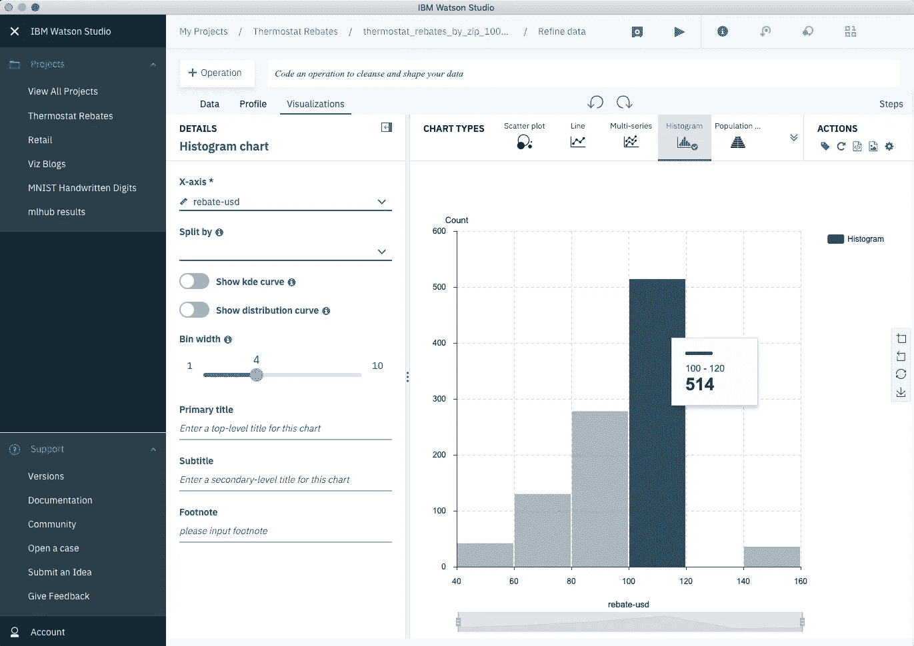
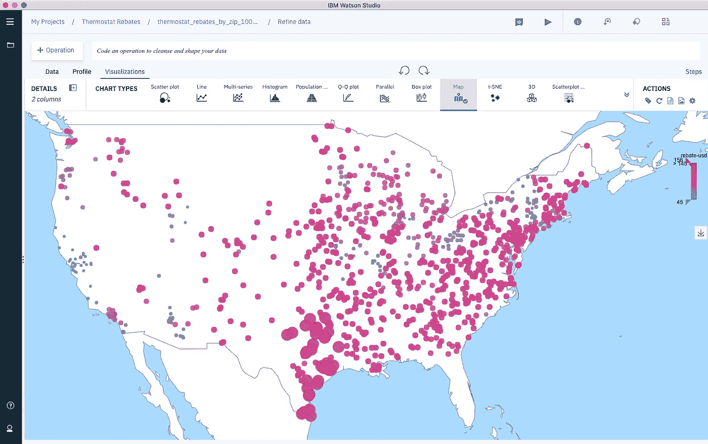
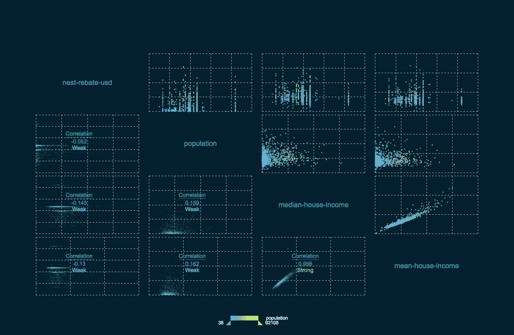
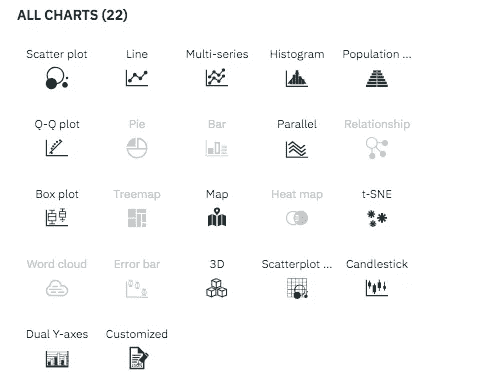
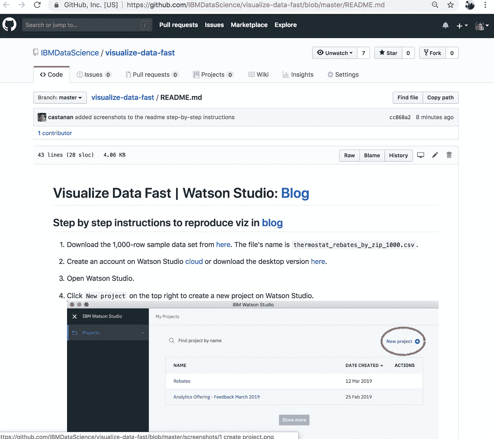

# 可视化恒温器折扣数据

> 原文：<https://towardsdatascience.com/visualize-data-fast-watson-studio-ae1ec63e9b8f?source=collection_archive---------27----------------------->

## github [repo](https://github.com/IBMDataScience/visualize-data-fast/blob/master/README.md) 上的逐步说明。

正如一些读者所知，通过提供设备折扣，智能恒温器对美国消费者更具吸引力。你可能不知道的是，恒温器的折扣根据邮政编码的不同而不同。这篇博客调查了美国哪些地区的回扣较高或较低，并直观地展示了结果。对于这个分析，我使用了 [IBM 的 Watson Studio](https://www.ibm.com/cloud/watson-studio) ，它使得与数据的可视化交互变得简单而快速。

## 数据分布

让我们从数据分布开始，这将为我们提供所有可能值的概述，以及它们出现的频率。用视觉术语来说，这意味着绘制恒温器折扣的直方图。为简单起见，我们可以使用从更大的数据集中提取的 1k 行的统一样本。

Watson Studio 中的数据提炼工具可以让您轻松地绘制柱状图，以及许多其他一次可能涉及多列的图表(散点图、时间序列等)。

Distribution of Thermostat Rebates

请注意，超过一半的恒温器折扣在 100 美元到 120 美元之间。我注意到只有少数邮政编码有超过 140 美元或低于 60 美元的折扣，这激起了我的兴趣。我决定在一张地图上标出获得最低和最高折扣的地区。幸运的是，数据已经包含了经度和纬度信息，所以一旦我指定了从最低(蓝色)到最高(红色)的色谱，我就可以将数据放在州地图上:

我注意到北加州的回扣比美国其他大多数地区都低。我还注意到，大多数最大的回扣都在得克萨斯州。老实说，我还是不确定为什么会这样。如果你有猜测，一定要让我知道。

Watson Studio 中的数据提炼工具有地图，您可以使用它来放置经度/纬度数据，它让您可以使用数据集的任何列轻松配置色谱。

## 与人口统计特征的相关性

为了更深入地了解恒温器折扣分布，我做了一个按邮政编码连接，以引入额外的人口统计特征，如家庭收入中值和平均值，以及人口规模。这些邮政编码的人口统计特征似乎都与恒温器折扣没有线性关系。唯一强相关的是家庭收入的平均值和中值，这并不奇怪。

Correlation Plots Created with Data Refinery.

## 更多图表可供探索

除了直方图和地图，Watson Studio 中的数据提炼工具还提供了广泛的可视化选择，包括用于可视化高维数据的 t-SNE:

Chart Options in Data Refinery (part of Watson Studio)

## github [repo](https://github.com/IBMDataScience/visualize-data-fast/blob/master/README.md) 上的逐步说明。

特别感谢[史蒂夫·摩尔](https://medium.com/u/c81f0352abb7?source=post_page-----ae1ec63e9b8f--------------------------------)对这篇文章的大力反馈。

***推特:***[@ castan](https://twitter.com/castanan) ***LinkedIn:***@[jorgecasta](https://www.linkedin.com/in/jorgecasta/)