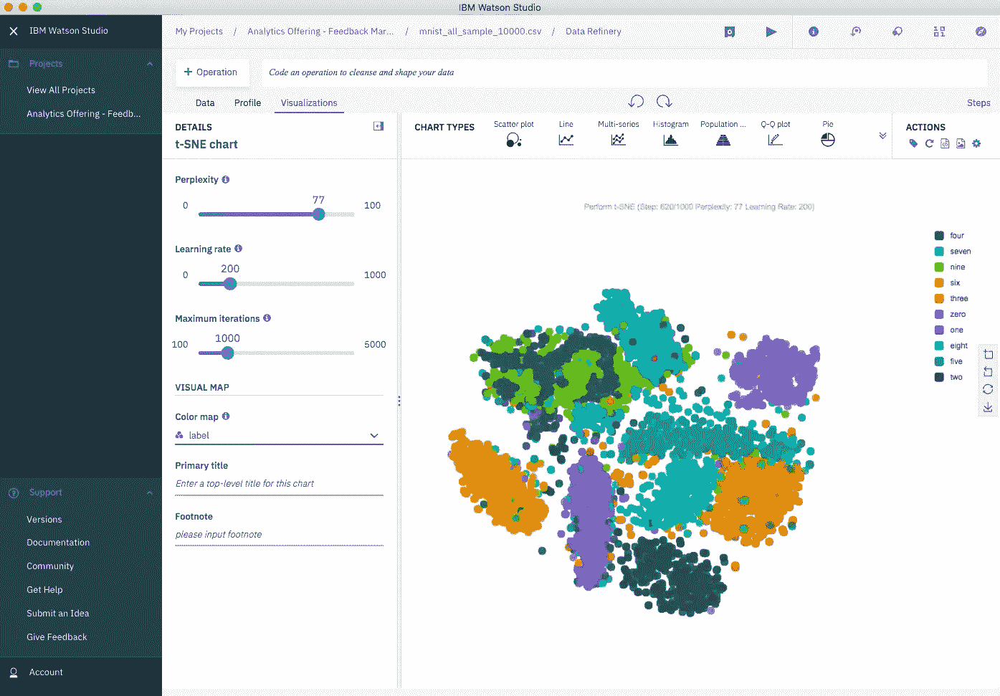
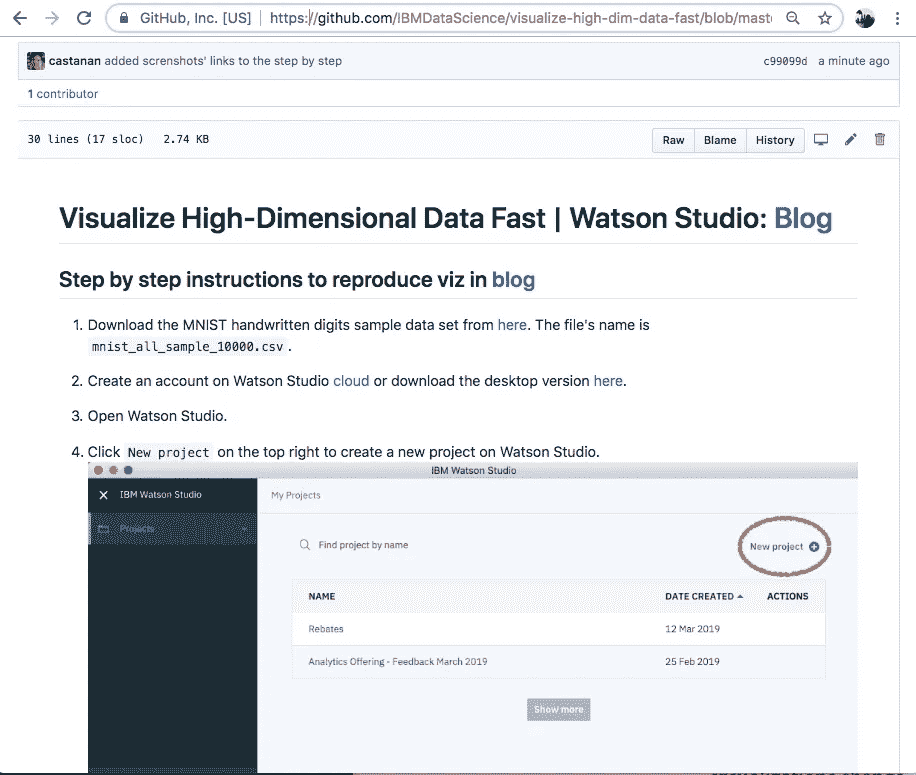

# 基于 t-SNE 的可视化降维

> 原文：<https://towardsdatascience.com/visualize-high-dimensional-data-fast-watson-studio-ebad7e7e1b6a?source=collection_archive---------13----------------------->

## github [repo](https://github.com/IBMDataScience/visualize-high-dim-data-fast/blob/master/README.md) 上的分步说明

t-SNE on MNIST Database of Handwritten Digits

不需要编码，Python 或 R。只需插入您的高维数据，并使用[沃森工作室](https://www.ibm.com/cloud/watson-studio)中的数据提炼工具将其可视化。不要误解我，我喜欢用 Python 和 R 编写代码，但是当涉及到快速可视化数据时，我只是使用数据精炼。

重要的事情先来。在这篇博客中，我提到的高维数据是指数据集的特征数量，而不一定是指观察值的数量。图像由大量像素组成，这些像素可以被投影到二维空间。但是为什么要投影到二维呢？将代表相同对象的图像组合在一起可以帮助我们对图像进行分类。为了直观地验证我们的分组技术有多好，我们需要首先投射到二维或三维空间。我将介绍一个例子，其中为了可视化的目的，手写数字的图像从 784 维投影到 2 维。

## 方法

t-随机近邻嵌入(t-SNE)技术是由 L.J.P. van der Maaten 和 G.E. Hinton 于 2008 年提出的一种非线性降维方法。人们通常使用 t-SNE 进行数据可视化，但你也可以将其用于许多其他机器学习任务，例如减少特征空间和聚类，等等。(你可以在这里了解更多关于 t-SNE 方法及其在几种编程语言中的实现[。)](https://lvdmaaten.github.io/tsne/)

与最流行的降维技术主成分分析(PCA)相比，t-SNE 更擅长捕捉数据中的非线性关系。PCA 基于寻找最大化数据线性变化的新向量来降低特征空间的维度。因此，当数据的线性相关性很强时，PCA 可以在不丢失信息的情况下显著降低数据的维数。(你不需要总是在 PCA 或 t-SNE 之间选择，因为你可以将它们结合起来，并获得每种技术的好处。参见示例[这里的](https://medium.com/@luckylwk/visualising-high-dimensional-datasets-using-pca-and-t-sne-in-python-8ef87e7915b)，其中 PCA 用于减少特征空间，t-SNE 用于可视化 PCA 减少的空间。)

t-SNE 最重要的参数:

1.  **困惑**-根据经验猜测每个点的近邻数量。帮助平衡数据的本地和全局方面。
2.  **学习率** —通过指定每次迭代改变多少权重，该值影响学习的速度。
3.  **最大迭代次数** —执行迭代次数的上限。

## 数据

在这个例子中，我使用了 MNIST 手写数字数据库，你可以在这里下载。该数据库包含数千幅从 0 到 9 的数字图像，研究人员用这些图像来测试他们的聚类和分类算法。完整的数据集由 60，000 张用于训练的图像和 10，000 张用于测试的图像组成，但是为了简化这个示例，我从数据库中每位数抽取了大约 1，000 张图像，因此总共有 10，000 张图像。样本数据集的每一行都是原始图像的矢量化版本(大小为 28 x 28 = 784)以及每个图像的标签(零、一、二、三、…、九)。因此，数据集的维数是 10，000(图像)乘 785 (784 像素加一个标签)。

## 我在探索 SNE 霸王龙时学到了什么

在写这篇博客之前，我从来没有机会了解 SNE 霸王龙。每当我需要降低特征空间的维数时，我都会使用 PCA。我知道主成分分析对于降低列线性相关的数据集的维数非常有用。现在我知道，当你的列的关系是非线性的时候，t-SNE 是一个可行的选择。

## 这是几百次迭代后 t-SNE 分组的样子…

t-SNE on MNIST Data Set (at iterations 620)

## github [回购](https://github.com/IBMDataScience/visualize-high-dim-data-fast/blob/master/README.md)上的分步说明。

在这里找到更多关于 Watson Studio 桌面[的信息，或者在这里](https://medium.com/ibm-watson/ibm-watson-studio-is-coming-to-your-desktop-4160c15bb8d8)找到数据精炼[的信息。](https://www.ibm.com/cloud/data-refinery)

特别感谢[史蒂夫·摩尔](https://medium.com/u/c81f0352abb7?source=post_page-----ebad7e7e1b6a--------------------------------)对这篇文章的巨大反馈。

***Twitter:***[@ castan](https://twitter.com/castanan) ***LinkedIn:***@[jorgecasta](https://www.linkedin.com/in/jorgecasta/)