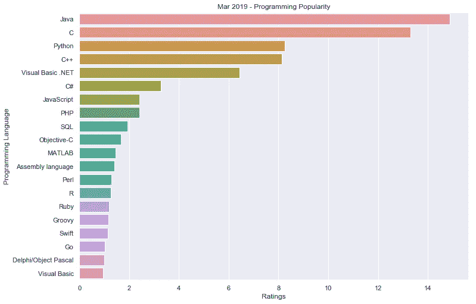
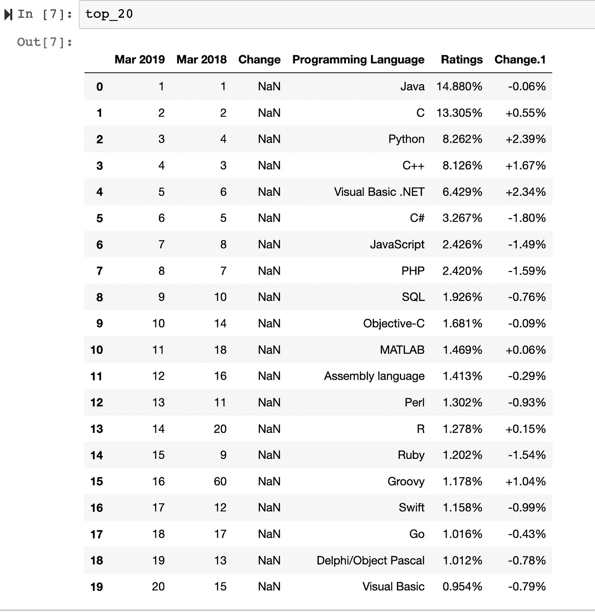
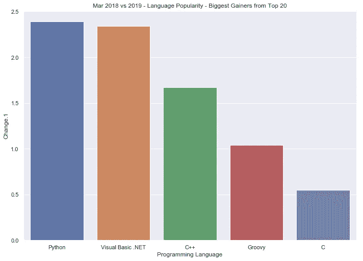
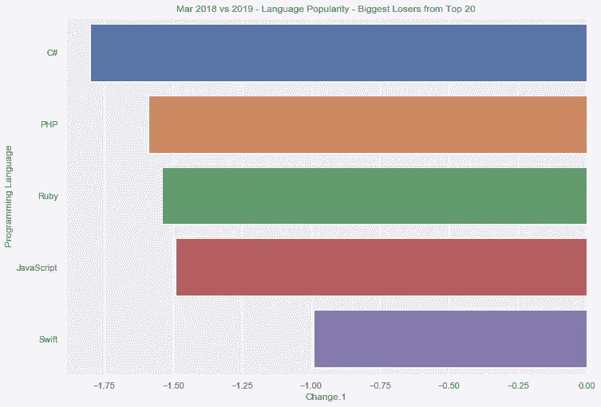
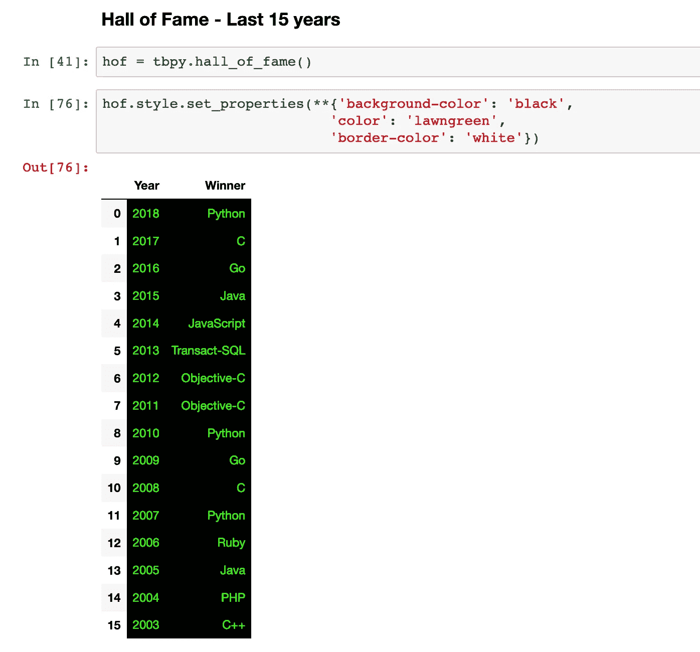

# 使用 tiobeindexpy 可视化编程语言流行度

> 原文：<https://towardsdatascience.com/visualize-programming-language-popularity-using-tiobeindexpy-f82c5a96400d?source=collection_archive---------7----------------------->



尽管我们中的大多数人会用一种主要的编程语言进行编码，但是关注编程世界中发生的变化总是有好处的。TIOBE 是一个已经为编程语言创建了一个索引的组织，并且每个月跟踪这个索引的变化。

在本帖中，我们将使用`tiobeindexpy` Python 包来可视化编程语言的流行程度，这样它就可以作为一个小追踪器，供我们每个月重温。

## 关于套餐:

`tiobeindexpy`是一个 Python 包(PyPi 上有)，给我们提供了官方网站的 TIOBE 索引摘录。

## 安装:

使用`pip`可以安装`tiobeindexpy`的稳定版本。

`pip install tiobeindexpy`

如果你有 Python3，请确保使用`pip3 install tiobeindexpy`以避免任何冲突。

# 目标

在练习结束时，我们要努力完成三件事。

*   *最流行的 20 种编程语言是什么(截至 2019 年 2 月)*
*   *谁是前 5 名收益者(2018 年 2 月与 2019 年 2 月-当前前 20 名中的收益者)*
*   *谁是前 5 名输家(2018 年 2 月与 2019 年 2 月-当前前 20 名中的输家)*

## 加载库

作为典型的体面的编码风格，让我们从加载所需的库开始。

```
from tiobeindexpy import tiobeindexpy as tbpy
import seaborn as sns
```

需要注意的是，一旦库被加载，`tiobeindexpy`从 TIOBE 索引网站下载所需的数据。因此，所有其他后续函数将只获取该数据，而不会进行实际的服务器调用。

## 地块大小和主题

我也更喜欢在开始时设置地块大小及其主题——如果有人想在不深入研究代码的情况下使用这些参数，这会更容易。

```
sns.set(style = "whitegrid")
sns.set(rc={'figure.figsize':(11.7,8.27)})
```

## 前 20 名

首先，我们将使用来自`tiobeindexpy`的函数`top_20()`来提取基于 TIOBE 指数评级的前 20 种编程语言。

```
top_20 = tbpy.top_20()
```

在我们开始可视化数据之前，让我们通过打印来验证数据是否真的可用。

```
top_20
```



从上面的输出可以看出，很明显 Python 对象`top_20`是一个熊猫数据帧，它实际上是 2019 年 3 月的数据帧。您可能还会注意到 Ratings and Change.1 列中数值旁边的`%`符号——这也意味着这些列在提取的数据帧中必须是字符串，因此需要进行前置处理。

## 数据预处理

在这一步，我们将`strip`(移除)上述两列中的`%`符号，并将它们类型转换为浮点字段。

```
top_20['Ratings'] = top_20.loc[:,'Ratings'].apply(lambda x: float(x.strip("%")))top_20['Change.1'] = top_20.loc[:,'Change.1'].apply(lambda x: float(x.strip("%")))
```

## 开始数据可视化

我们已经对数据进行了预处理，现在可以开始可视化编程语言排名了。

**前 20 名编程语言**

我们可以从一个非常简单的排名前 20 位语言的条形图开始(基于它们的 TIOBE 指数评级)

```
sns.barplot('Ratings', 'Programming Language', data = top_20).set_title('Mar 2019 - Programming Popularity')
```


**Java、C、Python** —是基于 TIOBE 指数的前 3 名语言。Java 和 Python 之间的评级差异似乎很大，这让我想了解一下 TIOBE Index 方法论的清晰性。

## 在 2018 年到 2019 年之间

世界上发生了很多变化，特别是在 2018 年和 2019 年之间的技术领域，所以让我们试着看看一年内的变化是什么样的:

**涨幅前五名**

```
sns.barplot('Programming Language', 'Change.1', 
            data = top_20.sort_values("Change.1",ascending = False)[0:5]).set_title('Mar 2018 vs 2019 - Language Popularity - Biggest Gainers from Top 20')
```

【VB.NET】**和**c++**`Python`跃居首位。**

****

****前 5 名输家****

```
sns.barplot('Change.1', 'Programming Language', 
            data = top_20.sort_values("Change.1",ascending = True)[0:5]).set_title('Mar 2018 vs 2019 - Language Popularity - Biggest Losers from Top 20')
```

****C#、PHP、Ruby**——在变化百分比(负值)方面一直是排行榜冠军。**

****

**到目前为止，这给了我们一个很好的月度图片，以及编程语言的流行程度是如何变化的。**

## **名人堂——过去 15 年**

**让我们抽象一下，看看每年名人堂的获奖者是什么编程语言。**

**我们可以简单地使用`tiobeindexpy`的函数`hall_of_fame()`来提取名人堂数据。**

```
hof = tbpy.hall_of_fame()
```

**上面输出的一个稍微格式化的表。**

```
hof.style.set_properties(**{'background-color': 'black',
                           'color': 'lawngreen',
                           'border-color': 'white'})
```

****

**这些数据一次又一次地显示出，当一种新的趋势出现时，Python 如何选择，并且以这种方式，它如何成为名人堂中出现次数最多的条目之一。**

# **摘要**

**在这篇文章中，我们看到了如何使用 python 包`tiobeindexpy`和`seaborn`来可视化基于 TIOBE 索引的编程语言流行度(排名)。**

## **参考**

*   **这里使用的全部代码可以从 Github 上的 [Jupyter 笔记本中获得](https://github.com/amrrs/visualize_tiobeindexpy)**
*   **[TIOBE 指数办公室网站](https://www.tiobe.com/tiobe-index/)**
*   **[tiobeindexpy github 回购](https://github.com/amrrs/tiobeindexpy)**