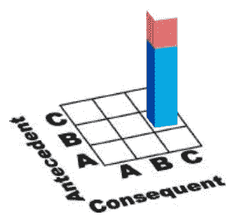
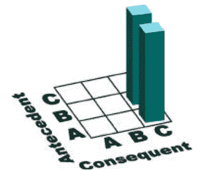
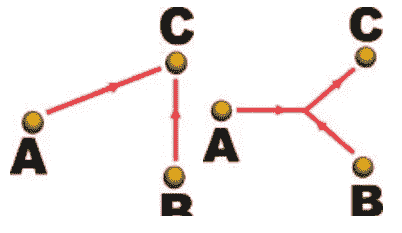

# 文本挖掘中关联规则的可视化

> 原文：<https://towardsdatascience.com/visualizing-association-rules-for-text-mining-6cb80dc71171?source=collection_archive---------16----------------------->

## 一种新颖的关联规则可视化系统

关联是一种强大的数据分析技术，经常出现在数据挖掘文献中。关联规则是 X→Y 形式的蕴涵，其中 X 是一组前提项，Y 是结果项。超市数据库的一个示例关联规则是，购买尿布和婴儿爽身粉的人中有 80%也购买婴儿油。

关联规则的分析有多种用途，包括商品库存、保险欺诈调查和气候预测。多年来，科学家和工程师开发了许多可视化技术来支持关联规则的分析。

然而，许多可视化在处理大量的规则或具有多个前提的规则时表现不佳。这一限制给需要了解大型数据库关联信息的分析师带来了严峻的挑战。

这篇博客是对研究论文 [**可视化文本挖掘关联规则**](http://neuro.bstu.by/ai/To-dom/My_research/Paper-0-again/For-research/D-mining/Stock-market/InfoVis1999Association.pdf) **，**的总结，该论文提出了一种新颖的关联规则可视化系统，旨在解决这些问题。

# 关联规则定义

关联规则的定义随着规程和实现的不同而不同。基本方法是挖掘描述项目集之间关联的定性规则。

给定一组项，S = {i1，i2，…，ij，…，in}其中 n ≥ 2。关联规则是 X→ij 形式的蕴涵，其中 X→S，ij → S，使得 ij→X。项目集 X 是关联规则的前因，而项目 ij 是关联规则的后果。X 的大小在 1 到(n-1)个项目之间。规则 X → ij 的支持度定义为 S 中满足 X 和 ij 中项的并集的项的百分比。规则的置信度是满足 X 和 ij 的文章的百分比。

# 关联规则可视化

关联规则的可视化涉及五个参数:

*   先行项目集
*   后续项目
*   前因和后果之间的联系
*   规则支持
*   规则的可信度

# 当前技术

二维矩阵和有向图是关联规则可视化的两种方法。

## 二维矩阵

将前因项和后果项定位在正方形矩阵的独立轴上，并在连接相应关联规则的前因项和后果项的某些矩阵瓦片上绘制定制图标。

**The coloured column indicates the association rule B → C. Different icon colours are used to show different metadata values of the association rule.**

该图描述了一个关联规则(B →C)。列图标的高度和颜色都可以用来表示元数据值。置信度和支持度的值被映射到分别构建在矩阵瓦片之上和之下的 3D 列。在 MineSet 的规则可视化器中，磁盘和条形等图标用于可视化元数据。

**Very difficult to determine the differences between (A+B →C) and (A →C and B →C).**

**2D 矩阵的问题**:2D 矩阵是显示一对一二元关系的最有效的技术。然而，当我们需要可视化多对一的关系时，例如具有多个先行项的关联规则，2D 矩阵的优势就失效了。

**有向图**

Left: A →C and B →C. Right: A+B →C.

有向图的节点代表项目，边代表关联。图中显示了三个关联规则(A→C，B→C，A+B→C)。这种技术只适用于少数项目(节点)和关联(边)。一个关联图可以变成一个只有十几条规则的混乱显示。

# 一种新的可视化技术

这种技术是可视化多对一关联规则。它不是使用 2D 矩阵的瓦片来显示项目到项目的关联规则，而是使用矩阵来描述规则到项目的关系。

A visualization of item associations with support 0.4% and confidence 50%.

矩阵底层的行表示项目，列表示项目关联。每个规则的蓝色和红色块代表规则的前因和后果。矩阵的右侧显示了项目的身份。矩阵远端不同比例的相应条形图给出了规则的置信度和支持度。

该系统通过使用弹出菜单来限制要包括在可视化中的关键项目，从而支持基本的查询命令。显示器具有鼠标控制的缩放功能，以支持上下文/焦点分析。

## 规则到项目可视化方法的优势:

*   先行词中的项数没有上限。
*   它可以分析两者的分布，关联规则(水平轴)以及其中的项目(垂直轴)。
*   由于关联规则中有多个先行项，没有新的先行组。
*   没有屏幕交换，动画，或人类互动(除了基本的鼠标缩放)来分析规则。

从实验来看，这种可视化技术在 17 英寸的监视器屏幕上处理多达数百条关联规则和几十个先行主题时效果很好。这是对传统的 2D 项目到项目关联可视化的重大改进。

# 结论

当存在一对一的二元关系时，二维矩阵是最有效的。在多对一关系的情况下，二维矩阵的强度会下降。有向图也适用于只有少量节点和关联的情况。当项目增加到一打时，它会变成一个混乱的显示。然而，规则到项目的可视化方法可以在对先行项中的项目数量没有任何上限的情况下实现。

因此，从二维矩阵的项目到项目的排列切换到规则到项目的设计，让我们有效地显示具有多个先行主题的关联规则。