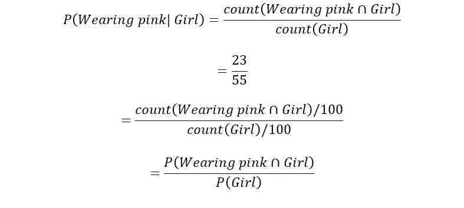

# 可视化朴素贝叶斯定理

> 原文：<https://towardsdatascience.com/visualizing-bayesian-theorem-ccea9e3696a2?source=collection_archive---------12----------------------->

## 贝叶斯定理通过维恩图、树形图和饼状图可视化

曾经需要记忆贝叶斯定理公式吗？通过维恩图可视化贝叶斯定理，不需要再次记忆。

根据下面的文氏图，在一个 100 人的班级中，随机挑选的学生是女生的概率， **P(女生)**是女生在 100 名学生中的比例:

假设学生是女生，她穿粉色的条件概率， **P(穿粉色|女生)**是所有女生中穿粉色的比例:

学生是女生并且穿粉色的概率， **P(穿粉色∩女生)**或 **P(穿粉色∩女生)**是 100 个学生中女生穿粉色的比例:

因此，假设学生穿粉红色衣服，则该学生是女生的条件概率， **P(女生|穿粉红色衣服)**是所有穿粉红色衣服的女生的比例，可以通过将交集除以穿粉红色衣服的概率 P(穿粉红色衣服)得到:

更常见的是，贝叶斯概率可以通过树形图来计算:

任何一个学生穿粉色的概率， **P(穿粉色)** = P(穿粉色的女生)+ P(穿粉色的男生)= 23/100+2/100 = 25/100 =**0.25**

假设学生是女生，她穿粉色衣服的条件概率是 23/55 = **0.418**

知道学生是女生，她穿粉色的概率(0.418)整体上大于任何一个学生穿粉色的概率(0.25)。因此**知道学生是女生，就增加了她穿粉色的概率**。也可以说，作为一个女孩和穿粉红色是相关联的，它们不是相互独立的事件。

另一方面，以下示例显示了相互独立的事件:

任意一个学生免费吃饭的概率， **P(免费吃饭)**为 P(女生免费吃饭)+ P(男生免费吃饭)= 22/100+18/100 = 40/100 =**0.4**

假设学生是女生，她有空吃饭的条件概率是 22/55 = **0.4**

知道是女生，她有空吃饭的概率(0.4)和整体上有空吃饭的人的概率(0.25)是一样的。因此**知道是女生，并没有增加或减少她有空吃饭的概率**。也可以说，做女生和免费吃饭是没有关联的，它们**是相互独立的事件。**

假设有另一个条件概率，学生穿短裤，假定她是女生， **P(穿短裤|女生)** = 1/4。 **P(穿短裤|少女)**与 **P(穿粉色|少女)相互独立。**

由于 **P(穿短裤|女生)**与 **P(穿粉色|女生)**相互独立，所以女生是否穿粉色并不影响女生穿短裤的概率(总是 1/4)。穿粉色的女生有 1/4 穿短裤。1/4 不穿粉色的女生也穿短裤。因此，假设学生是女生，穿粉色短裤的学生的条件概率 **P(穿短裤，穿粉色|女生)**为:

Xi 指的是女孩的不同特征。由于假定 **P(穿短裤|女孩)**和 **P(穿粉色|女孩)**之间相互独立，这种从给定类别标签的多个特征中提取条件概率的方法被称为朴素贝叶斯。

如果 **P(穿短裤|女孩)**和 **P(穿粉色|女孩)**之间不假设相互独立，知道女孩穿粉色可能会降低女孩穿短裤的概率。1/5 穿粉色的女生也穿短裤。6/7 不穿粉色的女生也穿短裤。于是， **P(穿短裤，穿粉色|少女)**不可能是 **P(穿短裤|少女)* P(穿粉色|少女)。T** 女孩穿短裤的条件概率假设她是一个女孩并且穿粉色， **P(穿短裤|穿粉色，女孩)**需要在 **P(穿短裤，穿粉色|女孩)c** 能够被发现之前首先被发现。

给出了预测具有特征 X1 至 Xi 的示例属于类 j 的概率的朴素贝叶斯分类器公式:

其中 **P(Cj|X1，..、Xi)** 为待预测的后验概率， **P(Xi|Cj)** 为特征 I 给定类 j 的条件概率， **P(Cj)** 为类**j****P(Xi)**为 **Xi** 的概率。