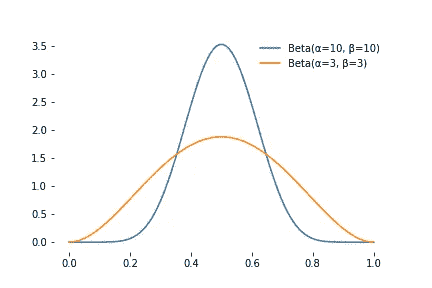
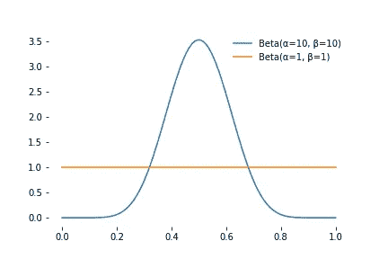
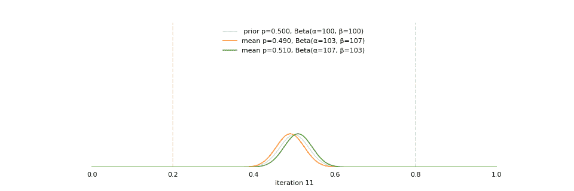
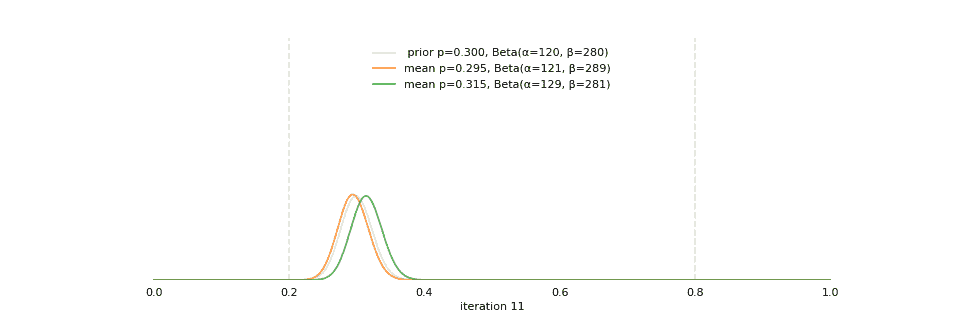
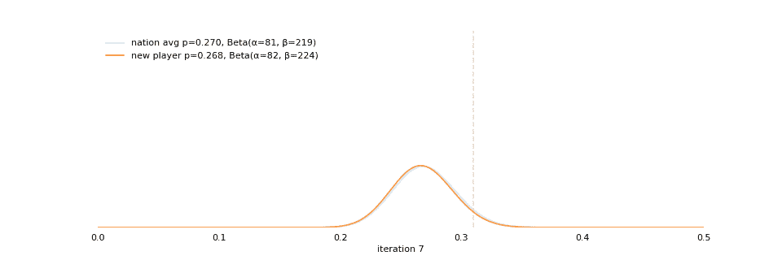

# 可视化贝塔分布和贝叶斯更新

> 原文：<https://towardsdatascience.com/visualizing-beta-distribution-7391c18031f1?source=collection_archive---------4----------------------->

## 眼见为实:通过模拟、想象和检查每一步来建立直觉

与伯努利分布、二项式分布和几何分布相比，贝塔分布是更深奥的分布之一。它在实践中也很少见，因为它没有现成的真实世界的类比来帮助直觉。更糟糕的是，在线教程往往用复杂的公式(beta & gamma 函数)和听起来怪异的名字(共轭先验)来恐吓读者。所以在这篇文章中，我将放弃那些技术细节，通过视觉动画和模拟实验来补充一些急需的直觉。

# **简介**

贝塔分布是概率的概率分布。这是什么意思？大家都是通过抛硬币开始学习概率的。那么让我们从一枚硬币开始。首先，*定义 p 为头部落地的概率*。如果硬币是公平的，那么很有可能有一半的时间硬币正面着地。在这种情况下， *p = 50%* 是 *p.* 最有可能的值，但是等等，不公平硬币也有可能意外地表现得像公平硬币。所以我们不能排除硬币不公平的可能性，即使我们有一半的时间观察正面。

注意我是如何用概率来描述概率 *p* 的。这是贝塔分布的本质:它描述了 *p* 取 0 到 1 之间的每个值的可能性。贝塔分布由𝛽).beta(𝛼的*参数化*𝛼*和𝛽* 共同描述了 *p* 取某一值的概率。这是你完成这篇文章所需要的唯一公式。

**之前**

先验是我们在进行实验之前所相信的。如果你看一枚硬币的两面，看到一面是正面，另一面是反面，你可能会相信这枚硬币是公平的。一枚公平的硬币有 *𝛼 = 𝛽，*，数量描述了你对自己的信仰有多自信。如果你有信心，那么你可以给 *𝛼 = 𝛽 = 10 打高分。不太自信的人可能会认为𝛼 = 𝛽 = 3。差异总结如下。*

当然，两条曲线都以 p = 50%为中心，但是如何量化“置信度”呢？在你真正掷硬币之前，把 *𝛼* 和 *𝛽* 想象成抛硬币:𝛼 - *1* 是你得到的正面数， *𝛽 - 1* 是反面数。如果你想象你已经抛了 18 次，得到了 9 个正面和 9 个反面 *(𝛼 = 𝛽 = 10)* ，你比那些只想象了 4 次结果是 2 个正面和 2 个反面 *(𝛼 = 𝛽 = 3)的人更有信心认为硬币是公平的。*我们需要减去 1 的原因是，通过设置 *𝛼 = 𝛽 = 1，*我们将分子减少为常数 1。这给了我们一个无信息的先验——我们假设零次假想的硬币投掷。

**无信息先验**

在翻动硬币甚至看硬币之前，我们对硬币了解多少？我们什么都不知道，当我们什么都不知道的时候，我们说什么都有可能发生。它同样可能是一个公平的硬币，一个双头硬币，一个双尾硬币，或者任何一边比另一边重的合金混合物。在我们什么都不知道的情况下，落地头的概率是**均匀分布。**这是β的特例，参数化为 *Beta(⍺=1，β=1)。*

根据用例的不同，我们可能需要也可能不需要无信息的先验。有时候在实验过程中，我们不希望我们已经知道的东西影响我们解释数据的方式。在其他情况下，我们希望利用早期实验的结果，因此我们不必从头开始学习一切。然而，在这两种情况下，我们使用贝叶斯更新从新的证据中学习。

**贝叶斯更新**

我们之前认为 *𝛼* 和 *𝛽* 是想象中的掷硬币游戏。虽然这是一个概念上的便利，但好消息是 Beta 分布并不区分虚的和实的。如果我们抛硬币，观察一个人头，我们简单地更新 *𝛼 ← 𝛼* + 1(反之亦然 *𝛽* )。这个过程被称为贝叶斯更新(见[此处](https://en.wikipedia.org/wiki/Conjugate_prior#Example)为证明)。

## 建立直觉:模拟

让我们从一个无信息的先验开始，假设硬币确实是公平的。你预计会发生什么？当我们掷硬币时，我们会观察到数量大致相等的正面和反面，掷得越多，我们就越有信心认为硬币是公平的。所以概率密度函数在 p = 50%时变得越来越尖锐。

**先前的效果**

现在考虑硬币偏向正面 20%的情况，我们从无信息先验开始。它立即出现在 20%左右，并集中在 20%左右。这并不奇怪，因为我们没有偏见。注意，我还模拟了补体事件( *p* = 80%)。这是贝塔分布的一个重要性质:每次试验最终只能有两种可能的结果。

如果我们先相信硬币是公平的，我们会看到贝塔分布的峰值(模式)更慢地收敛到真实值。

我们先前的信念越强，如果它们不同，我们接受真相的速度就越慢。在下面的例子中，先验足够强( *𝛼 = 𝛽 = 100)* 以至于我们无法在 1000 次迭代中收敛到真实值。

如果先验是不对称的，我们将看到更接近先验的β比远离先验的β收敛得更快(并且其峰值更高)。这是直觉的:如果现实与我们的信念一致，我们会欣然接受，并对我们的信念更加自信。相比之下，如果真相与我们的信念相矛盾，我们接受真相的速度会慢一些。

**棒球击球统计**

对于现实世界应用的具体例子，让我们考虑棒球击球率(改编自这篇[帖子](http://varianceexplained.org/statistics/beta_distribution_and_baseball/))。全国平均打击率为 0.27。如果某个新玩家加入游戏时没有之前的表现记录，我们可以将他与全国平均水平进行比较，看他是否有任何优势。先验公式为 *Beta(⍺=81，β=219)* 以给出 0.27 的期望*。*当他挥动球棒时，我们沿途更新了 *⍺* 和 *β* 。在 1000 次击球后，我们观察到 300 次击中和 700 次未击中。后验变成 *Beta(⍺=81 + 300，β=219 + 700)，*带期望381 / (381 + 919) = 0.293。

## 摘要

这篇文章介绍了 Beta 分布，并通过模拟和可视化揭示了它的基本属性。对于用概率分布描述概率意味着什么，先验如何与证据相互作用，以及它如何与现实世界的场景相关，你应该已经建立了一些直觉。

贝叶斯更新是一个非常强大的概念，在商业智能、信号过滤和随机过程建模中有着广泛的应用。我将在不久的将来研究其中的一些应用。下一个[帖子](/beyond-a-b-testing-multi-armed-bandit-experiments-1493f709f804)是对 Google Analytics 的多臂土匪实验的近距离考察(这个帖子的第一个动画实际上来自一个 8 臂土匪实验)。

## 延伸阅读

下面的博客涵盖了与 AB 测试相关的主题，以及对本文中提到的关键概念的更深入的回顾。

*   理解置信区间[ [链接](/understanding-confidence-interval-d7b5aa68e3b)
*   A/B 测试的力量[ [链接](/the-power-of-a-b-testing-3387c04a14e3)
*   超越 A/B 测试:多臂强盗实验[ [链接](/beyond-a-b-testing-multi-armed-bandit-experiments-1493f709f804)
*   你知道可信区间[ [链接](/do-you-know-credible-interval-e5b833adf399#bce7)吗
*   代码在我的 Kaggle [笔记本](https://www.kaggle.com/shawlu/visualizing-beta-distribution)里。