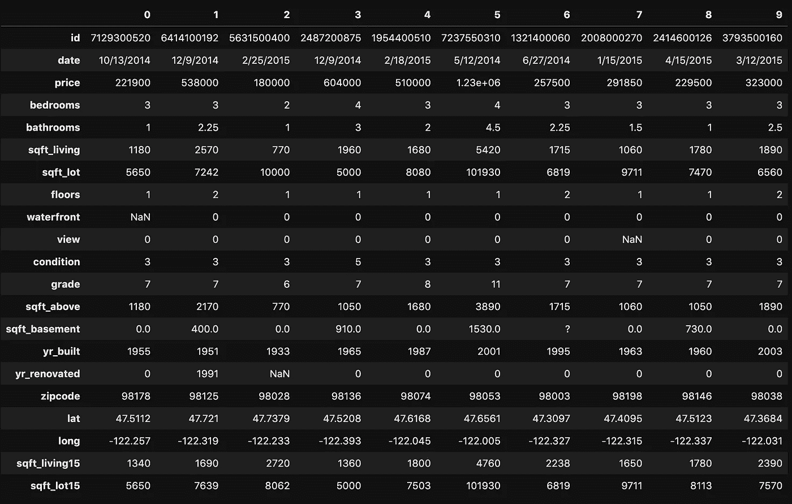
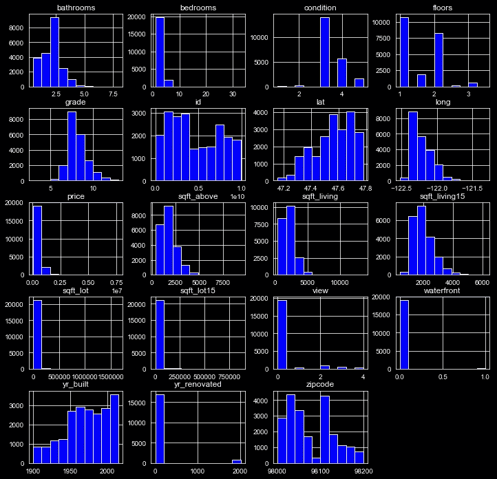
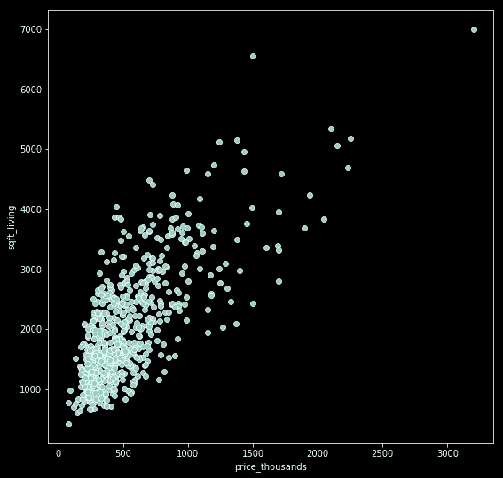
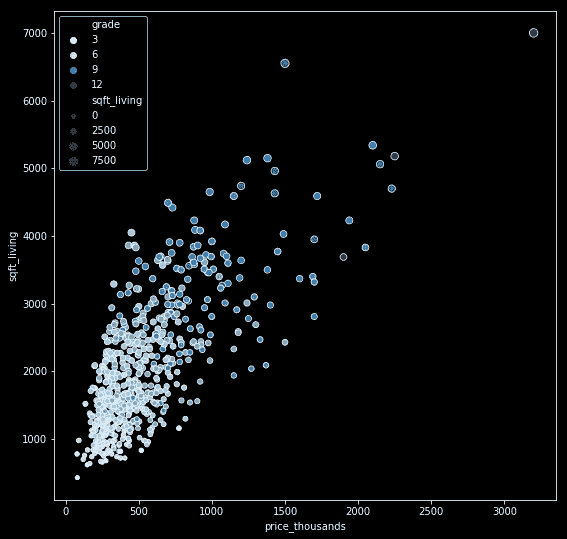
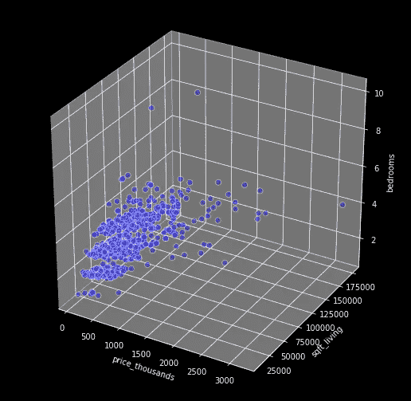
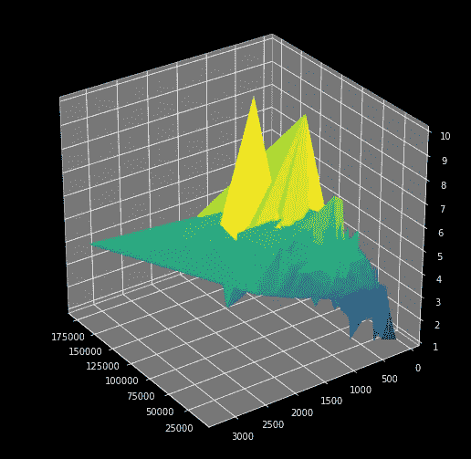
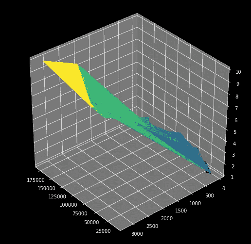
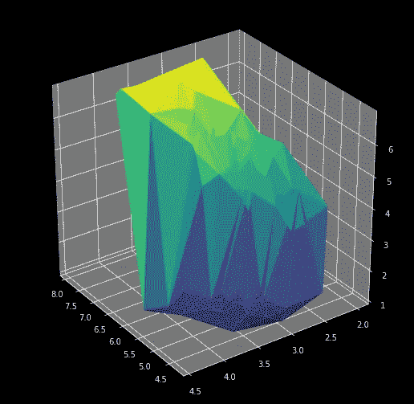
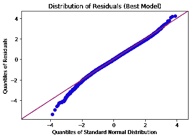

# 超越三维的视觉化

> 原文：<https://towardsdatascience.com/visualizing-beyond-3-dimensions-67531b431119?source=collection_archive---------22----------------------->

## 窥视看不见的复杂数据

视觉可以说是我们人类最大的优势之一。一旦你找到一种可视化的方法，即使是最复杂的想法也会变得容易理解(或者至少，更容易理解*)——我们的枕叶帮了我们大忙。这就是为什么当你处理超过 3 维的数据集时，仅仅理解数据集内部的情况是一个挑战，更不用说向他人展示你的发现了。这就是我们今天要应对的挑战。*

*为此，我们将使用 King County 房屋销售数据集，其中包含 2014 年和 2015 年超过 21，000 套真实房屋的销售信息。这个数据集恰好在每一条记录中包含 21 条信息，比如价格、平方英尺、房产状况等等——换句话说，这个数据集是 21 维的。实际上，我不得不将它转置，以适应下一个镜头的水平方向。*

```
*df.head(10).T*
```

**

*Sweet mother of data science.*

*我们从哪里开始呢？最简单的方法之一是绘制所有指标的直方图，或者在散点图中根据您选择的目标(如价格)绘制所有特征。*

```
*df.hist()* 
```

**

*It’s a start, but it doesn’t tell us everything.*

*这告诉我们关于我们所有的数据片段的一些事情，但是没有告诉我们它们是如何相互关联的。输入*散点图—* 是的，我刚才说散点图对此也没有太大帮助，但是请耐心听我说。*

*出于可见性的考虑，让我们设计一个`price_thousands`特性，并从我们的数据点中随机抽取大约 3%的样本。在这种情况下，3%仍然是 600 左右，超过这个数字，情节就会变得过于拥挤。*

```
*df['price_thousands'] = df['price'] / 1000
np.random.seed(25565)
df = df.sample(n=round(len(df)/33))plt.figure(figsize=(9, 9))
sns.scatterplot(x='price_thousands', 
                y='sqft_living', 
                palette='Blues', 
                data=df);*
```

*结果看起来像这样:*

**

*It’s something.*

*然而，只要添加几个新参数，我们就可以让它看起来像这样…*

```
*sns.scatterplot(x='price_thousands', 
                y='sqft_living', 
                hue='grade', 
                size='sqft_living', 
                palette='Blues', 
                data=df);*
```

**

*Much better.*

*通过本质上增加色调作为一个维度，我们能够本质上在二维空间中表现三维空间——这是一个不错的交易！注意，我们在这里也两次表示了`sqft_living`:一次作为轴，然后再次作为点的比例。如果您自己认为使用点的刻度来表示`sqft_living`和 y 轴来表示数据的其他特征会更好，那么原则上我完全同意您的观点。然而在实践中，对于这个特殊的数据集，这种尝试变得如此混乱，以至于数据在视觉上变得难以处理。至少我们可以通过两次表示`sqft_living`来增加这些数据的可读性，所以看起来并不是一无所获。我要说的是，从这个角度来看，数据可视化更多的是一门艺术，而不是科学。*

*回到手边的主题:如何超越三维可视化。也许我们可以将改变颜色梯度和点大小的新技巧与实际的 3D 散点图结合起来？嗯，是的，但实际上不是。*

```
*from mpl_toolkits.mplot3d import Axes3Dfig = plt.figure(figsize=(9, 9))
ax = fig.add_subplot(111, projection='3d')x_param = 'price_thousands'
y_param = 'sqft_living'
z_param = 'bedrooms'
x = df[x_param]
y = df[y_param] * 25
z = df[z_param]
ax.set_xlabel(x_param)
ax.set_ylabel(y_param)
ax.set_zlabel(z_param)ax.scatter(x, y, z, 
           c='b', s=50,
           edgecolors='w', 
           marker='o', 
           alpha=0.4);*
```

**

*It’s 3D, but it’s not quite all we hoped.*

*色调和点大小的变化是 Seaborn 的一个特点，但据我所知，Seaborn 不支持 3D 散点图。相反，Matplotlib 可能能够绘制三维图，但它不支持那些如此可爱和有用的变换色调和点大小。总之，没有(据我所知的)现成的解决方案可以让我们既吃蛋糕又吃 t。如果这确实存在，请分享评论！*

*让我们尝试另一种方法:曲面图。*

```
*fig = plt.figure(figsize=(9, 9))
ax = fig.gca(projection='3d')
ax.plot_trisurf(y, x, z, cmap=plt.cm.viridis, linewidth=0.2)
ax.view_init(30, 145)
plt.show();*
```

**

*嗯。事实证明，除非我们对它们的值进行排序，否则表面图非常混乱。然而，虽然对值进行排序会让我们更清楚，但不一定会让我们更有用。*

```
*x = np.sort(x)
y = np.sort(y)
z = np.sort(z)
fig = plt.figure(figsize=(9, 9))
ax = fig.gca(projection='3d')
ax.plot_trisurf(y, x, z, cmap=plt.cm.viridis, linewidth=0.2)
ax.view_init(35, 140)
plt.show();*
```

**

*所有这些变量都有很强的相关性，所以我们最终得到的是一个很窄的线性形状，很难分辨。最后，散点图似乎提供了更有效的可视化，至少对于这个特定的数据集是如此。然而，其他人对这种媒体的翻译要好一些。*

```
*iris = sns.load_dataset('iris')
fig = plt.figure(figsize=(9, 9))
ax = fig.gca(projection='3d')ax.plot_trisurf(iris['sepal_length'],
                 iris['sepal_width'],
                 iris['petal_length'],
                 cmap=plt.cm.viridis, 
                 linewidth=0.2)
ax.view_init(30, 145)
plt.show();*
```

**

*还有一些我们还没有尝试过的技巧(比如不同的点形状或者让我们的情节随着时间而变化的动画)，但是事实是我们还没有接近同时可视化 21 个维度——这完全不可能。但这并不意味着我们不能从超维数据中获得有意义的见解。我们可能不太关心这些数据的所有 21 个维度，而更关心这些数据实际能为我们做些什么，比如让我们更准确地预测价格。为此，我们可以简单地在两个维度上绘制误差值。*

```
*residuals = model_1st.resid
fig = sm.graphics.qqplot(residuals, dist=stats.norm, line='45', fit=**True**)
plt.xlabel('Quantiles of Standard Normal Distribution')
plt.ylabel('Quantiles of Residuals')
plt.title('Distribution of Residuals (Best Model)')
fig.show()*
```

**

*Error Distribution vs Normal Distribution*

*即使我们不能同时看到所有 21 个维度，也有很多方法可以从这些数据中获取有意义的见解。如果你还知道什么，请告诉我！*