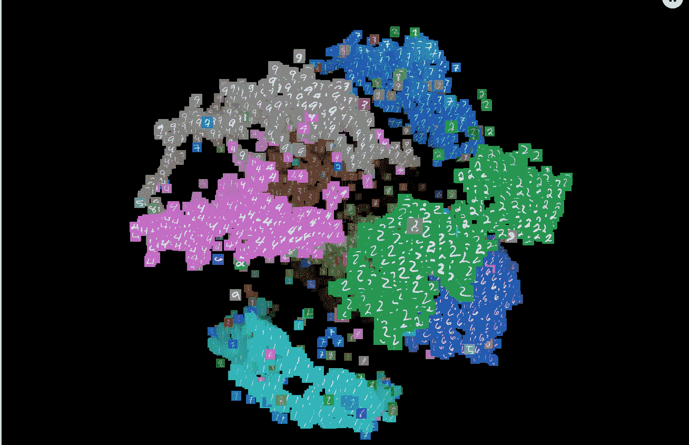
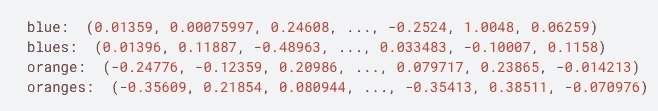
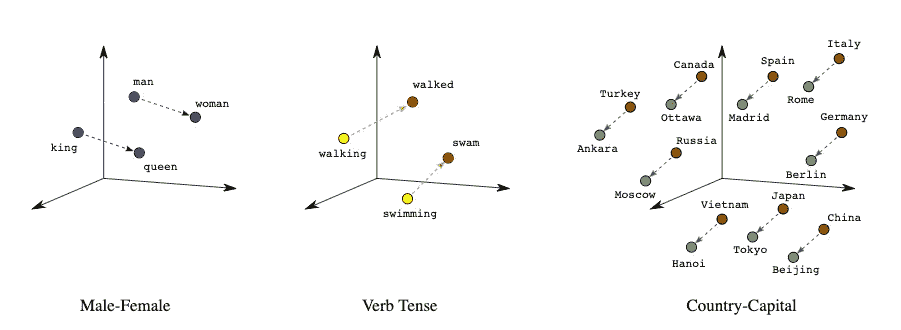
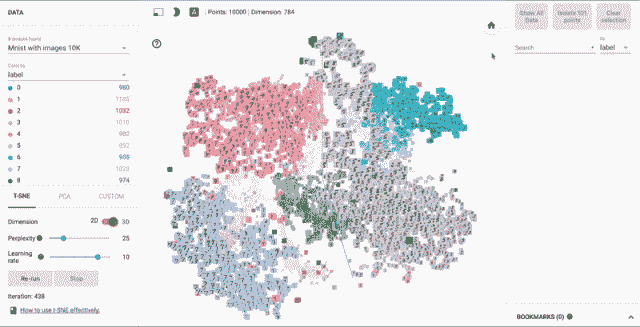
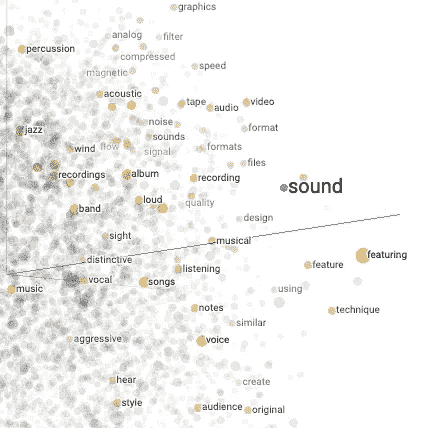
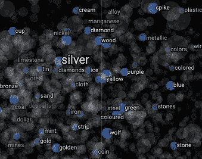
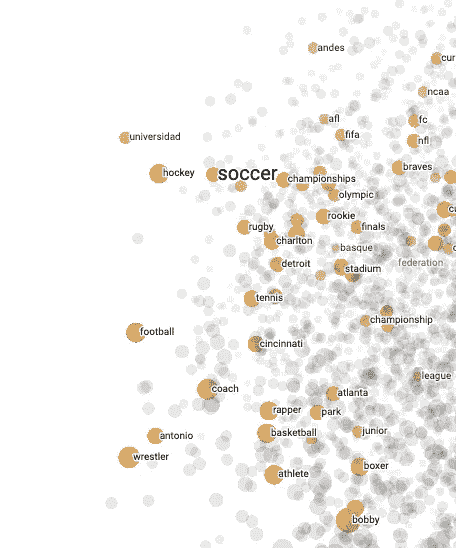
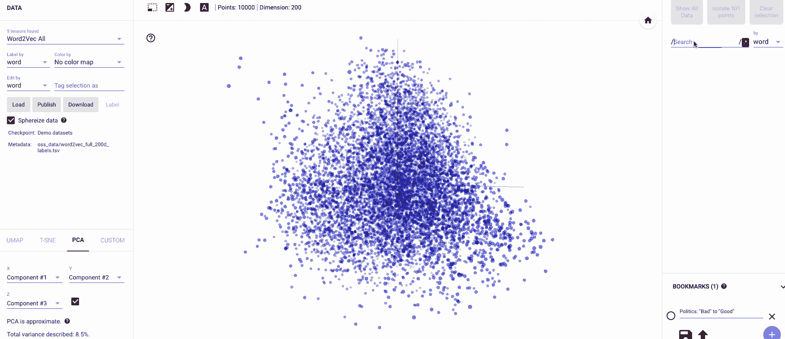
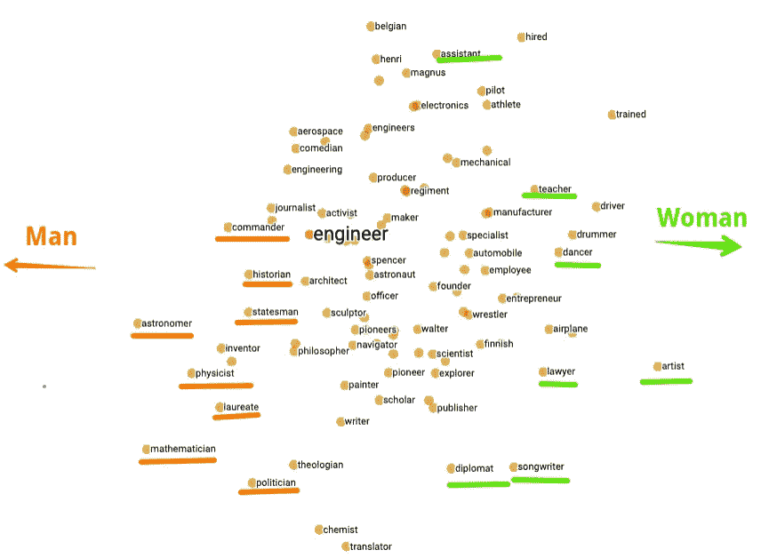
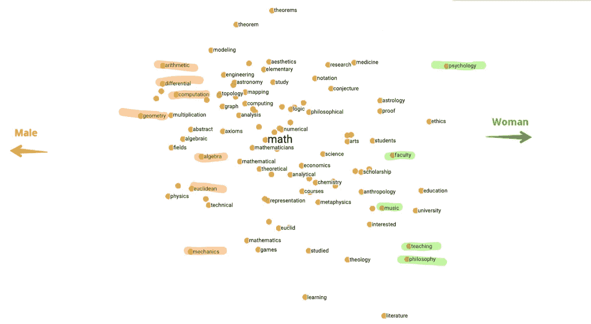

# 使用嵌入式投影仪可视化数据中的偏差

> 原文：<https://towardsdatascience.com/visualizing-bias-in-data-using-embedding-projector-649bc65e7487?source=collection_archive---------6----------------------->

## 使用开源嵌入投影工具进行嵌入的交互式可视化和解释

t-SNE projection of MNIST Digits

> 在调试模型之前先调试数据

在部署机器学习模型之前，会对其性能进行评估。然而，除了性能方面之外，了解模型学到了什么也很重要。这是必要的，以确保模型没有学到歧视或偏见的东西。

解决这个问题的一个方法是从数据可视化的角度。通过可视化模型如何对数据进行分组，我们可以了解模型认为哪些是相似的数据点，哪些是不相似的数据点。这对于理解模型为什么做出某些预测以及什么样的数据被输入到算法中是有益的。

*在本文中，我们将看看一个名为* [***的嵌入投影仪***](http://projector.tensorflow.org/) *的工具，它使我们能够轻松地可视化高维数据，以便我们能够理解模型从数据中学到了什么。*

# 介绍

嵌入的**本质上是一个低维空间，高维向量可以被转换到其中。在翻译期间，嵌入通过在嵌入空间中将相似的输入紧密地放置在一起来保持输入的语义关系。让我们试着用例子来理解这个概念。这是嵌入式投影仪的创作者的一个截图。**

Source: [https://www.youtube.com/watch?v=wvsE8jm1GzE](https://www.youtube.com/watch?v=wvsE8jm1GzE)

单词也可以表示为嵌入。这是一个 300 维嵌入的例子，它将单词映射到实数的向量。值得注意的是，这些向量中的个体维度不能提供太多信息。然而，对机器学习有用的是不同向量之间的距离和位置的整体模式。

[Source](https://www.tensorflow.org/guide/embedding)

## 嵌入的优势

多维空间有助于将语义相关的项目组合在一起，同时将不同的项目分开。这在机器学习任务中非常有用。考虑以下真实嵌入的可视化:

[Source: Embeddings- Translating to a Lower-Dimensional Space](https://developers.google.com/machine-learning/crash-course/embeddings/translating-to-a-lower-dimensional-space)

这些嵌入捕捉了动词时态、国家资本关系和性别类比等词之间的语义关系。

# 嵌入式投影仪应用程序

[**嵌入投影仪**](http://projector.tensorflow.org/) 是一个 web 应用工具，它通过从我们的模型中读取嵌入，并以二维或三维的方式呈现它们，从而交互式地可视化嵌入。这是一万张被标签着色的 MNIST 图像的可视化。

visualisation of the ten thousand MNIST images

## 使用

嵌入式投影仪是开源的，集成到 [**TensorFlow**](https://www.tensorflow.org/tensorboard/r1/summaries) 平台中，或者可以在[projector.tensorflow.org](http://projector.tensorflow.org/)*作为**独立工具**。*独立工具无需安装和运行 TensorFlow 即可工作。

## 布局

The main view of Embedding Projector

上图显示了 web 应用程序的主视图，它由五个不同的面板组成。

*   **数据面板，**在这里我们可以选择要检查的数据集。嵌入式投影仪网站包括一些数据集可供使用，或者我们可以[加载我们自己的数据集](https://www.tensorflow.org/guide/embedding#metadata)。也可以通过点击“发布”按钮来发布并与他人共享我们的嵌入。
*   **投影面板**在这里我们可以选择投影的类型。
*   **检查面板**我们可以在这里搜索特定的点，并查看最近邻居的列表。
*   **书签面板**让我们将当前状态(包括任何投影的计算坐标)保存为一个小文件，然后可以共享。
*   **可视化面板**是显示数据的区域

# 预测

嵌入式投影仪提供了四种众所周知的降低数据维数的方法。每种方法都可以用来创建二维或三维的探索视图。

*   **主成分分析**

[PCA](https://en.wikipedia.org/wiki/Principal_component_analysis) 是从现有数据中提取一组新变量称为**主** **分量**的技术。这些主成分是原始要素的线性组合，并试图从原始数据集中获取尽可能多的信息。嵌入式投影仪计算数据的前 10 个主成分，我们可以从中选择两个或三个进行查看。让我们看看 10000 个 MNIST 数字的 PCA 投影。每个 MNIST 数字有 784 个像素，投影将每个像素视为一个维度。

*   **t-SNE**

[t-SNE](https://en.wikipedia.org/wiki/T-distributed_stochastic_neighbor_embedding) 或 T-分布式随机邻居嵌入通过在二维或三维地图中给每个数据点一个位置来可视化高维数据。这种技术发现数据中的聚类，从而确保嵌入保留了数据中的含义。下面著名的 MNIST 数据集的 t-SNE 投影清楚地显示了相似的数字聚集在一起。

*   **风俗**

自定义投影是水平轴和垂直轴上的线性投影，已使用数据标签指定。自定义投影主要有助于解读数据集中有意义的“方向”。

*   **UMAP**

[UMAP](https://umap-learn.readthedocs.io/en/latest/index.html) 代表一致流形逼近和投影降维。t-SNE 是一种可视化高维数据集的优秀技术，但具有某些缺点，如高计算时间和大规模信息的丢失。另一方面，UMAP 试图克服这些限制，因为它可以轻松处理相当大的数据集，同时还保留了数据的局部和全局结构。

如果你正在寻找数学描述，请参见 UMAP 的论文。

# 探测

我们现在将检查已经被训练来处理文本的 Word2Vec 模型如何对单词的含义进行分组。看到这些分组会很有趣，因为它们会揭示很多单词之间的关系。工具中包含了数据集。

[维基百科](https://en.wikipedia.org/wiki/Word2vec)将 Word2vec 描述为一组用于产生[单词嵌入](https://en.wikipedia.org/wiki/Word_embedding)的相关模型。Word2vec 将文本的大型[语料库作为其输入，并产生一个向量空间，通常具有数百个维度，语料库中的每个唯一单词被分配一个空间中的相应向量。](https://en.wikipedia.org/wiki/Text_corpus)

我们将使用 **Word2Vec 10K** 数据集。这里每个点代表一个单词，每个单词有 200 个维度。让我们快速浏览一下创建投影的步骤:

*   从数据面板中选择所需的数据集。这里的每一个数据点都来自一个根据维基百科文章训练的模型。
*   现在，让我们通过查看一组预定义点的最近邻居来进行邻域分析。这将使我们清楚地了解模型已经学习了哪些关系。
*   在“检查器”面板中，键入单词“ **Apple** ”。
*   该工具会建议一些匹配的单词。点击`apple`，我们会得到空间中最近点的列表，其中包括与`apple`相似的单词。
*   要去除噪声，点击标有`isolate 101 points`的灰色按钮，分离相关点。这些点包括选定的点及其 100 个最近的邻居。
*   我们还可以旋转空间，缩放，甚至平移一点点。

注意`juice`、`wine`和`fruit`是如何一起出现的，而`Macintosh`、`technology`和`microprocessor`也在顶部组合在一起。这里需要注意的是，模型并没有被告知单词的意思，相反，它只是显示了数百万个句子作为单词用法的例子。

这里还有一些例子，会使事情变得更清楚。

在**左边**是与`sound`相关的一串单词。中间的**图**显示与`silver`相似的单词，而最右边的**图**显示与`soccer`相关的单词。

# 发掘我们语言中的偏见

有时，模型会学习一些令人担忧的事情，特别是当机器学习模型被用来为人类做决策时。这一次我们将使用 **Word2Vec All** 语料库并搜索单词 **Engineer** 来查看其最近的邻居。嵌入式投影仪还允许我们重新定向可视化，以便为这些情况执行更复杂的测试，因此我们将使用**自定义投影**选项卡重新定向我们的结果。

Visualising Bias in data

我固定了一条从**男**到**女**的轴，所以靠近男的字偏向左边**而类似女的字会出现在右边**的**上。让我们看看我们的锚词是 **Engineer，**的结果。**

看来**工程师**这个词已经比女人更接近男人了。更接近男性的词用橙色表示，包括`astronomer, physicist, mathematician` ，而像`dancer, songwriter, teacher`这样的词看起来更接近女性。

把锚词改成**数学**怎么样？成绩受影响吗？让我们自己来看看:

我们有类似于`computational, geometry, arithmetic`挨着**男人、**的词，而**女人**最近的邻居是`music, teaching, philosophy`等等。

想象一下，如果在这个数据集上训练的机器学习算法被用来预测某人在艺术或数学相关的工作中有多好？还有，如果一家公司依靠这样的算法来雇佣潜在的工程师，会发生什么？该模型可能会错误地认为，性别会影响候选人的表现，最终的决定会带有性别偏见。

# 结论

机器学习模型中的偏差是一个值得关注的领域。但是，重要的是要理解，在大多数情况下，用于训练模型的训练数据实际上是有偏差的，这最终会反映在模型中。因此，尽管强调创建准确的模型很重要，但调试训练数据中存在的任何偏差或异常也很重要。

# 参考

*   [开源嵌入式投影仪:一个可视化高维数据的工具](http://ai.googleblog.com/2016/12/open-sourcing-embedding-projector-tool.html)
*   [嵌入投影仪:嵌入的交互式可视化和解释](https://arxiv.org/abs/1611.05469)