# 使用交互式地图和动画可视化伦敦的自行车移动性

> 原文：<https://towardsdatascience.com/visualizing-bike-mobility-in-london-using-interactive-maps-for-absolute-beginners-3b9f55ccb59?source=collection_archive---------12----------------------->

## 探索 Python 中的数据可视化工具


Photo by [Max Adulyanukosol](https://unsplash.com/@na399?utm_source=medium&utm_medium=referral) on [Unsplash](https://unsplash.com?utm_source=medium&utm_medium=referral)

近年来，自行车共享系统已经成为流行的出行方式，为大都市的市民提供了一种绿色灵活的交通方案。世界上许多政府都认为这是一项创新战略，有可能带来许多社会效益。例如，它可以减少汽车的使用，从而减少温室气体排放，缓解市中心的交通拥堵。

> [报道](http://content.tfl.gov.uk/attitudes-to-cycling-2016.pdf)显示 77%的伦敦人同意骑自行车是短途旅行最快的方式。从长远来看，这也可能有助于提高城市的预期寿命。

我一直在研究一种数据驱动的经济有效的算法，用于优化(重新平衡)伦敦公共自行车租赁计划桑坦德自行车系统，一旦我的论文发表，我应该就此发表一篇文章(更多信息[这里](https://edenau.github.io/bike-sharing/))。在真正研究算法之前，我必须深入研究大量数据，如果我能以某种方式将它们可视化，那将非常有帮助。

> TL；DR——让我们看看如何使用图表、地图和动画来可视化自行车共享系统。

*你可以在这个* [*页面*](https://edenau.github.io/maps/) *找到网络地图。大多数地图、动画和源代码都可以在*[*GitHub*](https://github.com/edenau/maps)*上找到。数据现已在*[*ka ggle*](https://www.kaggle.com/edenau/london-bike-sharing-system-data)*上。*

## 目录

*   [更多关于数据—钻头](https://medium.com/p/3b9f55ccb59#9f3c)
*   [条形图](https://medium.com/p/3b9f55ccb59#aafa)
*   [互动地图](https://medium.com/p/3b9f55ccb59#06fb)
*   [密度图](https://medium.com/p/3b9f55ccb59#b4fb)
*   [连接图](https://medium.com/p/3b9f55ccb59#ad60)
*   [动画](https://medium.com/p/3b9f55ccb59#06e4)
*   [结论](https://medium.com/p/3b9f55ccb59#ab6f)
*   [备注](https://medium.com/p/3b9f55ccb59#d0d8)

*原载于我的博客*[*edenau . github . io*](https://edenau.github.io)*。我的作品灵感来源于* [*文森特·隆尼*](https://blog.prototypr.io/interactive-maps-in-python-part-3-29f14a9b2f7d) *和* [*德鲁米尔·帕特尔*](/master-python-through-building-real-world-applications-part-2-60d707955aa3) *。看看他们的帖子！*

# 关于数据的更多信息—枯燥的部分

我从伦敦交通局(TfL)获得了关于自行车旅行的数据。自 2012 年以来，他们系统中的每一次自行车旅行都被记录下来，这些公开数据可以在网上获得。

分析了从 2017 年 8 月 1 日到 9 月 13 日的 36 天旅程记录。在此期间，伦敦 700 多个自行车停靠站的行程超过 150 万次。从 2014 年开始，我们见证了自行车旅行的增长超过 190%。该系统中自行车和停靠站的数量都增加了两倍多，以适应伦敦市中心和地区自行车需求的显著增长。确切的数据将在我即将发表的论文中给出。[敬请期待](https://edenau.github.io/)。

## 数据操作

我相信工作日和周末的出行模式会有很大的不同。我们来做一些编码，看看这是不是真的。我们首先通过`pd.read_csv()`导入旅程数据。

```
# Load journey dataf = 'journeys.csv'
j = pd.read_csv(f)date = j['date'].values
month = j['month'].values
year = j['year'].values
hour = j['hour'].values
minute = j['minute'].values
station_start = j['id_start'].values
station_end = j['id_end'].values
```

然后，我们通过`date.weekday()`提取工作日数据，并将一天 24 小时平均分成 72 个时间片，这样每个时间片代表 20 分钟的间隔。

```
# Compute IsWeekdayweekday = np.zeros(len(date))
weekday[:] = np.nan
cnt = 0for _year, _month, _date, _hour, _minute in zip(year, month, date, hour, minute):
  _dt = datetime.datetime(_year, _month, _date, _hour, _minute)
  _weekday = _dt.weekday()
  weekday[cnt] = _weekday
  cnt += 1IsWeekday = weekday < 5
j['IsWeekday'] = IsWeekday# Compute TimeSlicej['TimeSlice'] = (hour*3 + np.floor(minute/20)).astype(int)
```

我们还需要检查这些自行车旅行是否是从/到被废除的车站，因为没有办法获得这些车站的信息，如位置、车站名称等。(干得好，TfL)。我们把它们称为“无效”旅行。

```
# Load station dataf = 'stations.csv'
stations = pd.read_csv(f)
station_id = stations['station_id'].values# Extract valid journeysvalid = np.zeros(len(date))
valid[:] = False
cnt = 0for _start, _end in zip(station_start, station_end):
  if np.logical_and((_start in station_id), (_end in station_id)):
    valid[cnt] = True
  cnt += 1j['Valid'] = valid
```

最后，我们只保留在工作日进行的“有效”**和**的旅程，这占数据的 73%左右。

```
df = j[j["IsWeekday"] == True].drop(columns="IsWeekday")
df = df[df["Valid"] == True].drop(columns="Valid")print('Ratio of valid journeys= {:.2f}%'.format(df.shape[0] / j.shape[0] * 100))
```

# 条形图

我们最后深入研究可视化部分！数据可视化最简单的形式可以说是图表。通过一个简单的`groupby('TimeSlice')`函数，我们可以看到不同时间的旅行有多频繁。

```
grp_by_timeslice = df.groupby('TimeSlice').count().values[:,0]plt.bar(range(0,72), grp_by_timeslice)
plt.xlabel('Time Slice')
plt.ylabel('Departures')
plt.show()
```

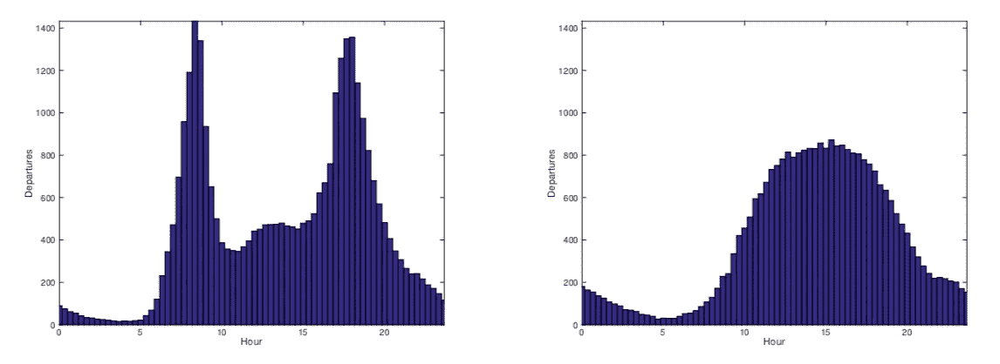

Average departure rates on weekdays (left) and weekends (right)

看到了吗？我们的假设是对的！工作日和周末的出行模式如此不同，因为我们可以看到工作日的两个高峰时间，大多数人在那里通勤，但周末不是。我们也可以用类似的方式观察旅行持续时间和速度的分布。

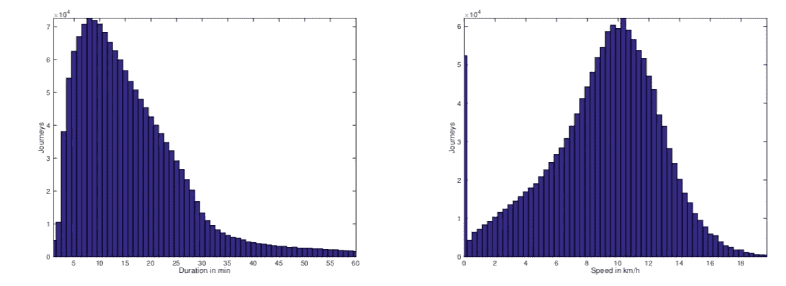

Distribution of journey duration (left) and speed (right)

请注意，由于数据限制(它们不跟踪您的运动)，我们假设采用的是直线路径，这将比实际路径短，因此根据起点站和终点站之间的距离计算的速度将被低估*。如果顾客在租车的同一个站点归还自行车，计算出的速度将是 0，这解释了为什么会出现 0 公里/小时的奇怪峰值。*

# *交互式地图*

*如果图表很奇特，地图就更奇特了。我们将使用`[folium](https://python-visualization.github.io/folium/)`，它是制作交互式地图的[fleet . js](https://leafletjs.com/)的 Python 包装器。确保通过以下方式安装最新版本*

```
*$ pip install folium==0.7.0*
```

*(或其`conda install`等价物)。我在谷歌合作实验室工作，预装版本是功能最少的`0.2.0`。*

*我创建了一个简单的模板，用圆圈标记(不同的颜色)生成地图。)使用集群。*

```
*import folium# Change coloursdef color_change(c):
    if(c < 15):
        return('red')
    elif(15 <= c < 30):
        return('orange')
    else:
        return('green')# Create base mapLondon = [51.506949, -0.122876]
map = folium.Map(location = London,
                 zoom_start = 12, 
                 tiles = "CartoDB positron")
marker_cluster = MarkerCluster(locations=[lat, lon]).add_to(map)# Plot markersfor _lat, _lon, _cap, _name in zip(lat, lon, cap, name):
    folium.CircleMarker(location = [_lat, _lon], 
                        radius = 9, 
                        popup = "("+str(_cap)+") "+_name, 
                        fill_color = color_change(_cap), 
                        color = "gray", 
                        fill_opacity = 0.9).add_to(marker_cluster)

f = 'map_station_cluster.html'
map.save(f)*
```

*为什么是集群？`MarkerCluster()`缩小时，标记如果靠得太近，可以聚集在一起。你不希望你的地图太乱，标记互相重叠。*

*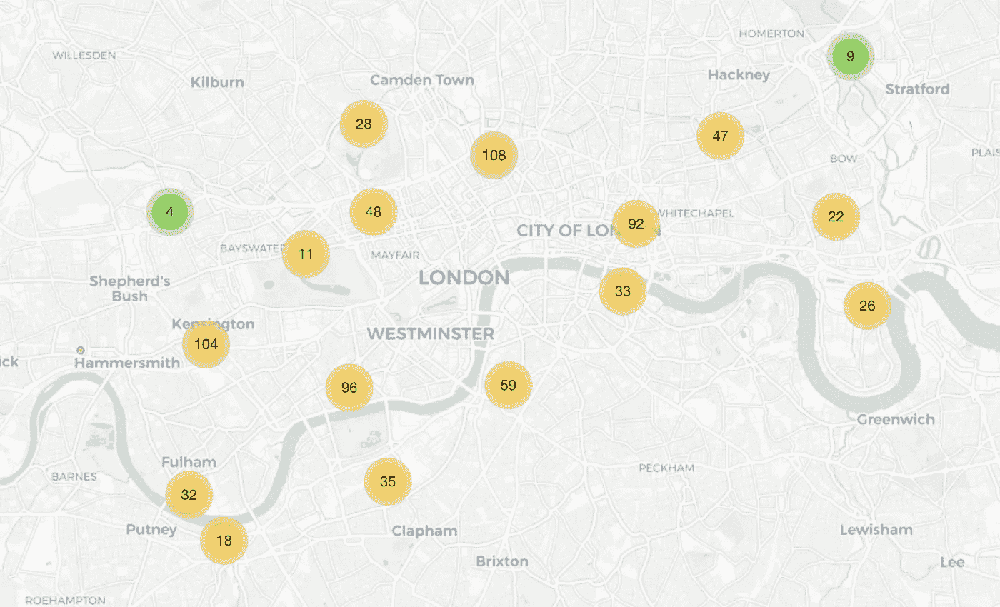*

*Station cluster map*

*当您放大时，它会自动分解/展开:*

*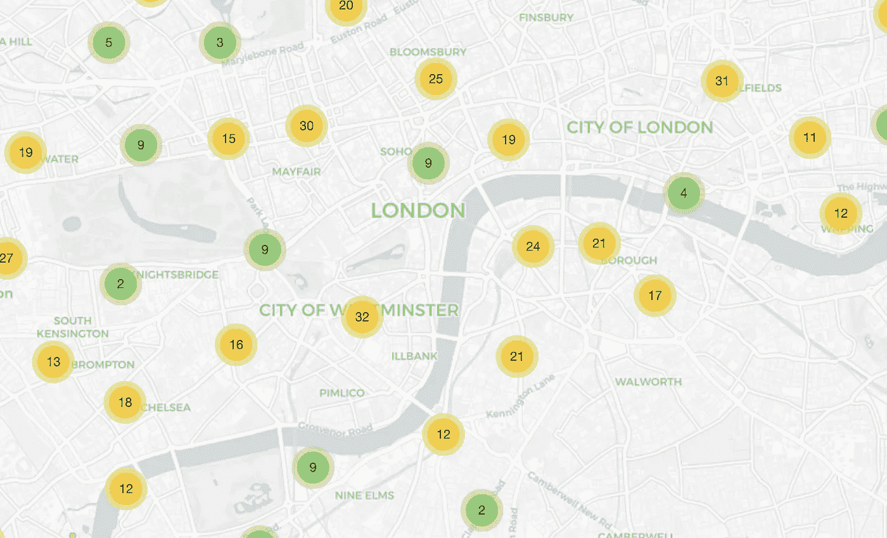*

*Station cluster map — zoomed in*

*但是我答应你 ***互动*** 地图。您可以设置`popup`参数，当您点击它时会显示站点名称及其容量。太棒了。*

*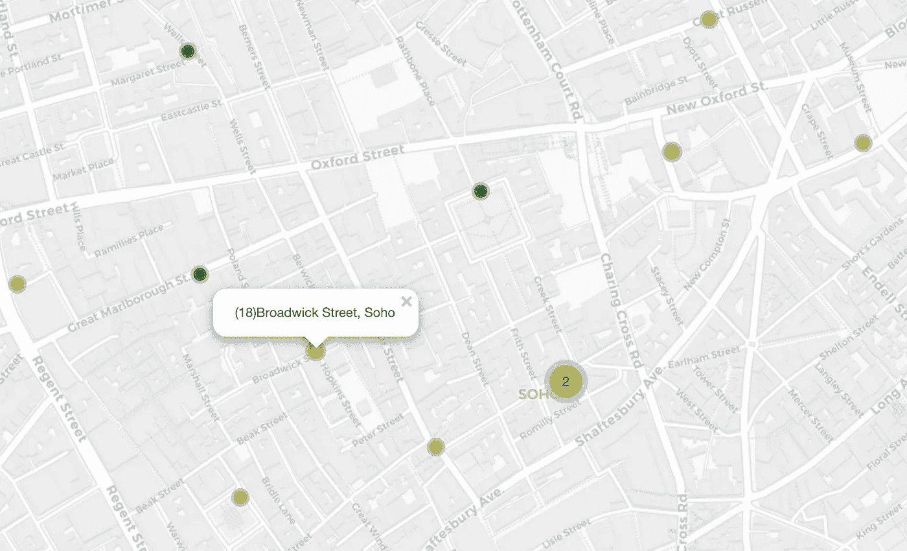*

*Interactions in the station cluster map*

**此地图在*[*https://edenau.github.io/maps/station-cluster/*](https://edenau.github.io/maps/station-cluster/)*上有售。**

# *密度图*

*上面的代码使用了一个动态的颜色方案，这个方案取决于站点的容量。我们还可以根据每个车站的出发和到达次数，为这些圆形标记实施动态半径方案。我们可以获得我们称之为 ***的密度图*** ，它显示了每个站点的净出发/到达。*

```
*def DensityMap(stations, cnt_departure, cnt_arrival):London = [51.506949, -0.122876]

  map = folium.Map(location = London, 
                   zoom_start = 12, 
                   tiles = "CartoDB dark_matter")

  stations['Total Departure'] = cnt_departure
  stations['Total Arrival'] = cnt_arrivalfor index, row in stations.iterrows():
    net_departure = row['Total Departure'] - row['Total Arrival']

    _radius = np.abs(net_departure) 
    if np.isnan(_radius):
      _radius = 0

    if net_departure > 0:
      _color= '#E80018' # target red
    else:
      _color= '#81D8D0' # tiffany blue

    lat, lon = row['lat'], row['lon']
    _popup = '('+str(row['capacity'])+'/'+str(int(_radius))+') '+row['station_name']

    folium.CircleMarker(location = [lat,lon], 
                        radius = _radius, 
                        popup = _popup, 
                        color = _color, 
                        fill_opacity = 0.5).add_to(map)

  return map*
```

*我在这里使用了不同的配色方案(*目标红*和*蒂芙尼蓝*都是在美国注册的颜色)来显示某个车站的出发人数是多于还是少于到达人数。大圆圈标记代表较大的出发-到达差异。*

*让我们看看早晚高峰时段的密度图:*

```
*# Select peak hoursTimeSlice = [25,53] # morning and evening
keyword = ['map_morning', 'map_evening']# Journeys depart between 0820 and 0859, and between 1740 and 1819
for ts, kw in zip(TimeSlice, keyword):
  df_1 = df[df["TimeSlice"] == ts]
  df_2 = df[df["TimeSlice"] == (ts+1)]
  df_target = df_1.append(df_2) cnt_departure = df_target.groupby("id_start").count().iloc[:,0]
  cnt_arrival = df_target.groupby("id_end").count().iloc[:,0] vars()[kw] = DensityMap(stations, cnt_departure, cnt_arrival)*
```

*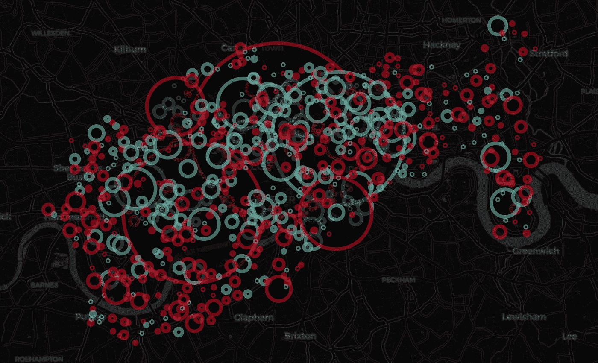*

*Density map in morning peak hours*

*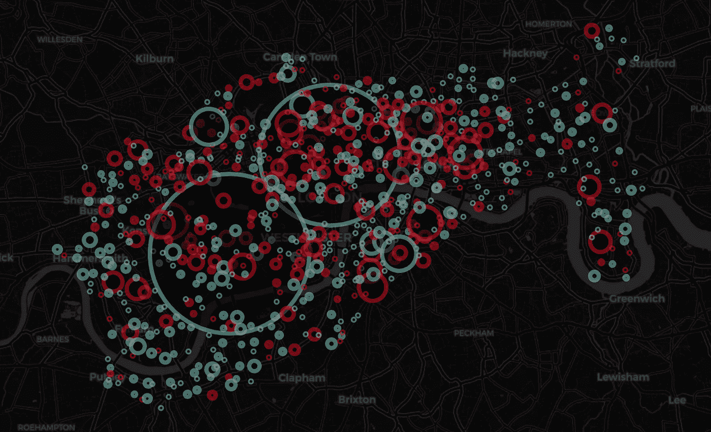*

*Density map in evening peak hours*

**密度图在*[*https://edenau.github.io/maps/density-morning/*](https://edenau.github.io/maps/density-morning/)*和*[*https://edenau.github.io/maps/density-evening/*](https://edenau.github.io/maps/density-evening/)*上可用。**

# *连接图*

*前面提到的所有地图都关注车站而不是旅程，但是我们也可以通过我们所谓的*连接地图，通过简单地在地图上绘制完成的旅程来可视化旅程。无需深究细节:**

**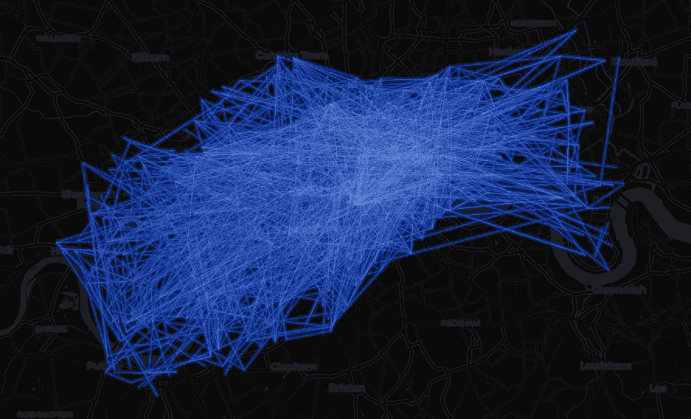**

**Connection map**

**我们还可以通过`folium.LayerControl()`添加多层连接，将频繁使用和不频繁使用的路径分开。**

**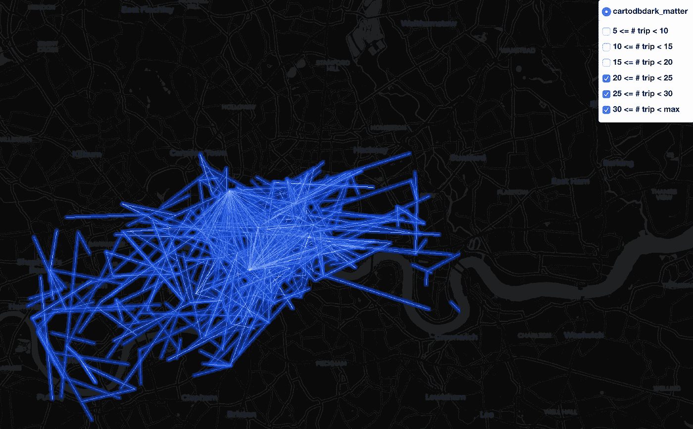**

**Multi-layer connection map**

***连接图在*[*https://edenau.github.io/maps/connection-morning/*](https://edenau.github.io/maps/connection-morning/)*和*[*https://edenau.github.io/maps/connection-morning-layers/*](https://edenau.github.io/maps/connection-morning-layers/)*上都有。***

# **动画片**

**到目前为止，我们已经演示了如何通过图表可视化时间和分布信息，以及通过各种地图可视化空间信息。但是如果我们在连续的时间实例上生成多个地图呢？我们可以用动画来可视化时空信息！**

**生成的地图是*中的 web 地图。html* 文件。这个想法是:**

> **为每个时间实例生成一个地图，在 web 浏览器上浏览，截屏并保存图片，并将所有图片链接成视频或. gif 文件。**

**我们将在`[selenium](https://www.seleniumhq.org/)`之前实现网页浏览和屏幕截图过程的自动化。我们还需要一个网络驱动，作为 Chrome 用户，我选择了`chromedriver`。**

```
**from selenium import webdriverdef a_frame(i, frame_time, data):
    my_frame = get_image_map(frame_time, data)

    # Save the web map    
    delay = 5 # give it some loading time
    fn = 'frame_{:0>5}'.format(i)
    DIR = 'frames'
    f = DIR + '/' + fn + '.html'
    tmpurl='file://{path}/{mapfile}'.format(path=os.getcwd()+
'/frames',mapfile=fn)
    my_frame.save(f) # Open the web map and take screenshot
    browser = webdriver.Chrome()
    browser.get(tmpurl)
    time.sleep(delay)
    f = DIR + '/' + fn + '.png'
    browser.save_screenshot(f)
    browser.quit() f = 'frames/frame_{:0>5}.png'.format(i)
    image = Image.open(io.BytesIO(f))
    draw = ImageDraw.ImageDraw(image)
    font = ImageFont.truetype('Roboto-Light.ttf', 30)

    # Add text on picture
    draw.text((20, image.height - 50), 
              'Time: {}'.format(frame_time),
              fill=(255, 255, 255), 
              font=font)

    # Write the .png file
    dir_name = "frames"
    if not os.path.exists(dir_name):
        os.mkdir(dir_name)
    image.save(os.path.join(dir_name, 'frame_{:0>5}.png'.format(i)), 'PNG') return image**
```

**然后我们可以在`[ffmpeg](https://www.ffmpeg.org/)`之前制作视频或 gif。对于 Mac 用户来说，在[自制软件](https://brew.sh/)的帮助下，安装`ffmpeg`简直不费吹灰之力，因为**

> **家酿安装了你需要的苹果没有的东西。**

**安装 Homebrew(用一个命令)后，只需输入**

```
**$ brew install ffmpeg**
```

**瞧！要创建一个 *.mp4* 文件，请尝试**

```
**$ ffmpeg -r 10 -i frames/frame_%05d.png -c:v libx264 -vf fps=25 -crf 17 -pix_fmt yuv420p video.mp4**
```

**对于*。gif* 文件，试试**

```
**$ ffmpeg -y  -t 3 -i frames/frame_%05d.png \ -vf fps=10,scale=320:-1:flags=lanczos,palettegen palette.png$ ffmpeg -r 10  -i frames/frame_%05d.png -i palette.png -filter_complex \ "fps=10,scale=720:-1:flags=lanczos[x];[x][1:v]paletteuse" animation.gif**
```

**查看全天密度图的动画:**

**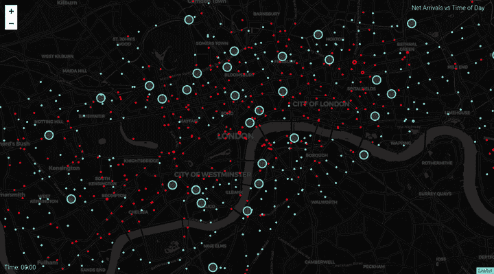**

**Animation of density maps throughout a day**

**以及不同时间旅程的动画:**

**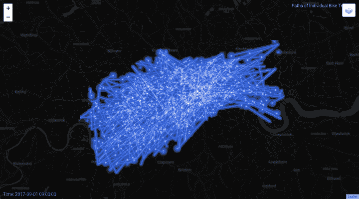**

**Animation of journeys in the morning**

**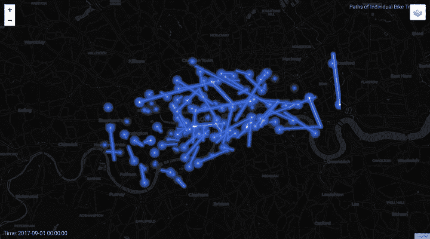**

**Animation of journeys after midnight**

# **结论**

**伦敦的自行车共享系统使用条形图、密度图、连接图和动画进行可视化。**

**Python 的抽象使其成为时空数据可视化的非常好的工具(以计算时间为代价)。我利用了`folium`、`selenium`、`chromedriver`、`brew`、`ffmpeg`，以及最重要的，来自文森特[代码](https://github.com/vincentropy/python_cartography_tutorial)的部分构建模块来实现这一点。**

# **评论**

**如果您对 Python 或编程感兴趣，以下文章可能会有所帮助:**

**[](/5-python-features-i-wish-i-had-known-earlier-bc16e4a13bf4) [## 我希望我能早点知道的 5 个 Python 特性

### 超越 lambda、map 和 filter 的 Python 技巧

towardsdatascience.com](/5-python-features-i-wish-i-had-known-earlier-bc16e4a13bf4) [](/handling-netcdf-files-using-xarray-for-absolute-beginners-111a8ab4463f) [## 绝对初学者使用 XArray 处理 NetCDF 文件

### 探索 Python 中与气候相关的数据操作工具

towardsdatascience.com](/handling-netcdf-files-using-xarray-for-absolute-beginners-111a8ab4463f) 

再次感谢 [Vincent Lonij](https://blog.prototypr.io/interactive-maps-in-python-part-3-29f14a9b2f7d) 和 [Dhrumil Patel](/master-python-through-building-real-world-applications-part-2-60d707955aa3) 展示相关作品。

这项工作基于我的硕士论文 [***基于站点的自行车共享系统***](https://edenau.github.io/bike-sharing/) 的优化。敬请关注我即将发表的论文。

*原载于我的博客*[*edenau . github . io*](https://edenau.github.io)*。*

## 参考

*   [http://content.tfl.gov.uk/attitudes-to-cycling-2016.pdf](http://content.tfl.gov.uk/attitudes-to-cycling-2016.pdf)
*   [https://towards data science . com/master-python-through-building-real-world-applications-part-2-60d 707955 aa3](/master-python-through-building-real-world-applications-part-2-60d707955aa3)
*   [https://blog . prototypr . io/interactive-maps-with-python-part-1-aa 1563 dbe5a 9](https://blog.prototypr.io/interactive-maps-with-python-part-1-aa1563dbe5a9)
*   [https://python-visualization.github.io/folium/](https://python-visualization.github.io/folium/)
*   [https://www.seleniumhq.org/](https://www.seleniumhq.org/)
*   【https://www.ffmpeg.org/ 号**