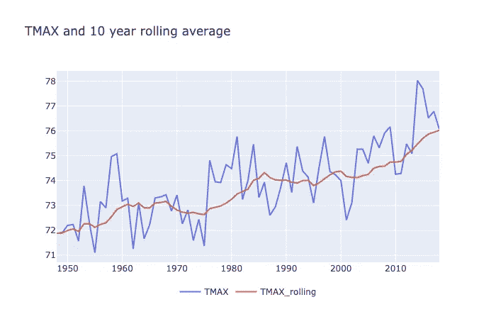
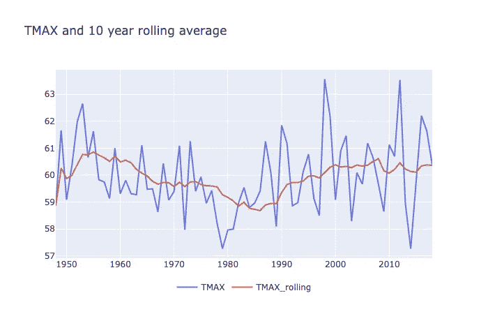
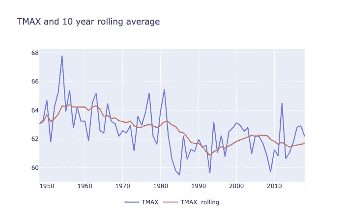

# 可视化气候变化

> 原文：<https://towardsdatascience.com/visualizing-climate-change-65ea422cf2dd?source=collection_archive---------30----------------------->

## Plotly 和 Dash 用于创建交互式可视仪表盘

Photo by [Frederik Schönfeldt](https://unsplash.com/@fschoenfeldt?utm_source=unsplash&utm_medium=referral&utm_content=creditCopyText) on [Unsplash](https://unsplash.com/t/nature?utm_source=unsplash&utm_medium=referral&utm_content=creditCopyText)

几个月前，我写了一篇文章，将否认气候变化视为某种应用数据科学问题:收集数据，可视化趋势，并进行统计测试，以说明气候变化的影响已经显而易见。在过去的几周里，我更新了这个项目，增加了更多的城市(几乎所有美国人口排名前 100 的城市)和一个交互式仪表盘来展示结果。我很高兴地宣布，结果已经在 isclimatechangeabigdeal.com 的[揭晓。](http://isclimatechangeabigdeal.com)

在这篇文章中，我将介绍什么是数据，它对气候变化意味着什么，并详细介绍如何创建一个仪表板。首先，这些数据向我们展示了什么？

**数据和可视化**

正如我在第一篇文章中所详述的，我从 NOAA 中提取了数据，其中有许多年来详细的历史天气和气候数据。出于几个原因，我关注两个指标，每日最高温度和每日最低温度。首先，考虑到提取这么多城市的数据需要多少 API 请求，提取多个不同的测量值很快就会变得很麻烦。另一个问题是，在整个观察期间，并非每个城市都有每个指标。一个可以说是更好的温度指标是日平均温度(考虑到温度在一天中的变化，这个数字不一定是一天中最高和最低温度的平均值)，但许多城市没有追溯到 50 年代的每日累计数字。

目前的城市列表几乎与维基百科上按人口统计的美国城市列表[完全相同](https://en.wikipedia.org/wiki/List_of_United_States_cities_by_population)，只有少数例外。维基百科上的一些城市没有 NOAA ids，我怀疑是因为它们离大城市太近了。例如，科罗拉多州的奥罗拉是更大的丹佛统计区域的一部分，这可以解释为什么它似乎没有单独存储的指标。丘拉维斯塔和圣地亚哥也是如此，亨德森和拉斯维加斯可能也是如此。不幸的是，内布拉斯加州的奥马哈也丢失了——似乎我在 NOAA 数据库中查看的一个或两个指标都不完整，并且我的一些 api 请求返回了空结果。我向奥马哈的人们道歉！我在寻找一个好的替代数据来源。

目前，我有三种方式汇总数据:对每日最大值和每日最小值进行逐年平均，并计算每年每日最大值超过 90 度的天数。从某些方面来说，这些都是用起来很钝的工具；首先，在一些地区，气候变化可能以更复杂的方式表现出来，而不仅仅是所有温度的上升或下降。尽管如此，我认为更大的趋势可能用平均指标来合理地表示。

我遇到的另一个问题是，将 90 度以上的天数作为度量标准有多敏感。NOAA 提供了每个测量站的数据，许多被调查的城市都有多个测量站。不同的站点并不总是有相同的每日最大值和最小值-考虑到一些城市的足迹有多大，这是有意义的。我需要决定如何汇总拥有多个测量站的每个城市的数据，我选择简单地将每个测量站的数据平均在一起。因此，如果某一天一些气象站的最大值超过 90，但其他气象站没有，并且所有气象站之间的平均值没有完全超过 90，则这一天不会计入该城市超过 90 的天数。因此，我的数字可能与其他地方的其他来源的数值不完全匹配——其他人可能会通过计算每天至少有一个站超过 90 或要求所有站都高于 90 来使该指标或多或少敏感。

右边仪表板的最后一块将你在过去 10 年中选择的指标与 20 世纪后半叶的平均值进行了比较。例如，在默认页面上，你会看到，与 1950 年至 2000 年期间相比，纽约的日平均最高气温在过去十年中上升了 1.25 度。当然，正如您将在图表中清楚看到的，这些指标每年都会有一点反弹，因此不同年份样本之间的差异很可能归因于样本的随机性。为了说明这一点，我还执行了一个统计测试来比较这两个平均值，并将结果显示为比值。这些概率都被四舍五入到一个合理的整数。

关于气候变化，这些数据说明了什么？

我鼓励你自己摆弄一下仪表盘，看看你的家乡(或离你家乡最近的大城市)的气温是否有显著变化。在我的探索中，几个趋势是显而易见的:

**1。气候变化的影响因地而异。**

在这个国家的不同城市或不同地区之间，趋势看起来非常不同。在一些城市，这一趋势看起来清晰而显著。以圣安娜为例，现在的平均日最高气温比 20 世纪高 2.5 度(日最低气温比 20 世纪高 4 度以上):

Average daily maximum temperatures by year in Santa Ana

相比之下，托莱多似乎没有太多的趋势。日平均最高气温上升了 0.6 度，但与年与年之间的差异相比，这一差异非常小。

Average daily maximum temperatures by year in Toledo

一些城市的日平均最高气温甚至有所下降，但是…

**2。总体趋势倾向于变暖**

如果我们观察到的唯一差异是由于随机抽样造成的，那么你会认为大约一半的城市看起来变暖了，而另一半看起来更冷了。事实并非如此。大多数城市都经历了某种程度的变暖。在这里显示的 86 个城市中，只有 5 个城市在过去十年里的日平均最高气温低于 20 世纪下半叶。如果你住在像丹佛这样的城市，你就不必太担心极端高温，因为过去十年的日平均最高气温比前一时期低了 1 度左右:

Average daily maximum temperatures by year in Denver

这是否意味着丹佛的居民知道气候变化对他们没有威胁就可以高枕无忧了？不完全是…

**3。不同的指标揭示不同的趋势**

如果您比较不同的可用指标，您有时会注意到非常不同的效果。丹佛最近看到平均每日最高值下降，但如果你看看*每日最低值*，你会看到相反的效果。在过去的十年里，日最低温度比以前高了 1.5 度以上:

Average daily minimum temperatures by year in Denver

这是怎么回事？嗯，每日最低气温上升的幅度超过了每日最高气温。天气和气候是复杂的系统，气候变化的不同方面有不同的方式。也许某个地区的最高温度更直接地取决于太阳总辐照度，并更受当地云量等因素的影响，而每日最低温度则受大气影响，即使云层阻止每日最高温度上升那么多，也可能相对于以前的时期上升。

所有这些都是说丹佛还没有完全摆脱困境。丹佛很可能正在经历气候变化的影响，这种影响不像日最高气温上升那么简单，但也同样重要。

**技术细节**

在 python 中，使用 Plotly 和 Dash 等工具构建这样的交互式仪表板并不复杂。Plotly 是一个非常强大的绘图工具，用最少的额外代码就可以制作出交互式的非常吸引人的图形。上面所有的温度图都是由几行代码组成的，如下所示:

关于 Plotly 的工作原理，需要理解的基本内容是，它在两个独立的对象中接收数据和布局信息。在我上面的例子中，数据是 plotly graph 对象的列表，图表中的每个元素对应一个 graph 对象。我有两行(指标和滚动平均值)，所以我需要一个包含两个图形对象的列表。这些是由 x 和 y 数据的系列或列表加上特定类型的图表组成的——在本例中是线条。其他布局信息存在于布局对象中(在本例中，我只包含了一个图表标题)。Plotly 为创建了一个交互式的 html 对象，但是可以方便地保存一个静态的。如果你需要的话。

整个应用程序的代码稍微复杂一点。然而，Dash 允许您调整 python 中页面的 html 布局，并加入交互式元素。该应用程序的一个简单版本，只有一个城市和一个下拉菜单来选择指标，可以通过以下代码实现:

Dash 允许您向页面添加元素，并使用列表和字典从 python 控制底层 html。Dash 也方便地拥有自己的一套交互功能对象，比如我使用的下拉菜单、滑块或文本输入框。关键的事情是将输入与你希望它产生效果的元素恰当地联系起来。在更复杂的页面中，这可能意味着处理多个回调和元素 id。

希望这能启发你建立交互式仪表盘，并可能阻止即将到来的气候灾难。