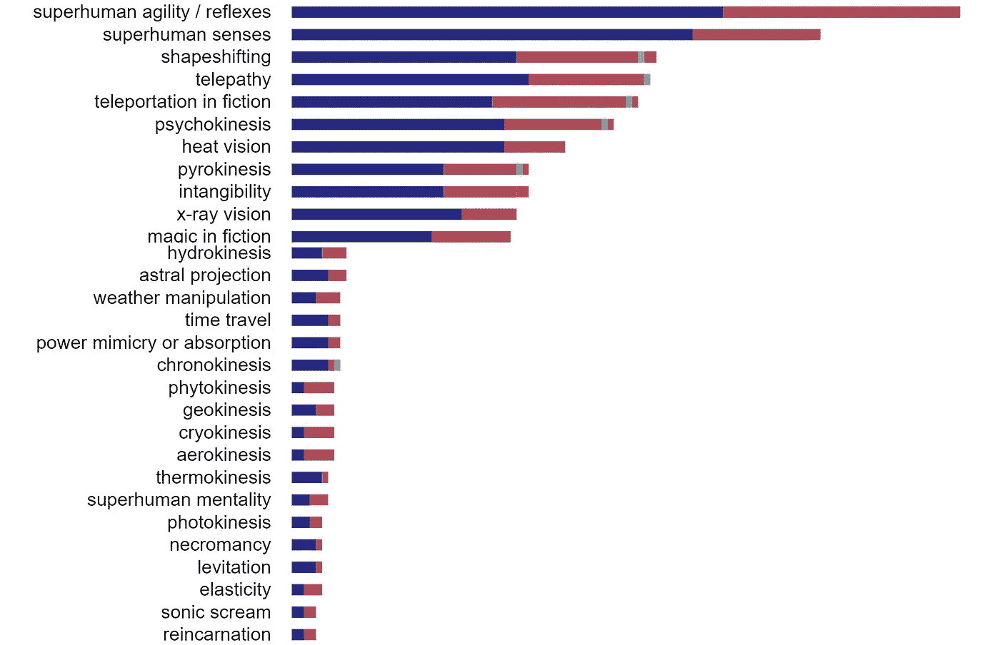
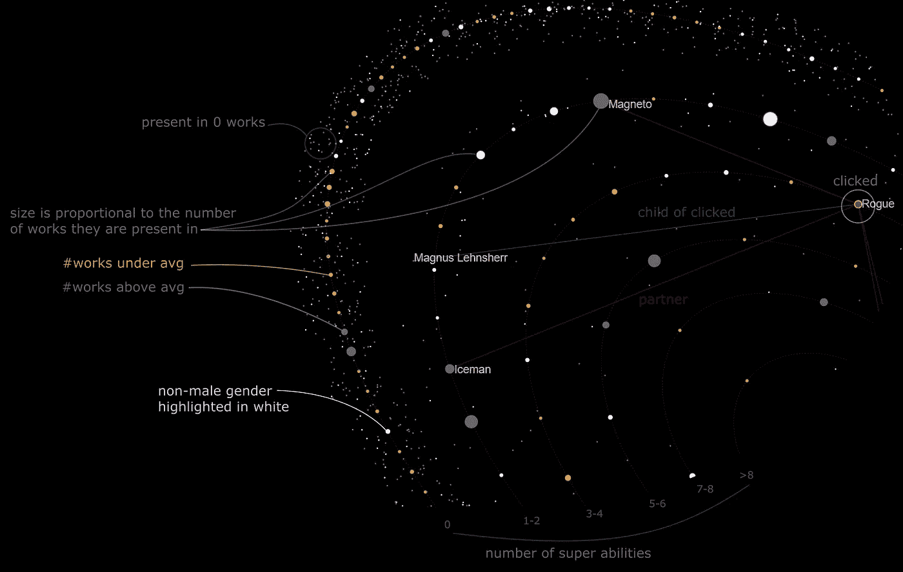
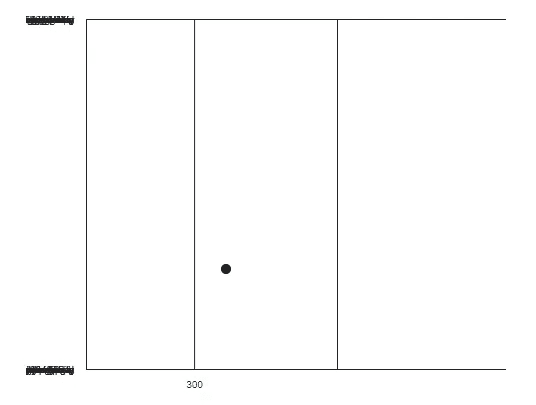
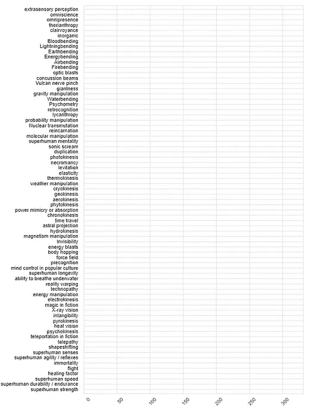
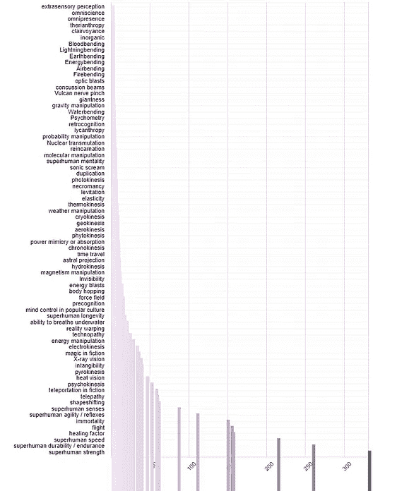
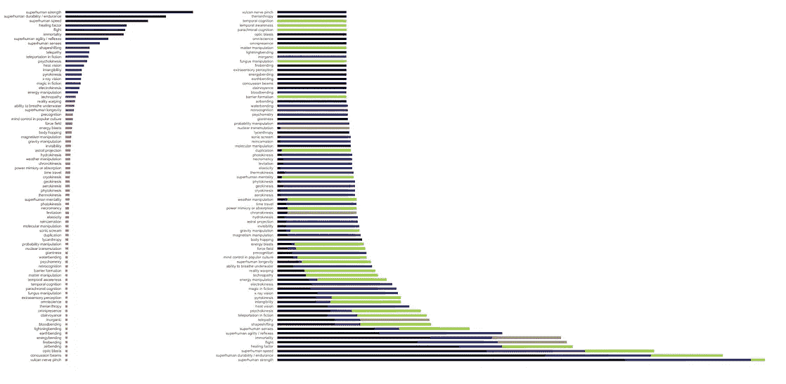
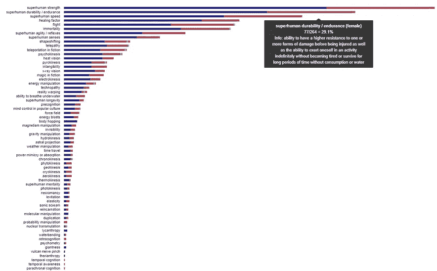

# 可视化漫画人物的性别和超能力

> 原文：<https://towardsdatascience.com/visualizing-comic-characters-genders-and-superpowers-ae7c2311cb89?source=collection_archive---------19----------------------->

## 如何使用 D3 & React 创建带工具提示的堆积条形图？以及关于漫画、性别和超能力的简短讨论

A small piece of the final chart

# 摘要

**1。可视化超能力和性别**

**2。查询漫画数据**

**3。创建 React 组件**

**4。设置工具提示**

**5。参考资料学习 D3 &反应积分**

React 和 D3 是我在这里使用的工具。我指出这个版本不同于常规 D3 版本的核心部分，常规 D3 版本基于`enter()`、`exit()`和`update()`。

*我写这篇文章是为了了解一点 D3 并且想用 React 方式编码的人。如果你不知道如何使用 React 编码，我强烈推荐 Scrimba 上的这个 100%免费互动* [*课程*](https://scrimba.com/g/glearnreact) *。*

【https://github.com/heberleh/learn-react-d3/】这是 GitHub 条形图库:**。**

*这是我漫画人物系列的第二部分:*

1.  *[用 SQL 和 Javascript 创建漫威数据库，最简单的方法](/create-a-marvel-database-with-sql-and-javascript-the-easy-way-573ccdf44673)*
2.  *[形象化漫画人物的性别和超能力](https://medium.com/@heberleh/visualizing-comic-characters-genders-and-superpowers-ae7c2311cb89)【这】*
3.  *[用数据可视化比较漫威和 DC](https://medium.com/@heberleh/comparing-marvel-and-dc-with-data-visualization-33b8f8486082)*

**

*Legend of Marvel & DC visualization: [https://heberleh.github.io/comics-universe/](https://heberleh.github.io/comics-universe/)*

# ***1。可视化超能力和性别***

*本节首先引导您进入交互式条形图，并描述有关该图的详细信息。然后，它给你一个关于漫画人物的能力和性别的简单讨论。*

## ***交互式堆积条形图***

*[https://heberleh.github.io/learn-react-d3/](https://heberleh.github.io/learn-react-d3/)*

*我的意图是展示男性、女性和其他性别在超级能力中的分布，同时展示超级能力的受欢迎程度。在这种情况下，堆积条形图是一个合理的选择。*

*每个条形代表一种能力。它的大小代表字符的数量。全部来自 Wikidata。*

*鼠标悬停会显示该技能的详细信息，如描述和数字。*

*我在这张图表中使用了许多颜色。如果我想关注一些特定的信息，这可能会被认为是杂乱的。*

*例如，在[漫威& DC 可视化](https://heberleh.github.io/comics-universe/)中显示的条形图中，我只选择了 2 种颜色。一个是黑暗，另一个是突出非男性角色多于男性角色的能力。*

*这里我只使用了来自任何虚构世界的喜剧角色的实例；在漫威和 DC 的可视化中，我使用了虚拟角色的实例和子类，从虚拟宇宙等于漫威/DC。*

## *解释和讨论*

*当解释这个情节时，我们需要考虑到，事实上，在大多数(如果不是全部的话)虚构的宇宙中，男性多于女性和其他性别。我们可以预计每个宇宙中平均有 60%到 70%的角色是男性。因此，在大多数受欢迎的能力中，也期待更多的男性。*

*另一方面，我们可以发现女性人数多于男性的不太受欢迎的技能。其中有*力场*、*植身术*、*冷冻术*、*气动术*、*弹力术*、*概率操纵*、*后知后觉*和*御血术*。有什么历史或社会事实可以解释吗？*

**

*[Marvel Premier — Dark Phoenix Artist Proof](https://www.deviantart.com/theopticnerve/art/Marvel-Premier-Dark-Phoenix-Artist-Proof-406825127) by [theopticnerve](https://www.deviantart.com/theopticnerve). Under CC BY-NC-ND 3.0*

*很少有角色的性别不同于男性和女性。*

*在图中发现的一个性别被命名为**agender**——查看绿色条。*

*那就是**凤凰力的情况。***

*性别、种族和其他因素比以前被更多地讨论，作者们也更加关注它。*

*举个例子，Jacques Nyemb 讨论了这个话题的一些优点。在第[篇文章](https://medium.com/@jnyemb/race-gender-and-comics-oh-my-d2328b901ab2)中，他写道他的漫画是有关联的:*

> *“我得出了一个我不想得出的结论。读者是白人男性，而我的角色是黑人。”*

*雅克还写了他在创造一个虚构的科学家，一个白人男性时的第一个想法:*

> *“……我很快问自己为什么没有一个女科学家？一个黑人中年人？她的动机在我的新故事中比我坚持原来的想法更有意义。”*

*对我来说，我不是专家，任何想要与我们的现实相联系的宇宙都需要代表不同的人和文化来保持一致。创造一个多样化的虚构世界是为了包容和更接近我们的现实，特别是当它的观众是整个世界的时候。*

# *2.**查询漫画数据***

*为了创建一个图表来显示有多少角色具有每种能力(堆叠的条形大小)以及这些数字如何在性别(颜色、条形)之间分布，我从[漫画数据库](/create-a-marvel-database-with-sql-and-javascript-the-easy-way-573ccdf44673)中查询了一个包含以下信息的表:*

*   *性格；角色；字母*
*   *能力*
*   *性别*

*要使用这个数据库，你只需要下载一些。js 和。json 文件并导入，然后可以使用 SQL 命令进行查询。如果你想了解如何从维基数据中查询数据并创建一个 *Javascript 数据库*，请查看[第一篇文章](/create-a-marvel-database-with-sql-and-javascript-the-easy-way-573ccdf44673)。这是我的`SELEC`命令:*

*经过一些数据处理后，我的数据形成为:*

*   *`labels`矢量:性别标签*
*   *`data`:每个能力一个向量，包含每个性别的字符总数向量，根据`labels`索引*

*示例:*

*我定义了堆叠条形图组件接收数据模型作为输入。它包含获取标签和总计的数据和辅助函数:*

*你可以在这里找到`skillsDistributionByGender()`的完整代码。*

# *3.创建 React 组件*

*在定义了我的数据集之后，我开始基于[这篇文章和](https://medium.com/@caspg/responsive-chart-with-react-and-d3v4-afd717e57583) [Kacper Goliński](https://medium.com/u/fe4fb1172944?source=post_page-----ae7c2311cb89--------------------------------) 的代码创建一个简单的条形图。*

*如果您没有使用 React 和 D3 创建任何图表，您可能会发现从一个简单的条形图开始更容易，然后回来检查我是如何做堆叠图的以及我是如何添加工具提示的。*

*Kacper 还实现了 **ResponsiveWrapper** ，它根据可见窗口的宽度控制图表的`width`。*

*在这一点上，我认为你知道`create-react-app`。如果没有，就去搜索一下，或者查一下我开头提到的课程。*

*我们最终的 SVG 将有两个主要的 React 组件，负责显示 y 轴和技能的标签(`<Axes/>`)以及堆叠的条形图(`<StackedBars/>`)。我设置了一个额外的组件来控制工具提示，显示在每个条的鼠标上(`<ReactTooltip/>`):*

***集成 D3 和 React 有不同的方法**。*

*第一种方法是使用 React 对应用程序进行模块化，并使用 D3 通过 *enter()、update()和 exit()* 来控制 SVG 元素。*

*第二种方法是使用 React 控制所有 SVG 元素，这对 React 应用程序更有意义。因此，我们不会调用`.attr('width', 200)`，而是将它直接设置为组件或 SVG 元素，如下例所示:*

*这段代码返回了`<rect>`元素，我们将把这些元素放入一个`<g>`中，对每个条形/能力的矩形进行分组。因此，我们可以将它添加到一个函数中，并为每个能力调用它，代码如下:*

*这段代码将为每个能力创建一个`<g>`和一个最终的`<g>`，其中包含了构成图表的所有条形。我们可以在 React 组件中编写所有这些代码，就像我在我的`<StackedBars />` ( [见这里](https://github.com/heberleh/learn-react-d3/blob/master/src/components/Bars/StackedBars.js))中所做的那样。*

*最初，我创建了`x`和`y`轴，但是我意识到实际的轴在我的图表中是不必要的信息。*

> *去掉对你的观众来说不重要的东西可以减少混乱！*

*因此，我让 y 轴保持原样，只使用 CSS 样式`stroke-opacity: 0`省略了`path`和`line`元素(你可以试试`display:none`)。通过移除 React 组件调用，我省略了 x 轴。*

*这是 React & D3 集成的第二个**重要**案例，因为`d3.axis`函数需要 SVG 元素来绘制。这意味着我们不能调用`d3.axis`并获得一个将在 React 组件中返回的 SVG 元素，就像我们在上一个例子中所做的那样。*

*在这种情况下，我们需要给 D3 对 DOM 的临时控制权。为此，我们选择引用当前组件的元素，并告诉 D3 处理它。这里有一个例子:*

*我们用`ref={(el) => { this.axisElement = el; }}`设置轴节点(见上图)，然后用 D3 选择它，并调用 D3 轴函数，就像这里的`d3.select(this.axisElement).call(axis)`一样，这将追加轴元素。*

*上面的例子将在`<g>`元素中绘制轴，并且我们在渲染后将其全部返回给父组件。*

> *"`ref`更新发生在`componentDidMount`或组件更新生命周期方法之前"-[文档](https://reactjs.org/docs/refs-and-the-dom.html)*

*因此，我们的代码首先执行`this.axisElement = el`，然后执行`renderAxis()`。*

***在结论**中，我们定义了使用 React 和 D3 创建 SVG 可视化的两种主要方法:*

1.  ***声明性地**:你控制 SVG 元素；*
2.  ***refs** :赋予 D3 对特定被引用节点的控制权。*

*根据 React [文档](https://reactjs.org/docs/refs-and-the-dom.html)，首选第一种，尽可能避免第二种。如果 D3 中的函数返回 SVG 元素，你可以声明性地使用结果(不使用 ref)，否则，`ref`似乎是避免*进入*、*退出*和*更新*函数的唯一方法。*

# *4.设置工具提示*

*创建工具提示的一种方法是为每个条或堆叠的条构建一个单独的组件；另一种方法是构建一个控制所有工具提示的组件。*

*这就是[反应工具提示](https://www.npmjs.com/package/react-tooltip)的作用。你只需要在工具提示出现的地方设置一些属性，以及 SVG 之外的一个组件`<ReactTooltip/>`的属性。在工具提示将出现的元素中，您设置了两个属性:*数据-提示*和*数据-用于*。第一个是文本，第二个是 ReactTooltip 组件 id，如下所示:*

*ReactTooltip website: [https://www.npmjs.com/package/react-tooltip](https://www.npmjs.com/package/react-tooltip)*

# *5.学习 D3 和 React 集成的参考资料*

*到目前为止，我已经*接触了三个主要活跃作者的内容*，他们使用 D3 和 React，创建教程并分享他们的代码:*

*   *[吴雪莉](https://medium.com/u/4607b4069d83?source=post_page-----ae7c2311cb89--------------------------------):[https://twitter.com/sxywu](https://twitter.com/sxywu)*
*   *纳迪耶·布雷默:[https://twitter.com/NadiehBremer](https://twitter.com/NadiehBremer)*
*   *[瑞士银行柜员](https://medium.com/u/8e43dcd3c21f?source=post_page-----ae7c2311cb89--------------------------------):**【https://twitter.com/Swizec】T4***

# ***6.在幕后***

***这些是我在编码图表时拍摄的一些屏幕截图。如你所见，我开始展示这些轴，最后却把它们拿走了。***

******************

***See all these lines and axes? I don’t need them here.***

************

***Adjusting the bar sizes and placement.***

***请留下您对任何主题的评论或私人笔记。***

***谢谢你看我的文章！***