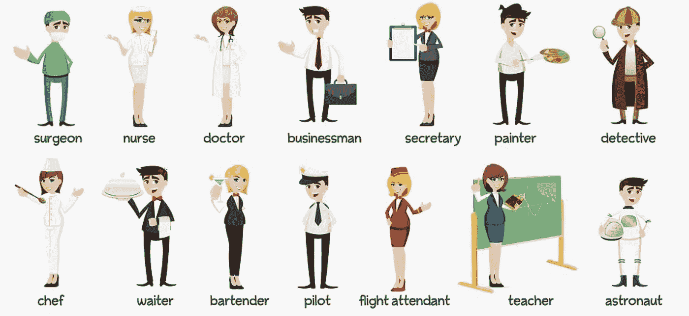
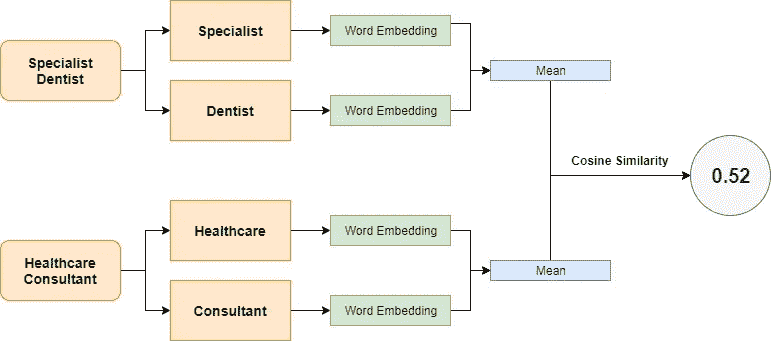
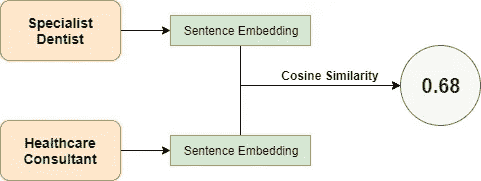
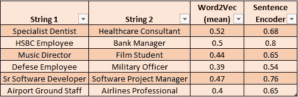
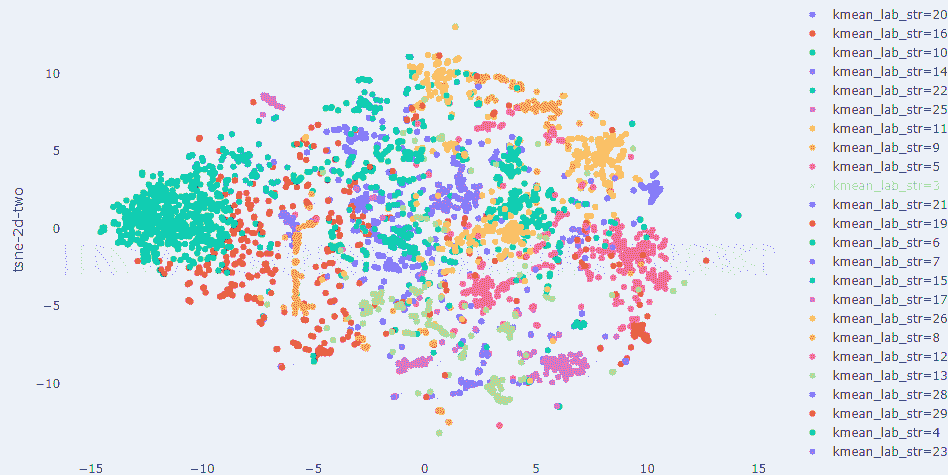
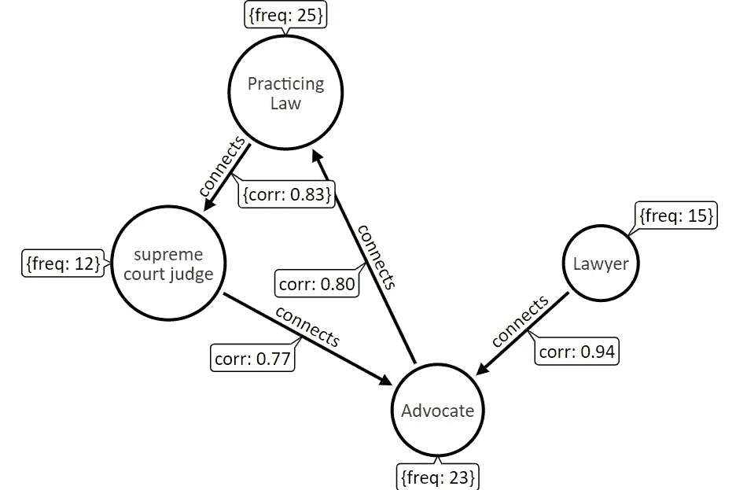

# 用 Neo4j 可视化图形中的文本嵌入和上下文

> 原文：<https://towardsdatascience.com/visualizing-context-with-googles-universal-sentence-encoder-and-graphdb-c5f92b2f3db3?source=collection_archive---------16----------------------->

## Neo4j 中的句子嵌入和图形连接

Photo by [Alina Grubnyak](https://unsplash.com/@alinnnaaaa?utm_source=medium&utm_medium=referral) on [Unsplash](https://unsplash.com?utm_source=medium&utm_medium=referral)

# 介绍

定量分析文本的挑战之一是对字符串进行分类。比方说，我们想研究现有客户的职业概况。我们希望根据他们的专业背景向他们发送有针对性的活动。我们的顾客来自各种背景。当一个人创建一个个人资料时，有些字段是他们作为自由文本输入的。职业就是其中之一。由于这些是自由文本字符串，具有相似职业(相似行业或工作)的人可能会以不同的方式输入他们的。

Figure 1: Example of Occupations (source: Image by author)

我们想要解决基于上述场景的问题。我们必须根据客户注册时输入的职业，为他们创建不同内容的有针对性的交叉销售活动。

我们有大约 10，000 个不同的字符串，我们希望将这些字符串按照客户的职业分为 30 到 40 个行业特定的组。我们发现了许多与工程师、医生、艺术家、国防、教育、设计师、劳工、警卫、食品、交通、企业主等相关的主题。挑战在于以无人监管的方式找到这些主题。

这是嵌入模型的一个很好的用例。随着 Word2Vec、Glove、ELMo 和最近的 BERT 等模型的出现，轻松解决复杂的 NLP 任务已经成为可能。在本文中，我们将尝试理解，对于多单词字符串，句子嵌入比单词嵌入的优势。此外，我们将看到如何使用这些嵌入来分析图形数据库 Neo4j 中相似字符串内的“概念转移”。

## 大声喊出单词嵌入！

像 Word2Vec 和 glove 这样的模型无疑为我们的生活提供了“背景”,使之变得更容易。这些模型已经在来自各种来源的大型语料库上被训练。这些模型背后的直觉是，

> 在同一语境中出现和使用的词在语义上彼此相似，具有相似的意义。

这些模型使我们能够使用迁移学习来完成 NLP 任务。我们可以直接使用这些模型的嵌入来获得固定大小的浮动向量，或者在我们的语料库上微调模型。这使我们能够用少量的数据找到有意义的聚类。

## 数据挑战

Figure 2: Challenges in Data (source: Image by author)

上图显示了客户输入的实际字符串，我们认为这些字符串可以归入“医疗”类别。通过观察字符串，我们可以直接看到数据中的一些挑战:

*   拼写错误——Doctor 写成 Doctor
*   不止一个词——骨科医生
*   缩写——医生写成 Dr
*   各种类型的医生——神经外科医生、牙医、医疗主管等。

因此，我们需要一种方法，以某种方式将所有这些字符串组合在一起。实现这一点的一种方法是使用 Word2Vec 模型。Word2Vec 是一个在大型语料库上训练的神经网络，它为每个单词提供固定大小的浮点数向量。出现在相似上下文中的单词有相似的向量。所以，“博士”、“docter”、“dr”都用在相似的语境中，因此有相似的嵌入。

然而，我们的数据可能包含多个单词字符串，我们希望使用模型进行推理，而不是进行微调。Word2Vec 返回一个单词的向量。一种方法是对多单词串中每个单词的嵌入取平均值。尽管这种策略可能适用于我们的职业数据，但对于较长的句子，它不会产生很好的结果。因为我们对每个单词进行平均嵌入，所以我们失去了整个句子的上下文。这就是句子编码器的用武之地。谷歌的*通用句子编码器*，嵌入任何可变长度的文本到一个 512 大小的矢量中。TF-hub 上有两种型号可供选择。一个是基于*变压器网络*，第二个是基于*深度平均网络* 的嵌入。要理解这些是如何工作的，请看谷歌研究中心的这篇论文。

让我们举一些具体的例子来理解对于多单词串，句子嵌入比单词嵌入的优势。假设我们有两种职业——“专业牙医”和“医疗顾问”。因为这两个职业都属于医学领域，我们可以预期它们有相似的嵌入，因此有很高的余弦相似性。让我们看看下面两种方法返回的余弦相似性的比较。

**方法 1 —取 Word2Vec 嵌入的平均值**

Figure 3.1: Word2Vec approach (source: Image by author)

在这里，我们首先将字符串拆分成单词，并使用[Gensim](https://radimrehurek.com/gensim/models/word2vec.html)(Google news-vectors-negative 300)中的 Word2Vec 模型获得单词嵌入。我们取相应职业返回的单词嵌入向量的平均值。然后，我们计算两个平均向量之间的余弦相似度。

**方法 2——使用谷歌句子编码器**

Figure 3.2: Sentence Encoder approach (source: Image by author)

这里，我们使用来自 Tensorflow hub 的 [DAN 模型](https://tfhub.dev/google/universal-sentence-encoder/2)得到句子嵌入。然后我们简单地取返回向量之间的余弦相似性。

我们可以看到第二种方法给了我们更好的结果。与 Word2Vec 和 Google 通用句子编码器的更多余弦相似性比较:

Figure 4: Comparison of cosine similarities (Word2Vec vs Sentence Encoder) (source: Image by author)

对于所有的职业对，我们观察到句子编码器执行单词嵌入。这是可以理解的，因为“专家”可以是任何人。因此，Word2Vec 为“专家”返回的嵌入是通用的，并不依赖于单词“牙医”(参见图 3.1)。同样，第二职业中的“顾问”可以是任何职业。句子编码器返回与单词“Healthcare”和“Consultant”相互依赖的嵌入。因此，我们得到具有更高余弦相似性的嵌入向量。
此外，请注意句子编码器为汇丰员工和银行经理返回的高余弦相似性。算法知道汇丰是银行！在我们拥有少量数据的情况下，我们无法使用计数矢量器和 tf-idf 方法实现这一点。

# 可视化嵌入

一旦我们有了字符串的嵌入，我们使用 [t-SNE](/an-introduction-to-t-sne-with-python-example-5a3a293108d1) 将数据的维度从 512(句子编码向量的大小)减少到 2。此外，我们使用 K 个最近邻生成多个聚类。
我们使用 [plotly express](https://plot.ly/python/plotly-express/) 围绕 plotly graph 对象的高级包装器在散点图上绘制结果。

Figure 5: 2D t-SNE clusters for Occupation (source: Image by author)

正如我们在上面看到的，相似的职业已经聚集在一起。例如，所有与纺织相关的职业(天蓝色的集群)，如“裁缝”、“女装店”、“纱丽批发店”、“roohi 服装”，彼此之间的距离越来越近。我们可以把所有这些分类归入“纺织品”一类。同样，所有与“教育”相关的职业(紫色部分)都聚集在一起。左边的绿色污迹是一类严重的拼写错误，与其他聚类完全不同，因此彼此相似:)

# 用 Neo4j 跟踪图中的概念

t-SNE 图能够给我们的数据一个静态的 2D 表示。类似地，嵌入的相关图会给我们职业字符串之间的一级关系。如果我们想跟踪二级或二级以上的关系呢？

为了做到这一点，我们可以创建一个图表，其中每个职业都与另一个职业有关联。大概是这样的:

Figure 6: Graph schema for storing strings (source: Image by author)

在这里，“律师”与“最高法院法官”有二级联系。边(关系)的权重表示节点之间的余弦相似性。注意，我们只连接余弦相似度≥ 0.75 的那些节点。这确保了只有高度相关的数据在图中被连接。

上述模式在 Neo4j 中得到了应用。最常用的图形数据库之一。一定要观察它是如何从“概念”转移到“概念”的。
(注意:如果在浏览器上，强烈建议放大以便更好地查看)

1.  **先导**

Figure 7.1: Graph of “Pilot” (source: Image by author)

**主题 1——酒店试点**

> 飞行员->航空->航空专业->空乘->机舱服务员->酒店工作->其他酒店工作

**主题 2——飞行员对国防**

> 飞行员->空军->陆军->海军和商船队

飞行员既可以是私人航空公司的飞行员，也可以是空军飞行员。这就是我们在上述两个主题中看到的。一个分支走向接待，另一个分支走向防御。

2.**作家**

Figure 7.2: Graph for “Writer” (source: Image by author)

**主题——作家对新闻记者**

> 作家->文档作家->编辑->记者->记者->电视新闻记者

3.**机械师**

Figure 7.3: Graph for Mechanic (source: Image by author)

**主题—技工到建筑工人和结构工程师**

> 技工->交流技工->交流技术员->电工->焊工->钢筋工->建筑

4.**摄影师**

Figure 7.4: Graph for Photographer (source: Image by author)

**主题 1——摄影师到建筑师**

> 摄影师->时尚摄影师->服装设计师->室内设计师->建筑师

**他们 2 —拍摄素材的摄影师**

> 摄影师->视觉特效艺术家->助理摄影师->视频导演->电影制作人->更多电影素材

**5。农民**

Figure 7.5: Graph for Farmer (source: Image by author)

**主题——奶农到牛奶供应商**

> 农民->农业->奶牛场->牛奶和奶制品企业->牛奶供应商

# 最后的想法

结合嵌入的图成为理解信息流的强大可视化工具。我们提供了一个简单的例子，说明如何使用图表来理解和跟踪文本文档中的上下文。由于问题的小性质，很容易理解为什么“飞行员”既指向“空军”，又指向“酒店”。然而，

> 我们可以将其扩展到更大文档的应用程序，如研究论文、法律文档、书籍，并在图表上构建推荐或搜索系统。

如果你想了解更多关于文本嵌入的知识，可以看看这篇令人惊叹的文章:[自然语言处理的深度迁移学习](/deep-transfer-learning-for-natural-language-processing-text-classification-with-universal-1a2c69e5baa9)，作者 [Dipanjan (DJ) Sarkar](https://medium.com/u/6278d12b0682?source=post_page-----c5f92b2f3db3--------------------------------) 。