# 用 Pytorch 可视化卷积神经网络

> 原文：<https://towardsdatascience.com/visualizing-convolution-neural-networks-using-pytorch-3dfa8443e74e?source=collection_archive---------2----------------------->


Photo by [Karsten Würth (@karsten.wuerth)](https://unsplash.com/@karsten_wuerth?utm_source=medium&utm_medium=referral) on [Unsplash](https://unsplash.com?utm_source=medium&utm_medium=referral)

**卷积神经网络** (CNN)是另一种类型的神经网络，可用于使机器可视化事物并执行任务，如图像分类、图像识别、对象检测、实例分割等。但神经网络模型通常被称为“黑盒”模型，因为很难理解模型如何学习输入中存在的复杂依赖关系。此外，很难分析为什么在推断过程中做出给定的预测。

在本文中，我们将探讨两种不同类型的可视化技术，例如:

1.  可视化学习的滤波器权重。
2.  对图像执行遮挡实验。

这些方法帮助我们理解过滤器学习什么？什么样的图像会导致某些神经元放电？输入图像的隐藏表示有多好？。

> ***引用注:*** *本文内容和结构基于四分之一实验室深度学习讲座——*[*帕德海*](https://padhai.onefourthlabs.in/) *。如果你有兴趣，可以去看看那里的课程。*

# 神经元感受野

在我们继续和可视化卷积神经网络的工作之前，我们将讨论 CNN 中存在的过滤器的感受野。

假设我们有一个两层卷积神经网络，并且我们通过网络使用 3×3 滤波器。第 2 层中以黄色标记的中心像素实际上是对第 1 层中的中心像素应用卷积运算的结果(通过使用 3×3 内核和步长= 1)。类似地，层 3 中存在的中心像素是对层 2 中存在的中心像素应用卷积运算的结果。

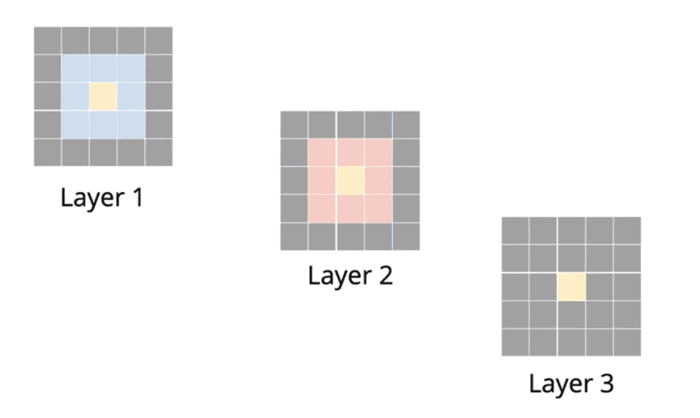

神经元的**感受野**定义为输入图像中能够影响卷积层中神经元的区域，即……原始图像中有多少像素正在影响卷积层中的神经元。

很明显，层 3 中的中心像素依赖于前一层(层 2)的 3×3 邻域。存在于层 2 中的包括中心像素的 9 个连续像素(用粉红色标记)对应于层 1 中的 5×5 区域。随着我们在网络中越来越深入，更深层的像素将具有高感受野，即……相对于原始图像的感兴趣区域将更大。

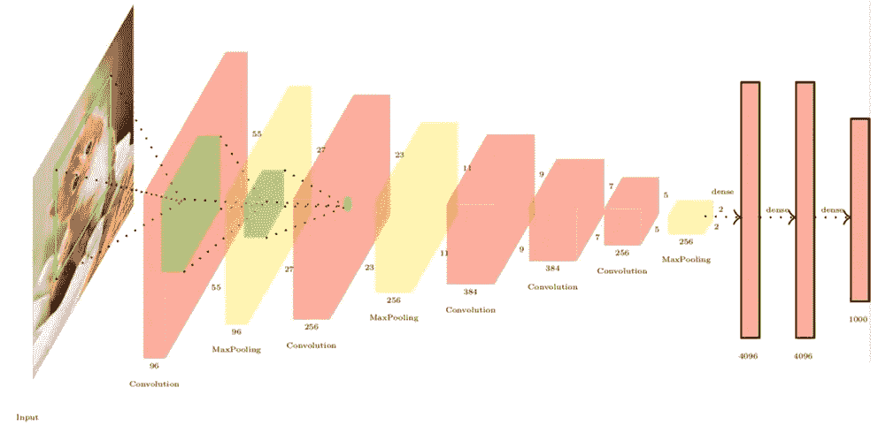

从上面的图像中，我们可以观察到，第二卷积层中突出显示的像素相对于原始输入图像具有较高的感受野。

# 可视化 CNN

为了形象化 CNN 的工作，我们将探索两种常用的方法来理解神经网络如何学习复杂的关系。

1.  使用预先训练的模型进行过滤可视化。
2.  使用预训练模型进行遮挡分析。

# 在 Colab 中运行此笔记本

文章中讨论的所有代码都在[我的 GitHub](https://github.com/Niranjankumar-c/DeepLearning-PadhAI) 上。在 Github 上直接打开[my Jupyter Notebook with Colab](https://colab.research.google.com/github/Niranjankumar-c/DeepLearning-PadhAI/blob/master/DeepLearning_Materials/6_VisualizationCNN_Pytorch/CNNVisualisation.ipynb) 可以用任何设置打开 code notebook，Colab 运行在 Google 的虚拟机上。如果您只想快速打开笔记本并按照本教程进行操作，请单击此处的。

*在执行 Colab 中的代码之前，不要忘记将输入图像文件夹(可以从 Github Repo 下载)上传到 Google Colab。*

[](https://github.com/Niranjankumar-c/DeepLearning-PadhAI/tree/master/DeepLearning_Materials/6_VisualizationCNN_Pytorch) [## niranjankumar-c/deep learning-PadhAI

### 来自 pad hai-Niranjankumar-c/deep learning-pad hai 的深度学习课程相关的所有代码文件

github.com](https://github.com/Niranjankumar-c/DeepLearning-PadhAI/tree/master/DeepLearning_Materials/6_VisualizationCNN_Pytorch) 

# 可视化输入图像

在本文中，我们将使用包含 1000 个类别的 ImageNet 数据集的一个小子集来可视化模型的过滤器。数据集可以从我的 [GitHub repo](http://If you want to skip the theory part and get into the code right away,) 下载。

为了可视化数据集，我们将实现自定义函数`imshow`。

函数`imshow`有两个参数——张量中的图像和图像的标题。首先，我们将针对 ImageNet 平均值和标准偏差值执行图像的逆归一化。之后，我们将使用`matplotlib`来显示图像。

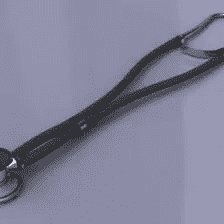

Sample Input Image

# 过滤器可视化

通过可视化训练模型的过滤器，我们可以了解 CNN 如何学习图像中存在的复杂的空间和时间像素依赖性。

> 过滤器捕捉什么？

假设我们有大小为 4x4 的 2D 输入，我们从图像的左上角开始对图像应用 2x2 的过滤器(用红色标记)。当我们在图像上从左到右、从上到下滑动内核来执行卷积运算时，我们会得到比输入更小的输出。

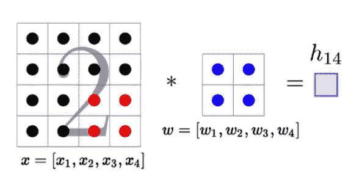

每个卷积运算(如 h₁₄)的输出等于输入向量和权重向量的点积。我们知道，两个向量之间的点积与向量之间夹角的余弦成正比。

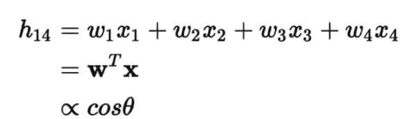

在卷积运算过程中，当我们在输入图像的某些部分(如包含狗脸的图像部分)上应用滤镜时，这些部分可能会给出较高的值。在上面的例子中，让我们讨论在什么样的情况下我们的输出 h₁₄会很高？。

如果矢量之间的余弦值很高，即……余弦值应该等于 1，则输出 h₁₄会很高。如果余弦角等于 1，那么我们知道向量之间的角度等于 0⁰.这意味着输入向量(图像的一部分) **X** 和权重向量 **W** 都处于神经元将最大程度地触发的相同方向。

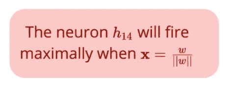

当输入 **X** (用于卷积的图像的一部分)等于单位向量或单位向量的倍数时，在滤波器向量 **W** 的方向上，神经元 h₁₄将最大程度地激发。

换句话说，我们可以把滤镜想象成一个图像。当我们在输入上从左到右、从上到下滑动过滤器时，只要过滤器与输入的类似部分重合，神经元就会触发。对于输入图像中与滤镜不对齐的所有其他部分，输出将会很低。这就是我们称核或权重矩阵为过滤器的原因，因为它过滤掉输入图像中与过滤器不一致的部分。

要了解过滤器学习哪种模式，我们可以绘制过滤器，即…与过滤器相关的权重。对于过滤器可视化，我们将使用预先用 ImageNet 数据集训练的 Alexnet。

```
#alexnet pretrained with imagenet data
#import model zoo in torchvisionimport torchvision.models as models
alexnet = models.alexnet(pretrained=True)
```

Alexnet 包含 5 个卷积层和 3 个全连接层。ReLU 在每次卷积运算后应用。请记住，在 3D (RGB)图像的卷积运算中，由于内核和图像具有相同的深度，因此内核不会随深度移动。我们将以两种方式可视化这些过滤器(内核)。

1.  通过将三个通道组合成一个 RGB 图像来可视化每个滤镜。
2.  使用热图独立显示过滤器中的每个通道。

绘制重量的主要功能是`plot_weights`。该函数有 4 个参数，

`model` — Alexnet 模型或任何经过训练的模型

`layer_num` —卷积层数以可视化权重

`single_channel` —可视化模式

`collated` —仅适用于单通道可视化。

在`plot_weights`函数中，我们采用训练好的模型并读取该层号处的层。在 Alexnet (Pytorch model zoo)中，第一卷积层用层索引零来表示。一旦我们提取了与该索引相关的层，我们将检查该层是否是卷积层。因为我们只能看到卷积层。在验证层索引之后，我们将提取该层中存在的学习重量数据。

```
#getting the weight tensor data
weight_tensor = model.features[layer_num].weight.data
```

根据输入参数`single_channel`，我们可以将重量数据绘制成单通道或多通道图像。Alexnet 的第一个卷积层有 64 个大小为 11x11 的滤镜。我们将以两种不同的方式绘制这些过滤器，并了解过滤器学习哪种模式。

## 可视化过滤器—多通道

在`single_channel = False`的例子中，我们有 64 个深度为 3 (RGB)的滤镜。我们将把每个过滤后的 RGB 通道合并成一个大小为 11x11x3 的 RGB 图像。结果，我们将得到 64 个 RGB 图像作为输出。

```
#visualize weights for alexnet — first conv layer
plot_weights(alexnet, 0, single_channel = False)
```

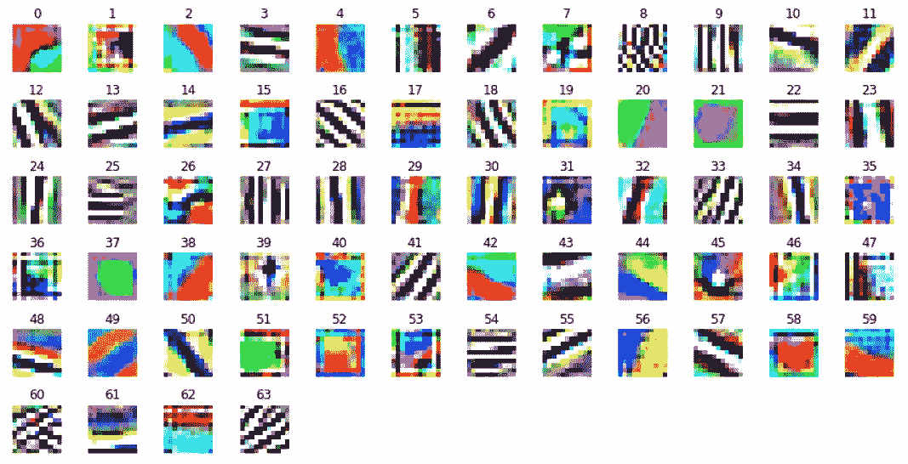

**Filters from first convolution layer in AlexNet**

从这些图像中，我们可以解读出内核似乎学会了模糊的边缘、轮廓和边界。例如，上图中的图 4 表示过滤器正在尝试学习边界。类似地，图 37 表明过滤器已经学习了轮廓，这可以帮助解决图像分类的问题。

## 可视化过滤器—单通道

通过设置`single_channel = True`，我们将过滤器中的每个通道解释为一个单独的图像。对于每个滤波器，我们将得到代表每个通道的 3 个单独的图像，因为对于第一次卷积运算，滤波器的深度是 3。总之，我们将有 64*3 的图像作为可视化的输出。

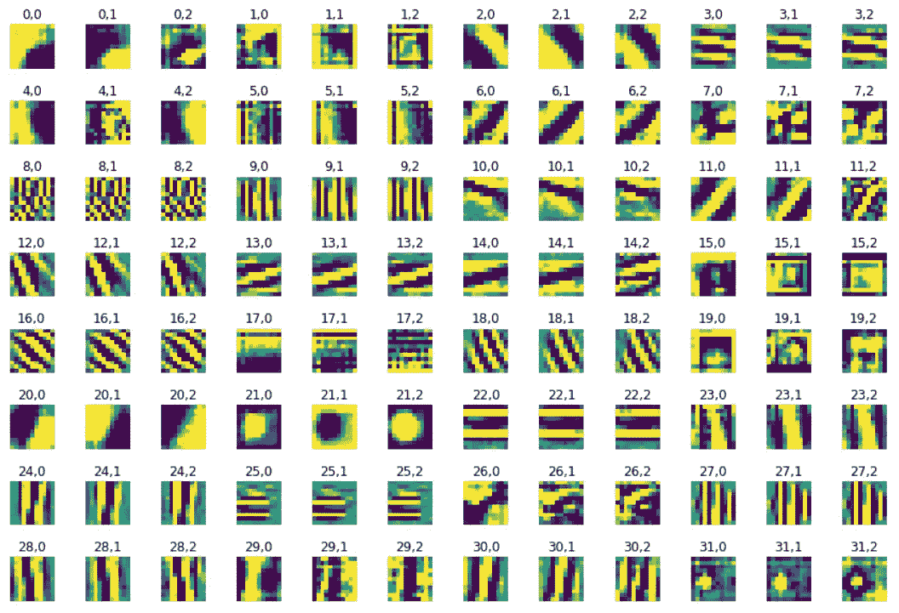

**Filters from the first convolution layer in AlexNet (A subset out of 192 images)**

从上图中，我们可以看到总共 64 个滤波器(0–63)中的每个滤波器通道都是单独可视化的。例如，图 0，0 表示图像表示对应于第零通道的第零滤波器。类似地，图 0，1 表示图像表示对应于第一通道的第零个滤波器，依此类推。

单独可视化过滤器通道可以更直观地了解不同过滤器基于输入数据正在尝试学习什么。通过仔细观察过滤器可视化，可以清楚地看到，在来自同一过滤器的一些通道中发现的模式是不同的。这意味着并非滤波器中的所有通道都试图从输入图像中获取相同的信息。随着我们越来越深入网络，过滤模式变得越来越复杂，它们倾向于捕捉高层次的信息，如狗或猫的脸。

随着我们越来越深入到网络中，用于卷积的滤波器数量也在增加。我们不可能将所有这些滤光器通道单独可视化为单个图像或单独的每个通道，因为有大量这样的滤光器。Alexnet 的第二卷积层(在 Pytorch 顺序模型结构中索引为层 3)具有 192 个过滤器，因此我们将得到 192*64 = 12，288 个单独的过滤器通道图用于可视化。绘制这些过滤器的另一种方法是将所有这些图像连接成一个带有灰度的热图。

```
#plotting single channel images
plot_weights(alexnet, 0, single_channel = True, collated = True)
```

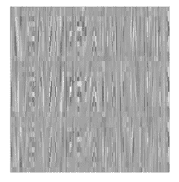

**Filters from the first convolution layer in AlexNet — Collated Values**

```
#plotting single channel images - second convolution layer
plot_weights(alexnet, 3, single_channel = True, collated = True)
```

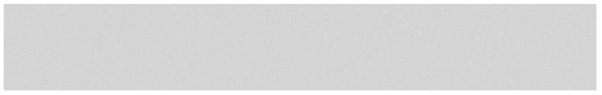

**Filters from the second convolution layer in AlexNet — Collated Values**

```
#plotting single channel images - third convolution layer
plot_weights(alexnet, 6, single_channel = True, collated = True)
```

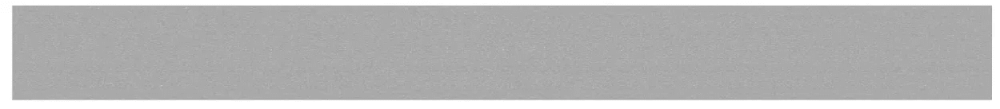

**Filters from the third convolution layer in AlexNet — Collated Values**

如您所见，在第一个卷积图层的图像中有一些可解释的特征，如边缘、角度和边界。但是随着我们深入网络，解释过滤器变得更加困难。

# 图像遮挡实验

执行遮挡实验以确定图像的哪些碎片对神经网络的输出贡献最大。

在一个图像分类问题中，我们如何知道模型实际上是在拾取一个感兴趣的对象(例如汽车车轮)，而不是周围的背景图像？。

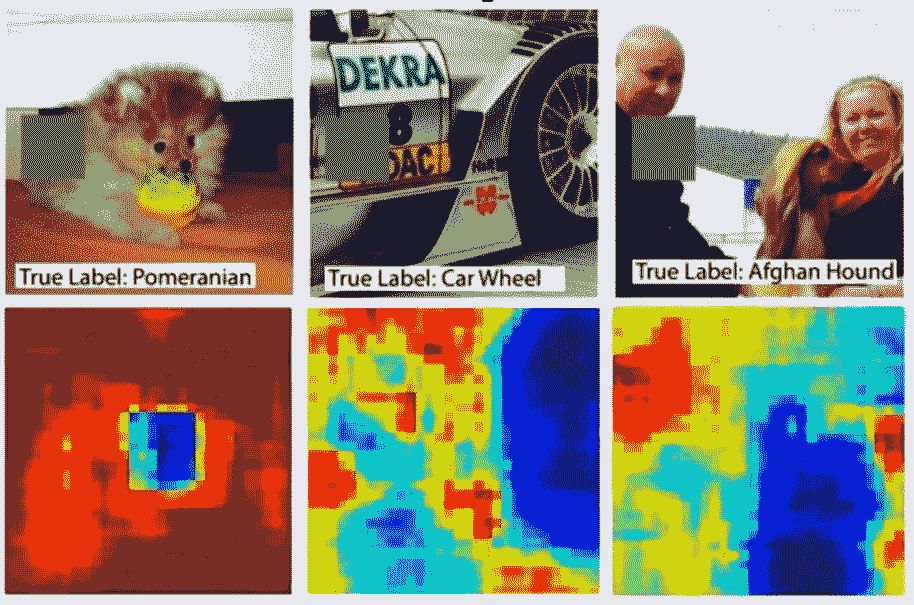

在遮挡实验中，我们通过用设置为零的灰色补片遮挡图像的一部分并监控分类器的概率，来系统地迭代图像的所有区域。

例如，我们通过灰化图像的左上角来开始遮挡实验，并通过将修改后的图像通过网络来计算特定类别的概率。类似地，我们将迭代图像的所有区域，并查看每个实验的分类器的概率。上图中的热图清楚地显示，如果我们遮挡我们感兴趣的对象，如车轮或狗的脸(深蓝色区域)，真实类别的概率会显著下降。

遮挡实验告诉我们，我们的卷积神经网络实际上正在学习一些意义模式，如从输入中检测狗的脸。这意味着该模型真正选择了狗的位置，而不是根据周围的环境(如沙发或躺椅)来识别。

为了清楚地理解这个概念，让我们从我们的数据集中取一个图像，并在其上进行遮挡实验。

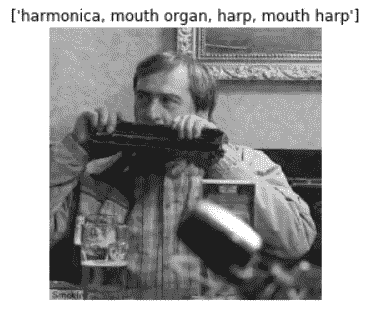

对于遮挡实验，我们将使用在 ImageNet 数据上预先训练的 VGG-16。

```
#for visualization we will use vgg16 pretrained on imagenet data
model = models.vgg16(pretrained=True)
```

为了进行实验，我们需要编写一个自定义函数来对输入图像进行遮挡。函数`occlusion`有 6 个参数——模型、输入图像、输入图像标签和遮挡超参数。遮挡超参数包括遮挡片的大小、遮挡步幅和遮挡像素值。

首先在函数中，我们得到输入图像的宽度和高度。之后，我们将基于输入图像尺寸和遮挡片尺寸来计算输出图像的宽度和高度。然后，我们将根据输出的高度和宽度初始化热图张量。

现在，我们将遍历热图中的每个像素。在每次迭代中，我们将计算原始图像中要替换的遮挡片的尺寸。然后，我们用指定位置的遮挡补丁替换图像中的所有像素信息，即…通过用灰色补丁替换特定区域来修改输入图像。一旦我们有了修改后的输入，我们将通过模型进行推理，并计算真实类别的概率。然后，我们用概率值更新相应位置的热图。

获得热图后，我们使用 seaborn 绘图仪显示热图，并将梯度的最大值设置为概率。

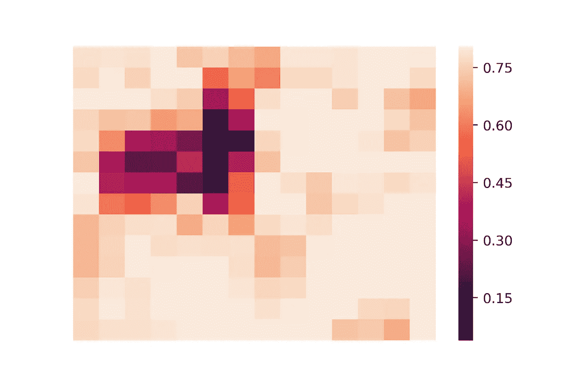

Occlusion Heatmap

从热图上看，颜色越深代表概率越小，意味着该区域的遮挡非常有效。如果我们在原始图像中用较暗的颜色遮挡或覆盖该区域，那么分类该图像的概率显著下降(小于 0.15)。

[](https://github.com/Niranjankumar-c/DeepLearning-PadhAI/tree/master/DeepLearning_Materials/6_VisualizationCNN_Pytorch) [## niranjankumar-c/deep learning-PadhAI

### 来自 pad hai-Niranjankumar-c/deep learning-pad hai 的深度学习课程相关的所有代码文件

github.com](https://github.com/Niranjankumar-c/DeepLearning-PadhAI/tree/master/DeepLearning_Materials/6_VisualizationCNN_Pytorch) 

# 下一步是什么？

如果你想用 Keras & Tensorflow 2.0 (Python 或者 R)学习更多关于人工神经网络的知识。查看来自 [Starttechacademy](https://courses.starttechacademy.com/full-site-access/?coupon=NKSTACAD) 的 Abhishek 和 Pukhraj 的[人工神经网络](https://courses.starttechacademy.com/full-site-access/?coupon=NKSTACAD)。他们以一种简单化的方式解释了深度学习的基础。

# 结论

在这篇文章中，我们讨论了神经网络的感受野。之后，我们讨论了两种不同的方法来可视化 CNN 模型以及 Pytorch 实现。可视化神经网络模型使我们更直观地了解如何为广泛的应用程序改进模型的性能。

*推荐阅读*

[](/understanding-convolution-neural-networks-the-eli5-way-785330cd1fb7) [## 理解卷积神经网络 ELI5 方法

### 了解卷积运算和 CNN 的

towardsdatascience.com](/understanding-convolution-neural-networks-the-eli5-way-785330cd1fb7) [](https://www.marktechpost.com/2019/07/30/introduction-to-image-classification-using-pytorch-to-classify-fashionmnist-dataset/) [## Pytorch FashionMNSIT 数据集影像分类简介

### 在这篇博客文章中，我们将讨论如何建立一个卷积神经网络，可以分类时装 MNIST 数据使用…

www.marktechpost.com](https://www.marktechpost.com/2019/07/30/introduction-to-image-classification-using-pytorch-to-classify-fashionmnist-dataset/) 

如果你在实现我的 GitHub 库中的代码时遇到任何问题，请随时通过 LinkedIn 或 T2 Twitter 联系我。

直到下次和平:)

NK。

**免责声明**——这篇文章中可能会有一些相关资源的附属链接。你可以以尽可能低的价格购买捆绑包。如果你购买这门课程，我会收到一小笔佣金。