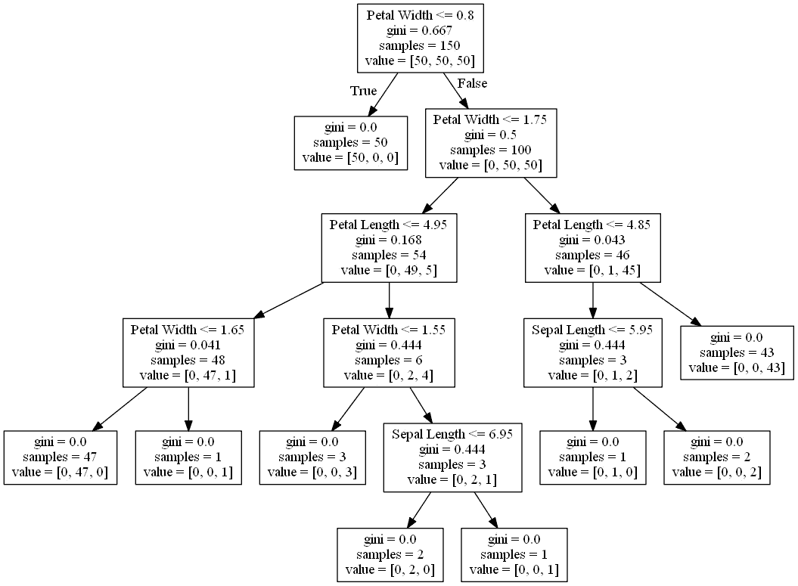

# 用 Python 和 Graphviz 在 Jupyter 笔记本中可视化决策树

> 原文：<https://towardsdatascience.com/visualizing-decision-trees-in-jupyter-notebook-with-python-and-graphviz-78703230a7b1?source=collection_archive---------3----------------------->

决策树回归器和分类器被广泛用作独立的算法或更复杂模型的组件。为了正确理解算法内部是如何做出某些决定的，将它们可视化是至关重要的，这对于业务应用程序来说总是很重要的。

[https://unsplash.com/photos/tGTVxeOr_Rs](https://unsplash.com/photos/tGTVxeOr_Rs)

在这个简短的教程中，我想简单描述一下从 sklearn 库中可视化决策树模型的过程。注意:运行下面的代码需要安装和配置 Graphviz。

作为一个玩具数据集，我将使用一个众所周知的虹膜数据集。让我们导入主库并下载实验数据。

现在，我们将创建一个简单的决策树分类器，并将其应用于整个数据集。

最后，有趣的步骤来了。我们将拟合的决策树导出为一个**。dot** 文件，这是 graphviz 文件的标准扩展名。这个 **tree.dot** 文件将会保存在你的 Jupyter 笔记本脚本所在的目录下。不要忘记包含*特征名称*参数，该参数表示特征名称，将在显示树时使用。

现在，通过运行下面的命令，我们将转换**。点**档到**档。png** 文件。这只适用于 Jupyter 笔记本，如**“!”**符号表示该命令将直接在控制台中执行。

在这个操作之后，tree.png 文件将出现在同一个文件夹中。现在我们可以很容易地显示它，使用众所周知的库。

你会看到下图。

完整的 Jupyter 笔记本代码:

**结论**

如您所见，可视化决策树可以通过使用 *export_graphviz* 库轻松完成。不过，设置 grahpviz 本身可能是一项相当棘手的任务，尤其是在 Windows 机器上

**推荐书籍**

[使用 Scikit-Learn 进行机器实践学习](https://amzn.to/3jF13md)

[用 Python 实现机器学习和深度学习](https://amzn.to/3jIxoIZ)

[Python 机器学习简介:数据科学家指南](https://amzn.to/32NjgqR)