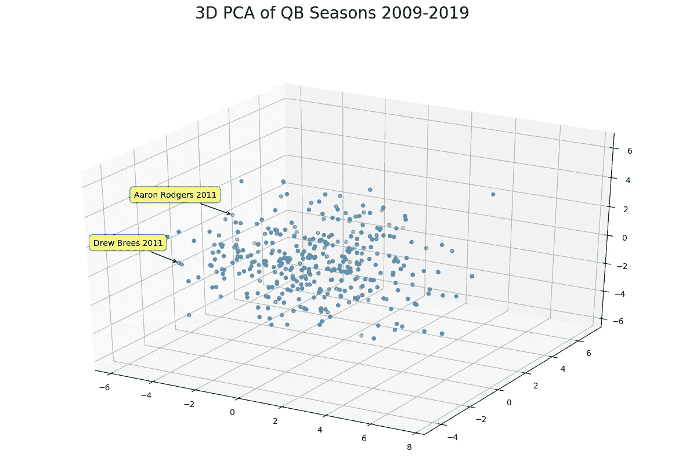
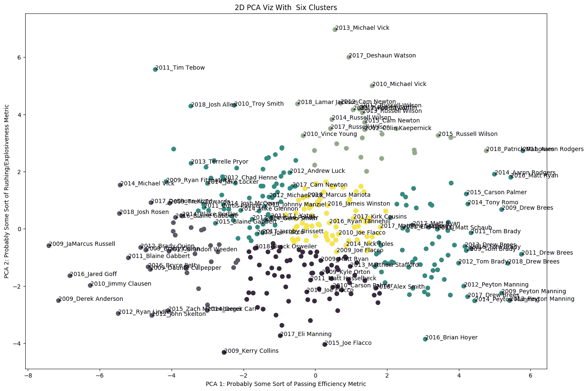
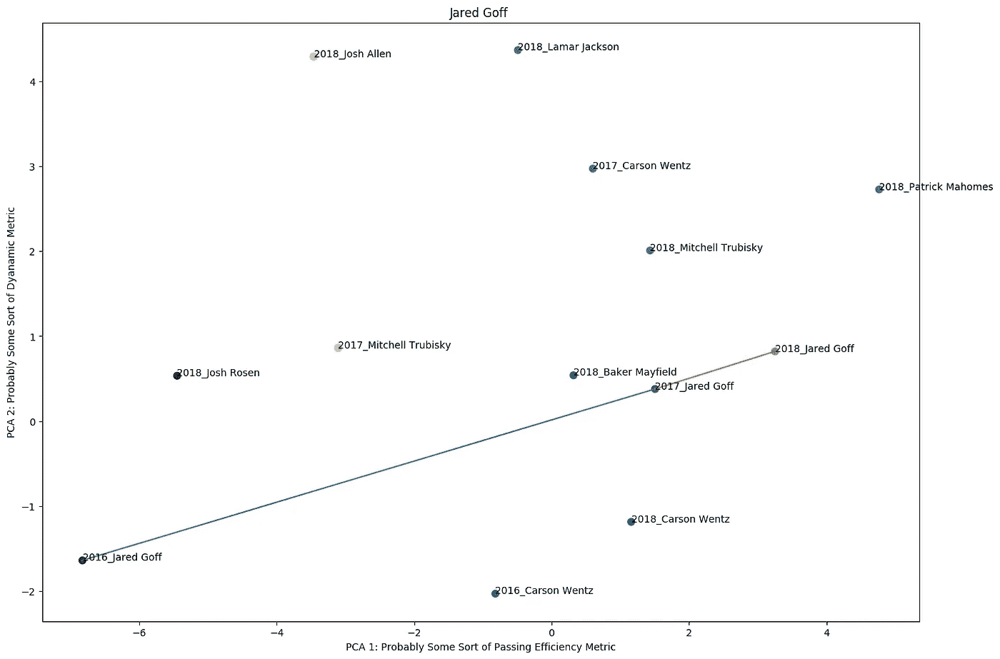
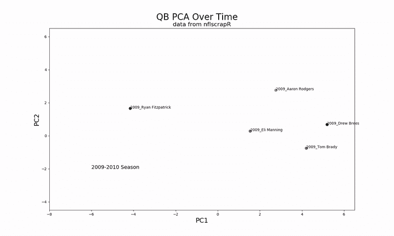
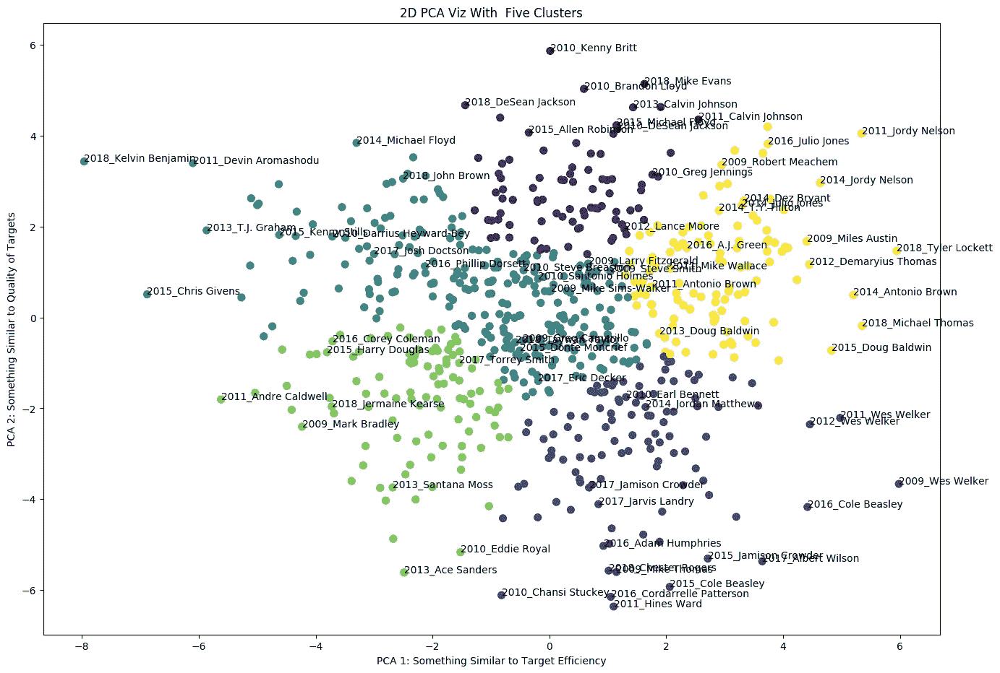
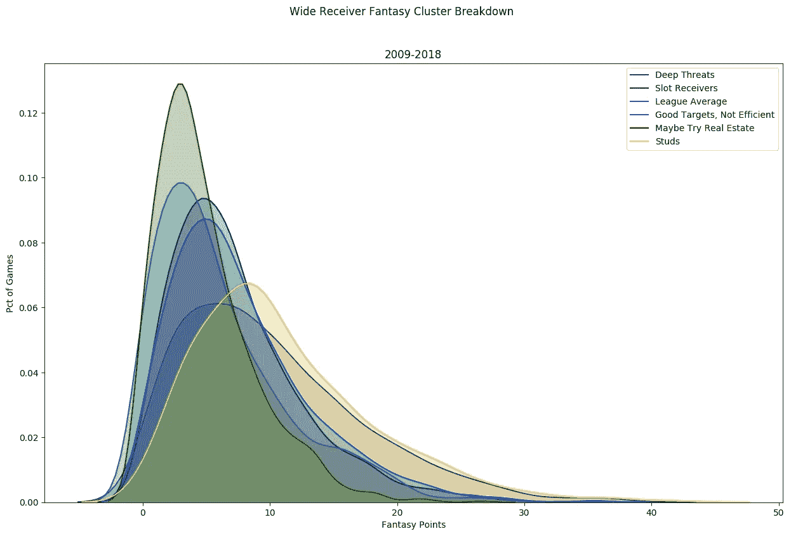
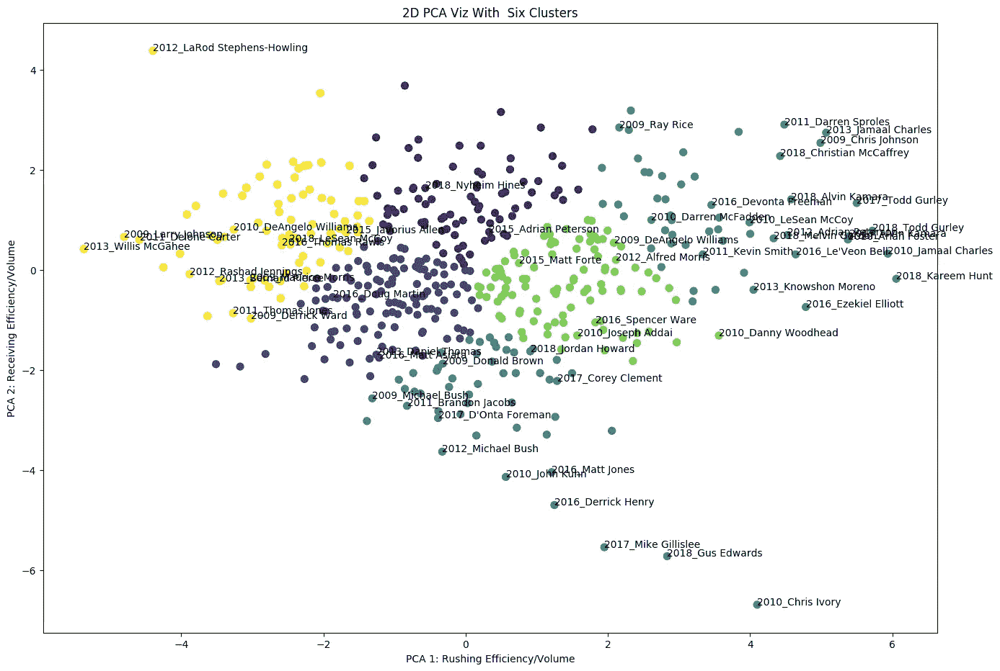
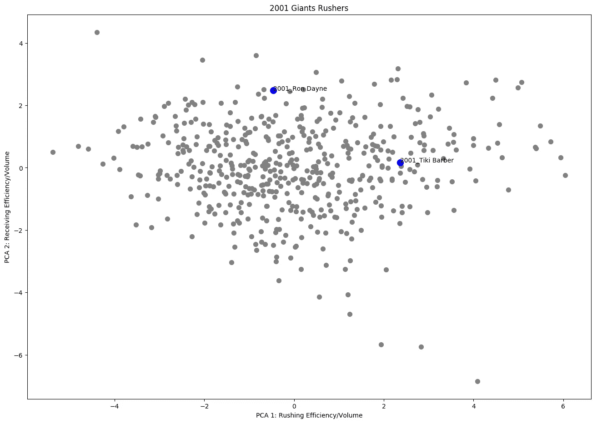

# 可视化不同的 NFL 球员风格

> 原文：<https://towardsdatascience.com/visualizing-different-nfl-player-styles-88ef31420539?source=collection_archive---------16----------------------->

[CC by 2.0](https://en.wikipedia.org/wiki/LaDainian_Tomlinson#/media/File:LaDainian_Tomlinson_vs_Cleveland_(cropped).jpg)

不同的玩家有不同的优点和缺点——有没有一种方法可以将它们形象化？

# 介绍

早在 21 世纪初，纽约巨人队就有一对令人兴奋的跑卫搭档。Tiki Barber(“闪电”)一年跑了大约 1000 码，接了 550 码。这本身就令人印象深刻，但更令人印象深刻的是，早期的第一轮选手罗恩·戴恩(“雷霆”)也在同一支球队。戴恩的总码数不太令人印象深刻(大约 40 码/场)，但他获得的码数都很难获得，他获得了大量的达阵机会。他在球门线，后面不远。不难理解他们的绰号是怎么来的。

在整个联盟中，在所有的位置上，在同一个位置上有不同的球员风格和球员角色。使用[主成分分析](https://en.wikipedia.org/wiki/Principal_component_analysis) (PCA)和[聚类算法](https://en.wikipedia.org/wiki/Cluster_analysis)，我们可以很容易地将这些球员分成不同的类别，这样做没有可能来自电影研究的偏见。PCA 和聚类算法听起来很奇特，但它们非常直观。我远不是第一个做这种分析的人——[这里有一个来自](/which-nba-players-are-most-similar-machine-learning-provides-the-answers-r-project-b903f9b2fe1f)[纳迪尔·尼布拉斯](https://medium.com/u/fee0dbf183d9?source=post_page-----88ef31420539--------------------------------)的 NBA 球员相同过程的伟大版本。

# 步骤 1:选择功能

对玩家进行分类的第一步是找出是什么将某些玩家与其他玩家区分开来。有非常明显的特征，像每场比赛的码数或一个赛季的达阵数。你不需要无监督的学习算法来区分 Cam Newton 和 Blaine Gabbert，如果这就是我所比较的，那么这篇文章现在应该已经结束了。身高和体重也是显而易见的特征，尤其是如果你看过蒂基·巴伯和罗恩·戴恩的话，所以我从 pro-football-reference.com 那里收集了他们的资料。我最终为每个玩家提供了相当多的特性，只要它们都是相关的，这并不是一件坏事。我选择的特征是主观的，并且是可以讨论的！

1.  年龄/身高/体重——不言自明
2.  每场比赛的回退—不言自明
3.  完成率、TD 率、INT 率——完成率、触地得分率和截球率除以总回球率
4.  Sack 率，QB 命中率——sack 很重要，因为[只需要一个就可以杀死一个驱动器](http://settingedge.com/sackskilldrives)。我考虑包括平均码损失和标准偏差码损失的麻袋，但我认为这只会增加噪音。像埃利·曼宁和山姆·布拉德福德这样的四分卫不会在口袋里移动，当他们感到压力时，他们只会龟缩。亚伦罗杰斯和拉塞尔威尔逊永远不会被发现不推出至少一点点。这些是关键的区别，我想我们必须等待玩家跟踪数据！
5.  EPA/Dropback，成功率—大量的 per dropback 统计数据！这两个都是密切相关的高级属性。如果你在寻找两个最能衡量 QB 能力的属性，我会选择这两个。EPA/Dropback 衡量四分卫平均每落后一次会增加多少分。成功率衡量的是有多少百分比的回落导致阳性 EPA。
6.  每完成码数，[完成爆发力](/the-2018-kansas-city-chiefs-and-an-explosiveness-metric-in-football-c3b3fd447d73)😈——这是我第一次使用我的爆发力统计，这是我写这些的足够理由。每完成码数是不言自明的。完成爆发力是所有完成的基尼系数，即百分之多少的完成码属于大戏？如果基尼系数很高，那就意味着有很多温和到低的收益，也有少数巨大的收益。Saquon Barkley 是使用这个定义的“爆炸性”球员的典型例子。或者，较低的基尼系数表明一名球员的许多收益是相似的(即，如果一名球员有许多 7 码的收益，但从未有过 80 码的 TD)。
7.  空气码统计，空气码爆发力——也称为平均目标深度(aDOT)。一些四分卫，即 2018 年的瑞安·菲茨帕特里克，喜欢把球扔得很深，希望他们的接球手带球下来。其他的是验钞机……我想到了埃利·曼宁，尽管还有很多其他的例子。瑞安菲茨帕特里克有高空码，而埃利·曼宁没有。我把机场分为完成机场(CAY)和不完成机场(ICAY)。
8.  接球后 10 码，YAC 爆发力——与上面的统计相反.当一个接球员接到球时，他们能接多远？说到埃利·曼宁，当他有奥德尔·贝克汉姆时，他会斜打奥德尔，奥德尔接球后有 75 码。我猜从技术上来说是 Odell 的 YAC，但对于 Eli 来说，知道他的产量有多少百分比来自于带球跑的接球手，这是值得衡量的。伊莱的 YAC 爆发力也很高，因为他的码数中有更高比例属于大打。有时大的 YAC 是因为在开阔场地的接收者很好，其他时候是因为 QB 在穿越路线上大步击中了球员，而接收者有大量的开阔场地。QB 确实对它有影响，更多(更多)你可以在这里阅读。
9.  增加了所有的 QB 冲刺数据——每场比赛的冲刺码数，每场比赛的冲刺次数，奔跑爆发力，冲刺胜利概率。
10.  平均获胜概率—尝试传球时的平均获胜概率。我选择包括这一点，因为当防守期望传球时，一些 QB 在后面传球。其他人上升了两个分数，不同的结果是可以预料的。这也是对四分卫天赋的粗略衡量。
11.  [近似值](https://www.pro-football-reference.com/blog/index37a8.html)(av)——一项职业足球参考统计，主要衡量球员相对于其他位置的价值。这是一个粗略的衡量，但在我看来，值得包括在内。

毫无疑问，这个分析中选择的统计数据是有争议的。我没有提到薪水和职位草案，但是我可以根据你的分析(我的薪水数据也不完整)看到包含它们的理由。如果我有现成综合统计数据，我可能也会把它们包括在内。

# 第二步:足够的文字，更多的图片。我们来分析一下！

## 上面 26 个统计数据的热图:

/D means per dropback, /G means per game

好吧，这是压倒性的。我们会解决的！但是它包含了大量有用的信息。例如，如果你越过顶行，你可以看到年龄是如何与其他变量相关联的。许多变量根本没有意义上的相关性，但是有一些有趣的高度相关性。一个简单的例子是，EPA/Dropback(基本上是一个衡量你有多好的指标)与完成和 TDs 高度相关，而与不完成和拦截负相关。另一个例子是，每场比赛的得分尝试与 sacks 和 hits 相关——基本上，如果你被击中，你必须争夺更多。也有一些不太令人期待的相关性。高个子四分卫不经常抢球。接球后的码数与 QB 跑位统计相关…如果你在前场和/或抢球时打接球手，我猜接球手在空地上有更多的活动空间。这些是我找到的第一批，你自己看看吧！

# 第三步:信息太多！我们需要 PCA。

首先，[本文](/pca-using-python-scikit-learn-e653f8989e60)纯致力于解释 PCA，如果需要进一步解释，我推荐！

假设，我们有 26 个独立的四分卫特征。许多这些特征是高度相关或反相关的——它们基本上告诉我们同样的事情。举例来说，你已经知道，一个具有高完成量、低截获量和高 TD 率的 QB 将具有高的 EPA/drop back。我们只需要一个组件来告诉我们“好的 QB”或“坏的 QB”。我们可以将这三个成分(完成、拦截和 TD 比率)提取为一个**主成分**。那个主成分将是一个试图最大化你能从它的 3 个子成分中得到的信息的数字。

实际上，[主成分分析](https://en.wikipedia.org/wiki/Principal_component_analysis)是某种手动波动魔法，可以将 26 个成分变成 25 个成分、24 个成分、23 个成分，任何我们想要的更小的数字...并且它寻求最小化它所牺牲的每个组件的信息丢失。

PCA 的优势在于，我们可以开发给定四分卫的二维或三维表示，从上述 26 个特征中提取最大可能的信息。缺点是我们对每个维度没有任何真正的意义，我们只会知道彼此相似的四分卫会彼此靠近。

此外，如果我们的 26 个特征选择不当，PCA 将输出完整的垃圾。因此，尽管我很想加入“鞋钉外观评分”或“1-10 分的啤酒搭配”等特征，但它们会打乱分析。最后，离群值会把事情搞糟。拉马尔杰克逊可能是一个很好的例子，一个 QB，可以弄乱冲统计，因为他会有很多尝试。

以上是 2009 年至 2019 年 QB 赛季的 3D PCA 图示例。这里有几个问题，但我仍然认为它足够酷，可以包括。

第一，从现在开始我会用 2D 图。在二维屏幕上很难看到三维的差异。也许当我们使用[增强现实来可视化图形](https://www.researchgate.net/publication/4040670_Using_augmented_reality_for_visualizing_complex_graphs_in_three_dimensions)时，我们将能够理解 3D 图形。在那之前，我们必须失去另一个维度的信息。

二，有什么意义？？我们可以看到 QB 季节的云，它很酷，持续了 2 秒钟，但它能帮助我们吗？

# 第四步:真正提取有意义的信息

现在我们已经绘制了这些点，我们可以将这些 QB 分组到不同的类别中。我们不需要手工创建类别并标记它们，我们可以欺骗并使用聚类算法来为我们做这件事。我将使用最著名的一个——k means 聚类。我也尝试了 DBSCAN，但结果不太好。

使用 KMeans 聚类，您可以指定所需的聚类数，然后算法会尝试根据给定的聚类数找到最佳分组。显然，我没有给出太多的数学细节，这是故意的。每一个聚类算法都有优点和缺点，我只是喜欢这个算法如何处理六个聚类。

好吧，来吧，这很酷。在右下角的海蓝色类别中，我们有一组非超级移动、真正高效、名人堂级别的 QB。我想知道为什么他们离蒂姆·泰博那么远🤔。我还会猜测他们的完成百分比通常更高，而他们的 aDOT 更低。顺便说一句，这是一个好迹象，同一个球员在几个赛季中通常都在同一个地区。很长一段时间里，培顿·曼宁显然是同一个 QB。在右上角，我们有更多的移动性，爆炸性，但仍然有效的 QBs。我认为中间的黄色可能是你在《幻想》后期起草的那种一年一年一致的 QB。马特·斯塔福德，菲利普·里弗斯等。当你在 x 轴上负向移动时，你的传球效率会越来越差。当你在 y 轴上走负向时，你的机动性/爆发力会降低(我认为)。紫色=检查下来的机器，蓝绿色=移动/爆炸，但不是有效的传球者。

重申一下，这只是我对主要成分的解读。像身体高度和 YAC 爆发力这样的东西被混合在一起，所以谁知道到底发生了什么。我喜欢 PCA 和聚类的一点是它如何创建独特的比较。我从来没想过拿乔希·艾伦和蒂姆·泰博做比较，但这很有意义。

我们可以逐季分析每个 QB 的变动。移动队伍、更换进攻协调者或者受伤的 QB 都会在这张图上移动。那只是四分卫！如果这是一份全职工作，我可能会分析很多。既然不是，我就只举一个例子。这里有一个挑战:你能指出公羊队从杰夫·费舍尔转变为肖恩·麦克维的确切时间吗？

Other young notables marked for reference. Was 2017 an outlier for Carson Wentz? Is Mitch Trubisky being slept on because of his bad accuracy?

(对于那些不关注足球的人来说，杰夫费舍尔在 2016 年是出了名的保守/传统，2017 年肖恩麦克维解锁了戈夫和公羊队的进攻)。

顺着这个思路，为什么不做一个动画呢？我从[科里·杰斯的](https://github.com/jezlax/sports_analytics/blob/master/animated_nfl_scatter.py)体育分析报告中得到这个想法/代码灵感，这要感谢[本·鲍德温](https://twitter.com/benbbaldwin)为[NFL scraper](https://github.com/maksimhorowitz/nflscrapR)写[一篇 R 教程](https://gist.github.com/guga31bb/5634562c5a2a7b1e9961ac9b6c568701)。

似乎每次我运行一个新的程序，我都会学到一些新的东西，或者它们打开了我以前从未想过的视野。在这种情况下，汤姆·布拉迪和德鲁·布里斯年复一年的表现非常一致，这并不奇怪。同样不足为奇的是，埃利·曼宁可能已经展现了他的极限。然而，我很惊讶 Aaron Rodgers 在过去的 4 年里效率并不高！我认为这被他多高的个人得分所掩盖了，大部分的责任都不在他身上。最后，瑞安·菲茨帕特里克在 2018 年的跳跃确实令人震惊。

# 外接球手

所以这个我不能马上理解。最终，我发现 x 轴代表目标效率，y 轴代表目标的危险程度。*目标体积*没有明显的轴，这就是第三维度派上用场的地方。著名的吃角子老虎机/短靶球员在右下角海军蓝集群中非常突出。在它们的对面，中间上方，有一个紫色的深威胁集群。我有点惊讶，像安东尼奥·布朗，迪安卓·霍普金斯，胡里奥·琼斯这样的接球手并没有完全脱颖而出。事实证明，在《梦幻足球》中，高接球员更多地位于图表的右上角。另外，我觉得很奇怪，我看到的是 2016 年的胡里奥·琼斯，而不是 2015 年的胡里奥·琼斯。2015 年是胡里奥有史以来的一年！然后我看得更近一点，这是因为 2016 年胡里奥少了 2 场比赛和 **50** 个目标的类似数字(而且，结果是 2015 年胡里奥就在附近，我检查过)。因此，似乎更有效的接收器肯定突出！或者在 2018 年开尔文·本杰明的情况下，在图表的左端，非常低效的接收器也很突出。这也解释了 2018 年泰勒·洛科特在 x 轴上大约 6 点的位置。似乎海鹰队应该扔给他更多的球。有了这些信息，为什么不把它应用到我最喜欢的过去时光之一，梦幻足球上呢？

上面我画了每个集群的幻想点分布。黄色，右上方的接收者平均得分最高。紫色深度威胁接收器的平均水平没有那么高，但是它们可以像黄色集群一样玩“爆炸”游戏。插槽/短目标接收器非常类似于联盟平均水平的接收器，但根据我的定义，稍微不那么“爆炸性”。两个绿团效率都很低，也没得多少幻想分，但至少有一半(海绿团)得到了像样的目标质量。

# 跑锋

跑卫可能是迄今为止最有趣的比赛。从左到右，你得到越来越强的冲季。RB 螺柱位于右上方。对我来说，图表中有趣的部分是右下角的海绿色星团。只有极少数例子表明跑卫是非常高效的冲球员(每次跑动大约 6 码)，但根本不构成威胁。格斯·爱德华兹、迈克·吉利斯利和克里斯·伊沃都跑得非常好，但根本没有接到传球。这种后卫的例子可能很少，因为当这些跑卫在比赛中时，防守队员应该知道如何堆叠禁区。在我的数据集中只有一个相反类型的回跑的例子，一个接收效率极高但没有冲效率的例子:LaRod Stephens-Howling。也许他应该换成吃角子老虎机？

## 雷电交加

我在这篇文章中讨论了蒂基·巴伯和罗恩·戴恩，所以我觉得我应该试着策划他们在 2001 年的最佳组合赛季。我尽了最大努力填写我没有的统计数据(我的数据集只追溯到 2009 年):

令人惊讶的是，罗恩·戴恩那年在小样本量上接球效率很高。随着时间的推移，罗恩·戴恩趋向于联盟平均水平，而蒂基·巴伯变成了一个怪物。

最后，[这里的](https://github.com/btatkinson/player_vectors)是我在这篇文章中使用的代码。