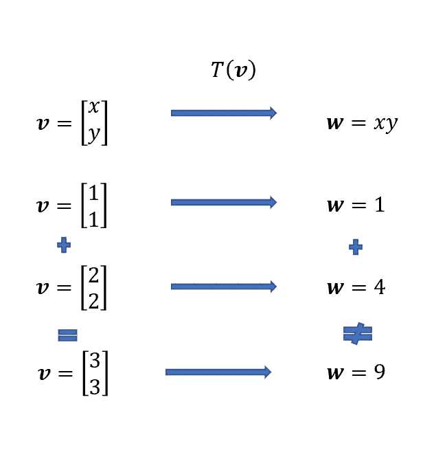
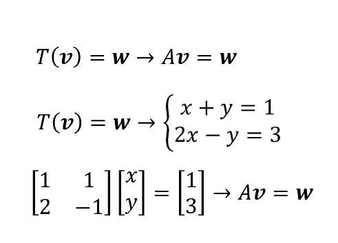
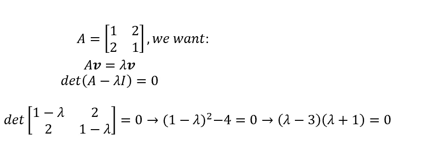
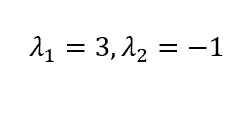
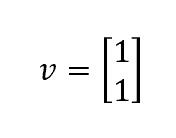
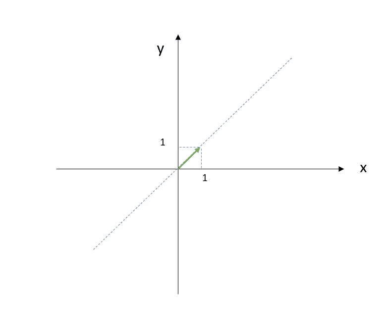
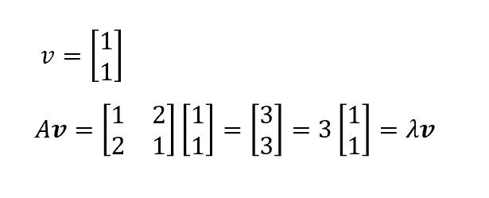
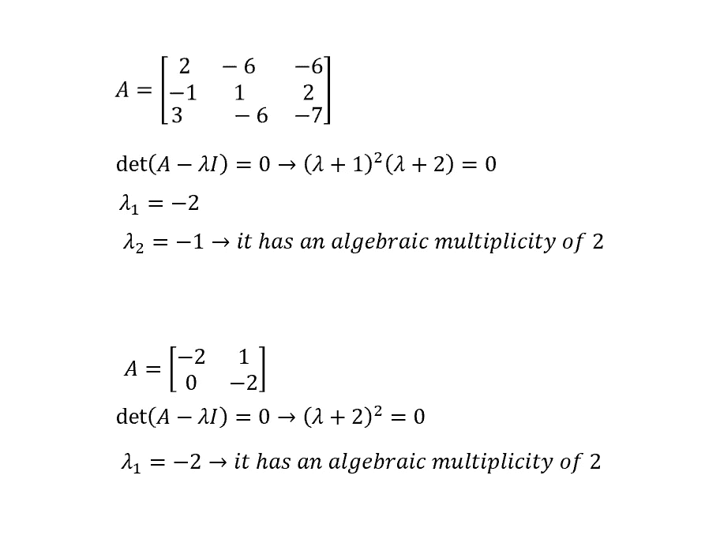
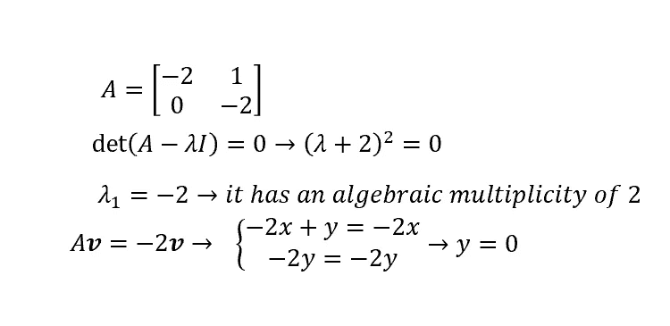
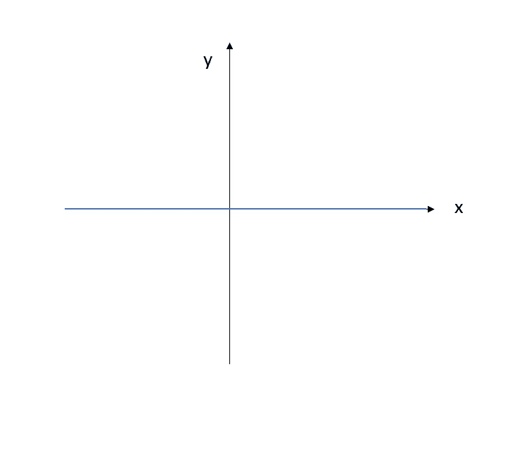

# 可视化特征值和特征向量

> 原文：<https://towardsdatascience.com/visualizing-eigenvalues-and-eigenvectors-e2f9e3ac58d7?source=collection_archive---------8----------------------->

特征值和特征向量是线性代数和一般机器学习中非常重要的概念。在我之前的[文章](/pca-eigenvectors-and-eigenvalues-1f968bc6777a)中，我已经从主成分分析的角度介绍了这些概念，并提供了实际的例子。在这篇文章中，我将更详细地阐述这些概念背后的数学原理，为我将要解释的内容提供一个几何解释。

为此，我将讨论以下主题:

*   线性转换
*   特征值和特征向量
*   代数和几何的多重性

那么就从第一个话题开始吧。

## 线性转换

一般来说，变换是定义在定义域空间 V 上的任何函数，其输出在余定义域 W 中(其中 V 和 W 是多维空间，不一定是欧几里得的)。

保留加法和标量乘法运算的变换，如下所示:

叫做线性变换，从现在开始我们称之为 t。

让我们考虑下面的两个数值例子来清楚地了解它。假设我们有一个定义在 R2 上的变换 T，输出为 R:

如你所见，这种转换不是线性的，因为它不保持可加性。这个怎么样？

此外:

如你所见，加法和标量乘法被保留，因此转换是线性的。值得注意的是，从 R2 到 R 的唯一线性变换是那些看起来像 w=ax+by 的变换，因此是域向量分量的线性组合。

表示定理给出了线性系统的一个非常重要的性质，表示线性变换可以表示如下:

其中 A 是所谓的表示矩阵。我们将使用这个公式，因为它更紧凑，更方便。

现在，每一个变换都可能影响一个向量的方向和范围(关于多维空间中向量形状的更清楚的解释，你可以在这里阅读我以前的文章)。然而，给定一个变换 T，存在一类非常有趣的向量，它们只在外延上受变换的影响，因为方向保持不变。具有该属性的通用向量 **v** 是这样的:

其中*λ*是扩展因子。那些向量被称为特征向量，并且与它们相关联的值被称为特征值。

## 特征值和特征向量

正如所预料的，特征向量是那些一旦通过固定的 T 变换其方向保持不变的向量，而特征值是那些与它们相关的扩张因子的值。

更准确地说，特征向量是不平凡的向量，因此不同于 **0** 。那是因为上面的等式总是至少有一个解，就是其中 **v=0** 的平凡解。

在特征向量和特征值不同于平凡向量的情况下，如何找到我们的特征向量和特征值？为此，让我们用表示定理来重新构造我们的线性系统:

正如预期的那样，这个系统至少有一个解，这是一个平凡的解。因此，我们想要找到矩阵的行列式(A-*λ** I)等于零的那些λ值(否则，由于克莱姆定理，这将意味着系统有 1 个唯一解)。

让我们来设定我们的等式:

这个方程叫做特征方程，它的根就是特征值。再者，由于代数基本定理*“每一个 n 次多项式在 C(复数集)*中有 n 个解”，我们知道特征方程的次数将是与那个系统相关的特征值的个数。

让我们考虑下面的例子:

从特征方程中，我们导出了两个特征值 3 和-1。为了提供一个数字示例，我将找到与*λ*= 3 相关联的向量，称为特征向量(同样的推理适用于*λ*=-1)。如果我们考虑矩阵 A，这一目的的快速捷径可能是有用的。事实上，由于我们要求解的非唯一性，我们已经知道矩阵的行列式(A-lI)等于 0，因此在求解最终系统时，我们可以直接摆脱两个约束之一:

让我们想象一下:

基本上，位于该直线上的所有向量都是与特征值 3 相关联的特征向量:一旦通过 T 进行变换，它们将仅被延长/缩短，但方向不会改变。例如，考虑以下向量:

现在让我们来转换它:

如你所见，现在它的大小是原来的 3 倍，但是方向还是一样。

现在让我们转向本文的最后一个主题，即与特征值和特征向量相关的代数和几何重数。

## 代数和几何的多重性

现在假设你有一个 n 次特征方程，但是你只找到了一个根。因此，因为次数是 *n* ，所以称该根的代数重数为 *n* 。让我们考虑以下两个例子:

在第一个例子中，我们有一个等于-2 的特征值，没有重数(因为它的幂等于 1)，而特征值-1(来自二次多项式)的重数等于 2。

现在的问题是:这个多重性在问题的几何方面也受到尊重吗？换句话说，一个特征值在一个解中出现的次数是否等于对应的特征空间(即相关特征向量的集合)的维数/自由度？

答案并不总是如此。每当我们有一个重数等于 *n* 的特征值和一个对应的维数小于 *n* 的特征空间时，我们称该λ系数为不规则的(否则，称该特征值为规则的)。

让我们用上面的例子直观地展示一下:

正如你所看到的，即使我们有一个重数为 2 的特征值，相关的特征空间只有一维，因为它等于 y=0。

## 结论

特征值和特征向量通常是数据科学和建模的基础。除了它们在 PCA 中的使用之外，它们还被用在谱聚类和图像压缩中。因此，记住它们的几何解释是很重要的。