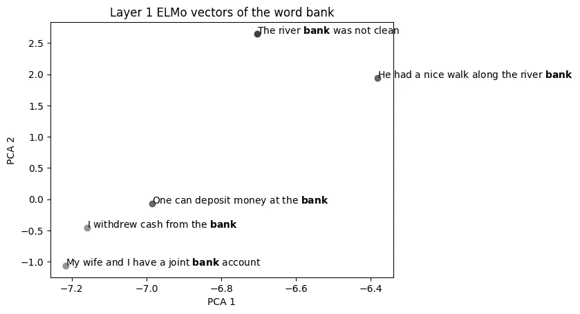
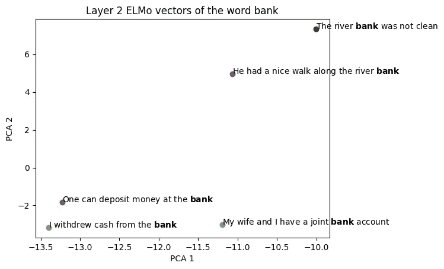
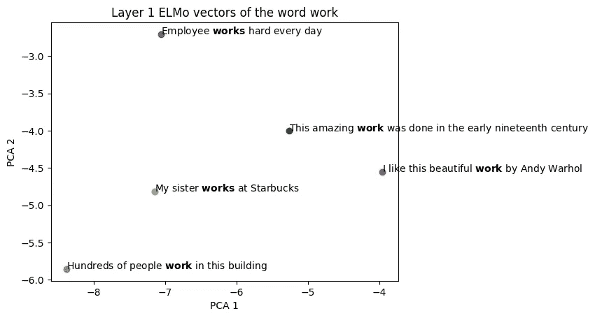
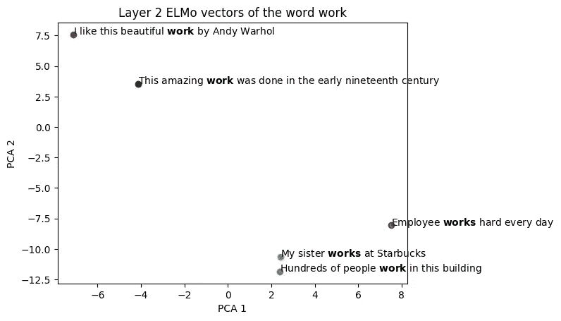
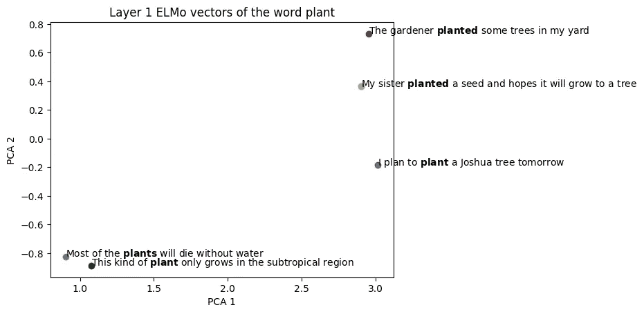
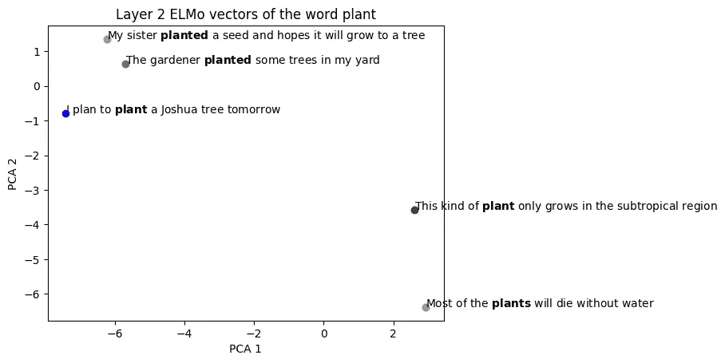

# 可视化 ELMo 上下文向量

> 原文：<https://towardsdatascience.com/visualizing-elmo-contextual-vectors-94168768fdaa?source=collection_archive---------19----------------------->

## 上下文向量对于词义消歧很有用。

# 单词嵌入的问题

处理世界感官的单词嵌入存在困难。无论一个单词有多少个义项，单词嵌入方法都将所有义项嵌入到一个单一的向量表示中。这可能会给下游的 NLP 任务(如文档分类)带来问题。

比如*银行*这个词，可以指金融机构，也可以指水以外的坡地。根据[单词嵌入演示](http://bionlp-www.utu.fi/wv_demo/)，使用 Google News 上训练好的模型，向量空间中*银行*最近的前 5 个单词分别是 banks、banking、bank、lender 和 banker。我们可以看到, *bank* 在这里的语义是指金融机构，除了水之外并没有包含坡地的意思。因此，文本“Sandy walks along the river bank”在文档分类中会被错误分类到“金融机构”类别，因为 *bank* 的词向量指向金融机构的含义。

# 语境向量

另一方面，单词的上下文向量可以捕捉单词的不同含义。顾名思义，上下文单词向量的向量表示取决于它在句子中的相邻单词。所以“我在银行取钱”中的单词 *bank* 和“她在河边散步很愉快”会有非常不同的单词向量。

根据最近的研究，将上下文向量添加到各种 NLP 任务中，如文本蕴涵、命名实体提取和问题回答，已经显示出极大地改善了最先进的结果。这些上下文向量是预先训练的语言模型的输出。关于预训练语言模型的细节可以在论文 [ELMo](https://arxiv.org/pdf/1802.05365.pdf) 或 [BERT](https://arxiv.org/pdf/1810.04805.pdf) 中找到。下面我将使用 ELMo 模型来生成上下文向量。

# 可视化 ELMo 上下文向量

让我们尝试使用 [ELMo](https://arxiv.org/pdf/1802.05365.pdf) 模型生成上下文向量，并使用 PCA 将向量投影到 2D 空间进行可视化。在 ELMo 的论文中，有 3 层单词嵌入，第 0 层是基于字符的上下文无关层，接下来是两个双 LSTM 层。作者根据经验表明，从第一双 LSTM 层生成的词向量可以更好地捕捉语法，而第二层可以更好地捕捉语义。我们将为具有多种含义的三个单词——银行、工作和工厂——可视化第 1 层和第 2 层上下文向量。

## 银行

先来重温一下*银行*这个词。我挑选了 5 个包含*银行、*和*银行*这两个词的句子，可以是金融机构，也可以是水边的坡地。以下是 5 个句子:

```
1\. The river **bank** was not clean
2\. One can deposit money at the **bank**
3\. I withdrew cash from the **bank**
4\. He had a nice walk along the river **bank**
5\. My wife and I have a joint **bank** account
```

下面是使用 PCA 的预测结果。每个色点代表*库*在其上下文中的词向量:



我们可以将上述上下文向量分为两组。右上簇的 *bank* 的词向量表示除水之外的坡地，左下簇则有金融机构的意思。



类似地，我们可以看到在第 2 层 ELMo 向量空间中有 2 个簇。

> 通过使用上下文向量， *bank* 根据不同的上下文有不同的词向量，意义相同的词在向量空间中会彼此接近！

## 工作

*工作*是另一个有多重含义的词。 *Work* 作为名词的意思是做或做的事情，作为动词的意思是工作。以下是包含上述两种意思之一的 5 个句子:

```
1\. I like this beautiful **work** by Andy Warhol
2\. Employee **works** hard every day
3\. My sister **works** at Starbucks
4\. This amazing **work** was done in the early nineteenth century
5\. Hundreds of people **work** in this building
```

下面是使用 PCA 的预测结果。每个色点代表*作品*在其上下文中的词向量:



查看第 1 层向量，我们无法立即将一个集群与另一个集群区分开来。然而，我们知道左边的三个向量把 *work* 作为动词，意思是工作，右边的两个向量把 *work* 作为名词，意思是做或做某事。



对于第 2 层向量，我们在右下角观察到作为动词的*工作*的清晰聚类，并且在左上角观察到作为名词的*工作*的另一聚类。

## 植物

植物可以表示“一个活的有机体”或者“把一颗种子埋在地里”以下是包含上述两种意思之一的 5 个句子:

```
1\. The gardener **planted** some trees in my yard
2\. I plan to **plant** a Joshua tree tomorrow
3\. My sister **planted** a seed and hopes it will grow to a tree
4\. This kind of **plant** only grows in the subtropical region
5\. Most of the **plants** will die without water
```

下面是使用 PCA 的投影结果，每个色点代表*植物*在其上下文中的词向量:



右上方的簇是向量，其含义是将种子放在地上以种植*植物*。对于左下方的簇，单词 *plant* 表示有生命的有机体。



在该图中可以发现类似的结果。左上的 3 个向量形成了具有含义为“将种子放在地里”的*植物*的簇，右下的 2 个向量形成了具有含义为活的有机体的词语*植物*的簇。

有趣的一点是，在上述所有 3 个实验中，与第 1 层相比，第 2 层 ELMo 向量空间中的簇形成似乎更清晰，并且簇质心之间的距离更大。ELMo 的论文提到，在词义消歧任务中使用第二层比使用第一层导致更高的 F1 分数。我们对第二层向量空间中更大距离的观察显示了对论文发现的可能解释。

生成上述图形的代码可以在这个 [github 库](https://github.com/hengluchang/visualizing_contextual_vectors)中找到。

# 结论

通过可视化具有多种含义的单词的上下文向量，我们从经验上表明:

1.  具有相同意义的上下文单词向量将形成一个簇。然后，我们可以计算每个词义的聚类质心，并使用简单的 1-最近邻方法来消除句子中词义的歧义。
2.  具有相同意义的 ELMo 第 2 层单词向量形成清晰的簇，并且簇质心之间的距离大于第 1 层。

欢迎对这篇文章的任何建议或评论！