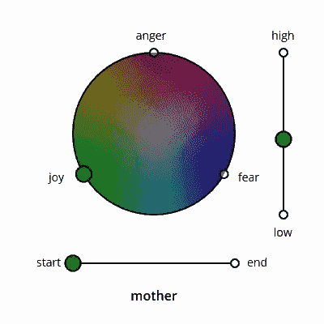
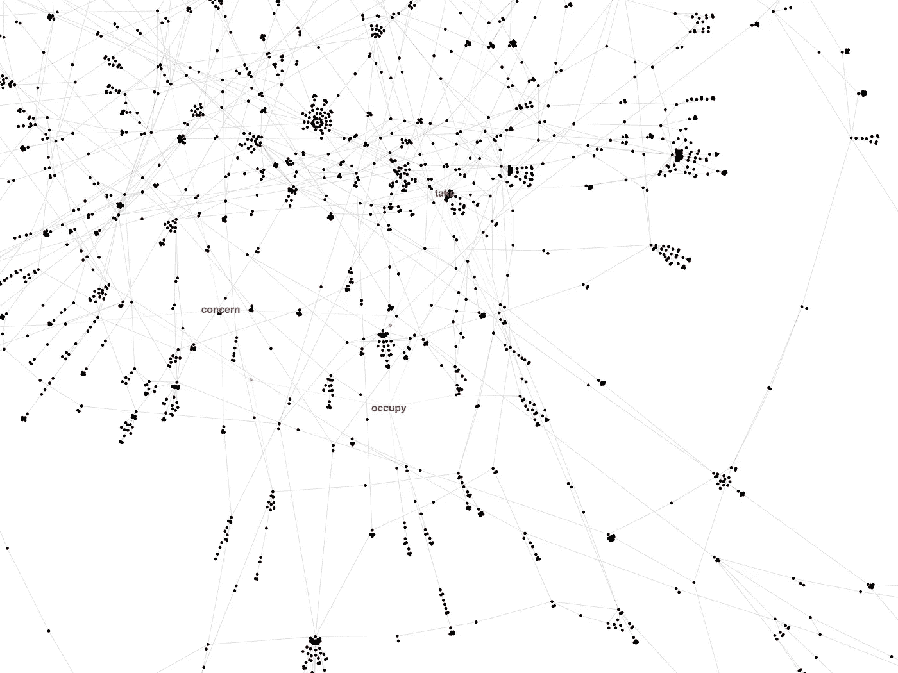
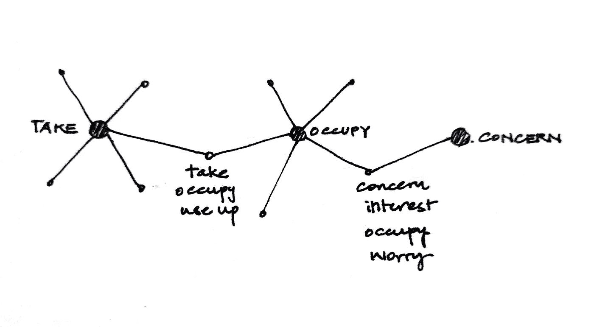
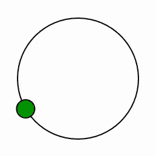

# 可视化情感

> 原文：<https://towardsdatascience.com/visualizing-emotions-cec2215e9178?source=collection_archive---------27----------------------->

## 当我们通读一篇文章时，我想展示它的情感。



我从探索词汇数据库 WordNet 开始。我最初的想法是使用 WordNet 创建一个所有单词(不包括停用词)与其同义词相连的图表，并在单词出现在文本中时对其进行跟踪。我希望他们能创造出一串相关的单词。



Visualized with Gephi (find the shortest path)

但是哎呀！他们是偶然的；我错过了一些重要的东西。比方说，A 和 B 共享同素集，B 和 C 也共享同素集。然而，A 和 C 可能在意义上没有关系。例如，一个公共节点连接*‘take’*和*‘occupy’*。另一个节点连接*【关注】*和*【占领】*。这将*【take】*和*【concern】*联系起来，尽管它们的含义并不相似。



下一次，我再次使用 WordNet，试图形成一个通过上位词连接的树。我尝试使用派生相关的形式、相似的 to 和动词组，将尽可能多的叶节点扩展到根‘实体’。我用迈克·博斯托克的径向树状图来展示数据。


Visualized with Mike Bostock’s Radial Dendrogram

这一次，虽然它形成了聚类，但单词不是基于含义聚类的。

例如，感觉群集被放置在远离物理实体群集的地方。然而，在情感群中,“高兴”和“愤怒”的节点就在附近。虽然这两个节点通过上位词密切相关，但它们在意义上是相反的。

## 终于！

最后，我选择了国家研究委员会的情感强度词典，也就是 Saif M. Mohammad 的情感强度词典。它包含四种情绪的 0 到 1 分的单词:愤怒、恐惧、快乐和悲伤。我考虑了三种情绪，用它们的分数和色轮来找到它们的位置。

```
var xyArray=[];
function data2rgb(filename)
{
    let D=2*R;
    let rgbArray=[];
    let scaleColor= d3.scaleLinear().domain([0,1]).range([0,255]);
    d3.csv(filename).then(function(data) 
    {
        for(let i=0;i<data.length;i++)
        {
            let [red,green,blue]=
               [scaleColor(data[i]["anger"]),
                scaleColor(data[i]["joy"]),
                scaleColor(data[i]["fear"])];

            let xyval=rgb2xy(red,green,blue,data[i]["negate"]);
            xyArray.push({i:i, word:data[i].word, x:xyval.x,
                      y:xyval.y, h:xyval.h, s:xyval.s, v:xyval.v});
        }   
        intervalLoop(xyArray);
    });
}
```

首先，我借助了 Cory Forsyth 的文章[用画布手工编写色轮](https://medium.com/@bantic/hand-coding-a-color-wheel-with-canvas-78256c9d7d43)。我开始收集一篇[文章](http://shortstoriesshort.com/story/hansel-and-gretel/)中可以在词典中找到的单词，以及它们的分数。然后，我将每个分数在 0 到 255 的范围内，并给它分配了一种颜色(绿色代表快乐，红色代表愤怒，蓝色代表恐惧)。将 RGB 值转换成 HSV 后，我可以从 H 和 S 得到它在圆中的位置，从 v 得到它的值。

```
function repeating()
{
    timeouts=setTimeout(function()
    {  if(i==xyArray.length-1) 
       return 0;
       drawNode(xyArray[i],xyArray[i+1]);
       i++;
       repeating();
       },tt); function drawNode(a,b)
    {...}
}
repeating();
```

然后，使用 setTimeout()方法，我评估了该函数，以便在一个间隔之后定期绘制 SVG 元素。在这段时间里，通过 d3 转换，我可以在节点之间进行线性转换，并转换节点的颜色。但是我想创造一个更平滑的路径；不是线性的。



因此，我创建了一个 Catmull-Rom 样条线使用 d3 的无中风或填充，并打破了它成段。然后，我将沿着断开线段的点的数据添加到每个单词的数据中，以便在 setTimeout()函数中使用。

```
if (b.seg.length!=0)
{ 
      circles.attr("cx",R+p)
         .attr("cy",R+p); let pathSeg=svg.append("path").attr("id","pathSeg")
         .data([b.seg])
         .attr("d", d3.line()
         .curve(d3.curveCatmullRom))
         .attr("fill","none")
         .attr("stroke-width","0")
         .attr("transform", "translate("+ R+p +"," + R+p + ")"); circles.transition()
         .duration(t)
         .attrTween("transform", translateAlong(pathSeg.node()))
         .attr("fill",d3.hsv(b.h,b.s,b.v))
         .attr("r",scaleRadius(b.v));
}
else
{
      circles.attr("cx",R+b.x+p)
         .attr("cy",R+b.y+p)
         .transition().duration(t)
         .attr("fill",d3.hsv(b.h,b.s,b.v))
         .attr("r",scaleRadius(b.v));
}
```

最后，为了表示 HSV 颜色的 V 值，我改变了节点的半径，使其与 V 成比例，看起来像是在垂直于屏幕的方向上平移。此外，为了匹配背景，我重叠了一个黑色圆圈，不透明度等于 1-V。

```
svg.append("circle").attr("id","cvalue")
     .attr("cx",R+p).attr("cy",R+p).attr("r",R)
     .attr("fill","black").attr("fill-opacity",1-a.v)
     .transition().duration(t).ease(d3.easeLinear)
     .attr("fill-opacity",1-b.v);
```

还有刷新！


And refresh!

## *参考文献:*

[1]赛义夫·穆罕默德， [NRC 影响强度词典](https://saifmohammad.com/WebPages/AffectIntensity.htm)

[2] C. Forsyth，[用画布手工编码色轮](https://medium.com/@bantic/hand-coding-a-color-wheel-with-canvas-78256c9d7d43) (2017)

## **倒影:**

1.  还有很多事情要做。(例如，在 VADER，根据标点符号或强调符号来修改分数)。
2.  我们如何知道一个词在文本和词典中的意义？比如某本书里提到的*‘邪灵’*，词典上可能会认为是*‘精神好’*。
3.  假设快乐、愤怒和恐惧这三种情绪相距 120 度是正确的吗？将悲伤视为快乐的对立面，并将其置于愤怒和恐惧之间(冷静和勇气也是如此)，这样做对吗？

这个项目是我第一次尝试数据可视化和自然语言处理。如果你有任何反馈或建议，给我发邮件到 nive.mathan21@gmail.com，或者在回复中告诉我。我很乐意连接！