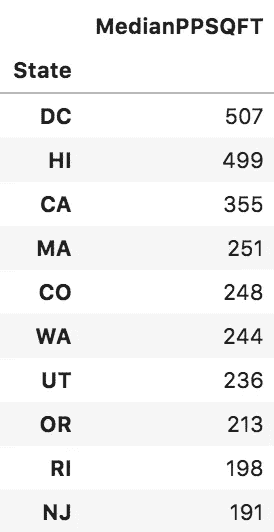
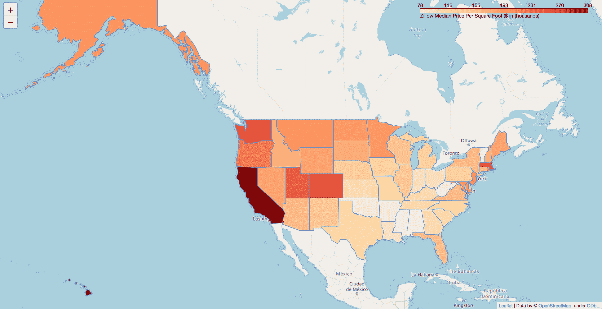
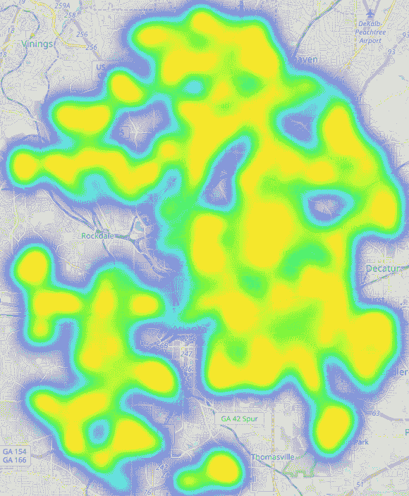

# 可视化房价分布

> 原文：<https://towardsdatascience.com/visualizing-house-price-distributions-fb0e6c2c264d?source=collection_archive---------22----------------------->


Photo by [John Lockwood](https://unsplash.com/@lockwood?utm_source=unsplash&utm_medium=referral&utm_content=creditCopyText) on [Unsplash](https://unsplash.com/collections/4885214/blog-photos?utm_source=unsplash&utm_medium=referral&utm_content=creditCopyText)

## 有了 Zillow 和 python 的 than，比以往任何时候都容易。

# 等等，但是为什么？

我正在关闭我在佐治亚州亚特兰大的第一个家，并一直在大量使用各种房地产网站，如 Zillow，Redfin 和 Trulia。我也一直在摆弄 Zillow 的 API，尽管在功能和文档方面有些参差不齐。尽管它有缺点，但当我阅读了由 [Lukas Frei](https://medium.com/u/5164378fc848) 撰写的[帖子](/rat-city-visualizing-new-york-citys-rat-problem-f7aabd6900b2)后，我受到了充分的启发，该帖子讲述了如何使用该库无缝地创建基于地理的可视化。几天后，我结合 Zillow 和 leav 制作了一些亚特兰大和美国各地房价的酷炫视觉效果。

# 主题

*   API 集成
*   图形遍历
*   形象化

# 一个小例子

让我们从使用一些我从 Zillow 网站下载的[预汇总数据](https://github.com/aagnone3/zillium/blob/master/data/State_MedianValuePerSqft_AllHomes.csv)开始。该数据集显示了美国每个州从 1996 年 4 月到 2019 年 5 月每个月的平方英尺价格中位数。自然，人们可以对这些价格随时间的发展建立丰富的可视化；然而，现在让我们坚持使用最新的价格，它在文件的最后一列。

看看排名前 10 的州，并没有多少惊喜。需要说明的是，最初我对其中一些城市的订单感到措手不及，特别是华盛顿和夏威夷名列榜首。但是，回想一下指标中“每平方英尺”的标准化。因此，考虑到加州的面积，我可能更惊讶于它仍然排在第三位。



Top 10 price/sqft in thousands of $$$ (May 2019)

不管怎样，上节目吧！由于这是一篇可视化的文章，我将避免在你面前扔太多行代码，并在文章的结尾将所有内容链接到它。简而言之，我从[叶 repo](https://github.com/python-visualization/folium) 下载了一个美国各州的 GeoJSON 文件。这是一个伟大的发现，因为它立即为我提供了无缝流程所需的数据模式；我需要添加的唯一信息是价格数据(在最终的地图中生成颜色)。在提供了这些之后，仅仅 5 行代码就给了我下面的情节:



Heatmap of price/sqft of homes in the U.S. for May 2019

# 更进一步

既然我已经把脚趾伸进了 Zillow 和 leav 的水里，我已经准备好沉浸其中了。我决定画一张亚特兰大房价的热图。Zillow API 的一个缺点是它的搜索功能非常有限——我找不到任何基于经纬度坐标的搜索方法，这对于创建粒度热图来说非常方便。尽管如此，我还是把它作为一个机会来温习一些爬虫风格的代码；我使用一个城市名称的初始搜索结果作为未来调用的种子，以获得这些房屋的 [comps](https://en.wikipedia.org/wiki/Comparables) (通过 [GetComps](https://www.zillow.com/howto/api/GetComps.htm) 端点)。

值得注意的是，Zillow 确实有很多基于 URL 的搜索过滤器，可以用来进行纬度/经度搜索(见下文)。然而，从网页上获取房屋就变成了一项搜集工作，你会受到 Zillow 网页结构突然变化的影响。也就是说，抓取项目会有很多乐趣；如果你想把这个放进我做的东西里，请告诉我！

```
# an example of a Zillow search URL, with plenty of specifications
[https://www.zillow.com/atlanta-ga/houses/2-_beds/2.0-_baths/?searchQueryState={%22pagination%22:{},%22mapBounds%22:{%22west%22:-84.88217862207034,%22east%22:-84.07880337792972,%22south%22:33.53377471775447,%22north%22:33.999556422130006},%22usersSearchTerm%22:%22Atlanta,%20GA%22,%22regionSelection%22:[{%22regionId%22:37211,%22regionType%22:6}],%22isMapVisible%22:true,%22mapZoom%22:11,%22filterState%22:{%22price%22:{%22min%22:300000,%22max%22:600000},%22monthlyPayment%22:{%22min%22:1119,%22max%22:2237},%22hoa%22:{%22max%22:200},%22beds%22:{%22min%22:2},%22baths%22:{%22min%22:2},%22sqft%22:{%22min%22:1300},%22isAuction%22:{%22value%22:false},%22isMakeMeMove%22:{%22value%22:false},%22isMultiFamily%22:{%22value%22:false},%22isManufactured%22:{%22value%22:false},%22isLotLand%22:{%22value%22:false},%22isPreMarketForeclosure%22:{%22value%22:false},%22isPreMarketPreForeclosure%22:{%22value%22:false}},%22isListVisible%22:true}](https://www.zillow.com/atlanta-ga/houses/2-_beds/2.0-_baths/?searchQueryState=%7B%22pagination%22:%7B%7D,%22mapBounds%22:%7B%22west%22:-84.88217862207034,%22east%22:-84.07880337792972,%22south%22:33.53377471775447,%22north%22:33.999556422130006%7D,%22usersSearchTerm%22:%22Atlanta,%20GA%22,%22regionSelection%22:%5B%7B%22regionId%22:37211,%22regionType%22:6%7D%5D,%22isMapVisible%22:true,%22mapZoom%22:11,%22filterState%22:%7B%22price%22:%7B%22min%22:300000,%22max%22:600000%7D,%22monthlyPayment%22:%7B%22min%22:1119,%22max%22:2237%7D,%22hoa%22:%7B%22max%22:200%7D,%22beds%22:%7B%22min%22:2%7D,%22baths%22:%7B%22min%22:2%7D,%22sqft%22:%7B%22min%22:1300%7D,%22isAuction%22:%7B%22value%22:false%7D,%22isMakeMeMove%22:%7B%22value%22:false%7D,%22isMultiFamily%22:%7B%22value%22:false%7D,%22isManufactured%22:%7B%22value%22:false%7D,%22isLotLand%22:%7B%22value%22:false%7D,%22isPreMarketForeclosure%22:%7B%22value%22:false%7D,%22isPreMarketPreForeclosure%22:%7B%22value%22:false%7D%7D,%22isListVisible%22:true%7D)
```

回到选择的路径，我提到我使用最初的结果作为某个城市的家庭网络的入口点。有了这些入口点，我不断递归调用每个家庭的 comps。这里的一个重要假设是，Zillow 对房屋相似性的定义，除了其他因素之外，还包括位置邻近性。如果没有位置邻近性，基于 comp 的住宅遍历相对于位置将非常不平滑。

那么，我们有什么算法可以以不同的方式遍历节点网络呢？当然，广度优先搜索(BFS)和深度优先搜索(DFS)很快就会浮现在脑海中。出于好奇，看看下面它的基本逻辑流程。除了集合成员保护之外，只有当新的 homes 满足在`meets_criteria`函数中断言的约束时，它们才会被添加到集合中。现在，我在预定义的根纬度/经度位置和当前家的位置之间做一个简单的 L2 距离检查。这一标准鼓励搜索停留在根的本地，目的是为了一个良好连接和粒度的热图。下面的实现通过弹出列表的末尾(第 5 行)并添加到列表的末尾(第 14 行)来使用 DFS，但是通过更改任一行(但不是两行)来使用列表的前面，可以快速实现 BFS。

让这个算法在亚特兰大的房屋上运行 10，000 次迭代，在几分钟内就会产生下面的地图！更重要的是，由 folium 生成的[网页](https://anthonyagnone.com/wp-shares-aagnone/atlanta_heatmap.html)是交互式的，允许像缩放和平移这样的常见地图导航工具。为了证明它的模块化，我还生成了一些[波士顿、马萨诸塞州](https://anthonyagnone.com/wp-shares-aagnone/boston_heatmap.html)和[西雅图、华盛顿州](https://anthonyagnone.com/wp-shares-aagnone/seattle_heatmap.html)的小比例价格地图。



Heat map of Atlanta housing prices. See the interactive version [here](https://anthonyagnone.com/wp-shares-aagnone/atlanta_heatmap.html).

# 代码

正如承诺的那样，[这是项目](https://github.com/aagnone3/zillium)。它有一个 Make+Docker 设置，便于使用和再现。如果您想了解这两种工具如何完美结合以实现可重现的数据科学，[请继续阅读这里的](https://anthonyagnone.com/2019/07/10/towards-efficient-and-reproducible-ml-workflows-part-1-analysis/)。无论哪种方式，README 都可以让你很快上手，无论是通过脚本还是 Jupyter 笔记本。快乐的 viz！

[](https://github.com/aagnone3/zillium) [## agnone3/zillium

### 用 Zillow+leav 实现房地产可视化。在…上创建帐户，为 aagnone3/zillium 开发做出贡献

github.com](https://github.com/aagnone3/zillium) 

# 现在怎么办？

接下来，我们可以沿着许多不同的方向发展这个逻辑。我在下面详细介绍了一些激励措施，但我更喜欢朝着最能获得支持、影响和协作的方向前进。你怎么想呢?

*原载于*[*https://anthonyagnone.com*](https://anthonyagnone.com/visualizing-house-price-distributions/)*。*